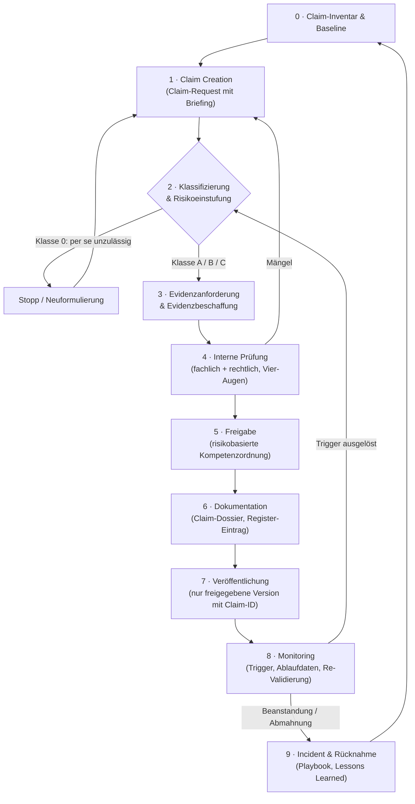
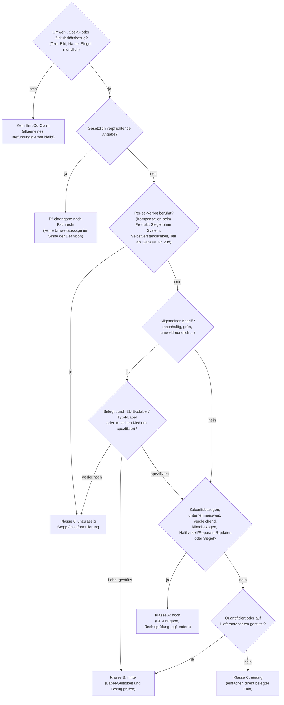

# EmpCo & UWG-Novelle aus Governance- und Compliance-Sicht

**Research-Basis für den internen Debrief – Fokus KMU / Mittelstand**

| | |
|---|---|
| **Stand** | 28.09.2026 – die EmpCo-Regeln sind in Deutschland seit dem 27.09.2026 anwendbar |
| **Zweck** | Inhaltliche und konzeptionelle Grundlage für den internen Debrief. **Keine** Präsentation, **keine** Rechtsberatung im Einzelfall |
| **Perspektive** | Governance, Compliance, IKS/CMS, Verantwortlichkeiten. ESG nur, soweit es für das Verständnis nötig ist |
| **Status** | Research-Entwurf v1.0 – ergänzt um Kap. 13 „KI-Einsatz in der Claim-Governance“. Normzitate vor externer Verwendung gegen die Originaltexte prüfen (siehe „Quellenlage“) |
| **Denkkette** | Regulation → Requirement → Risk → Governance Implication → Process → Control → Responsibility |

---

## Lesehinweise

### Kennzeichnung der Aussagequalität

| Kennzeichen | Bedeutung |
|---|---|
| **[G]** | **Gesetzlich eindeutig** – ergibt sich unmittelbar aus dem Wortlaut von Richtlinie oder Gesetz |
| **[I]** | **Vertretbare rechtliche Interpretation** – Behördenauffassung, Gesetzesbegründung, Literatur oder Rechtsprechungslinie; nicht abschließend geklärt |
| **[E]** | **Praktische Governance-Empfehlung** – nicht rechtlich vorgeschrieben, aber aus Anforderungen und Risiken abgeleitet |
| **[A]** | **Eigene analytische Schlussfolgerung** – Einordnung, These oder Synthese des Verfassers |

Quellenverweise: **[P#]** = Primärquellen (Rechtsakte, Gesetzesmaterialien, Urteile), **[B#]** = Behörden, offizielle Leitlinien, Standardsetzer, Verbände, **[S#]** = Sekundärquellen (Kanzleien, WP-Gesellschaften, Fachmedien). Das vollständige Verzeichnis steht in **Anhang A**.

### Quellenlage – wichtig für die Weiterverwendung

In der Arbeitsumgebung dieser Recherche ließen sich die Primärtexte nicht direkt abrufen: EUR-Lex, BGBl./recht.bund.de, Bundestags-Drucksachen und die BMJV-Seiten waren durch die Netzwerkrichtlinie gesperrt. Normbezogene Aussagen beruhen deshalb auf zwei Grundlagen:

1. dem bekannten Text der Richtlinie (EU) 2024/825,
2. dem Abgleich mehrerer **übereinstimmender** Sekundärquellen (Kanzleien, IHKs, Fachdienste, Behördenmitteilungen).

Die Paragraphen- und Nummernangaben zum UWG n. F. sind plausibilisiert. Vor jeder externen Verwendung sind sie **am BGBl.-Text (BGBl. 2026 I Nr. 43) zu verifizieren**. Wo eine Aussage nur auf einer einzigen Quelle beruht, ist das vermerkt.

### Arbeitsannahmen (bitte bestätigen oder korrigieren)

- **A1 – Zielgruppe:** internes Beraterteam (Governance, Compliance, Risk) mit gemischtem Kenntnisstand zum Lauterkeitsrecht.
- **A2 – Fokus:** Deutschland auf EU-Basis. Grenzüberschreitende Aspekte nur punktuell, etwa der Vergleich mit Österreich.
- **A3 – Referenz-KMU:**
  - mittelständisch, ca. 50–500 Mitarbeitende, produzierend oder handelnd, mit B2C- oder B2B2C-Bezug;
  - nach Omnibus I **nicht** CSRD-pflichtig, ggf. ISO 9001/14001-zertifiziert;
  - keine eigene Rechtsabteilung (externe Kanzlei), keine Interne Revision.
- **A4 – Beratungsperspektive:** Design und Prüfung von Governance- und Kontrollstrukturen. Die rechtliche Einzelfallbewertung konkreter Claims bleibt Rechtsberatung (Abgrenzung zum RDG, siehe Kap. 12).
- **A5 – Detailtiefe:** Research-Tiefe. Die Priorisierung für die Präsentation erfolgt gemeinsam im Anschluss.

**Offene Rückfragen, die die Analyse weiter schärfen würden:**

1. Gibt es einen konkreten Mandanten- oder Branchenfall, z. B. Lebensmittel, Konsumgüter, Bau/Handwerk, Energie oder Handel?
2. Soll der Debrief eher „Rechtslage + Handlungsbedarf beim KMU“ oder eher „unser Leistungsangebot“ betonen?
3. Reicht der Fokus auf Deutschland, oder ist DACH relevant? Österreich hat eine abweichende Altbestandsregel.

---

## Executive Summary – die 16 wichtigsten Erkenntnisse

1. **Der Stichtag ist erreicht – ohne allgemeine Schonfrist.**
   - Seit dem 27.09.2026 gelten die EmpCo-Regeln über das 3. UWG-Änderungsgesetz vom 12.02.2026 (BGBl. 2026 I Nr. 43) **[G][P3]**.
   - Für Altbestände gibt es mit **§ 15b UWG** eine Last-Minute-Regel. Der Bundestag hat sie am 24.09.2026 beschlossen, **in Kraft ist sie aber noch nicht**: Der Bundesrat befasst sich voraussichtlich am 16.10.2026 damit, das Inkrafttreten ist rückwirkend zum 27.09.2026 geplant.
   - § 15b ändert nur die *Durchsetzung* von Unterlassungs- und Beseitigungsansprüchen, und zwar nur für **Waren**, die vor dem Stichtag in Verkehr gebracht wurden. Websites, Social Media und Druckwerbung erfasst er nicht **[I][P5][S5][S6][S7]**.

2. **Paradigmenwechsel: vom Einzelfall-Irreführungstest zu Per-se-Verboten.**
   - Die Schwarze Liste (Anhang zu § 3 Abs. 3 UWG) wächst um Umwelt- und Nachhaltigkeitstatbestände (Nr. 2a, 4a–4c, 10a, 23d). Diese gelten ohne Relevanzschwelle und ohne Interessenabwägung **[G]**.
   - Governance-seitig heißt das: Viele Fragen werden binär („zulässig/unzulässig“). Das ist gut kontrollierbar, aber jeder einzelne Verstoß ist leicht angreifbar **[A]**.

3. **Wer grün wirbt, trägt faktisch die Beweislast – und zwar vor der Veröffentlichung.**
   - Nr. 4a knüpft daran an, dass der Unternehmer die anerkannte hervorragende Umweltleistung „nachweisen kann“.
   - Art. 12 UGP-RL und die strenge BGH-Linie zur Umweltwerbung verstärken das **[G/I][P1][P7]**.
   - Leitprinzip: **„Kein Claim ohne Beleg“** – analog zu „Keine Buchung ohne Beleg“ **[E]**.

4. **Es gibt keine KMU-Ausnahme.**
   - Die Regeln gelten für jeden Unternehmer, unabhängig von der Größe **[G]**. Entscheidend ist, ob (a) Verbraucher erreicht werden und (b) Umwelt-, Sozial- oder Zirkularitätsaussagen getroffen werden.
   - Reine B2B-Unternehmen sind trotzdem mittelbar betroffen. Zum einen über § 5 UWG: Das „klimaneutral“-Urteil des BGH betraf eine Anzeige in einer **Fachzeitschrift**. Zum anderen über Lieferketten-Kaskaden (B2B2C) **[G/I][P7]**.

5. **Der Claim-Begriff ist sehr weit.** Erfasst sind:
   - Text, Bild, Symbol und Siegel,
   - Marken-, Produkt- und Firmennamen,
   - mündliche Aussagen, etwa im Vertrieb,
   - Aussagen über Dienstleistungen, etwa „klimaneutraler Versand“,
   - soziale Merkmale und Zirkularität (Haltbarkeit, Reparierbarkeit, Recycelbarkeit) **[G/I][P1][B1]**.

   Eine Bestandsaufnahme nach dem Muster „Werbetexte prüfen“ greift deshalb zu kurz **[E]**.

6. **Zukunftsaussagen werden zu prüfpflichtigen öffentlichen Verpflichtungen.**
   - „Klimaneutral bis 2035“ oder „Net Zero 2040“ gegenüber Verbrauchern ist nur zulässig mit einem öffentlich einsehbaren, detaillierten und realistischen Umsetzungsplan. Er braucht messbare Ziele und Ressourcen und muss regelmäßig durch unabhängige Sachverständige geprüft werden, deren Ergebnisse verfügbar sind (§ 5 Abs. 3 Nr. 4 UWG) **[G]**.
   - Das IDW hat dazu im September 2026 F&A und Mustervermerke veröffentlicht **[B9]**.
   - Eine Marketingaussage wird damit zur **Governance- und Kapitalallokationsfrage der Geschäftsführung** **[A]**.

7. **Produktbezogene „Klimaneutral“-Werbung auf Kompensationsbasis ist per se verboten** (Nr. 4c) **[G]**.
   - Unternehmensbezogene Kompensationsaussagen fallen nicht unter Nr. 4c, sind aber hochriskant (Nr. 4b, § 5, BGH „klimaneutral“) **[I]**.
   - „Beitrags“-Kommunikation, also etwa die Finanzierung von Klimaschutzprojekten, bleibt zulässig, wenn sie nicht irreführt **[B1][I]**.

8. **Eigene Siegel ohne Zertifizierungssystem sind unzulässig** (Nr. 2a).
   - Zulässig sind nur staatlich festgesetzte Siegel oder solche mit Zertifizierungssystem und unabhängiger Drittüberwachung **[G]**.
   - Nach den Q&A der Kommission darf ein Unternehmen ein Siegel zwar selbst besitzen, aber nur mit einem echten Zertifizierungssystem **[B1][S1]**.
   - Auch Plattform- und Händler-Icons können erfasst sein **[I][B4]**.

9. **Das Hauptrisiko ist private und schnelle Rechtsdurchsetzung – nicht das Bußgeld.**
   - Wer durchsetzt: Mitbewerber, Wettbewerbszentrale, Deutsche Umwelthilfe (DUH) und Verbraucherverbände, per Abmahnung oder einstweiliger Verfügung.
   - Mögliche Folgen: Unterlassung, Beseitigung (ggf. Rückruf aus dem Handel), Vertragsstrafe, Ordnungsgeld bis 250.000 €, Verbraucher-Schadensersatz (§ 9 Abs. 2 UWG) und Gewährleistungsfolgen (§ 434 BGB) **[G/I]**.
   - Das viel zitierte **Bußgeld bis 4 % des Umsatzes** (§ 19 UWG) greift nur bei koordinierten grenzüberschreitenden CPC-Aktionen. Für typische KMU-Fälle ist es nachrangig **[G][P10][A]**.

10. **Der Governance-Kern: Claims sind „kontrollierte Unternehmensinformationen“.**
    - Wie Finanzkennzahlen brauchen sie Aussage-Assertions (Tatsächlichkeit, Vollständigkeit, Richtigkeit, Gültigkeit, Darstellung), Evidenz, Funktionstrennung, eine risikobasierte Freigabe, einen Audit Trail und Monitoring **[A]**.
    - Eine etablierte Marktpraxis gibt es dafür noch nicht **[A]**.

11. **Die schwierigste Kontrolle ist die Vollständigkeit.** Weil ein einzelner Verstoß reicht, kommt es auf die Erfassung aller Kanäle und Urheber an:
    - Verpackung, Website, Marktplatz-Listings, Social Media,
    - Vertrieb (mündlich), Agenturen und Influencer,
    - KI-generierte Produkttexte und Chatbots,
    - Alt-Inhalte wie PDFs und Pressemitteilungen **[A][E]**.

12. **Integration statt Silo.** Empfehlung **[E][A]**:
    - EmpCo nicht als eigenes Compliance-Programm aufsetzen, sondern als klar benannten Risikobereich „Umwelt-, Sozial- und Produktaussagen (Claims)“ im bestehenden CMS/IKS.
    - Operativ verankert in Marketing-Freigabe, Produktentwicklung, Einkauf/QM und – falls vorhanden – im UMS nach ISO 14001 (Ziff. 7.4 verlangt schon heute verlässliche Umweltkommunikation).
    - Mit eigenem Claim-Owner und eigenem Policy-Modul.

13. **Die Verantwortung bleibt bei der Geschäftsführung.**
    - Nicht delegierbar: Risikoappetit, Organisationsentscheidung, Aussagen über Firma und Marke, Zukunftsaussagen (Ressourcenzusage) und die Überwachung der Wirksamkeit.
    - Delegierbar ist die operative Prüfung – aber nie an die Funktion, die den Claim erstellt hat **[E][I][P9]**.

14. **Dokumentation hat unmittelbaren Rechtswert.** Sie entscheidet über:
    - die Verteidigungsfähigkeit im Eilverfahren („time-to-evidence“ in Tagen, nicht Wochen),
    - die Abwägung nach § 15b (Beseitigungsbemühungen),
    - die Glaubhaftmachung „echter Übergangsprobleme“ im Sinne des CPC Common Understanding **[A][I][B2]**.

15. **Gegenrisiko „Greenhushing“ und offene Flanken.**
    - Überkorrektur vernichtet legitimen Differenzierungswert. Ziel ist deshalb *Enablement*: spezifische, belegte Claims aus einer freigegebenen Claim-Bibliothek **[E]**.
    - Offen oder streitig sind u. a.: § 15b (Inkrafttreten, Unionsrechtskonformität), „gleiches Medium“ und QR-Codes, Marken- und Firmennamen, Kompensation auf Unternehmensebene, Mass-Balance/Book-and-Claim sowie die Anforderungen an Sachverständige.
    - Die Green-Claims-Richtlinie ist formell anhängig, faktisch aber gestoppt **[I][B13][S16]**.

16. **KI kann die Claim-Governance tragen, aber nicht verantworten** (Kap. 13).
    - Den größten Nutzen hat KI dort, wo es um Menge, Suche, Abgleich und Aktualität geht: vollständige Kanal-Scans, Ablaufüberwachung von Zertifikaten, Konsistenzabgleich, schneller Dossier-Abruf.
    - Ungeeignet ist sie als Freigabeinstanz und als Evidenzquelle („KI-Ausgaben sind Hinweise, keine Belege“) **[E][A]**.
    - Es braucht zwei Freigabeebenen: den **KI-Einsatz** (System mit Validierung und Änderungssteuerung) und die **Ergebnisse** (Claims nach Kompetenzordnung). Die Systemfreigabe ersetzt die Claim-Freigabe nur bei geschlossener Generierung aus bereits freigegebenen Bausteinen **[E]**.
    - Am riskantesten ist KI, die selbst nach außen spricht: generative Produkttexte im großen Umfang, Chatbots (Offenlegungspflicht nach Art. 50 Abs. 1 KI-VO) und Bildwelten **[G/A]**.

---

## 1. Regulatory Landscape

### 1.1 Die Regelungslogik auf einen Blick

| Ebene | Instrument | Regelungstechnik | Adressat/Durchsetzung |
|---|---|---|---|
| **EU** | Richtlinie (EU) 2024/825 („EmpCo“). Sie ändert die UGP-RL 2005/29/EG und die Verbraucherrechte-RL (VRRL) 2011/83/EU | Änderungsrichtlinie. Die UGP-RL ist **vollharmonisiert**: Mitgliedstaaten dürfen weder strenger noch milder umsetzen. Die Schwarze Liste gilt EU-weit einheitlich | Mitgliedstaaten; materiell Unternehmen im B2C-Verhältnis |
| **DE** | 3. UWG-Änderungsgesetz (UWG), Verbrauchervertragsrecht (BGB/EGBGB), geplant: § 15b UWG | Einbau in das bestehende UWG-System: Irreführung (§ 5), wesentliche Informationen (§ 5a/5b), Schwarze Liste (Anhang zu § 3 Abs. 3) | Unternehmer. Durchsetzung **überwiegend privat** (Mitbewerber, Verbände) |
| **Unternehmen** | Keine ausdrücklichen Organisationspflichten – mit zwei Ausnahmen: Umsetzungsplan und externe Prüfung bei Zukunftsaussagen, Zertifizierungssystem bei Siegeln | **Ergebnispflichten**: keine unzulässigen Aussagen und jederzeit nachweisfähig. Die nötige Governance ergibt sich daraus nur implizit | Geschäftsführung, Marketing, Produkt, Sustainability, Vertrieb … |

> **Kernthese [A]:** EmpCo reguliert **Aussagen**, nicht die Umweltleistung selbst. Kein Unternehmen muss „grün“ sein. Aber jedes Unternehmen, das „grün“ *sagt*, muss belegen können, dass die Aussage zutrifft, richtig abgegrenzt ist und verstanden wird, wie sie gemeint ist. Governance-Objekt ist daher der **Claim**, nicht die Nachhaltigkeitsstrategie.

### 1.2 EU-Ebene: die EmpCo-Richtlinie

#### 1.2.1 Bezeichnung und Zweck

- **Vollständige Bezeichnung [G][P1]:** Richtlinie (EU) 2024/825 des Europäischen Parlaments und des Rates vom 28. Februar 2024 zur Änderung der Richtlinien 2005/29/EG und 2011/83/EU hinsichtlich der Stärkung der Verbraucher für den ökologischen Wandel durch besseren Schutz gegen unlautere Praktiken und durch bessere Informationen (ABl. L 2024/825 vom 06.03.2024).
- **Kurzform:** „Empowering Consumers for the Green Transition“, kurz EmpCo oder ECGT.
- **Zweck:** Verbraucher sollen informierte, nachhaltigere Kaufentscheidungen treffen können. Dazu schützt die Richtlinie vor Greenwashing, vor unglaubwürdigen Siegeln und vor Praktiken der vorzeitigen Obsoleszenz. Zusätzlich verbessert sie die Information über Haltbarkeit, Reparierbarkeit und Garantien.

#### 1.2.2 Entstehung und regulatorischer Hintergrund

- **Politischer Rahmen:** European Green Deal (2019), Circular Economy Action Plan (März 2020) und New Consumer Agenda (November 2020).
- **Kommissionsvorschlag:** COM(2022) 143 vom 30.03.2022 **[P19]**.
- **Evidenzbasis:**
  - Eine Kommissionsstudie aus 2020 stufte 53,3 % der untersuchten Umweltaussagen als vage, irreführend oder unbegründet ein; 40 % waren gar nicht belegt (Studie zitiert nach Sekundärquellen) **[S33]**.
  - Beim Website-Screening 2021 hielten die nationalen Behörden die Aussagen in **42 %** der Fälle für übertrieben, falsch oder täuschend **[B3]**.
  - Im Markt existieren mindestens **230** Nachhaltigkeitssiegel mit sehr unterschiedlicher Transparenz (Angabe der Kommission im Kontext der Green-Claims-Initiative, zitiert nach Sekundärquellen) **[S16]**.
- **Zeitleiste [G]:**
  - Annahme: 28.02.2024
  - Inkrafttreten: 26.03.2024
  - Umsetzungsfrist: 27.03.2026
  - **Anwendung: 27.09.2026**
- **Das Zwillingsprojekt ist gestoppt:**
  - Die **Green-Claims-Richtlinie** (COM(2023) 166) hätte für ausdrückliche Umweltaussagen eine methodische Substantiierung und eine *Ex-ante*-Verifizierung vorgeschrieben.
  - Am 20.06.2025 kündigte die Kommission die Rücknahme an; der Trilog am 23.06.2025 wurde abgesagt.
  - Formell ist der Vorschlag laut Arbeitsprogramm 2026 weiterhin anhängig, Fortschritte gibt es aber keine **[B13][S16]**.

> **Konsequenz [A]:** EmpCo ist bis auf Weiteres das **einzige horizontale Regime**. Es gibt keine verbindliche Methodik (etwa PEF) und keine vorgelagerte Prüfung der Claims. Ausnahmen sind Zukunftsaussagen und Siegel. Die Substantiierung bleibt damit **Selbstverantwortung der Unternehmen**, und Streitfragen klären am Ende die Gerichte. Umso wichtiger ist die dokumentierte **Methodenwahl** – siehe Kap. 3.12.

#### 1.2.3 Verhältnis zum bestehenden EU-Verbraucherschutzrecht

- **Einbettung:** EmpCo ist eine Änderungsrichtlinie und fügt sich in die bestehende Architektur der UGP-RL ein **[G]**:
  - Generalklausel (Art. 5),
  - irreführende Handlungen (Art. 6),
  - irreführende Unterlassungen (Art. 7),
  - Schwarze Liste (Anhang I).
- **Spezialrecht geht vor (Art. 3 Abs. 4 UGP-RL):** Sektorale Unionsvorschriften haben Vorrang, z. B. EU-Öko-VO, Energielabel, Batterie-VO, PPWR und ESPR. Gesetzlich verpflichtende Angaben sind **per Definition keine „Umweltaussagen“** **[G]**.
- **Beweisführung (Art. 12 UGP-RL):** Gerichte können vom Unternehmer Beweise für die Richtigkeit von Tatsachenbehauptungen verlangen und unbelegte Behauptungen als unrichtig behandeln **[G]**.
- **B2B:** Die UGP-RL schützt nur Verbraucher. Irreführende Werbung zwischen Unternehmen regelt die RL 2006/114/EG, die EmpCo **nicht** geändert hat **[G]**.
- **Auslegungshilfe:** Die UGP-Leitlinien der Kommission von 2021 (ABl. C 526 vom 29.12.2021) enthalten ein eigenes Kapitel zu Umweltaussagen und bleiben relevant **[B]**. Grundlage aller Änderungen sind die konsolidierten Fassungen von UGP-RL und VRRL **[P2]**.

#### 1.2.4 Welche Probleme adressiert werden

1. vage und generische Umweltversprechen („umweltfreundlich“, „grün“, „nachhaltig“),
2. Aussagen, die einen Teilaspekt als Eigenschaft des Ganzen ausgeben,
3. Klimaneutralitätsaussagen auf Basis von Kompensation,
4. unbelegte Zukunftsversprechen („Net Zero 2050“),
5. Siegelwildwuchs und Eigenlabels,
6. Werbung mit Selbstverständlichkeiten und irrelevanten Vorteilen,
7. intransparente Vergleichsdienste,
8. geplante Obsoleszenz sowie Praktiken rund um Updates und Verbrauchsmaterial,
9. Informationsdefizite zu Haltbarkeit, Reparierbarkeit und Garantien.

#### 1.2.5 Die zentralen Änderungen

| Bereich | EU-Norm (UGP-RL n. F.) | Inhalt | Regelungstechnik |
|---|---|---|---|
| Definitionen | Art. 2 lit. o–v | Umweltaussage, allgemeine Umweltaussage, Nachhaltigkeitssiegel, Zertifizierungssystem, anerkannte hervorragende Umweltleistung, Haltbarkeit, Software-Update, Verbrauchsmaterial | Begriffe steuern die Reichweite aller Verbote |
| Wesentliche Merkmale | Art. 6 Abs. 1 lit. b | **Ökologische und soziale Merkmale** sowie **Zirkularitätsaspekte** (Haltbarkeit, Reparierbarkeit, Recycelbarkeit) werden ausdrücklich Bezugspunkte der Irreführung | Irreführungstest im Einzelfall |
| Zukunftsaussagen | Art. 6 Abs. 2 lit. d | Nur mit klaren, objektiven, öffentlich einsehbaren und überprüfbaren Verpflichtungen in einem detaillierten, realistischen Umsetzungsplan, der regelmäßig durch unabhängige Sachverständige geprüft wird | Irreführung im Einzelfall, aber mit konkreten Mindestanforderungen |
| Irrelevante Vorteile | Art. 6 Abs. 2 lit. e | Verbot, Vorteile zu bewerben, die irrelevant sind und nicht aus einem Merkmal des Produkts oder Unternehmens folgen | Irreführung im Einzelfall |
| Vergleichsdienste | Art. 7 Abs. 7 | Methode, verglichene Produkte und Anbieter sowie Aktualisierung sind **wesentliche Informationen** | Irreführung durch Unterlassen |
| Schwarze Liste | Anhang I Nr. 2a, 4a, 4b, 4c, 10a, 23d–23j | Siegel ohne Zertifizierungssystem; allgemeine Umweltaussagen ohne anerkannte Spitzenleistung; Teil als Ganzes; Kompensations-Neutralität bei Produkten; gesetzliche Pflicht als Besonderheit; sieben Obsoleszenz- und Update-Praktiken | **Per-se-Verbot** |
| Verbraucherinformation | VRRL Art. 5, 6, 22a | Harmonisierter Hinweis zur gesetzlichen Gewährleistung; harmonisiertes Label für die gewerbliche **Haltbarkeitsgarantie** („GARAN“); Informationen zu Software-Updates, Reparierbarkeit und Ersatzteilen; umweltfreundliche Lieferoptionen, sofern angeboten | Vorvertragliche Informationspflicht; Design nach DVO (EU) 2025/1960 **[P6]** |

**Das Zertifizierungssystem im Sinne von Nr. 2a muss vier Kriterien kumulativ erfüllen [G]:**

1. Es steht allen Unternehmen zu transparenten, fairen und diskriminierungsfreien Bedingungen offen.
2. Die Anforderungen wurden mit Sachverständigen und Stakeholdern entwickelt.
3. Es gibt Verfahren bei Nichteinhaltung, einschließlich Entzug oder Aussetzung des Siegels.
4. Die Überwachung erfolgt objektiv durch einen **Dritten**, dessen Kompetenz und Unabhängigkeit gegenüber Systeminhaber **und** Unternehmer auf internationalen, EU- oder nationalen Normen beruht (in der Praxis z. B. Akkreditierung).

**„Anerkannte hervorragende Umweltleistung“** umfasst genau drei Fälle **[G]**:

- das EU-Umweltzeichen (VO (EG) 66/2010),
- ein offiziell anerkanntes Umweltzeichen nach EN ISO 14024 Typ I (in Deutschland: **Blauer Engel**),
- eine Spitzenleistung nach anderem anwendbarem Unionsrecht.

#### 1.2.6 Auslegungshilfen und Begleitdokumente (Stand 09/2026)

| Dokument | Datum | Kernaussagen (Auswahl) | Verbindlichkeit |
|---|---|---|---|
| **Kommission: Q&A zur RL 2024/825** [B1] | 27.11.2025, **aktualisiert 18.05.2026** | Siehe die Aufzählung unter der Tabelle | Nicht bindend; Auslegungsmonopol beim EuGH **[I]** |
| **CPC-Netzwerk: Common Understanding „old stock“** [B2] | 30.06.2026 | Verwaltungsbehörden können bei Altbeständen (Ware/Verpackung vor dem 27.09.2026 hergestellt, bestellt oder ausgeliefert) auf Vernichtung oder Rückruf verzichten, wenn das unverhältnismäßige Kosten oder unnötige Umweltschäden verursachen würde | Nicht bindend; adressiert **Behörden**, nicht private Kläger oder Gerichte **[I][S4]** |
| **DVO (EU) 2025/1960** [P6] | 2025, anwendbar ab 27.09.2026 | Design und Inhalt des harmonisierten Gewährleistungshinweises und des GARAN-Labels | **Verbindlich [G]** |
| **UGP-Leitlinien 2021** [B] | 29.12.2021 | Grundsätze für Umweltaussagen (Klarheit, Belegbarkeit, Lebenszyklus) | Nicht bindend |

**Kernaussagen der Kommissions-Q&A [B1][S1][S2][S3]:**

- Die Regeln gelten ab dem 27.09.2026 **ohne Ausnahme** für Verpackungen und Werbemittel, die vorher produziert wurden.
- **Marken-, Produkt- und Firmennamen** sind nicht ausgenommen. Die Beurteilung erfolgt kontextabhängig aus Sicht des Durchschnittsverbrauchers; „green“ im Namen begründet keine Vermutung für eine Umweltaussage (Präzisierung vom Mai 2026).
- **Bildelemente** können implizite Umweltaussagen sein, sind aber für sich allein keine „allgemeinen Umweltaussagen“.
- Ein Unternehmen darf ein **eigenes Siegel** besitzen, wenn dahinter ein echtes Zertifizierungssystem steht.
- Aussagen über die Finanzierung von Klimaschutzprojekten sind zulässig, wenn sie nicht irreführen.
- Der **Umsetzungsplan** für Zukunftsaussagen kann z. B. per QR-Code zugänglich gemacht werden. Die Prüfintervalle richten sich nach den Umständen.
- **B2B** liegt außerhalb der Richtlinie; nationales Recht kann aber greifen.

#### 1.2.7 Nachbarregime mit Claim-Bezug

| Regime | Stand 09/2026 | Bezug zur Claim-Governance |
|---|---|---|
| Green-Claims-RL (Vorschlag) | formell anhängig, faktisch gestoppt [B13][S16] | Keine Methodenpflicht, keine Vorabprüfung → Unternehmen tragen die Methodenwahl selbst **[A]** |
| PPWR (VO (EU) 2025/40) | gilt seit 12.08.2026. Harmonisierte Kennzeichnung (Art. 12) ab 12.08.2028; Kennzeichnungen, die über die Nachhaltigkeit der Verpackung irreführen, sind unzulässig [P13][S32] | Recyclingfähigkeits- und Rezyklatclaims bei Verpackungen; Pflichtkennzeichnung verdrängt künftig freiwillige Claims teilweise |
| ESPR (VO (EU) 2024/1781) / Digitaler Produktpass | schrittweise über produktspezifische delegierte Rechtsakte | Pflichtdaten sind keine Claims, aber eine **Datenquelle** und ein **Konsistenzmaßstab** für Claims |
| Recht auf Reparatur (RL (EU) 2024/1799) | DE-Umsetzung: BGBl. 2026 I Nr. 212. Reparierbarkeit zählt zur „üblichen Beschaffenheit“ (§ 434 BGB) bei Käufen ab 31.07.2026 [P15][S21] | Reparatur- und Haltbarkeitsclaims werden vertragsrechtlich relevanter |
| Batterie-VO (EU) 2023/1542 | gestaffelt | CO₂-Fußabdruck-Erklärung als **Pflicht**angabe (kein Claim) |
| CSRD/CSDDD nach **Omnibus I** | ABl. 26.02.2026, in Kraft 18.03.2026. CSRD künftig nur für > 1.000 MA **und** > 450 Mio. € Umsatz; CSDDD > 5.000 MA und > 1,5 Mrd. € [P14][S29] | Die meisten KMU sind aus der CSRD heraus. Damit fehlt oft die Dateninfrastruktur, gleichzeitig verlangen B2B-Kunden VSME-Daten. Risiko inkonsistenter Aussagen **[A]** |
| KI-VO (EU) 2024/1689 + Digital Omnibus (VO (EU) 2026/1744) | Art. 50 (Transparenz) gilt seit 02.08.2026; Hochrisiko-Pflichten verschoben (Anhang III: 02.12.2027) [P12][B15][S18] | Exkurs, siehe Kap. 11.7: KI-generierte Claims, Chatbots, synthetische Bilder |
| Digital Fairness Act | Kommissionsvorschlag für Q4 2026 angekündigt, noch nicht vorgelegt [B13] | Dark Patterns, Influencer-Marketing; mögliche künftige Überschneidungen |

### 1.3 Deutsche Umsetzung

#### 1.3.1 Chronologie

| Datum | Schritt | Quelle |
|---|---|---|
| Frühjahr 2025 | Diskussionsentwurf des BMJ (u. a. Verbändestellungnahme vom 14.03.2025) | [B16] |
| 07.07.2025 | Referentenentwurf des BMJV veröffentlicht | [B7] |
| 03.09.2025 | Kabinettsbeschluss (Regierungsentwurf) | [B7][S20] |
| 29.09.2025 | Gesetzentwurf BT-Drs. 21/1855 | [P4] |
| Okt.–Dez. 2025 | 1. Lesung, Anhörung im Rechtsausschuss; die Abstimmung in KW 49 wurde abgesetzt | [B8] |
| 17.12.2025 | Beschlussempfehlung des Rechtsausschusses, BT-Drs. 21/3327 | [P4] |
| **19.12.2025** | **Bundestag nimmt an** (dafür: CDU/CSU, SPD, Grüne; dagegen: AfD, Linke) | [B8] |
| 09.01.2026 ff. | Bundesrat, 2. Durchgang (BR-Drs. 8/26) | [P4] |
| 03.02.2026 | Umsetzung des VRRL-Teils im Verbrauchervertragsrecht, BGBl. 2026 I Nr. 28 (Informationspflichten in BGB/EGBGB) | [P16][S9] – *nur Sekundärquelle* |
| **12.02.2026** | Ausfertigung des 3. UWG-Änderungsgesetzes | [P3] |
| **19.02.2026** | **Verkündung im BGBl. 2026 I Nr. 43** | [P3] |
| 19.06.2026 | Eine Einzelregelung tritt früher in Kraft: Dark Patterns bei Finanzdienstleistungen (Umsetzung der RL 2023/2673, gleiches Gesetz) | [S10] |
| 30.06.2026 | CPC Common Understanding zu Altbeständen | [B2] |
| **24.09.2026** | Bundestag beschließt **§ 15b UWG** im „Gesetz zur Modernisierung des Designrechts“ (BT-Drs. 21/6215; Beschlussempfehlung 21/8158) | [P5][B8] |
| **27.09.2026** | **Anwendung der EmpCo-Regeln** (UWG, BGB/EGBGB) | [P3] |
| 16.10.2026 (erwartet) | Bundesrat zum Designrechtsgesetz, danach Verkündung. § 15b soll **rückwirkend ab 27.09.2026** gelten und am 27.09.2028 wieder entfallen | [S7][S3] |

#### 1.3.2 Architektur der UWG-Änderungen

| UWG n. F. | Inhalt | EU-Grundlage | Gilt für | Qualität |
|---|---|---|---|---|
| **§ 2 Abs. 2** (nachhaltigkeitsbezogene Definitionen), **§ 2 Abs. 3** (verweisende Definitionen) | Umweltaussage, allgemeine Umweltaussage, Nachhaltigkeitssiegel, Zertifizierungssystem, anerkannte hervorragende Umweltleistung u. a. | Art. 2 lit. o–v | alle Tatbestände | **[G]**; die Aufteilung auf zwei Absätze kritisiert die Literatur als „Definitionen-Durcheinander“ [S20] |
| **§ 5 Abs. 2 Nr. 1** | ökologische und soziale Merkmale sowie Zirkularitätsaspekte als Bezugspunkte der Irreführung | Art. 6 Abs. 1 lit. b | **B2C und B2B** (§ 5 schützt alle Marktteilnehmer) | **[G/I]** [S11] |
| **§ 5 Abs. 3 Nr. 3** | Werbung mit irrelevanten Vorteilen | Art. 6 Abs. 2 lit. e | voraussichtlich B2C | **[I]** |
| **§ 5 Abs. 3 Nr. 4** | Zukunftsaussagen: Umsetzungsplan und unabhängige Prüfung | Art. 6 Abs. 2 lit. d | **B2C** („gegenüber Verbrauchern“) | **[I]** [S12] – *Wortlaut am BGBl. prüfen* |
| **§ 5b Abs. 3a** | Vergleichsdienste für ökologische und soziale Merkmale bzw. Zirkularität: Methode, Produkte, Anbieter, Aktualisierung als wesentliche Informationen | Art. 7 Abs. 7 | B2C | **[I]** [S3][S6] |
| **Anhang Nr. 2a** | Nachhaltigkeitssiegel ohne Zertifizierungssystem und nicht staatlich festgesetzt | Anhang I Nr. 2a | **nur B2C** (§ 3 Abs. 3) | **[G]** |
| **Anhang Nr. 4a** | allgemeine Umweltaussage ohne nachweisbare anerkannte hervorragende Umweltleistung | Nr. 4a | nur B2C | **[G]** |
| **Anhang Nr. 4b** | Umweltaussage über das ganze Produkt bzw. die ganze Geschäftstätigkeit, obwohl sie nur einen Aspekt betrifft | Nr. 4b | nur B2C | **[G]** |
| **Anhang Nr. 4c** | kompensationsbasierte Behauptung neutraler, verringerter oder positiver THG-Wirkung eines **Produkts** | Nr. 4c | nur B2C | **[G]** |
| **Anhang Nr. 10a** | gesetzliche Anforderungen an alle Produkte einer Kategorie als Besonderheit des Angebots | Nr. 10a | nur B2C | **[G]** |
| **Anhang Nr. 23d** | Software-Updates, Haltbarkeit, Reparierbarkeit, Verbrauchsmaterial, Ersatzteile – **sieben Fallgruppen gebündelt** | Nr. 23d–23j | nur B2C | **[G/I]** [S9][S15] |
| **§ 15b** (beschlossen, noch nicht in Kraft) | Verhältnismäßigkeitsvorbehalt bei Altbeständen | – (national) | Durchsetzung | **[I]** [S5][S6] |

**Die zentrale Definition der „Umweltaussage“ [G, Wortlaut nach S10]:**

> „jede Aussage oder Darstellung im Kontext einer geschäftlichen Handlung, einschließlich Darstellungen durch Text, Bilder, grafische Elemente oder Symbole wie beispielsweise Etiketten, Markennamen, Firmennamen oder Produktbezeichnungen, die rechtlich nicht verpflichtend ist und in der ausdrücklich oder stillschweigend angegeben wird“, dass ein Produkt, eine Produktkategorie, eine Marke oder ein Unternehmer eine positive oder keine Auswirkung auf die Umwelt hat, weniger schädlich ist als andere oder seine Auswirkung im Laufe der Zeit verbessert hat.

Die **„allgemeine Umweltaussage“** ist eine schriftlich oder mündlich (auch audiovisuell) getätigte Umweltaussage, die nicht auf einem Nachhaltigkeitssiegel steht und deren Spezifizierung nicht klar und hervorgehoben **auf demselben Medium** angegeben ist **[G]**.

#### 1.3.3 § 15b UWG – die Altbestandsregel (Stand 28.09.2026)

**Inhalt [I][S3][S5][S6]:**

- Betroffen sind Waren, die **vor dem 27.09.2026 in Verkehr gebracht** wurden.
- Für sie dürfen Unterlassungs- und Beseitigungsansprüche wegen der **neuen** EmpCo-Tatbestände nur „nach Treu und Glauben unter Berücksichtigung des Grundsatzes der Verhältnismäßigkeit“ geltend gemacht werden.
- Erfasst sind folgende Tatbestände: § 5 Abs. 2 Nr. 1 (ökologische/soziale Merkmale, Zirkularität), § 5 Abs. 3 Nr. 3 und 4, § 5b Abs. 3a sowie Anhang Nr. 2a, 4a–4c, 10a und 23d.
- Abwägungskriterien sind die Schwere des Verstoßes, die **Beseitigungsbemühungen**, die Kosten und die Umweltauswirkungen.
- Die Regel ist bis zum **26.09.2028** befristet.

**Status [I][S7]:**

- Der Bundestag hat § 15b am 24.09.2026 beschlossen. Der Bundesrat tagt voraussichtlich erst am 16.10.2026; danach folgt die Verkündung.
- Bis dahin **gilt das Recht ohne § 15b**. In dieser Lücke sind Abmahnungen möglich.
- Wegen der geplanten Rückwirkung kann man sich später im Verfahren trotzdem auf § 15b berufen.

**Grenzen [I][S5][S6]:**

- Es gibt **keine** Abverkaufsfrist; der Rechtsverstoß bleibt bestehen.
- Nur Waren sind erfasst. **Websites, Online-Shops, Social Media und gedruckte Werbemittel** fallen nicht darunter.
- Über das Ergebnis entscheidet das Gericht im Einzelfall.
- Ob § 15b auch auf Schadensersatz oder Gewinnabschöpfung ausstrahlt, ist ungeklärt.

**Unionsrecht [I][A]:**

- EmpCo kennt keine Übergangsregel. Die Kommission lehnt Ausnahmen ab [B1][S2]. Der Rechtsausschuss hielt Ende 2025 nationale Abverkaufsfristen für unionsrechtswidrig [S7].
- § 15b setzt deshalb **nicht** am materiellen Verbot an, sondern an der Rechtsdurchsetzung, über die Verhältnismäßigkeit der Sanktion. Das CPC Common Understanding stützt diesen Ansatz für Behörden [B2].
- Das ist vertretbar, aber **nicht gesichert**.

**Vergleich mit Österreich [S8]:**

- § 44 Abs. 16 öUWG schließt zivilrechtliche Ansprüche wegen Altware für drei Jahre aus.
- Die Regel ist umstritten; foodwatch hat eine Beschwerde bei der Kommission angekündigt.
- Folge: Fragmentierung innerhalb von DACH, trotz Vollharmonisierung **[A]**.

> **Governance-Implikation [A][E]:** § 15b und das CPC Common Understanding belohnen **dokumentierte** Übergangsbemühungen. Dazu gehören Bestandsaufnahme, Abverkaufs- und Überklebeplan, Umstellung der Neuproduktion und Bereinigung der digitalen Kanäle. Diese Dokumentation ist deshalb ein **Rechtsverteidigungs-Asset**, kein Verwaltungsaufwand.

#### 1.3.4 Verbrauchervertragsrecht (BGB/EGBGB) und Recht auf Reparatur

- **VRRL-Teil der EmpCo** [P16][S9][S17]:
  - Umgesetzt in einem gesonderten Gesetz (BGBl. 2026 I Nr. 28, *nur Sekundärquelle*), anwendbar ab 27.09.2026.
  - Neue vorvertragliche Informationspflichten, insbesondere in Art. 246, 246a EGBGB: **harmonisierter Hinweis** zur Gewährleistung; **GARAN-Label**, wenn der Hersteller eine gewerbliche Haltbarkeitsgarantie über mehr als zwei Jahre für die ganze Ware ohne Zusatzkosten gibt; Update-Zeiträume; Reparatur- und Ersatzteilinformationen; umweltfreundliche Lieferoptionen, sofern angeboten.
  - Nach Sekundärquellen soll künftig an Regalen unter Bedingungen eine Sammelkennzeichnung zulässig sein; die Details sind noch offen **[S5]** – *nur eine Quelle, verifizieren*.
- **Recht auf Reparatur** [P15][S21]:
  - Bundestagsbeschluss am 25.06.2026, BGBl. 2026 I Nr. 212.
  - Reparierbarkeit wird Teil der üblichen Beschaffenheit (§ 434 BGB) bei Käufen ab dem 31.07.2026.
- **Governance-Konsequenz [A]:** Diese Pflichten sind **Stammdaten-Pflichten**. Sie liegen typischerweise bei Produktmanagement und E-Commerce (PIM) und nicht bei Marketing. Die Claim-Governance muss diese Datenlinie mitdenken.

### 1.4 Zeitachse – ab wann gilt was praktisch?

- **Seit 27.09.2026 [I][B1]:**
  - Maßgeblich ist der **Zeitpunkt der geschäftlichen Handlung**, nicht der Herstellung.
  - Eine 2024 veröffentlichte Webseite, die heute noch online ist, ist eine *heutige* Handlung.
  - Verpackungen im Handel sind heutige Handlungen; für Waren kommt ggf. § 15b hinzu.
- **Zukunftsaussagen:** Umsetzungsplan und Prüfung müssen **zum Zeitpunkt der Aussage** vorliegen **[G]**.
- **Verbraucherinformation:** Harmonisierter Hinweis und GARAN-Label gelten ab 27.09.2026 **[G][P6]**.
- **Sofortprioritäten in den ersten 30 Tagen [E]:**
  1. Per-se-Verstöße in den **digitalen Kanälen** entfernen – das geht schnell und fällt nicht unter § 15b.
  2. Altbestände erfassen und einen **dokumentierten** Plan zur Beseitigung erstellen.
  3. Freeze für neue Umwelt- und Sozialclaims ohne Freigabe.
  4. Abmahn-Response-Plan mit Kanzleikontakt und Evidenzzugriff aufsetzen.
  5. Briefing an Agenturen, Vertrieb, Kundenservice und Marktplatz-Verantwortliche.

### 1.5 Durchsetzungsarchitektur in Deutschland

| Akteur | Grundlage | Instrumente | Praxisrelevanz für KMU |
|---|---|---|---|
| Mitbewerber | § 8 Abs. 3 Nr. 1 UWG | Abmahnung, einstweilige Verfügung (eV), Klage, Schadensersatz (§ 9 Abs. 1) | **hoch** – Wettbewerber beobachten sich gegenseitig |
| Wirtschaftsverbände (z. B. Wettbewerbszentrale) | § 8 Abs. 3 Nr. 2 UWG | Abmahnung, eV, Klage, Gewinnabschöpfung (§ 10) | **hoch** – Greenwashing ist seit Jahren ein Schwerpunkt [S] |
| Qualifizierte Verbraucherverbände (vzbv, Verbraucherzentralen, **DUH**) | § 8 Abs. 3 Nr. 3 UWG i. V. m. UKlaG; VDuG | Abmahnung, eV, Klage, **Abhilfeklage** (Sammelklage) | **hoch** – die DUH hat nach eigenen Angaben seit 2022 über 100 Unternehmen abgemahnt [B12] |
| IHK/HWK | § 8 Abs. 3 Nr. 4 UWG | Abmahnung, Klage | gering bis mittel |
| Verbraucher | **§ 9 Abs. 2 UWG** (seit 28.05.2022) | individueller Schadensersatz (Verjährung 1 Jahr, § 11 UWG) | mittel, steigend (Bündelung, Legal Tech) |
| Behörden (CPC; in DE u. a. **UBA**, Bundesamt für Justiz) | CPC-VO (EU) 2017/2394; EU-VSchDG; § 5c, § 19 UWG | Maßnahmen bei grenzüberschreitenden Verstößen. **Bußgeld** bis 4 % des Jahresumsatzes nur in koordinierter Aktion nach Art. 21 CPC-VO | gering für typische KMU; relevant für grenzüberschreitende B2C-Onlinehändler [P10][B4] |
| Staatsanwaltschaft | § 16 UWG | strafbare Werbung (vorsätzlich unwahre Angaben mit Täuschungsabsicht) | sehr gering |

**Rechtsfolgen im Überblick [G/I]:**

- Unterlassung und Beseitigung. Dazu kann nach BGH-Rechtsprechung auch der **Rückruf** bereits an den Handel gelieferter Ware gehören (u. a. „Hot Sox“, „RESCUE-Produkte“, „Luftentfeuchter“) [P18][S22].
- Strafbewehrte Unterlassungserklärung mit **Vertragsstrafe**.
- **Ordnungsgeld** bis 250.000 € je Zuwiderhandlung (§ 890 ZPO).
- Abmahnkosten (§ 13 Abs. 3 UWG).
- Gewinnabschöpfung bei Vorsatz (§ 10 UWG).
- Verjährung von Unterlassungsansprüchen: **6 Monate ab Kenntnis** (§ 11 UWG) [P10].

### 1.6 Rechtsprechungs- und Durchsetzungslinien

| Entscheidung/Aktion | Kern | Governance-Lehre **[A]** |
|---|---|---|
| **BGH, 27.06.2024 – I ZR 98/23** („klimaneutral“, Katjes; Anzeige in einer **Fachzeitschrift**) [P7] | Mehrdeutige Umweltbegriffe müssen **in der Werbung selbst** erläutert werden; Reduktion und Kompensation sind nicht gleichwertig; strenge Maßstäbe wie bei Gesundheitswerbung | Die Erläuterung „on-pack/in-ad“ ist ein eigener Kontrollpunkt. Strenge gilt **auch B2B** |
| **LG Frankfurt a. M., 26.08.2025 – 3-06 O 8/24** (Apple Watch „CO₂-neutral“; DUH; nicht rechtskräftig) [P8][S31] | Der Verkehr erwartet eine dauerhafte Kompensation (bis ca. 2050); Projektlaufzeiten bis 2029 reichen nicht | Evidenz muss **zeitlich** zur Verbrauchererwartung passen – Gültigkeit ist eine eigene Assertion |
| **LG Amberg, Aug. 2026** (DUH ./. Netto, Joghurt) [B12] | „Futter aus umweltschonendem Anbau“ entsprach nicht der Realität | Lieferketten-Claims brauchen **Lieferantenevidenz** |
| **Tribunal judiciaire de Paris, 23.10.2025** (TotalEnergies) [P17][S30] | Net-Zero-2050 und „Klima im Zentrum der Strategie“ irreführend angesichts der Expansionspläne (3 von 44 Aussagen beanstandet) | Die Konsistenz zwischen Claim und Geschäftsstrategie bzw. CapEx wird geprüft |
| **AGCM (Italien), 04.08.2025** (Shein, 1 Mio. €) [B6] | vage Kreislauf- und Recyclingclaims; Reduktionsziele widersprachen dem Emissionsanstieg | Zukunftsziele müssen durch **Ist-Entwicklung** plausibel sein |
| **CPC/Zalando** (2022 – 04/2024; Co-Lead u. a. **UBA**) [B4] | „Nachhaltigkeits“-Flags sowie Blatt- und Baum-Icons irreführend; Umstellung auf spezifische Angaben mit Prozentwerten | Icons und Plattform-Flags sind Claims bzw. Siegel |
| **CPC/Airlines** (2024 – 06.11.2025; 21 Airlines) [B5] | Zusagen zu Kompensations- und SAF-Aufpreisclaims | Kompensationskommunikation muss grundlegend neu aufgesetzt werden |

**Kritische Einordnung zu Kapitel 1 [A]:**

1. Die **Vollharmonisierung** wird durch nationale Sonderwege bei Altbeständen (AT, DE) faktisch unterlaufen. Grenzüberschreitend tätige KMU bekommen unterschiedliche Durchsetzungsrisiken.
2. Nach dem **Stopp der Green-Claims-RL** fehlen Methodik-Standards. Rechtsunsicherheit wird daher über Einzelfallentscheidungen abgebaut, was Jahre dauert und durch die Wahl des Gerichtsstands geprägt ist.
3. Die **Last-Minute-Gesetzgebung** (§ 15b drei Tage vor dem Stichtag; Bundesrat erst im Oktober) schafft ausgerechnet in der kritischen Anfangsphase die größte Unsicherheit.

---

## 2. Scope & Applicability

### 2.1 Wer ist betroffen? Unternehmensgröße und Verbraucherbegriff

- **Persönlicher Anwendungsbereich [G]:**
  - Adressat ist jeder **Unternehmer**, einschließlich der Personen, die in seinem Namen oder Auftrag handeln (§ 2 Abs. 1 UWG).
  - Es gibt **keine Größenschwelle** und keine KMU- oder Kleinstunternehmer-Ausnahme. Der Entwurf der Green-Claims-RL hatte eine Ausnahme für Kleinstunternehmen vorgesehen, EmpCo nicht.
- **Unternehmensgröße spielt nur mittelbar eine Rolle [A]:**
  - bei der **Verhältnismäßigkeit** der Governance-Ausgestaltung (wie viel Organisation angemessen ist, § 43 GmbHG),
  - bei den **Ressourcen** für Evidenz (LCA/PCF, Zertifizierung, externe Prüfung),
  - bei der **Sichtbarkeit**: Große Marken werden häufiger von NGOs angegriffen, KMU häufiger von Mitbewerbern und Abmahnkanzleien.
- **Verbraucher (§ 13 BGB) [G]:** jede natürliche Person, die überwiegend zu privaten Zwecken handelt.
- **Maßstab ist der Durchschnittsverbraucher [G/I]:** angemessen informiert, aufmerksam und verständig. Bei Umweltwerbung legt die Rechtsprechung **besonders strenge** Maßstäbe an Klarheit und Richtigkeit an [P7]. Richtet sich eine Aussage an eine besonders schutzbedürftige Gruppe, zählt deren Verständnis (Art. 5 Abs. 3 UGP-RL).

### 2.2 B2C, B2B und Mischformen

| Konstellation | Welche Regeln greifen? | Qualität |
|---|---|---|
| **B2C** (Werbung, Verpackung, Shop, Social Media, POS, Vertrieb) | Vollständig: Schwarze Liste (Nr. 2a, 4a–4c, 10a, 23d), § 5 inkl. Abs. 3 Nr. 3/4, § 5a/5b sowie VRRL-Informationspflichten | **[G]** |
| **B2B in geschlossenen Kanälen** (Angebote, technische Datenblätter, Kundenportale mit Login) | **Nicht:** Schwarze Liste und § 5 Abs. 3 Nr. 4. **Aber:** § 5 Abs. 1/2 (Irreführung, einschließlich der neuen Bezugspunkte „ökologische/soziale Merkmale, Zirkularität“), § 6 (vergleichende Werbung) und die strenge BGH-Linie – das Katjes-Urteil betraf eine Fachzeitschrift | **[G/I]** [P7][S11] |
| **B2B mit öffentlicher Sichtbarkeit** (offene Website, Messen mit Publikum, Social Media) | Werden (auch) Verbraucher erreicht, sind B2C-Regeln auf diese Kommunikation anwendbar. Die „B2B-Ausnahme“ trägt nur bei geschlossenen Kanälen | **[I]** [S23] |
| **B2B2C** (Zulieferer liefert Daten oder Claims, der Kunde wirbt damit gegenüber Verbrauchern) | Rechtlich haftet der **werbende Kunde**. Der Zulieferer wird über Verträge (Garantien, Freistellungen), § 5 B2B und ggf. als Beauftragter bzw. über Gehilfenhaftung einbezogen | **[I][A]** |
| **Handwerk, Makler, Dienstleister mit Privatkunden** | Voll B2C (z. B. „klimafreundliche Heizung“, „energieeffizientes Haus“) | **[G]** |

### 2.3 Sachlicher Anwendungsbereich: Produkte, Dienstleistungen, Werbung, Unternehmenskommunikation

- **„Produkt“ [G]:** Waren, Dienstleistungen, Immobilien sowie digitale Inhalte und Dienstleistungen. Damit sind auch **Dienstleistungsclaims** erfasst, etwa „klimaneutraler Versand“, „grüner Strom“ oder „nachhaltige Geldanlage“.
- **„Geschäftliche Handlung“ [G/I]:** jedes Verhalten mit **objektivem Zusammenhang zur Absatzförderung** – vor, bei und nach Vertragsschluss. Dazu zählt auch **Image- und Unternehmenswerbung**, sofern sie den Absatz fördert (z. B. „Wir sind ein nachhaltiges Familienunternehmen“ auf der Shop-Startseite).
- **Kanäle [A]:** Verpackung, Etikett, Produktname, Anzeige, Spot, Website, Marktplatz-Listing, Social Media, Newsletter, Katalog, POS, Messe, Verkaufsgespräch, Hotline, Chatbot, Pressemitteilung, Influencer-Content.

### 2.4 Welche Aussagen sind betroffen?

| Kategorie | Beispiele | Hauptnorm(en) |
|---|---|---|
| Allgemeine Umweltaussagen | „umweltfreundlich“, „grün“, „öko“, „klimafreundlich“, „naturfreundlich“, „nachhaltig“, „biologisch abbaubar“, „energieeffizient“, „verantwortungsvoll“ (vgl. ErwG 9/10) | Anhang Nr. 4a; § 5 |
| Spezifische Umweltaussagen | „50 % weniger Kunststoff als 2022“, „aus 80 % Rezyklat“, „mit 100 % Ökostrom produziert“ | § 5 Abs. 1/2 |
| Klima und Kompensation | „klimaneutral“, „CO₂-kompensiert“, „klimapositiv“, „reduzierter CO₂-Fußabdruck“ | Anhang Nr. 4c; § 5; BGH I ZR 98/23 |
| Zukunft | „Net Zero bis 2040“, „bis 2030 plastikfrei“ | § 5 Abs. 3 Nr. 4 |
| Siegel und Icons | eigenes „Green Choice“-Logo, Händler-Flags, Blatt-Icons mit Label-Charakter | Anhang Nr. 2a |
| Teil als Ganzes | „nachhaltige Jacke“, weil nur das Etikett recycelt ist | Anhang Nr. 4b |
| Selbstverständlichkeiten | „FCKW-frei“, „frei von [in dieser Kategorie verbotenem Stoff]“ | Anhang Nr. 10a |
| Irrelevante Vorteile | Vorteile, die nicht aus Produkt- oder Unternehmensmerkmalen folgen | § 5 Abs. 3 Nr. 3 |
| Soziale Aussagen | „fair produziert“, „faire Löhne“, „ethisch“ | § 5 Abs. 2 Nr. 1; Siegel: Nr. 2a |
| Zirkularität und Haltbarkeit | „langlebig“, „10 Jahre haltbar“, „reparierbar“, „recycelbar“, Update-Versprechen | § 5 Abs. 2 Nr. 1; Anhang Nr. 23d |
| Vergleiche | „die grünere Wahl“, Ranking- und Vergleichsportale | § 5, § 6, § 5b Abs. 3a |
| Namen | „EcoLine“, „GreenTec GmbH“, „Nature Care“ | Umweltaussage, **wenn** der Durchschnittsverbraucher im Kontext einen Umweltvorteil erwartet [B1] |

### 2.5 Was fällt (wahrscheinlich) nicht darunter?

- **Gesetzlich verpflichtende Angaben** wie Energielabel, EU-Bio-Logo, Stromkennzeichnung und künftig die PPWR-Pflichtkennzeichnung. Sie sind per Definition keine Umweltaussagen **[G]**. Freiwillige Zusätze zu diesen Angaben sind aber erfasst.
- **Gesetzlich vorgeschriebene Nachhaltigkeitsberichterstattung (CSRD):** Sie ist Pflichtinformation und keine kommerzielle Kommunikation, *solange sie nicht absatzfördernd eingesetzt wird* **[I]**. Freiwillige Berichte (etwa nach VSME) auf der Website, aus dem Shop verlinkt oder in Vertriebsunterlagen, können dagegen zur geschäftlichen Handlung werden **[I]**.
- **Interne Kommunikation** **[G]**.
- **Investor Relations:** Hier greift das Kapitalmarktrecht; es gibt keinen Absatzbezug gegenüber Verbrauchern **[I]**.
- **Äußerungen ohne Absatzbezug**, etwa politische Stellungnahmen, wissenschaftliche Beiträge oder Verbandsarbeit. Die Abgrenzung erfolgt im Einzelfall **[I]**.
- **Reine B2B-Kommunikation in geschlossenen Kanälen**, soweit es um die EmpCo-spezifischen Verbote geht. § 5 UWG bleibt anwendbar **[I]**.

### 2.6 Welche Branchen sind besonders betroffen?

| Branche | Typische Claims | Betroffenheit | Besonderheit |
|---|---|---|---|
| Lebensmittel und Getränke | Klimaneutralität, Verpackung, Anbau, Tierwohl/Soziales | **hoch** | Lebensmittelrecht und EU-Öko-VO gehen als Spezialrecht vor; Lieferkettenevidenz |
| Konsumgüter, Kosmetik, Reinigungsmittel | „biologisch abbaubar“, „natürlich“, „bio“ (Non-Food!), Eigenlabels | **hoch** | „Bio“ ist außerhalb des Lebensmittelbereichs **nicht** über die Öko-VO geschützt; Risiko eines generischen Claims |
| Textil und Mode | Recyclingfasern, „conscious“, Sozialclaims | **hoch** | Grüner Knopf als staatliches Siegel; Zalando-Präzedenz [B4] |
| Handel, E-Commerce, Marktplätze | Filter und Icons, Eigenmarken, Versand | **hoch** | Plattform- und Händlersiegel; VRRL-Informationspflichten |
| Verpackungshersteller (B2B2C) | „recycelbar“, Rezyklatanteil | **mittel–hoch** | PPWR; Kundennachfrage nach Nachweisen |
| Haushaltsgeräte, Elektronik | Haltbarkeit, Reparierbarkeit, Updates | **hoch** | Anhang Nr. 23d, Recht auf Reparatur, GARAN-Label |
| Energie | Ökostrom, „klimaneutrales Gas“ | **hoch** | Herkunftsnachweise, Stromkennzeichnung; Branchenleitfaden des BDEW [S26] |
| Bau, Immobilien, Makler, Handwerk | „energieeffizient“, „nachhaltig bauen“ | **mittel–hoch** | Direkter Privatkundenkontakt |
| Mobilität, Reise, Logistik | CO₂-Kompensation, „grüner Versand“ | **hoch** | CPC-Aktion gegen Airlines [B5] |
| Finanzdienstleistungen | „nachhaltige Geldanlage“ | **mittel–hoch** | Überschneidung mit SFDR und ESMA-Fondsnamen [S25] |
| Maschinenbau, Industrie (B2B) | „energieeffizient“, „CO₂-arm“ | **mittel** (mittelbar) | § 5 UWG B2B; Kundenaudits und Tender |
| Hotellerie, Gastronomie | „nachhaltiges Hotel“, Labels | **mittel** | Siegelprüfung |

### 2.7 Grenzfälle mit besonderer Relevanz

| # | Grenzfall | Einschätzung | Qualität |
|---|---|---|---|
| 1 | **Firmen- oder Markenname mit Öko-Bezug** („GreenTec GmbH“) | Umweltaussage, wenn der Durchschnittsverbraucher im Kontext einen Umweltvorteil erwartet. Keine Vermutung, aber auch keine Ausnahme. Folge: Die Markenarchitektur ist zu prüfen | **[I]** [B1][S1] |
| 2 | **Nur Bildelemente** (Blätter, Globus, Grüntöne) | Implizite Umweltaussage möglich. Keine „allgemeine Umweltaussage“ im Sinne von Nr. 4a (die verlangt schriftlich oder mündlich), aber § 5 bleibt anwendbar | **[I]** [B1] |
| 3 | **QR-Code als Spezifizierung** | Für allgemeine Umweltaussagen voraussichtlich **nicht** „dasselbe Medium“ (BGH: Erläuterung in der Werbung selbst). Für den Umsetzungsplan bei Zukunftsaussagen nach Kommissionsauffassung ausreichend | **[I]** – Sekundärquellen uneinheitlich [P7][S2][S3] |
| 4 | **„Wir sind ein klimaneutrales Unternehmen“** (auf Kompensationsbasis) | Nicht Nr. 4c (die erfasst nur Produkte), aber Nr. 4b und § 5 (BGH-Anforderungen). **Hochrisiko** | **[I]** |
| 5 | **„Klimaneutraler Versand“** | Versand ist eine Dienstleistung und damit ein „Produkt“. Nr. 4c greift, wenn die Aussage auf Kompensation beruht | **[I]** |
| 6 | **Insetting, Mass-Balance, Book-and-Claim, Herkunftsnachweise** | Nr. 4c erfasst Kompensation **außerhalb** der Wertschöpfungskette (ErwG 12). Wo „innerhalb“ endet, ist bei zertifikatsbasierten Systemen **ungeklärt** | **[I][A]** |
| 7 | **B2B-Website öffentlich; Produkte auch im Baumarkt bzw. bei Privatkunden** | B2C-Regeln können greifen | **[I]** [S23] |
| 8 | **Zulieferer-Claim in der B2C-Werbung des Kunden** | Der Kunde haftet als Werbender; der Zulieferer wird über Vertrag und § 5 B2B einbezogen | **[I][A]** |
| 9 | **Freiwilliger Nachhaltigkeitsbericht, aus dem Shop verlinkt** | Kann zur geschäftlichen Handlung werden. Der CSRD-Pflichtbericht grundsätzlich nicht | **[I]** |
| 10 | **CEO-Interview, LinkedIn-Post der Geschäftsführung** | Geschäftliche Handlung, wenn die Äußerung objektiv den Absatz fördert; Abgrenzung zur Meinungsäußerung | **[I]** |
| 11 | **Mündliche Aussagen von Vertrieb oder Callcenter** | Ausdrücklich erfasst („schriftlich oder mündlich“) | **[G]** |
| 12 | **KI-generierte Produkttexte, Chatbot-Antworten** | Eigene geschäftliche Handlung des Unternehmers; bei externen Dienstleistern Zurechnung über § 8 Abs. 2 UWG | **[I][A]** |
| 13 | **Influencer-Content** | Influencer sind Beauftragte (§ 8 Abs. 2 UWG), ihre Aussagen werden zugerechnet | **[I]** |
| 14 | **Händler- oder Marktplatz-Icons** („nachhaltige Wahl“) | Umweltaussage bzw. Siegel **des Händlers**; Präzedenz Zalando | **[I]** [B4] |
| 15 | **EMAS- oder ISO-14001-Zertifikat als Beleg für „umweltfreundliches Unternehmen“** | Das ist **keine** „anerkannte hervorragende Umweltleistung“ im Sinne der Definition (kein Typ-I-Produktlabel). Zudem darf das EMAS-Logo nicht auf Produkten stehen | **[I]** |
| 16 | **„Biologisch abbaubar“, „kompostierbar“** | In ErwG 9 als Beispiel für eine allgemeine Aussage genannt. Daher spezifizieren (Norm, Bedingungen, Zeitraum); PPWR-Sonderregeln | **[I]** |
| 17 | **„Recycelbar“** | Spezifischer Claim, setzt aber praktische Recyclingfähigkeit voraus (Sammel- und Sortierinfrastruktur). Harmonisierte PPWR-Kriterien folgen | **[I]** |
| 18 | **Altbestände auf Lager oder im Handel** | § 15b (sobald in Kraft) und CPC Common Understanding. Digitale Kanäle sind nicht erfasst | **[I]** |
| 19 | **Rechtliche Pflicht als USP** (z. B. ein in der Kategorie verbotener Stoff als „frei von“) | Nr. 10a | **[G]** |
| 20 | **Haltbarkeits- und Garantieversprechen** | VRRL-Informationspflichten, GARAN-Label, Nr. 23d, Gewährleistung nach § 434 BGB | **[G]** |

### 2.8 Die GF-Perspektive: Wann muss ich mich damit beschäftigen – und wann nicht?

| Prüffrage für die Geschäftsführung | Wenn **ja** | Wenn **nein** |
|---|---|---|
| 1. Erreichen unsere Aussagen **Verbraucher**, direkt oder über Händler, Marktplätze, Verpackung, Website oder Social Media? | EmpCo-Regeln einschließlich Schwarzer Liste **voll relevant** | Weiter mit Frage 4 |
| 2. Treffen wir irgendeine Aussage oder Darstellung mit **Umwelt-, Sozial- oder Zirkularitätsbezug** (inkl. Bilder, Siegel, Namen, mündlich)? | **Claim-Governance erforderlich** (Kap. 6) | Nicht-Betroffenheit **dokumentieren**; Vertrieb und Marketing sensibilisieren |
| 3. Kommunizieren wir **Zukunftsziele** (Klima, Umwelt) gegenüber Verbrauchern? | Umsetzungsplan und externe Prüfung (§ 5 Abs. 3 Nr. 4) – ein **GF-Thema** | – |
| 4. Nur B2B: Treffen wir Umweltaussagen gegenüber Geschäftskunden? | § 5 UWG mit strengem Maßstab und Kundenanforderungen → **schlanke** Claim-Governance | Geringe Relevanz; jährlich überprüfen |
| 5. Nutzen Kunden **unsere Angaben** in ihrer Verbraucherwerbung (B2B2C)? | Evidenz bereitstellen, Vertragsklauseln prüfen, Datenqualität sichern | – |
| 6. Verkaufen wir **Waren an Verbraucher**, online oder stationär? | VRRL-Informationspflichten: harmonisierter Hinweis, GARAN-Label, Updates, Reparatur | – |
| 7. Sind **Bestände oder Verpackungen mit Alt-Claims** im Markt? | Übergangsplan und Dokumentation für § 15b bzw. die CPC-Logik | – |

> **Empfehlung [E][A]:** Auch das Ergebnis „nicht betroffen“ gehört dokumentiert – mit Datum, Prüfumfang und Verantwortlichem. Das entspricht der Logik, mit der die KI-VO bei einer Selbsteinstufung als „nicht hochriskant“ eine dokumentierte Begründung verlangt (Art. 6 Abs. 4 KI-VO, siehe Kap. 11.7). Eine **dokumentierte Negativfeststellung** ist ein einfacher, aber belastbarer erster Governance-Baustein.

---

## 3. Key Requirements – nach Governance-Themenfeldern

> Die folgenden Themenfelder sind **nicht** nach Paragraphen geordnet, sondern nach den Fragen, die eine Claim-Governance beantworten muss. Jedes Feld nennt Anforderung, Rechtsgrundlage, Qualität, praktische Bedeutung und **Evidenzbedarf**.

### 3.1 Allgemeine („generische“) Umweltaussagen

- **Anforderung [G]:** Allgemeine Umweltaussagen sind **verboten**, wenn der Unternehmer keine für die Aussage relevante **anerkannte hervorragende Umweltleistung nachweisen kann** (Anhang Nr. 4a).
- **Ausweg über Spezifizierung [G]:** Eine Aussage ist keine „allgemeine“ mehr, wenn ihre **Spezifizierung klar und hervorgehoben auf demselben Medium** steht – derselbe Spot, dieselbe Verpackung, dieselbe Verkaufsoberfläche. Sie unterliegt dann dem allgemeinen Irreführungstest (§ 5).
- **Zwei Pfade zur Zulässigkeit [A]:**
  - **(a) Label-Pfad:** Das Produkt trägt EU Ecolabel oder Blauer Engel, *und* der Claim bezieht sich auf die vom Label abgedeckten Aspekte.
  - **(b) Spezifizierungs-Pfad:** Der allgemeine Begriff wird durch eine konkrete, belegte Angabe im selben Medium ersetzt oder erläutert.
- **„Nachhaltig“ ist doppelt heikel [I]:** Der Begriff umfasst neben Umwelt- auch soziale Aspekte (ErwG 10). Die Substantiierung muss daher beide Dimensionen abdecken.
- **Evidenz:**
  - gültige Label-Lizenz bzw. gültiges Zertifikat für genau diese Produktvariante,
  - Wortlaut und Layout der Spezifizierung,
  - dokumentierte Prüfung der Verbraucherwahrnehmung.

**Beispielhafte Umformulierungen [E] (rechtliche Prüfung im Einzelfall vorbehalten):**

| Vorher (generisch) | Nachher (spezifisch, belegpflichtig) |
|---|---|
| „Umweltfreundliche Verpackung“ | „Verpackung zu 100 % aus Recyclingkarton, ohne Kunststoffanteil“ |
| „Grüne Produktion“ | „Produktion am Standort X mit Strom aus eigener PV-Anlage (62 % des Jahresbedarfs 2025); Rest Netzstrom“ |
| „Nachhaltiger Sneaker“ | „Obermaterial zu 70 % aus recyceltem Polyester (GRS-zertifiziert); Sohle konventionell“ |
| „Biologisch abbaubar“ | „Industriell kompostierbar nach EN 13432 – nicht über die Biotonne entsorgen“ (Entsorgungshinweise nach lokalem Recht prüfen) |

### 3.2 Spezifische Umweltaussagen und Produkteigenschaften

- **Anforderung [G]:** wahr, klar, eindeutig und nicht irreführend (§ 5 Abs. 1). Ökologische und soziale Merkmale sowie Zirkularität sind jetzt ausdrücklich Bezugspunkte der Irreführung (§ 5 Abs. 2 Nr. 1 n. F.). Das gilt **auch B2B**.
- **Strenger Maßstab [I][P7]:** Mehrdeutige Begriffe müssen in der Werbung selbst erläutert werden. Das Irreführungspotenzial ist ähnlich hoch wie bei Gesundheitswerbung.
- **„Verbesserung über die Zeit“** fällt ausdrücklich unter die Definition der Umweltaussage [G], etwa „30 % weniger CO₂ als 2020“. Anzugeben bzw. zu belegen sind Basisjahr, Systemgrenze, Methode, Messgröße (absolut oder spezifisch) und Datenjahr **[I/E]**.
- **Evidenz [E]:** Rohdaten, Berechnung, Methode (z. B. ISO 14067/PEF), Systemgrenzen, Datenqualität und Datum. Bei hohem Risiko zusätzlich eine unabhängige Verifizierung.

### 3.3 Teil versus Ganzes (Anhang Nr. 4b)

- **Anforderung [G]:** Keine Umweltaussage über das **gesamte** Produkt oder die **gesamte** Geschäftstätigkeit, wenn sie tatsächlich nur einen Aspekt betrifft.
- **Governance-Übersetzung [E]:** Als Kontrolle bietet sich **„Scope-Kongruenz“** an: Der Geltungsbereich des Claims (Produkt, Komponente, Verpackung, Standort, Aktivität, Zeitraum) muss dem Geltungsbereich der Evidenz entsprechen.

### 3.4 Klimaneutralität, Kompensation, Net Zero

- **Produktebene [G]:**
  - Behauptungen, ein Produkt habe **auf Basis von Kompensation** eine neutrale, verringerte oder positive THG-Wirkung, sind **per se verboten** (Nr. 4c).
  - Die Qualität der Zertifikate spielt dafür keine Rolle [B1].
- **Was zulässig bleibt [I][B1]:**
  - Aussagen über **tatsächliche Reduktionen** im Lebenszyklus bzw. in der Wertschöpfungskette – spezifisch und belegt.
  - Aussagen über **Beiträge** zu Klimaschutzprojekten, etwa „Wir finanzieren zertifizierte Projekte …“, solange sie keine Neutralität des Produkts suggerieren.
- **Unternehmensebene [I]:**
  - Nicht von Nr. 4c erfasst.
  - Es gelten aber Nr. 4b, § 5 und die BGH-Pflicht, **in der Werbung selbst** zwischen Reduktion und Kompensation zu unterscheiden [P7].
  - Zusätzlich kommt es auf die **zeitliche Erwartung** des Verkehrs an: Das LG Frankfurt ging von einer Kompensation bis etwa 2050 aus [P8].
- **Evidenz [E]:**
  - THG-Bilanz (Scope 1–3) bzw. PCF,
  - Reduktionspfad,
  - bei Beitragsclaims Registerauszüge (Stilllegung) und Projektstandard,
  - Kommunikationsfreigabe mit sauberer Trennung von Reduktion und Beitrag.

### 3.5 Aussagen über künftige Umweltleistungen (§ 5 Abs. 3 Nr. 4 UWG, gegenüber Verbrauchern)

**Mindestanforderungen [G]:**

1. klare, objektive, **öffentlich einsehbare** und überprüfbare **Verpflichtungen**,
2. ein **detaillierter und realistischer Umsetzungsplan**,
3. **messbare, zeitgebundene Ziele** und weitere erforderliche Elemente, insbesondere die **Zuweisung von Ressourcen**,
4. eine **regelmäßige Prüfung** durch einen **unabhängigen externen Sachverständigen**,
5. **Ergebnisse, die den Verbrauchern zugänglich** gemacht werden.

**Auslegung und Praxis [I]:**

- **Wer prüfen darf:** Der Sachverständige muss vom Unternehmen unabhängig, frei von Interessenkonflikten und umweltfachlich kompetent sein (ErwG). Die Gesetzesbegründung nennt u. a. **Umweltgutachter nach UAG** und **Wirtschaftsprüfer** mit Qualifikation für Nachhaltigkeitsprüfungen; nach Sekundärquellen kann auch der **Abschlussprüfer** prüfen [S13][S14][B9].
- **Prüfintervall:** „Regelmäßig“ ist nicht festgelegt. Die Kommission stellt auf die Umstände ab; die Praxis empfiehlt eine jährliche oder zweijährliche Prüfung sowie eine anlassbezogene Prüfung bei wesentlichen Änderungen [B1][S3].
- **Zugang:** Plan und Ergebnisse können z. B. per QR-Code bzw. auf der Website zugänglich gemacht werden [B1][S3][S24].
- **IDW-Leitlinien:**
  - F&A mit 16 Fragen (10.09.2026) und **vier Mustervermerke** (22.09.2026) – jeweils für eine Prüfung mit begrenzter oder hinreichender Sicherheit und mit bzw. ohne Bezug auf § 5 Abs. 3 Nr. 4.
  - **Prüfungsgegenstand ist der Umsetzungsplan, nicht der Claim** [B9][S13].

**Governance [E][A]:**

- Plan und Ressourcenzusage beschließt die Geschäftsführung.
- Die Zielerreichung wird wie ein Budget verfolgt (Soll/Ist, Abweichungsanalyse).
- Wer CSRD-berichtet, sollte Konsistenz mit dem Transitionsplan (ESRS E1) herstellen.
- Die Marketingkommunikation ist an den **aktuellen** Prüfstand gekoppelt.

### 3.6 Nachhaltigkeitssiegel und Zertifizierungen (Anhang Nr. 2a)

- **Anforderung [G]:** Zulässig sind nur Siegel, die **von staatlichen Stellen festgesetzt** sind (z. B. EU Ecolabel, Blauer Engel, Grüner Knopf, staatliches Bio-Siegel) oder **auf einem Zertifizierungssystem beruhen**. Die vier Kriterien des Zertifizierungssystems stehen in Kap. 1.2.5.
- **Eigene Siegel [B1][S1]:** zulässig nur mit echtem Zertifizierungssystem, das u. a. offen zugänglich ist, öffentliche Kriterien hat und von einem **unabhängigen Dritten** überwacht wird. Ein selbst gestaltetes „Öko-Logo“ ohne ein solches System ist unzulässig – selbst wenn die dahinterstehenden Fakten stimmen [S15][S24].
- **Reichweite [G/I]:**
  - Auch **soziale** Siegel sind erfasst.
  - Ebenso Trust-Badges und Icons mit Siegelcharakter, auch von Händlern und Plattformen [B4].
- **Evidenz [E]:**
  - Systemdokumentation (öffentliche Kriterien, Stakeholder-Beteiligung, Sanktionsverfahren),
  - Nachweis von Akkreditierung bzw. Unabhängigkeit der prüfenden Stelle (z. B. nach ISO/IEC 17065),
  - Lizenzvertrag,
  - gültiges Zertifikat **je Produkt bzw. Variante**,
  - Überwachung der Laufzeit in einem **Label-Register**.
  - Orientierung bietet Siegelklarheit.de [B10].

### 3.7 Vergleichende Aussagen und Vergleichsdienste

- **Vergleichende Werbung (§ 6 UWG) [G]:** objektiv, nachprüfbar, typisch, wesentlich und relevant.
- **Umweltvergleiche [I/E]:** Es gilt, ohne ausdrückliche gesetzliche Methodenpflicht (die GCD ist gestoppt), das **Gleichbehandlungsprinzip**:
  - gleiche Methode und gleiche Systemgrenzen,
  - gleicher Zeitraum und repräsentative Vergleichsprodukte,
  - Offenlegung der Vergleichsbasis im selben Medium.
- **Vergleichsdienste (§ 5b Abs. 3a) [G/I]:** Wer Produkte nach ökologischen oder sozialen Merkmalen bzw. Zirkularität vergleicht, muss informieren über:
  - die Vergleichsmethode,
  - die einbezogenen Produkte und Anbieter,
  - die Maßnahmen zur Aktualisierung.

### 3.8 Kreislauffähigkeit, Recycling, Haltbarkeit, Reparierbarkeit, Software

- **Irreführung [G]:** Haltbarkeit, Reparierbarkeit und Recycelbarkeit sind ausdrücklich wesentliche Merkmale (§ 5 Abs. 2 Nr. 1 n. F.).
- **Per-se-Verbote (Anhang Nr. 23d) [G]** – sieben Fallgruppen:
  1. negative Auswirkungen eines Updates verschweigen,
  2. ein Update als notwendig darstellen, obwohl es nur Funktionen erweitert,
  3. Werbung für Waren mit bekannten haltbarkeitsbegrenzenden Merkmalen,
  4. falsche Haltbarkeitsangaben,
  5. Waren als reparierbar darstellen, obwohl sie es nicht sind,
  6. Verbraucher zum verfrühten Austausch von Verbrauchsmaterial veranlassen,
  7. Beeinträchtigungen durch Fremd-Verbrauchsmaterial oder Fremd-Ersatzteile verschweigen oder fälschlich behaupten.
- **Flankierende Regime [G/I]:**
  - Recht auf Reparatur (Reparierbarkeit als übliche Beschaffenheit ab 31.07.2026) [P15],
  - PPWR (Recycling-Kennzeichnung; irreführende Kennzeichnungen unzulässig) [P13].
- **Evidenz [E]:**
  - Prüfberichte zu Haltbarkeit und Reparierbarkeit (z. B. EN 45552, EN 45554),
  - Konzept zur Ersatzteilverfügbarkeit,
  - Software-Support-Policy,
  - Gutachten zur Recyclingfähigkeit (bezogen auf die reale Infrastruktur).

### 3.9 Selbstverständlichkeiten und irrelevante Vorteile

- **Nr. 10a [G]:** Gesetzliche Anforderungen, die für **alle** Produkte der Kategorie im Unionsmarkt gelten, dürfen nicht als Besonderheit des eigenen Angebots präsentiert werden.
- **§ 5 Abs. 3 Nr. 3 [G]:** Vorteile, die irrelevant sind und nicht aus einem Merkmal des Produkts oder Unternehmens folgen, dürfen nicht beworben werden.
- **Kontrolle [E]:** ein **„Pflicht-Abgleich“** – ist die beworbene Eigenschaft ohnehin gesetzlich vorgeschrieben? Beteiligt sind Produkt-Compliance und Regulatory Affairs.

### 3.10 Soziale Aussagen

- **Anforderung [G/I]:** Soziale Merkmale sind ausdrücklich Bezugspunkte der Irreführung (§ 5 Abs. 2 Nr. 1); soziale Siegel fallen unter Nr. 2a.
- Für **allgemeine** Sozialaussagen gibt es **kein** eigenes Per-se-Verbot analog zu Nr. 4a. „Nachhaltig“ verbindet aber Umwelt und Soziales (ErwG 10).
- **Evidenz [E]:** Lieferantenaudits, Zertifikate (z. B. Fairtrade), Lohn- und Arbeitsbedingungsnachweise, Lieferkettentransparenz – mit einem konsistenten Bezug zu LkSG bzw. CSDDD, soweit einschlägig.

### 3.11 Transparenz, Spezifizierung, Disclaimer und Erläuterungen

- **„Klar und in hervorgehobener Weise auf demselben Medium“ [G]:** Gemeint sind dieselbe Anzeige, dieselbe Verpackung, dieselbe Online-Verkaufsoberfläche (ErwG) – also räumliche Nähe, Lesbarkeit und kein Verstecken in Fußnoten **[I]**.
- **Disclaimer heilen kein Per-se-Verbot [I][A]:** „Klimaneutral* (*durch Kompensation)“ bleibt bei Produkten nach Nr. 4c unzulässig.
- **QR-Codes und Links:** Für die Spezifizierung allgemeiner Umweltaussagen sind sie **zweifelhaft**; für Umsetzungspläne und Prüfberichte (Zukunftsaussagen) sind sie **zulässig** [I][B1][P7].
- **Irreführung durch Unterlassen (§ 5a) [I]:** Wesentliche Einschränkungen dürfen nicht verschwiegen werden, etwa „Reduktion bezieht sich nur auf Scope 1–2“ oder „gilt nur für Produktlinie X“.

### 3.12 Belegbarkeit, Nachweisführung, Daten und Evidenz

- **Rechtlicher Rahmen [G/I]:**
  - Art. 12 UGP-RL (Beweisanforderung durch das Gericht).
  - Nr. 4a („nachweisen kann“).
  - In der deutschen Prozesspraxis trägt der Werbende regelmäßig eine **sekundäre Darlegungslast** für Tatsachen aus seiner Sphäre. Im Eilverfahren muss **schnell glaubhaft gemacht** werden.
- **Evidenzstandards [E]** (keine Pflicht, aber anerkannte Referenzen):
  - ISO 14021 (selbst deklarierte Umweltaussagen),
  - ISO 14020 (Grundsätze für Umweltkennzeichnungen),
  - ISO 14067 (PCF) und ISO 14064-1,
  - GHG Protocol,
  - PEF (Empfehlung (EU) 2021/2279),
  - EN 45552/45554,
  - einschlägige Zertifizierungsstandards.
- **Methodenpluralismus [A]:** Ohne GCD gibt es keine Einheitsmethode. Ein Claim kann nach Methode A zutreffen und nach Methode B nicht. Daraus folgt eine **dokumentierte Begründung der Methodenwahl**: warum diese Methode, welche Alternativen es gibt und wie sensitiv das Ergebnis darauf reagiert.
- **Gültigkeit [E]:** Evidenz hat ein **Verfallsdatum** (Datenjahr, Laufzeit von Zertifikat und Projekt). Das ist ein eigenes Kontrollmerkmal.

### 3.13 Verbraucherinformationen (VRRL-Teil)

- **Anforderung [G]:** Seit 27.09.2026 gelten vorvertragliche Informationspflichten zu:
  - gesetzlicher Gewährleistung (**harmonisierter Hinweis**),
  - gewerblicher **Haltbarkeitsgarantie** des Herstellers (**GARAN-Label**, wenn > 2 Jahre, ganze Ware, ohne Zusatzkosten),
  - Update-Zeiträumen,
  - Reparierbarkeit und Ersatzteilen,
  - umweltfreundlichen Lieferoptionen (sofern angeboten) [P6][P16][S9][S17].
- **Governance [E]:** Die Stammdaten-Governance (PIM) muss die neuen Attribute abbilden – mit Datenverantwortung bei Produktmanagement bzw. E-Commerce.
- **Abmahnrisiko [I]:** Mitbewerber können bei fehlenden Online-Informationen typischerweise **keinen Kostenersatz** verlangen (§ 13 Abs. 4 Nr. 1 UWG). Verbände können das. Bei irreführenden Claims gilt diese Kostenprivilegierung **nicht**.

### 3.14 Anforderungen an interne Prozesse

- **Explizit [G]:**
  - Für Zukunftsaussagen: Umsetzungsplan, externe Prüfung, Veröffentlichung.
  - Für Siegel: Zertifizierungssystem mit Drittüberwachung.
- **Implizit [I][A]:** Das Gesetz schreibt keinen Prozess vor. Es setzt aber **Ergebnisse** voraus, die ohne Prozess nicht erreichbar sind:
  - (a) Nachweisfähigkeit **vor** der Veröffentlichung,
  - (b) **vollständige** Kontrolle aller Kanäle, weil jede einzelne Aussage genügt,
  - (c) Zurechnung von Mitarbeitenden und Beauftragten (§ 8 Abs. 2 UWG), was Anweisung und Überwachung erforderlich macht,
  - (d) Organisationspflichten der Geschäftsleitung (§ 43 GmbHG, § 93 AktG; bei Börsennotierung § 91 Abs. 3 AktG: angemessenes und wirksames IKS/RMS).

### 3.15 Nicht offensichtliche Anforderungen (Details in Kap. 10)

1. **Mündliche** Claims (Vertrieb, Hotline, Messe) sind ausdrücklich erfasst.
2. **Namen** (Firma, Marke, Produktlinie) können Claims sein.
3. **Bilder und Icons** können implizite Claims sein.
4. **KI-generierte** Texte und **Chatbots** erzeugen Claims in großem Umfang.
5. **Marktplatz-Listings** Dritter mit eigenen Texten und Icons.
6. **Digitale Altinhalte** (PDF-Broschüren, alte Pressemitteilungen, Blogposts) sind heutige Handlungen.
7. **B2B2C-Kaskade:** Kunden verlangen Evidenz, Gewährleistung und Freistellung.
8. **Gewährleistungsrecht:** Werbeaussagen prägen die „übliche Beschaffenheit“ (§ 434 Abs. 3 BGB).
9. **Label-Lizenzen** laufen ab oder werden entzogen; der Claim wird dann rückwirkend angreifbar.
10. **Anreizsysteme** (Boni auf „grüne“ Umsätze) erzeugen Druck auf Claims.
11. **Hinweisgebersystem:** Greenwashing-Meldungen fallen in den Schutzbereich des HinSchG (§ 2 Abs. 1 Nr. 3 lit. n – Verbraucherschutz, unlautere Geschäftspraktiken) [P11].

### 3.16 Anforderungs-Landkarte (Zusammenfassung)

| Themenfeld | Per-se-Verbot? | B2B-relevant? | Evidenzbedarf | Externe Prüfung vorgeschrieben? |
|---|---|---|---|---|
| Allgemeine Umweltaussage | **ja** (Nr. 4a) | über § 5 | Label oder Spezifizierung | nein (Label impliziert Drittprüfung) |
| Spezifische Umweltaussage | nein | **ja** | Daten + Methode | nein |
| Teil/Ganzes | **ja** (Nr. 4b) | über § 5 | Scope-Nachweis | nein |
| Kompensation (Produkt) | **ja** (Nr. 4c) | über § 5 | – (verboten) | – |
| Zukunftsaussage | nein (aber Mindestinhalte) | nein (B2C) | Plan, Ressourcen, KPIs | **ja**, regelmäßig |
| Siegel | **ja** (Nr. 2a) | über § 5 | Systemnachweis, Lizenz | **ja** (Drittüberwachung im System) |
| Vergleich/Vergleichsdienst | nein | **ja** (§ 6) | Methode, Basis | nein |
| Haltbarkeit, Reparatur, Updates | **ja** (Nr. 23d) | über § 5 | Prüfberichte, Policies | nein |
| Selbstverständlichkeit/irrelevant | **ja** (Nr. 10a) bzw. § 5 Abs. 3 Nr. 3 | über § 5 | Rechtsabgleich | nein |
| Soziale Aussage | nein | **ja** | Audits, Zertifikate | nein |
| VRRL-Informationen | – (Pflichtangaben) | nein | Stammdaten | nein |

---

## 4. Governance Implications

### 4.1 Grundthese: vom „Werbetext“ zur „kontrollierten Unternehmensaussage“

Bisher entstanden Umwelt- und Nachhaltigkeitsaussagen in vielen KMU dort, wo auch der Slogan entsteht: im Marketing, oft mit Agentur, unter Zeitdruck, kreativ optimiert. Die Rechtslage seit dem 27.09.2026 verändert den Charakter dieser Aussagen **[A]**:

- Der Claim wird zu einer **Tatsachenbehauptung mit Beweisrisiko**.
  - Bei allgemeinen Aussagen gilt faktisch eine Beweislastumkehr.
  - Im Eilverfahren muss schnell glaubhaft gemacht werden.
- Viele Konstellationen sind **binär und ohne Relevanzschwelle** verboten. **Vollständigkeit** wird damit zum zentralen Kontrollziel.
- Zukunftsaussagen werden zu **öffentlichen, extern geprüften Verpflichtungen** mit Ressourcenbindung.
- Namen, Siegel, Bilder, mündliche Aussagen und KI-Texte zählen mit. Der Claim entsteht also **verteilt**, nicht nur im Marketing.

> **Konsequenz [A]:** Ein Green Claim braucht dieselbe Governance-Grundausstattung wie jede andere Unternehmensinformation, auf die Dritte vertrauen und für deren Richtigkeit das Unternehmen haftet: **definierte Verantwortliche, Evidenz, Funktionstrennung, Freigabe, Dokumentation und Überwachung.**

### 4.2 Die Kette Regulation → Requirement → Risk → Governance Implication → Process → Control → Responsibility

| # | Regulation | Requirement | Risk | Governance Implication | Process | Control | Responsibility |
|---|---|---|---|---|---|---|---|
| 1 | Anhang Nr. 4a UWG | Keine allgemeinen Umweltaussagen ohne anerkannte Spitzenleistung; sonst im selben Medium spezifizieren | Per-se-Verstoß; Abmahnung ohne Relevanzprüfung | Begriffe müssen **vor** der Veröffentlichung klassifiziert werden; eine Negativliste wird Pflichtbestandteil | Klassifizierung (Schritt 2), Wording-Review (Schritt 4) | **Negativlisten-Screening** (manuell/automatisiert); Label-Gültigkeitsprüfung; Spezifizierungs-Check „gleiches Medium“ | R: Marketing; A: Compliance; C: Legal |
| 2 | Anhang Nr. 4b | Claim-Scope = tatsächlicher Aspekt | Per-se-Verstoß; Glaubwürdigkeitsverlust | Die Evidenz muss ihren **Geltungsbereich** ausweisen | Evidenzanforderung (Schritt 3) | **Scope-Kongruenz-Check** (Claim vs. Evidenz) | R: Sustainability/Produkt; A: Compliance |
| 3 | Anhang Nr. 4c; § 5; BGH I ZR 98/23 | Keine kompensationsbasierte Produktneutralität; Reduktion und Kompensation trennen | Per-se-Verstoß; Rückruf/Überkleben; Reputationsschaden | Klimaclaims sind **Hochrisiko** und gehören auf GF-Ebene | Hochrisiko-Pfad (Schritt 5) | Hartes Stopp-Kriterium; GF-Freigabe für jeden Klima-Claim | A: GF; R: Sustainability; C: Legal |
| 4 | § 5 Abs. 3 Nr. 4 | Umsetzungsplan, Ressourcen, KPIs, externe Prüfung, Veröffentlichung | Irreführung; Glaubwürdigkeitsverlust bei Zielverfehlung | Marketingaussage wird **Unternehmensverpflichtung**; Kapitalallokation und externe Prüfung | Sonderprozess „Zukunftsaussage“ (6.9 a) | GF-Beschluss; Soll/Ist-Monitoring; Prüfzyklus; Veröffentlichungskontrolle | A: GF; R: Sustainability + Controlling; C: externer Prüfer |
| 5 | Anhang Nr. 2a | Nur staatliche oder zertifizierte Siegel | Per-se-Verstoß; Pflicht zur Label-Entfernung | Siegel werden als **Portfolio mit Lebenszyklus** geführt | Label-Management (6.9 b) | Label-Register; Prüfung der Systemkriterien; Laufzeit-Monitoring | A: Compliance; R: Produkt/QM |
| 6 | § 5 Abs. 1/2 Nr. 1 | Spezifische Claims wahr, klar, belegt (auch B2B) | Irreführung; Gewährleistung (§ 434 BGB); § 9 Abs. 2 | **Evidenz-Standard** je Claim-Typ; Datenqualität | Evidenzbeschaffung, fachliche Prüfung | Vier-Augen-Prüfung; Datenherkunft dokumentiert; Plausibilisierung | R: Data Owner; A: Sustainability; C: Controlling |
| 7 | Anhang Nr. 10a; § 5 Abs. 3 Nr. 3 | Keine Selbstverständlichkeiten, keine irrelevanten Vorteile | Per-se-Verstoß bzw. Irreführung | Regulatorisches Wissen (Produktrecht) fließt ins Claim-Review ein | Fachliche Prüfung | **Pflicht-Abgleich** gegen Produktanforderungen | R: Regulatory/Produkt-Compliance; A: Compliance |
| 8 | Anhang Nr. 23d; R2R; VRRL | Keine falschen Haltbarkeits-, Reparatur- oder Update-Aussagen; Informationspflichten | Per-se-Verstoß; Gewährleistung; Abmahnung | **Produktentwicklung** und After-Sales werden Claim-relevant | Stage-Gate-Integration | Testberichte als Freigabevoraussetzung; Update- und Ersatzteil-Policy | A: Produktmanagement; R: Entwicklung/QM |
| 9 | § 6; § 5b Abs. 3a | Vergleiche objektiv und methodengleich; Vergleichsdienste transparent | Irreführung; Mitbewerberklagen | Die **Vergleichsbasis** ist Teil der Evidenz | Evidenzanforderung | Methodengleichheits-Check; Offenlegung der Basis | R: Marketing; A: Legal |
| 10 | § 8 Abs. 2 UWG | Zurechnung von Mitarbeitenden und Beauftragten | Haftung für Agenturen, Influencer, Vertrieb | Die Claim-Governance muss **über die Unternehmensgrenze** reichen | Veröffentlichung (Schritt 7) | Vertragsklauseln; freigegebene Claim-Bibliothek; Stichprobenkontrolle | A: Marketing; R: Einkauf/Legal |
| 11 | § 15b UWG (geplant); CPC CU | Verhältnismäßigkeit bei Altbeständen; „echte“ Übergangsprobleme | Rückruf/Vernichtung; Vertragsstrafe | **Übergangsmanagement** ist nachweispflichtig | Transition-Prozess (6.9 c) | Bestandsinventur; Beseitigungsplan; Fortschrittsdokumentation | A: GF; R: Supply Chain/Vertrieb |
| 12 | Art. 12 UGP-RL; Nr. 4a „nachweisen kann“ | Beweis auf Anforderung | Unterliegen trotz „wahrem“ Claim (Beweisnot) | **Time-to-Evidence** wird ein Leistungsmerkmal | Dokumentation (Schritt 6), Incident (Schritt 9) | Claim-Dossier vollständig und abrufbar; Test „48 h“ | A: Compliance; R: Claim-Owner |

### 4.3 Acht Governance-Prinzipien für Claims

| Prinzip | Inhalt | Ableitung |
|---|---|---|
| **1. Belegprinzip** | Kein Claim ohne vorab vorliegende, geprüfte Evidenz („Kein Claim ohne Beleg“) | Nr. 4a, Art. 12 UGP-RL, BGH-Strenge **[G/I]** |
| **2. Vollständigkeitsprinzip** | Alle Claims aller Kanäle und Urheber sind erfasst (Claim-Register) | Per-se-Verbote ohne Relevanzschwelle **[A]** |
| **3. Scope-Kongruenz** | Claim-Geltungsbereich = Evidenz-Geltungsbereich (Aspekt, Produkt, Zeitraum, Systemgrenze) | Nr. 4b, § 5 **[G/A]** |
| **4. Funktionstrennung** | Wer den Claim erstellt, prüft oder genehmigt ihn nicht allein (Vier-Augen) | Allgemeiner IKS-Grundsatz; Interessenkonflikt Marketing **[E]** |
| **5. Risikoorientierung** | Prüf- und Freigabetiefe richtet sich nach dem Claim-Risiko (Klassifizierung, Kompetenzordnung) | Verhältnismäßigkeit, KMU-Ressourcen **[E]** |
| **6. Lebenszyklus und Gültigkeit** | Jeder Claim hat ein Ablaufdatum und Re-Validierungs-Trigger | Gültigkeit der Evidenz (LG Frankfurt, Zertifikatslaufzeiten) **[I/E]** |
| **7. Konsistenz (Single Source of Truth)** | Werbung, Bericht, B2B-Datenblatt, Produktpass und Vertriebsaussage speisen sich aus denselben Daten | Widersprüche dienen als Beweismittel (TotalEnergies, Shein) **[A]** |
| **8. Verantwortlichkeit** | Benannte Claim-Owner und Data-Owner; die GF verantwortet das System | Organisationspflicht, § 8 Abs. 2 UWG **[I/E]** |

### 4.4 Claim-Assertions: die Prüflogik aus der Abschlussprüfung übertragen

> **Analytische These [A]:** Die Aussagen („Assertions“), mit denen Abschlussprüfer Posten des Jahresabschlusses strukturieren, lassen sich direkt auf Claims übertragen. Daraus entsteht eine **vollständige Prüf-Checkliste**, die Juristen, Sustainability-Verantwortliche und Controller gleichermaßen verstehen.

| Assertion (Abschlussprüfung) | Claim-Assertion | Leitfrage | Typische Kontrolle |
|---|---|---|---|
| Existenz/Eintritt | **Tatsächlichkeit** | Liegt die behauptete Eigenschaft tatsächlich vor? | Evidenz-Review durch den Fachverantwortlichen |
| Vollständigkeit | **Vollständige Erfassung** und **vollständige Information** | Sind alle Claims im Register? Fehlen wesentliche Einschränkungen (§ 5a)? | Kanal-Inventur; Pflichtfeld „Einschränkungen“ im Dossier |
| Genauigkeit/Bewertung | **Richtigkeit & Methode** | Stimmen Zahlen, Berechnung und Methode? Ist die Methodenwahl begründet? | Nachrechnen; Methodendokumentation; ggf. Drittverifizierung |
| Periodenabgrenzung | **Gültigkeit** | Gilt die Evidenz für den gesamten Nutzungszeitraum (Datenjahr, Zertifikatslaufzeit, Kompensationsdauer)? | Ablaufdatum im Register; Trigger-Monitoring |
| Rechte & Verpflichtungen | **Nutzungsrecht** | Darf das Siegel bzw. Zertifikat für *diese* Variante und *dieses* Medium genutzt werden? | Lizenz- und Zertifikatsabgleich |
| Darstellung & Offenlegung | **Verständlichkeit & Kontext** | Versteht der Durchschnittsverbraucher die Aussage wie gemeint? Steht die Spezifizierung im selben Medium? Teil oder Ganzes? | Wording-Review; Layout-Check; ggf. Wahrnehmungstest |
| (zusätzlich) | **Zulässigkeit** | Ist ein Per-se-Verbot berührt (Nr. 2a, 4a–4c, 10a, 23d)? | Negativliste; Stopp-Kriterien |

### 4.5 Verteidigungsfähigkeit: Was ein Unternehmen gegenüber einem kritischen Dritten zeigen können muss

Behörden, Gerichte, Wettbewerbsverbände, Verbraucherschützer oder Journalisten fragen am Ende immer dasselbe: *Woher wusstet ihr, dass es stimmt – und wer hat das entschieden?* Um das beantworten zu können, braucht es sechs Nachweisebenen **[E][A]**:

1. **Claim-Historie:** Wortlaut und Layout-Versionen, Kanäle, Zeitraum der Nutzung (von/bis), Varianten und Märkte.
2. **Klassifizierungsbegründung:** Warum ist der Claim so eingestuft (z. B. „spezifisch, nicht allgemein“, weil die Spezifizierung im selben Medium steht)?
3. **Evidenz-Dossier:** Daten, Methode, Systemgrenzen, Quellen, Drittbestätigungen, Gültigkeit.
4. **Prüf- und Freigabenachweise:** wer, wann, in welcher Rolle, auf welcher Grundlage – einschließlich **abgelehnter** Varianten.
5. **Monitoring-Nachweise:** Re-Validierungen, Trigger-Prüfungen, Änderungen und Rücknahmen.
6. **Organisationsnachweise:** Policy, Kompetenzordnung, Schulungen, Anweisungen an Agenturen und Influencer, Kontrolltests. Diese Ebene ist auch für die Haftungsentlastung der Geschäftsleitung relevant (Organisationspflicht) **[I]**.

> **KPI-Vorschlag [E]: „Time-to-Evidence ≤ 48 Stunden“.** Die Frist in einer Abmahnung beträgt oft nur wenige Tage bis ca. zwei Wochen, und einstweilige Verfügungen können ohne mündliche Verhandlung ergehen. Ein Claim, dessen Evidenz erst zusammengesucht werden muss, ist faktisch **nicht verteidigungsfähig** – selbst wenn er inhaltlich zutrifft **[A]**.

---

## 5. Management Systems

### 5.1 Eigenständiges Compliance-Thema oder Integration?

| Option | Vorteile | Nachteile |
|---|---|---|
| **A. Eigenständiges „EmpCo-Programm“** | Hohe Sichtbarkeit; schneller Start; klare Projektverantwortung | Parallelstrukturen; Silo-Denken; in KMU schwer dauerhaft zu tragen; neue Themen wie KI- oder Gesundheitsclaims brauchen wieder eigene Programme |
| **B. Integration in bestehendes CMS/IKS mit eigenem Claims-Modul** | Nutzt vorhandene Prozesse (Freigaben, Dokumentenlenkung, Schulung, Hinweisgebersystem); dauerhaft tragfähig; erweiterbar auf andere Claim-Arten | Risiko, dass das Thema „untergeht“, wenn kein Owner benannt ist; setzt ein Mindestmaß an CMS/IKS voraus |
| **C. Nur Rechtsprüfung durch externe Kanzlei im Einzelfall** | Wenig internes Know-how nötig | Keine Vollständigkeit, kein Monitoring, keine Evidenzhaltung; teuer bei vielen Claims; keine Organisationsentlastung |

> **Empfehlung: Option B – „integriert, aber sichtbar“ [E][A].** Begründung:
>
> 1. EmpCo ist **Lauterkeitsrecht** und damit Teil des bestehenden Werbe- und Wettbewerbsrechts-Risikos, kein neues Rechtsgebiet.
> 2. Die wirksamen Kontrollen sind **Prozesskontrollen in bestehenden Abläufen** (Marketing-Freigabe, Produktentwicklung, Einkauf, QM).
> 3. Die **Evidenz** stammt aus bestehenden Systemen (Controlling, QM, UMS, Einkauf); ein Silo müsste sie duplizieren.
> 4. In KMU fehlen die **Ressourcen** für Parallelstrukturen.
> 5. Eine generische **Claims-Governance** trägt auch für KI-, Gesundheits-, Sicherheits-, Datenschutz- oder „Made in Germany“-Aussagen (Kap. 11.8).
> 6. Integration fördert die **Konsistenz** zwischen Bericht, Werbung und B2B-Daten.
> 7. **Aber:** Übergangsphase als Projekt (Inventur, Bereinigung, Altbestände) – danach Regelbetrieb. Dazu ein **benannter Claim-Governance-Owner** und ein eigenes **Policy-Modul**, damit das Thema sichtbar und steuerbar bleibt.

### 5.2 Auswirkungen auf die einzelnen Managementsysteme

| System | Warum relevant? | Welche Anpassung? | Welche Kontrolle? | Verantwortlich? |
|---|---|---|---|---|
| **Internes Steuerungs- und Kontrollsystem / IKS** | Claims sind Informationen mit Haftungsrisiko; Evidenz stammt aus Finanz- und Betriebsdaten | Claims als eigener **Prozess** in der Risk-Control-Matrix (Kap. 8); Kompetenzordnung ergänzen | Vier-Augen-Freigabe; Kontrolle der Datenherkunft; Belegprinzip | GF (System); Controlling/Compliance (Pflege) |
| **Compliance-Management-System** (IDW PS 980 / ISO 37301) | Neue bzw. verschärfte Rechtspflichten und Haftungsrisiken | Compliance-Risikoanalyse um den Risikobereich „Umwelt-/Sozial-/Produktaussagen“ erweitern; Policy-Modul; Schulung; Kommunikation; Überwachung | Jährliche Risikoanalyse; Programmwirksamkeit (Stichproben) | Compliance-Verantwortliche/r; GF |
| **Risikomanagement** (ISO 31000/COSO ERM; § 1 StaRUG) | Rechts-, Reputations- und operative Risiken (Rückruf, Neuverpackung) | Risiko „Claim-Verstoß/Altbestände“ ins Risikoinventar aufnehmen; Frühwarnindikatoren (Abmahnungen in der Branche, Rechtsprechung) | Quartalsweise Risikobewertung; KRI-Monitoring | Risikomanager/Controlling |
| **Sustainability-/ESG-Management** (inkl. VSME, ggf. CSRD, Transitionsplan) | Quelle der Evidenz; Zukunftsziele; Konsistenz | Rollenklärung: Sustainability als **Data Owner und Fachprüfer**, nicht als Freigeber eigener Aussagen; Zielsteuerung für Zukunftsaussagen | Konsistenzabgleich Bericht ↔ Claims; Zielmonitoring | Nachhaltigkeitsbeauftragte/r |
| **Umweltmanagement** (ISO 14001/EMAS) | ISO 14001 Ziff. 7.4.1 verlangt, dass kommunizierte Umweltinformationen **mit dem UMS konsistent und verlässlich** sind | Externe Kommunikation (7.4.3) um Claim-Prozess und Negativliste ergänzen; bindende Verpflichtungen (6.1.3) um EmpCo/UWG ergänzen | Internes Audit (9.2) mit Claim-Stichprobe; Managementbewertung (9.3) | UMS-Beauftragte/r |
| **Qualitätsmanagement** (ISO 9001) | Produktaussagen sind Produktanforderungen (8.2); Änderungen gefährden Claims | Kundenkommunikation (8.2.1) und Anforderungen (8.2.2) um Claims ergänzen; Änderungslenkung (8.5.6) als **Claim-Trigger**; gelenkte Dokumente (7.5) für Dossiers | Änderungsprozess mit Pflichtfrage „Claim betroffen?“; Reklamationsauswertung | QM-Beauftragte/r |
| **Marketing-Freigabeprozess** | Hauptentstehungsort der Claims | Pflichtschritte: Klassifizierung, Evidenz-Check, risikobasierte Freigabe; Claim-ID; Agenturbriefing | Keine Veröffentlichung ohne Claim-ID im Register (Gate) | Leitung Marketing |
| **Produktentwicklung/Produktfreigabe** (Stage-Gate/PLM) | Haltbarkeit, Reparierbarkeit, Updates, Material, Verpackung und Produktnamen entstehen hier | „Claim-by-Design“: Claims werden als Produktanforderung definiert und bis zum Launch nachgewiesen | Gate-Kriterium „Claims belegt und freigegeben“ | Produktmanagement |
| **Legal Review** | Rechtliche Einordnung, Wording, Grenzfälle | Risikobasierter Zugang: Hochrisiko-Claims immer, niedrige nur stichprobenartig; Rahmenvertrag mit Kanzlei | Dokumentierte Rechtsprüfung im Dossier | Legal (intern/extern) |
| **Dokumenten-/Content-Management** (DMS/DAM/PIM) | Versionen, Nachweise, Verfall, Kanalausspielung | Claim-Register mit Metadaten (ID, Klasse, Evidenz-Link, Ablaufdatum, Kanäle); DAM/PIM spielt nur freigegebene Assets aus | Automatische Ablaufwarnung; Sperre abgelaufener Assets | Marketing Operations/IT |
| **Datenmanagement** (PCF/LCA, Lieferantendaten) | Evidenz beruht auf Daten | Data Ownership, Data Lineage, Versionierung (Datenbanken wie ecoinvent), Qualitätskriterien | Datenqualitäts-Checks; Versions- und Quellenkontrolle | Data Owner (Sustainability/Controlling) |
| **Einkauf/Lieferantenmanagement** | Viele Claims beruhen auf Lieferantenangaben (Rezyklat, Herkunft, Sozialstandards) | Nachweisklauseln, Änderungsmeldepflichten, Audit-Rechte, Zertifikatsvorlagepflicht | Zertifikatsprüfung bei Wareneingang bzw. jährlich | Einkauf |
| **Vertragsmanagement** (Agenturen, Influencer, Händler, Label-Lizenzen) | Zurechnung (§ 8 Abs. 2 UWG); Label-Nutzungsrechte | Freigabepflicht, Nutzung nur der Claim-Bibliothek, Haftungs- und Freistellungsregeln; Lizenzbedingungen erfassen | Stichproben bei Agentur- und Influencer-Content | Legal/Einkauf/Marketing |
| **Hinweisgebersystem** (HinSchG) | Greenwashing-Meldungen sind geschützte Meldungen (§ 2 Abs. 1 Nr. 3 lit. n HinSchG) | Kategorie „Umwelt-/Produktaussagen“; Fallbearbeitung mit Claim-Owner | Fristgerechte Bearbeitung; Auswertung | Meldestelle/Compliance |
| **Interne Richtlinien/Policies** | Verbindliche Regeln fehlen typischerweise | **Claims-Policy** (Geltungsbereich, Klassifizierung, Negativliste, Evidenzstandards, Kompetenzordnung, Dokumentation, Monitoring); Brand Guidelines ergänzen | Jährliche Aktualisierung; Kenntnisnahme dokumentiert | Compliance; GF-Beschluss |
| **Schulungen** | Claims entstehen verteilt (Marketing, Vertrieb, Produkt, Service, Agenturen) | Zielgruppenspezifisch: Marketing (tief), Vertrieb/Service (mündliche Claims), Produkt (Nr. 23d), GF (Haftung, Zukunftsaussagen) | Teilnahmequote; Wirksamkeitscheck | Compliance/HR |
| **Verantwortlichkeitsmodell/Kompetenzordnung** | Wer darf was freigeben? | Kompetenzordnung um die Claim-Risikoklassen ergänzen (Kap. 6.6) | Freigabenachweis im Register | GF |
| **Reporting/Monitoring** | Die GF muss Wirksamkeit überwachen können | Quartals-Dashboard (KPIs/KRIs, Kap. 8.6) | Management-Review | Compliance → GF/Beirat |
| **KI-Governance** (falls KI-Tools genutzt werden) | KI erzeugt Claims in großem Umfang (Produkttexte, Chatbots) | Prompt- und Output-Guardrails (Negativliste), Freigabe vor Veröffentlichung, Logging | Stichprobe KI-generierter Inhalte; Filtertests (Vertiefung in Kap. 13) | Digital/Marketing; Compliance |
| **Interne Revision bzw. externe Prüfung** | 3rd-Line-Assurance; in KMU oft nicht vorhanden | Claims ins Prüfungsuniversum aufnehmen; alternativ jährliche externe Review | Prüfbericht mit Maßnahmen | IR bzw. externe Prüfer; Beirat/Aufsichtsrat |

### 5.3 Integrationsarchitektur für KMU: das „Claims-Modul“ in der ISO-Grundstruktur

Viele Mittelständler haben ISO 9001 und/oder 14001 und nutzen damit die **harmonisierte Grundstruktur** der ISO-Managementsystemnormen. Das Claims-Modul lässt sich dort andocken, ohne ein neues System zu bauen **[E]**:

| Kapitel der Grundstruktur | Claims-Modul (Beispielinhalte) |
|---|---|
| 4 Kontext | Claim-Landkarte (Kanäle, Zielgruppen B2C/B2B), rechtliche Anforderungen (UWG, VRRL, Fachrecht) |
| 5 Führung | GF-Beschluss zur Claims-Policy, Risikoappetit, Rollen (Claim-Governance-Owner) |
| 6 Planung | Risikobewertung der Claims, Ziele (z. B. 100 % Dossier-Vollständigkeit), Übergangsplan für Altbestände |
| 7 Unterstützung | Kompetenz und Schulung, Kommunikation (externe Umweltkommunikation), dokumentierte Information (Dossiers) |
| 8 Betrieb | Claim-Lebenszyklusprozess (Kap. 6), Lieferantenlenkung, Änderungslenkung |
| 9 Bewertung | Monitoring, internes Audit (Claim-Stichprobe), Managementbewertung |
| 10 Verbesserung | Incident- und Abmahnmanagement, Korrekturmaßnahmen, Lessons Learned |

---

## 6. Claim Governance – vom Marketing Claim zur geprüften Aussage

### 6.1 Designprinzipien des Modells

Das Modell ist aus den Anforderungen und Risiken abgeleitet, nicht generisch **[A]**:

- **Klassifizierung vor Kreation-Freeze:** Viele Verbote sind per se. Deshalb muss **früh** geprüft werden, ob ein Claim überhaupt zulässig sein *kann* – bevor Layout, Druck und Kampagne feststehen.
- **Evidenz vor Freigabe:** Das folgt aus Nr. 4a („nachweisen kann“) und aus der Eilverfahrenslogik.
- **Risikobasierte Tiefe:** Nicht jeder Claim braucht Kanzlei und Geschäftsführung, aber jeder braucht eine Klassifizierung und Evidenz.
- **Register als Rückgrat:** Das Register ist die Vollständigkeitskontrolle, die Grundlage des Monitorings und der Verteidigungsnachweis.
- **Lebenszyklus statt Einmalprüfung:** Daten, Produkte, Zertifikate und Rechtsprechung ändern sich.
- **Über die Unternehmensgrenze hinaus:** Agenturen, Influencer, Händler und Zulieferer werden einbezogen (§ 8 Abs. 2 UWG, B2B2C).

### 6.2 Prozessmodell (Überblick)

### 6.3 Die Schritte im Detail

| Schritt | Zweck & regulatorische Ableitung | Input → Output | Schlüsselkontrollen | Rollen | KMU-Minimum |
|---|---|---|---|---|---|
| **0 Claim-Inventar & Baseline** | Vollständigkeit (Per-se-Verbote); Altbestände (§ 15b, CPC) | Alle Kanäle, Verpackungen, Namen, Siegel, Alt-Inhalte → **Claim-Register (Ist)**, Entscheidung Keep/Change/Stop je Claim | Kanal-Checkliste; Abgleich mit Artikelstamm und Website-Crawl | Marketing (R), Compliance (A), Vertrieb/E-Com (C) | Excel/SharePoint-Register; einmalige Vollinventur, danach jährlich |
| **1 Claim Creation** | Frühe Steuerung statt später Korrektur | Briefing → **Claim-Request**: Wortlaut und Visual, Zielgruppe B2C/B2B, Kanal, Produkt-Scope, Zeitraum, Zweck | Pflichtfelder; Verbot „freier“ Claims außerhalb des Prozesses | Marketing/Produkt/Agentur (R) | Einseitiges Formular |
| **2 Klassifizierung** | Per-se-Verbote aussortieren; Risiko bestimmen (Nr. 2a, 4a–4c, 10a, 23d; § 5 Abs. 3 Nr. 4) | Claim-Request → **Klasse 0/A/B/C** mit Begründung | Entscheidungsbaum (6.4); Negativliste; Zweitmeinung bei Klasse A | Compliance (A), Marketing (R), Legal (C) | Entscheidungsbaum + Negativliste |
| **3 Evidenzanforderung & -beschaffung** | Belegprinzip; Scope-Kongruenz; Gültigkeit | Klasse → **Evidenzanforderung** (Tabelle 6.5) → Evidenzpaket | Vollständigkeits-Check; Quellen- und Datumsprüfung; Methodenbegründung | Data Owner (R), Sustainability (A) | Checkliste je Claim-Typ |
| **4 Interne Prüfung** | Richtigkeit (fachlich), Zulässigkeit und Darstellung (rechtlich), Funktionstrennung | Evidenz + Entwurf → **Prüfvermerk** (fachlich + rechtlich) | Vier-Augen; Prüfer ≠ Ersteller; Assertions-Checkliste (4.4) | Sustainability/QM (fachlich), Legal/Compliance (rechtlich) | Fachprüfung intern; Rechtsprüfung für Klasse A extern |
| **5 Freigabe** | Klare Verantwortung; Eskalation bei Hochrisiko | Prüfvermerk → **Freigabe** oder Ablehnung (mit Begründung) | Kompetenzordnung (6.6); keine Selbstfreigabe | je nach Klasse: Leitung Marketing / Compliance / GF | Freigabe per E-Mail/Workflow mit Ablage |
| **6 Dokumentation** | Verteidigungsfähigkeit; Audit Trail | Alle Artefakte → **Claim-Dossier** + Register-Eintrag (ID, Klasse, Ablaufdatum, Kanäle) | Dossier-Vollständigkeit; Unveränderbarkeit bzw. Versionierung | Claim-Owner (R), Compliance (A) | Ordnerstruktur je Claim-ID |
| **7 Veröffentlichung** | Nur freigegebene Versionen; Kanäle unter Kontrolle (§ 8 Abs. 2) | Freigegebenes Asset → Ausspielung in Kanälen; Claim-Bibliothek für Agenturen, Vertrieb, Händler | Publikations-Gate (keine Claim-ID, keine Ausspielung); Briefing der Dritten | Marketing/E-Com (R) | Freigabeliste an Agenturen/Vertrieb |
| **8 Monitoring** | Gültigkeit; Änderungen; Rechtsprechung | Register + Trigger → **Re-Validierung**, Anpassung, Rücknahme | Ablaufwarnungen; Trigger-Abfrage in Änderungsprozessen; Stichproben im Markt | Claim-Owner (R), Compliance (A) | Halbjährlicher Register-Review |
| **9 Incident & Rücknahme** | Abmahnfristen, Beseitigung, Rückruf, Vertragsstrafenrisiko | Beanstandung → **Entscheidung in 48 h** (Evidenzlage, Rechtsrat), Rücknahme bzw. Anpassung, Lessons Learned | Playbook; Kanzlei-Rahmenmandat; Entscheidungsprotokoll | GF (A), Legal (R), Compliance/Marketing (C) | Notfallkontaktliste + Einseiter-Playbook |

### 6.4 Klassifizierung: Entscheidungsbaum und Risikoklassen

| Klasse | Typische Claims | Prüftiefe | Freigabe | Re-Validierung |
|---|---|---|---|---|
| **0 – unzulässig** | Kompensationsbasierte Produktneutralität; Eigensiegel ohne Zertifizierungssystem; unspezifizierte allgemeine Begriffe ohne Label; Selbstverständlichkeiten; Teil als Ganzes; Nr.-23d-Praktiken | – | **keine Freigabe möglich** | – |
| **A – hoch** | Zukunftsaussagen; Aussagen über das ganze Unternehmen; Klima- und THG-Claims (Reduktion); Vergleiche; Haltbarkeit, Reparatur, Updates; Siegel und Icons; Firmen- und Markennamen mit Umweltbezug | fachlich + rechtlich (extern bei Unsicherheit); ggf. Drittverifizierung | **Geschäftsführung** | jährlich + anlassbezogen |
| **B – mittel** | Quantifizierte Produktclaims (z. B. Rezyklatanteil); Claims auf Basis von Lieferantendaten; Label-gestützte allgemeine Begriffe; soziale Claims | fachlich + Compliance-Review | **Compliance** (bzw. benannte Freigabeinstanz) | jährlich + anlassbezogen |
| **C – niedrig** | Einfache, direkt belegte Fakten ohne Wertung (z. B. „Karton aus 100 % Altpapier“ mit Lieferantenzertifikat) | fachliche Prüfung (Vier-Augen) | **Leitung Marketing** | bei Änderung, sonst alle 2 Jahre |

### 6.5 Evidenzstandards je Claim-Typ

| Claim-Typ | Mindestevidenz | Qualitätsmerkmale | Externe Bestätigung |
|---|---|---|---|
| Label-gestützter allgemeiner Claim | Gültige Lizenz bzw. gültiges Zertifikat je Produkt/Variante; Label-Kriterien, die den Claim-Bezug decken | Laufzeit, Geltungsbereich, Markenrichtlinien des Labels | im Label enthalten |
| Materialanteil (Rezyklat, Bio-Basis) | Lieferantenzertifikate (z. B. GRS, RCS, ISCC), Mengenbilanz, Stückliste | Chargenbezug; Mass-Balance vs. physischer Anteil **klar benennen** | empfohlen bei B2C-Massenclaims |
| THG-Reduktion (Produkt/Unternehmen) | THG-Bilanz bzw. PCF nach anerkannter Methode; Basisjahr; Systemgrenzen; Rechenweg | Methodenbegründung, Datenqualität, Sensitivität | **empfohlen** (Klasse A) |
| Recyclingfähigkeit | Bewertung der Recyclingfähigkeit anhand der tatsächlichen Sammel- und Sortierinfrastruktur im Zielmarkt | Marktbezug (Land), Zeitbezug; PPWR-Kriterien beobachten | empfohlen |
| Biologische Abbaubarkeit/Kompostierbarkeit | Prüfbericht nach Norm (z. B. EN 13432), Bedingungen (industriell/heimisch) | Spezifizierung im selben Medium; Entsorgungshinweis | Prüflabor (akkreditiert) |
| Haltbarkeit/Reparierbarkeit | Prüfberichte (z. B. EN 45552/45554), Konzept zur Ersatzteilverfügbarkeit, Reparaturanleitung | Realistische Nutzungsbedingungen; Zeitraum | empfohlen |
| Software-Updates | Update-Policy mit Mindestzeitraum; Change-Log | Verbindlichkeit (Selbstverpflichtung); Auswirkungen auf Funktionen | – |
| Soziale Claims | Audits, Zertifikate (z. B. Fairtrade), Lieferantenerklärungen, Lohnnachweise | Lieferkettentiefe; Aktualität | über Zertifizierungssystem |
| Vergleiche | Vergleichsbasis, gleiche Methode und Systemgrenzen, repräsentative Vergleichsprodukte | Offenlegung im selben Medium | empfohlen |
| Zukunftsaussagen | Umsetzungsplan (Ziele, Meilensteine, Maßnahmen, **Ressourcen**), GF-Beschluss, Fortschrittsberichte | Realismus (Plausibilität der Maßnahmen), Konsistenz mit CapEx | **vorgeschrieben** (unabhängiger Sachverständiger) |
| Beitragsclaims (Klimaprojekte) | Registerauszüge (Stilllegung), Projektstandard, Mengen, Zeitraum | Keine Neutralitätsanmutung; Trennung von Reduktion und Beitrag | Projektstandard (Verifizierung) |

### 6.6 Freigabematrix (Kompetenzordnung)

| Klasse | Erstellt von | Fachliche Prüfung | Rechtliche Prüfung | Freigabe | Informiert |
|---|---|---|---|---|---|
| **A** | Marketing/Produkt | Sustainability bzw. Data Owner (≠ Ersteller) | Legal (extern bei fehlender Inhouse-Kompetenz) | **GF** (bei Zukunftsaussagen: GF-Beschluss) | Compliance, Vertrieb |
| **B** | Marketing/Produkt | Data Owner | Compliance-Review (Negativliste, Darstellung) | **Compliance** | Marketing-Leitung |
| **C** | Marketing | Data Owner | – (Negativliste) | **Leitung Marketing** | Compliance (über Register) |

**Grundregeln [E]:**

- **Keine Selbstfreigabe**: Wer erstellt, prüft oder genehmigt nicht allein.
- **Ablehnungen dokumentieren.**
- **Eskalation an die GF**, wenn fachliche und rechtliche Prüfung uneins sind.
- **Freigaben sind befristet** und laufen mit dem Ablaufdatum der Evidenz aus.

### 6.7 Das Claim-Dossier: Mindestinhalte und Aufbewahrung

**Mindestinhalte [E]:**

1. Claim-ID, Wortlaut und Visual (alle Versionen), Kanäle, Märkte, Zielgruppe, Nutzungszeitraum.
2. Klassifizierung mit Begründung (einschließlich geprüfter Per-se-Verbote).
3. Evidenzpaket: Daten, Methode mit Begründung der Methodenwahl, Systemgrenzen, Quellen, Drittbestätigungen, Gültigkeit.
4. Fachlicher und rechtlicher Prüfvermerk; Freigabe (wer, wann, Rolle); abgelehnte Varianten.
5. Spezifizierung bzw. Einschränkungen, wie sie im Medium stehen (Screenshot/Druckfreigabe).
6. Monitoring-Historie: Re-Validierungen, Trigger, Änderungen, Rücknahme.
7. Bezüge: Label-Lizenz, Lieferantenverträge, Umsetzungsplan und Prüfbericht (Zukunftsaussagen).

**Aufbewahrung [E] – eine Empfehlung, keine gesetzliche Pflicht:**

- Mindestens **Nutzungsdauer des Claims plus drei Jahre**. Das deckt die Verjährungslogik des UWG (6 Monate ab Kenntnis bei Unterlassung; 1 Jahr bei § 9 Abs. 2) mit Sicherheitspuffer ab und berücksichtigt die Regelverjährung weiterer Ansprüche.
- Bei **Haltbarkeits- und Garantieaussagen** bis zum Ablauf der längsten Garantie- bzw. Gewährleistungsfrist plus Puffer.
- Bei **Zukunftsaussagen** für die gesamte Zielperiode plus drei Jahre.
- Bei **Verpackungen** so lange, wie Ware im Markt sein kann (Mindesthaltbarkeit, Lagerdauer im Handel), plus Puffer.

### 6.8 Monitoring: Trigger und Re-Validierung

| Trigger | Beispiel | Reaktion | Owner |
|---|---|---|---|
| Produkt- oder Rezepturänderung | Neuer Lieferant, anderes Material, andere Verpackung | Claim-Re-Validierung vor Umstellung (Änderungslenkung) | Produktmanagement/QM |
| Datenänderung | Neues Bilanzjahr, geänderte Emissionsfaktoren, neue Datenbankversion | Nachrechnen; Claim anpassen oder bestätigen | Data Owner |
| Ablauf oder Entzug eines Zertifikats bzw. einer Label-Lizenz | Zertifikat nicht verlängert | Claim sofort sperren (DAM/PIM), Ware prüfen | Compliance/Produkt |
| Rechtsentwicklung | Neue Urteile, Kommissions-Q&A-Update, § 15b in Kraft | Klassifizierungsregeln und Negativliste aktualisieren | Legal/Compliance |
| Beanstandung | Kundenbeschwerde, Hinweisgebermeldung, Abmahnung | Incident-Prozess (Schritt 9) | Compliance/Legal |
| Zielabweichung (Zukunftsaussagen) | Meilenstein verfehlt | Plan anpassen, Kommunikation anpassen, Prüfer informieren | GF/Sustainability |
| Periodischer Review | Halbjährlicher/jährlicher Register-Review | Stichprobe im Markt (Website, Regal, Marktplatz) | Compliance |

### 6.9 Sonderprozesse

**a) Zukunftsaussagen (§ 5 Abs. 3 Nr. 4) [G/E]:**

1. Die GF entscheidet, ob überhaupt öffentlich kommuniziert werden soll. Alternative: rein interne Ziele ohne B2C-Kommunikation.
2. Umsetzungsplan erstellen: Ziele, Meilensteine, Maßnahmen, **Budget/Ressourcen**, Verantwortliche, Annahmen, Risiken.
3. GF-Beschluss mit Ressourcenzusage.
4. Unabhängigen Sachverständigen auswählen (Unabhängigkeit prüfen: nicht derjenige, der den Plan mitentwickelt hat).
5. Prüfung vornehmen lassen (begrenzte oder hinreichende Sicherheit; IDW-Mustervermerke).
6. Plan und Ergebnisse veröffentlichen (Website/QR).
7. Claim formulieren und freigeben (Klasse A).
8. Jährliches Soll/Ist-Monitoring, periodische Prüfung, Anpassung der Kommunikation bei Abweichungen.

**b) Label- und Siegelmanagement [E]:**

- **Label-Register** mit Systeminhaber, Kriterien, prüfender Stelle bzw. Akkreditierung, Lizenzbedingungen, Produktzuordnung und Laufzeit.
- Jährliche Prüfung, ob die **vier Kriterien** des Zertifizierungssystems erfüllt sind.
- Eigenlabels entweder in ein echtes Zertifizierungssystem überführen oder **ausphasen**.
- Händler-Icons und Plattform-Badges vertraglich klären.

**c) Übergang und Altbestände (§ 15b, CPC Common Understanding) [E][I]:**

1. Bestände mit Alt-Claims erfassen (Lager, Handel, Marktplätze; Mengen, Abverkaufsprognose).
2. Maßnahmen je Bestand festlegen: Überkleben, Abverkauf, Umetikettierung, Rücknahme – mit Kosten-, Umwelt- und Machbarkeitsabwägung.
3. Neuproduktion sofort umstellen (Druckfreigaben stoppen).
4. **Digitale Kanäle sofort bereinigen**, denn § 15b erfasst sie nicht.
5. Alles **dokumentieren**: Entscheidungen, Fristen, Fortschritt. Das ist die Grundlage der Verhältnismäßigkeitsabwägung.
6. Händler informieren (Rückruf- bzw. Hinweispflicht beachten).

**d) Incident- und Abmahn-Playbook (48 h / 7 Tage) [E]:**

| Zeitpunkt | Maßnahmen |
|---|---|
| **Stunde 0–4** | Eingang registrieren; Fristen notieren; Claim-ID identifizieren; Kanzlei informieren; Veröffentlichungsstopp prüfen |
| **Stunde 4–48** | Dossier ziehen; Evidenzlage bewerten; Kanäle prüfen (Wo wird der Claim noch genutzt?); Optionen bewerten: modifizierte Unterlassungserklärung, Zurückweisung, Schutzschrift |
| **Tag 3–7** | GF-Entscheidung; Beseitigung (Kanäle, Handel); Kommunikationslinie; Lessons Learned; Register aktualisieren |

> **Achtung [I]:** Eine strafbewehrte Unterlassungserklärung bindet grundsätzlich **dauerhaft**. Jeder spätere Verstoß – etwa über übersehene Altverpackungen oder alte Web-Inhalte – kann die Vertragsstrafe auslösen. Vor der Unterzeichnung muss deshalb die **Umsetzbarkeit** geprüft werden, nicht nur die Rechtslage.

### 6.10 KMU-Blueprint: Minimum Governance vs. Mature Governance

| Praxisfrage | **Minimum Governance** (was ein KMU mindestens haben sollte) | **Mature Governance** (Ausbaustufe) |
|---|---|---|
| Welche Prozesse überprüfen? | Marketing-Freigabe, Verpackungs- und Druckfreigabe, Website/Shop-Pflege, Vertriebsunterlagen | Zusätzlich: Stage-Gate/PLM, Einkauf/Lieferantenfreigabe, Änderungslenkung, Marktplatz-Management, KI-Content-Prozesse, Nachhaltigkeitsberichterstattung |
| Welche Policies sind betroffen? | Neue **Claims-Richtlinie** (2–4 Seiten) + Negativliste; Ergänzung der Brand Guidelines | Integration in Verhaltenskodex, CMS-Richtlinie, Lieferantenkodex, Agentur- und Influencer-Richtlinie, KI-Nutzungsrichtlinie |
| Welche bestehenden Kontrollen nutzen? | Bestehende Druck- und Werbefreigaben (um Pflichtfelder ergänzt); QM-Dokumentenlenkung; Vier-Augen-Prinzip aus dem Finanzbereich | ISO 9001/14001-Audits mit Claim-Stichprobe; IKS-Dokumentation (Risk-Control-Matrix); Hinweisgebersystem |
| Wo entstehen neue Kontrollen? | Klassifizierung (Negativliste, Entscheidungsbaum); Evidenz-Check; Register mit Ablaufdaten | Automatisiertes Content-Screening; Publikations-Gates in DAM/PIM; Lieferanten-Datenvalidierung; Drittverifizierung bei Klasse A; Kontrolltests |
| Welche Dokumentation aufbauen? | Claim-Register; Dossier-Ordner je Claim; Freigabe-E-Mails; Schulungsnachweise; Negativfeststellungen | Workflow-Tool mit Audit Trail; versionierte Evidenzbibliothek; Management-Reports; Prüfberichte |
| Welche Daten müssen verfügbar sein? | Belege für jeden aktiven Claim (Zertifikate, Stücklisten, Lieferantenerklärungen) | Product Carbon Footprints und THG-Bilanz; LCA-Daten; Datenherkunft; Lieferantendatenaustausch; ggf. VSME-Datensatz als Konsistenzbasis |
| Welche Rollen definieren? | **Claim-Governance-Owner** (z. B. Compliance- oder QM-Verantwortliche/r); Data Owner je Claim-Typ; GF als Freigabeinstanz Klasse A | Claims Committee (Marketing, Sustainability, Legal/Compliance, Produkt); Rolle „Claim Reviewer“; 2nd-Line-Monitoring; 3rd-Line-Review |
| Welche Claims besonders kritisch behandeln? | Klimaneutral/CO₂-neutral/klimapositiv; allgemeine Begriffe (nachhaltig, umweltfreundlich, grün, öko, „bio“ im Non-Food-Bereich); Zukunftsziele; Eigenlabels/Icons; Firmen- und Markennamen; Unternehmensaussagen („Wir sind nachhaltig“) | Zusätzlich: Vergleichsclaims; Reduktionsclaims in %; Recycling- und Abbaubarkeitsclaims; Haltbarkeit/Reparatur; soziale Claims; Claims auf Basis von Lieferantendaten |
| Wie sieht ein einfaches, belastbares System aus? | **10 Bausteine** (siehe unten) | Integriertes Claims-Modul im CMS/IMS mit Tool-Unterstützung, KPIs und externer Assurance |

**Minimum Governance in 10 Bausteinen [E]:**

1. **GF-Beschluss** zur Claims-Policy mit benanntem **Claim-Governance-Owner**.
2. **Einmalige Vollinventur** aller Claims (inkl. Verpackung, Web, Marktplatz, Social Media, Vertriebsunterlagen, Namen, Siegel) mit Entscheidung Keep/Change/Stop.
3. **Claim-Register** (Tabelle genügt) mit ID, Klasse, Evidenz-Link, Freigabe, Ablaufdatum, Kanälen.
4. **Negativliste** (per se unzulässig) + **Positivliste/Claim-Bibliothek** (freigegebene Formulierungen).
5. **Entscheidungsbaum** für die Klassifizierung (Kap. 6.4) + **Freigabematrix** (Kap. 6.6).
6. **Evidenz-Ordner je Claim** mit Pflichtinhalten (Kap. 6.7).
7. **Vertragsklauseln** für Agenturen, Influencer und Händler: nur freigegebene Claims, Freigabepflicht.
8. **Schulung** (ca. 2 h) für Marketing, Vertrieb/Service und Produkt; einseitige Kurzregel für den Vertrieb („Was ich mündlich nicht sagen darf“).
9. **Abmahn-Playbook** mit Kanzleikontakt und 48-h-Evidenzzugriff.
10. **Halbjährlicher Register-Review** mit Stichprobe im Markt; Bericht an die GF.

**Mature Governance – typische Ausbaustufen [E]:**

- **Stufe 2 – systematisch:** Workflow-Tool bzw. DAM/PIM-Integration; Kontrolltests; Lieferanten-Datenklauseln; Label-Register; KPIs.
- **Stufe 3 – integriert:** Claim-by-Design im Stage-Gate; Konsistenzprüfung zwischen Bericht und Marketing; automatisiertes Screening (auch KI-generierter Inhalte); Drittverifizierung für Klasse A; externe Prüfung der Claim-Governance.
- **Stufe 4 – generisch:** Die Claims-Governance wird auf **alle** regulierten Produktaussagen ausgeweitet, z. B. KI, Gesundheit, Sicherheit, Datenschutz, Herkunft (Kap. 11.8).

**Einführungspfad für KMU (seit Stichtag) [E]:**

| Zeitraum | Schwerpunkte |
|---|---|
| **Tage 0–30** | Digitale Per-se-Verstöße bereinigen; Freeze für neue Claims; Inventur starten; Altbestandsplan; Playbook |
| **Tage 30–90** | Register, Negativliste, Entscheidungsbaum, Freigabematrix, Policy, Schulungen, Agenturklauseln; Dossiers für alle aktiven Klasse-A/B-Claims |
| **Tage 90–180** | Integration in QM/UMS/CMS; Lieferantenklauseln; erster Register-Review; Management-Report; Entscheidung zu Zukunftsaussagen (mit/ohne externe Prüfung) |

---

## 7. Roles & Responsibilities

### 7.1 Betroffene Funktionen

| Funktion | Rolle im Claim-Lebenszyklus | Typischer Beitrag bzw. Evidenz | Typische Risiken und Interessenkonflikte |
|---|---|---|---|
| **Geschäftsführung** | Systemverantwortung; Freigabe Klasse A; Zukunftsaussagen; Firmen- und Markenaussagen; Risikoappetit | Beschlüsse, Ressourcen, Überwachung | Umsatzdruck vs. Vorsicht; persönliche Haftung bei eigener Mitwirkung (BGH I ZR 242/12) |
| **Marketing** | Ersteller und fachlicher Owner der Kommunikation; Kanalsteuerung; Agenturen | Claim-Requests, Layouts, Kanalübersicht | **Zielkonflikt**: Kreativität und Conversion vs. Belegbarkeit; Neigung zu allgemeinen Begriffen |
| **Sales/Vertrieb** | Mündliche Claims; B2B-Unterlagen; Kundenanfragen (B2B2C) | Vertriebsunterlagen, Angebote, Kundenfragebögen | Unkontrollierte mündliche Aussagen; „kreative“ Präsentationen |
| **Sustainability/ESG** | Data Owner und fachlicher Prüfer; Methodik; Zukunftsziele | THG-Bilanz, PCF, LCA, Zielpfade | **Rollenkonflikt**: Anwalt der eigenen Leistung *und* Prüfer, was eine Selbstprüfung bedeuten kann |
| **Compliance** | Owner des Claim-Governance-Systems (2nd Line); Klassifizierung; Freigabe Klasse B; Monitoring | Policy, Register, Negativliste, Schulungen, Berichte | In KMU oft nebenamtlich; fehlende Fachtiefe im Lauterkeitsrecht |
| **Legal** (intern/extern) | Rechtliche Einordnung, Wording, Grenzfälle; Abmahnabwehr | Rechtsvermerke, Mustervorlagen, Verträge | Kosten; Engpass bei vielen Claims; Haftungsbegrenzung der Kanzlei |
| **Procurement/Einkauf** | Lieferantennachweise; Vertragsklauseln | Zertifikate, Lieferantenerklärungen, Audit-Rechte | Preisfokus vs. Nachweisqualität |
| **Product Management** | Produktbezogene Claims (Haltbarkeit, Reparatur, Material, Namen); Stage-Gate | Spezifikationen, Prüfberichte, Update-Policy | Launch-Druck; Claims als „Marketingthema“ missverstanden |
| **Quality Management** | Änderungslenkung als Trigger; Dokumentenlenkung; Prüfberichte; Audits | Prüfpläne, Änderungsprotokolle, Auditberichte | Claim-Bezug im QM-System bisher nicht verankert |
| **Finance/Controlling** | Ressourcen für Zukunftsaussagen; Kosten- und Mengendaten; Plausibilisierung; IKS-Methodik | Budget, Mengenbilanzen, Soll/Ist | Nicht eingebunden, obwohl Datenhalter |
| **Data Management/IT** | Register-, DAM-, PIM- und Workflow-Systeme; Datenherkunft; KI-Tools | Systemprotokolle, Versionierung, Zugriffsrechte | Schatten-IT (Excel-Wildwuchs); fehlende Protokollierung |
| **Internal Audit** (bzw. externe Review) | 3rd Line: unabhängige Prüfung der Wirksamkeit | Prüfberichte | In KMU meist nicht vorhanden → externe Lösung nötig |
| *Extern: Agenturen, Influencer, Händler, Zertifizierer, Sachverständige, Kanzlei* | Erstellen, Verbreiten oder Bestätigen von Claims | Verträge, Freigaben, Zertifikate, Prüfberichte | Zurechnung (§ 8 Abs. 2 UWG); Unabhängigkeit (Zukunftsaussagen) |

### 7.2 RACI-Logik für Green- und Sustainability-Claims

*R = Responsible (führt aus), A = Accountable (verantwortet/entscheidet, genau eine Rolle), C = Consulted (wird beteiligt), I = Informed (wird informiert). GF = Geschäftsführung, Mkt = Marketing, Sales = Vertrieb, Sust = Sustainability, Comp = Compliance, PM = Produktmanagement, Proc = Einkauf, QM = Qualitätsmanagement, Fin = Finance/Controlling, IT = Daten/IT, IA = Interne Revision bzw. externe Review.*

| Aktivität | GF | Mkt | Sales | Sust | Comp | Legal | PM | Proc | QM | Fin | IT | IA |
|---|---|---|---|---|---|---|---|---|---|---|---|---|
| Claims-Policy & Risikoappetit festlegen | **A** | C | I | C | R | C | C | I | C | I | I | I |
| Claim-Inventar & Register pflegen | I | R | C | C | **A** | I | C | I | C | I | C | I |
| Claim-Request erstellen | I | **A**/R | C | C | I | I | R | I | I | I | I | – |
| Klassifizierung (Klasse 0/A/B/C) | I | R | I | C | **A** | C | C | I | I | I | I | – |
| Evidenz beschaffen | I | I | I | **A** | I | I | R | R | R | R | C | – |
| Fachliche Prüfung (Daten, Methode) | – | I | – | **A**/R | I | – | C | C | C | C | – | – |
| Rechtliche Prüfung (Zulässigkeit, Wording) | – | C | – | C | C | **A**/R | – | – | – | – | – | – |
| Freigabe Klasse C | – | **A**/R | I | C | I | – | I | – | – | – | – | – |
| Freigabe Klasse B | I | C | I | C | **A**/R | C | I | – | – | – | – | – |
| Freigabe Klasse A | **A**/R | C | I | C | C | C | C | – | – | C | – | – |
| Veröffentlichung, Kanal- und Agentursteuerung | I | **A**/R | R | I | I | C | I | C | – | – | R | – |
| Monitoring, Trigger & Re-Validierung | I | R | I | R | **A** | C | R | R | R | C | C | – |
| Lieferantennachweise & Vertragsklauseln | – | I | – | C | C | C | C | **A**/R | C | – | – | – |
| Zukunftsaussage: Plan, Ressourcen, externe Prüfung | **A** | I | I | R | C | C | C | C | – | R | – | I |
| Altbestände/Übergang (§ 15b) | **A** | R | R | C | C | C | R | R | C | C | C | – |
| Abmahnung/Incident | **A** | C | C | C | R | R | C | – | – | C | C | I |
| Schulung | I | C | I | C | **A**/R | C | C | – | – | – | – | – |
| Kontrolltests/Wirksamkeitsprüfung | I | I | – | I | C | – | – | – | – | – | – | **A**/R |
| Management-Reporting | I | C | – | C | **A**/R | C | – | – | – | – | – | I |

### 7.3 Wer darf erstellen, wer prüft, wer gibt frei, wer entscheidet zuletzt?

- **Erstellen [E]:** grundsätzlich jede Funktion mit Kommunikationsauftrag – Marketing, Produkt, Vertrieb, Agentur. **Aber nur über den Claim-Request**, der Claim bekommt also eine ID. Freie Claims außerhalb des Prozesses sind untersagt; für den Vertrieb gilt die Claim-Bibliothek.
- **Prüfen [E]:**
  - *fachlich* der jeweilige Data Owner bzw. Sustainability, wobei die Person nicht die erstellende sein darf;
  - *rechtlich* Legal bzw. Compliance, abgestuft nach Risikoklasse.
- **Freigeben [E]:** nach Kompetenzordnung (Kap. 6.6).
  - Klasse C: Leitung Marketing,
  - Klasse B: Compliance,
  - Klasse A: Geschäftsführung.
- **Letzte Entscheidung [E][A]:** bei der **Geschäftsführung** für alle Claims, die das Unternehmen als Ganzes, seine Marke oder Firma, seine Zukunftsverpflichtungen oder erhebliche Kosten (Altbestände, Rebranding) betreffen. Für den Regelfall entscheidet die per Kompetenzordnung benannte Instanz.

### 7.4 Die Rolle der Geschäftsleitung

- **Rechtlicher Rahmen:**
  - **Organisations- und Legalitätspflicht:** § 43 GmbHG bzw. § 93 AktG. Die Rechtsprechung leitet daraus die Pflicht ab, eine angemessene Compliance-Organisation einzurichten (grundlegend LG München I, Siemens/Neubürger, 2013). Börsennotierte AG müssen zusätzlich nach § 91 Abs. 3 AktG ein angemessenes und wirksames IKS/RMS einrichten **[G/I]**.
  - **Persönliche UWG-Haftung der Geschäftsführung** nur bei eigener Mitwirkung oder bei einer Garantenstellung; die Organstellung allein genügt nicht (BGH I ZR 242/12) **[I][P9]**. Aber: Entscheidungen über Firmierung, Markenauftritt und Kampagnenkonzept sind typischerweise GF-Entscheidungen → **persönliches Risiko bei eigener Freigabe** **[A]**.
  - **§ 130 OWiG** (Verletzung der Aufsichtspflicht) greift nur, wenn die Zuwiderhandlung straf- oder bußgeldbewehrt ist (z. B. § 16 bzw. § 19 UWG). Für den typischen zivilrechtlichen UWG-Fall ist die Norm nicht einschlägig **[G/I]**.
  - **Business Judgment Rule:** Nur **informierte** Entscheidungen sind geschützt. Die Dokumentation der Entscheidungsgrundlage ist deshalb auch eigener Haftungsschutz **[I]**.

| Nicht (vollständig) delegierbar [E][I] | Delegierbar (mit Überwachung) [E] |
|---|---|
| Grundsatzentscheidung zur Organisation (Policy, Owner, Ressourcen) | Operative Klassifizierung, Evidenzbeschaffung, fachliche Prüfung |
| Risikoappetit („Wie offensiv kommunizieren wir?“) | Freigabe der Klassen B/C nach Kompetenzordnung |
| Aussagen über das ganze Unternehmen, Firmen- und Markennamen | Registerpflege, Monitoring, Schulung |
| **Zukunftsaussagen** (Ressourcenzusage, öffentliche Verpflichtung) | Vorbereitung von Umsetzungsplan und Prüfauftrag |
| Wesentliche Incident-Entscheidungen (Unterlassungserklärung, Rückruf, Rebranding) | Erstbewertung, Evidenzzusammenstellung, Kanzleikoordination |
| **Überwachung** der Wirksamkeit (Reporting, Reaktion auf Mängel) | Kontrolltests (IA bzw. extern) |

### 7.5 Das Three-Lines-Modell in der KMU-Übersetzung

- **1st Line (Eigentümer des Risikos):** Marketing, Produkt, Vertrieb, Einkauf – *und* Sustainability als Datenlieferant.
- **2nd Line (Überwachung und Methodik):** Compliance (Owner des Claim-Systems) und Legal. In KMU oft eine **nebenamtliche** Compliance-Rolle plus externe Kanzlei.
- **3rd Line (unabhängige Prüfung):** Interne Revision – in KMU meist nicht vorhanden. Alternativen sind eine **jährliche externe Review** der Claim-Governance, ein integriertes Audit über ISO 9001/14001 (interne Audits mit Claim-Stichprobe) oder eine Befassung im Beirat.
- **Stolperstein [A]:** Sustainability ist in KMU häufig *zugleich* Treiber der grünen Kommunikation (1st Line) *und* fachlicher Prüfer (quasi 2nd Line). Die Rolle muss deshalb klar als **Data Owner und Fachprüfer ohne Freigabebefugnis für eigene Initiativen** definiert werden.

### 7.6 Typische Verantwortlichkeitslücken und wie man sie schließt

| Lücke | Symptom | Schließung [E] |
|---|---|---|
| „Das macht die Agentur“ | Claims ohne interne Freigabe | Vertragliche Freigabepflicht, Claim-Bibliothek, Stichproben |
| „Das ist Marketing-Sache“ | Produkt- und Verpackungsclaims ohne Produkt-/QM-Beteiligung | Stage-Gate-Kriterium; Pflichtfeld „Data Owner“ im Register |
| „Das hat der Lieferant bestätigt“ | Übernahme ungeprüfter Lieferantenaussagen | Evidenzstandard: Zertifikat bzw. Audit-Recht statt bloßer Erklärung |
| „Das hat die Nachhaltigkeitsabteilung gesagt“ | Selbstprüfung durch den Treiber | Funktionstrennung; rechtliche Zweitprüfung |
| „Das ist alt, das gilt noch“ | Abgelaufene Evidenz, vergessene Alt-Inhalte | Ablaufdaten; Content-Sunset-Prozess |
| „Das hat der Vertrieb nur mündlich gesagt“ | Unkontrollierte mündliche Claims | Kurzregel + Schulung; Gesprächsleitfaden |
| „Das hat die KI geschrieben“ | Massenhaft generische Claims | Guardrails, Freigabe vor Veröffentlichung, Logging |
| „Die Firma heißt schon immer so“ | Namen mit Umweltbezug ungeprüft | GF-Entscheidung auf Basis einer Rechtsbewertung (Kontext Durchschnittsverbraucher) |

---

## 8. Controls & Evidence

### 8.1 Kontrollziele

| Kontrollziel | Inhalt |
|---|---|
| **KZ1 Vollständigkeit** | Alle Claims in allen Kanälen und bei allen Urhebern sind erfasst |
| **KZ2 Zulässigkeit** | Kein Claim berührt ein Per-se-Verbot |
| **KZ3 Tatsächlichkeit & Richtigkeit** | Jeder Claim ist vor Veröffentlichung durch geeignete Evidenz belegt; die Methode ist begründet |
| **KZ4 Darstellung** | Spezifizierung im selben Medium; Teil/Ganzes korrekt; keine wesentlichen Auslassungen |
| **KZ5 Gültigkeit** | Evidenz und Nutzungsrechte gelten für den gesamten Nutzungszeitraum |
| **KZ6 Autorisierung** | Freigabe durch die zuständige Instanz, keine Selbstfreigabe |
| **KZ7 Nachvollziehbarkeit** | Audit Trail und Dossier sind vollständig und in ≤ 48 h abrufbar |
| **KZ8 Reaktionsfähigkeit** | Trigger und Beanstandungen führen zeitnah zu Re-Validierung, Anpassung oder Rücknahme |

### 8.2 Claim-Risk-Control-Matrix (Auszug)

*Typ: P = präventiv, D = detektiv; M = manuell, A = automatisiert. KMU-Min. ✓ = Bestandteil der Minimum Governance.*

| ID | Risiko | Kontrolle | Typ | Frequenz | Owner | Kontrollnachweis | KMU-Min. |
|---|---|---|---|---|---|---|---|
| C01 | Unerfasste Claims | Vollinventur aller Kanäle; danach Register-Pflicht für jede Veröffentlichung | P/M | einmalig + laufend | Compliance | Inventurprotokoll, Register | ✓ |
| C02 | Unerfasste Web- und Marktplatz-Claims | Periodischer Website- und Marktplatz-Scan auf Negativbegriffe | D/A | quartalsweise | Marketing/IT | Scan-Report | (✓ manuell) |
| C03 | Per-se-Verbot | Negativlisten-Check bei Klassifizierung | P/M | je Claim | Compliance | Klassifizierungsvermerk | ✓ |
| C04 | Allgemeiner Begriff ohne Grundlage | Pfadprüfung: Label-Gültigkeit **oder** Spezifizierung im selben Medium | P/M | je Claim | Compliance/Marketing | Checkliste, Layout-Screenshot | ✓ |
| C05 | Teil als Ganzes | Scope-Kongruenz-Check (Claim-Scope vs. Evidenz-Scope) | P/M | je Claim | Sustainability | Prüfvermerk | ✓ |
| C06 | Kompensationsbasierte Neutralität | Hartes Stopp-Kriterium; jeder Klima-Claim ist Klasse A | P/M | je Claim | Compliance/GF | Freigabeprotokoll | ✓ |
| C07 | Falsche oder veraltete Daten | Fachliche Vier-Augen-Prüfung; Datenherkunft und Datum im Dossier | P/M | je Claim | Data Owner | Prüfvermerk | ✓ |
| C08 | Methodenrisiko | Methodenbegründung und Sensitivität bei quantifizierten Claims | P/M | je Claim (A/B) | Sustainability | Methodenblatt | (✓ Klasse A) |
| C09 | Selbstfreigabe | Workflow bzw. Register prüft Ersteller ≠ Prüfer ≠ Freigeber | P/M(A) | je Claim | Compliance | Freigabelog | ✓ |
| C10 | Freigabe ohne Kompetenz | Kompetenzordnung nach Risikoklasse | P/M | je Claim | Compliance | Freigabelog | ✓ |
| C11 | Veröffentlichung nicht freigegebener Assets | Publikations-Gate: keine Claim-ID, keine Ausspielung (DAM/PIM) | P/A | laufend | Marketing Ops/IT | Systemprotokoll | (manuell: Checkliste) |
| C12 | Abgelaufene Evidenz oder Lizenz | Ablaufdaten mit Vorwarnung; Sperre bei Ablauf | P/D (A) | monatlich | Compliance | Register-Report | ✓ (manuell) |
| C13 | Produkt- oder Lieferantenänderung | Pflichtfrage „Claim betroffen?“ in Änderungslenkung und Lieferantenwechsel | P/M | je Änderung | QM/Einkauf | Änderungsprotokoll | ✓ |
| C14 | Siegel ohne Zertifizierungssystem | Label-Register mit Prüfung der vier Systemkriterien | P/M | jährlich | Compliance/PM | Label-Register | ✓ |
| C15 | Zukunftsaussage ohne Plan oder Prüfung | Sonderprozess: GF-Beschluss, Plan, Prüfer, Veröffentlichung vor Claim-Freigabe | P/M | je Aussage + jährlich | GF/Sustainability | Beschluss, Prüfvermerk | ✓ (falls genutzt) |
| C16 | Agentur- oder Influencer-Claims | Vertragsklausel + Freigabepflicht + Stichprobe | P/D, M | je Vertrag / quartalsweise | Marketing/Einkauf | Verträge, Stichprobenprotokoll | ✓ |
| C17 | Mündliche Claims im Vertrieb | Kurzregel + Schulung + Mystery-Check (optional) | P/D, M | jährlich | Vertrieb/Compliance | Schulungsnachweise | ✓ |
| C18 | KI-generierte Claims | Negativlisten-Filter im Prompt/Output; menschliche Freigabe; Logging | P/D, A+M | laufend | Digital/Compliance | Filterkonfiguration, Logs | (falls KI genutzt) |
| C19 | Inkonsistenz Bericht ↔ Werbung | Konsistenzabgleich vor Veröffentlichung des Berichts und bei Klasse-A-Claims | D/M | jährlich | Sustainability/Compliance | Abgleichprotokoll | – |
| C20 | Altbestände | Bestandsinventur, Maßnahmenplan, Fortschrittsdokumentation | P/M | bis Abschluss | Supply Chain/GF | Plan, Protokolle | ✓ |
| C21 | Verteidigungsunfähigkeit | „48-h-Test“: Dossier-Abruf für zufällige Claims | D/M | halbjährlich | Compliance | Testprotokoll | ✓ |
| C22 | Wirksamkeit des Systems | Kontrolltest (Stichprobe), Management-Review | D/M | jährlich | IA/extern/GF | Prüfbericht | (✓ Management-Review) |

KI-spezifische Ergänzungen der Matrix (C23–C35) stehen in Kap. 13.4.4.

### 8.3 Evidenzhierarchie und Qualitätskriterien

| Stufe | Evidenzart | Beispiele | Beweiswert (Einschätzung) [A] |
|---|---|---|---|
| 1 | Staatliches oder Typ-I-Label bzw. akkreditierte Drittzertifizierung | EU Ecolabel, Blauer Engel; akkreditierte Produktzertifizierung | sehr hoch (für den abgedeckten Aspekt) |
| 2 | Unabhängige Verifizierung eigener Daten | Verifizierte PCF/THG-Bilanz; Prüfbericht eines akkreditierten Labors; Prüfung nach IDW-Mustervermerk | hoch |
| 3 | Eigene Primärdaten mit dokumentierter Methode | Messdaten, Mengenbilanzen, interne LCA nach ISO 14067 | mittel bis hoch (je nach Dokumentation) |
| 4 | Sekundärdaten und Lieferantenerklärungen | Datenbank-Emissionsfaktoren, Lieferanten-Selbstauskünfte | mittel bis niedrig |
| 5 | Schätzungen, Annahmen, Branchenwerte | „Typische“ Werte | niedrig – als alleinige Basis für B2C-Claims ungeeignet |

**Qualitätskriterien für jede Evidenz [E]:**

- **Relevanz:** Deckt die Evidenz genau den Claim ab?
- **Zuverlässigkeit:** Wie belastbar ist die Quelle, wie unabhängig die bestätigende Stelle?
- **Vollständigkeit:** Sind Systemgrenzen und Einschränkungen dokumentiert?
- **Aktualität:** Welches Datenjahr, welche Laufzeit?
- **Nachvollziehbarkeit:** Lässt sich der Rechenweg nachvollziehen?
- **Konsistenz:** Passt die Evidenz zu Bericht, Datenblatt und Produktpass?

### 8.4 Umgang mit externen Zertifikaten und Datenlieferanten

Das Problem ist die **Abhängigkeit von Dritten** (Reliance). Wer sich auf Zertifikate, Datenbanken oder Lieferantenerklärungen stützt, übernimmt deren Fehler als eigenen Irreführungsfehler **[A]**. Kontrollen **[E]**:

1. **Due Diligence für Zertifizierungssysteme:** vier Kriterien, Akkreditierung der Prüfstelle, Sanktionsverfahren, Transparenz (Siegelklarheit als Orientierung).
2. **Zertifikatsverwaltung:** Laufzeit, Produktzuordnung, Scope und Entzugsmeldungen (Abonnement bzw. Monitoring).
3. **Vertragliche Datenzusicherungen** mit Lieferanten: Richtigkeit, Änderungsmeldepflicht, Audit-Recht, Freistellung, Methodenangaben.
4. **Versionskontrolle bei Sekundärdatenbanken:** Datenbankversion und Emissionsfaktoren „einfrieren“ und dokumentieren.
5. **Plausibilisierung:** Stichproben zum Abgleich von Lieferantendaten und Mengen, Benchmark-Vergleich.
6. **Abhängigkeitsregister:** Welche Claims hängen an welchem Dritten? Das ist wichtig für den schnellen Rückzug, falls ein Zertifikat entzogen wird.

### 8.5 Audit Trail und Aufbewahrung

- **Audit Trail [E]:**
  - Jede Veränderung von Wortlaut, Klasse, Evidenz, Freigabe und Kanal wird mit Zeitstempel und Person protokolliert, idealerweise im Workflow-Tool.
  - Minimum: versionierte Ablage plus Freigabe-E-Mails im Dossier.
  - Der Gedanke der Unveränderbarkeit (analog GoBD) gilt auch hier: Korrekturen erfolgen über neue Versionen, nicht durch Überschreiben.
- **Aufbewahrung:** siehe Kap. 6.7 (Nutzungsdauer + 3 Jahre als Faustregel; länger bei Garantie- und Zukunftsaussagen).

### 8.6 Kontrolltests und Management-Reporting

**Kontrolltests (2nd/3rd Line) [E]:**

- Stichprobe aktiver Claims mit Prüfung der Dossier-Vollständigkeit, Evidenzgültigkeit und Freigabe nach Kompetenzordnung.
- Stichprobe „Markt“ (Regal, Website, Marktplatz, Social Media) mit Abgleich gegen das Register (Vollständigkeitstest).
- 48-h-Test (C21).
- Schulungswirksamkeit.

**Management-Reporting – Vorschlag für ein Quartals-Dashboard [E]:**

| Kennzahl | Art | Zweck |
|---|---|---|
| Anzahl aktiver Claims je Klasse (A/B/C) | KPI | Risikoprofil |
| Dossier-Vollständigkeit (%) | KPI | Verteidigungsfähigkeit |
| Claims mit abgelaufener bzw. bald ablaufender Evidenz | KRI | Gültigkeit |
| Ungeplante Funde (Markt-Stichprobe: nicht registrierte Claims) | KRI | Vollständigkeit |
| Durchlaufzeit Claim-Request → Freigabe | KPI | Enablement (Marketing-Akzeptanz) |
| Abgelehnte bzw. umformulierte Claims | KPI | Kontrollwirksamkeit |
| Beanstandungen, Abmahnungen, Hinweisgebermeldungen | KRI | Schadensereignisse |
| Status Altbestände (Menge, Fortschritt) | KPI | § 15b/CPC-Nachweis |
| Zukunftsaussagen: Soll/Ist, Prüfstatus | KPI/KRI | Verpflichtungserfüllung |
| Schulungsquote (Zielgruppen) | KPI | Organisationsnachweis |

---

## 9. Risks

### 9.1 Die Durchsetzungsmechanik – warum Geschwindigkeit das Risiko prägt

Ein typischer Ablauf in Deutschland **[I]**:

1. **Entdeckung** durch Mitbewerber, Verband, DUH, Verbraucherzentrale oder Kunden. Per-se-Verbote sind leicht zu erkennen und zu belegen.
2. **Abmahnung** mit kurzer Frist (oft wenige Tage bis ca. zwei Wochen) zur Abgabe einer strafbewehrten Unterlassungserklärung; Kostenforderung.
3. **Einstweilige Verfügung**, wenn keine Unterlassungserklärung abgegeben wird. Für die Dringlichkeit wird ein Antrag nach Kenntnis erwartet (praktisch oft ca. ein Monat, abhängig vom OLG). Eine Entscheidung ist ohne mündliche Verhandlung möglich.
4. **Folgen:**
   - Unterlassung plus **Beseitigung**, ggf. mit Rückruf aus dem Handel [P18][S22],
   - Vertragsstrafe bzw. Ordnungsgeld bis 250.000 € je Verstoß,
   - Kosten,
   - ggf. Hauptsacheverfahren, Gewinnabschöpfung, Folgeklagen (§ 9 Abs. 2, Abhilfeklage),
   - Gewährleistungsfälle (§ 434 BGB).
5. **Nachwirkung:** Eine Unterlassungserklärung bindet dauerhaft. Wiederholungen – etwa durch Altbestände oder Alt-Inhalte – lösen die Vertragsstrafe aus.

> **[A]** Weil der Zeitraum zwischen Abmahnung und Entscheidung kurz ist, ist das Risiko vor allem ein **Organisationsrisiko**: Wer die Evidenz nicht sofort hat und den Claim nicht in allen Kanälen sofort findet, verliert – unabhängig davon, ob er „eigentlich recht“ hat.

### 9.2 Risikoinventar nach Kategorien

| Kategorie | Risiko | Ursache | Auswirkung |
|---|---|---|---|
| **Rechtlich** | Abmahnung, einstweilige Verfügung, Klage | Per-se-Verstoß, Irreführung | Kosten, Unterlassung, Beseitigung/Rückruf |
| | Vertragsstrafe, Ordnungsgeld | Wiederholung nach Unterlassungserklärung (Altbestände, Alt-Inhalte) | bis 250.000 € je Verstoß (Ordnungsgeld); Vertragsstrafen |
| | Verbraucher-Schadensersatz, Abhilfeklage | Irreführung mit Kaufentscheidung (§ 9 Abs. 2) | Sammelansprüche |
| | Gewährleistung, Regress | Claims prägen die „übliche Beschaffenheit“ (§ 434 Abs. 3 BGB); Recht auf Reparatur | Nacherfüllung, Minderung, Rücktritt; B2B-Regress |
| | Behördliche Maßnahmen, Bußgeld | Grenzüberschreitende CPC-Aktion (§ 19 UWG) | bis 4 % des Jahresumsatzes (selten, grenzüberschreitend) |
| | Strafbarkeit | Vorsätzlich unwahre Angaben (§ 16 UWG) | Freiheits- oder Geldstrafe (sehr selten) |
| **Compliance** | Fehlende Kontrollen und Freigaben | Kein Prozess, kein Register | Systematische Verstöße; Organisationsverschulden |
| | Unklare Verantwortlichkeiten | Verteilte Claim-Entstehung | Lücken (Kap. 7.6) |
| **Reputation** | Greenwashing-Vorwurf | NGO-Kampagne, Presse, Social Media | Vertrauensverlust bei Kunden, Mitarbeitenden, Banken |
| | Greenhushing | Überkorrektur | Verlust legitimer Differenzierung |
| **Governance** | Fehlende Dokumentation, fehlender Audit Trail | Kein Dossier | Beweisnot trotz zutreffender Claims |
| | Nicht nachvollziehbare Entscheidungen | Mündliche Freigaben | Haftungsrisiko der Geschäftsführung (Business Judgment Rule) |
| **Operativ** | Falsche bzw. veraltete Daten | Lieferantenwechsel, neues Datenjahr | Unrichtige Claims |
| | Altbestände und Verpackungen | Lange Vorlaufzeiten | Überkleben, Neuverpackung, Vernichtung, Abverkaufsverlust |
| | Widersprüchliche Aussagen | Bericht vs. Werbung vs. Vertrieb | Beweismittel für Kläger |
| | Dezentrale Kommunikation | Vertrieb, Agenturen, Händler, KI | Vollständigkeitslücken |

### 9.3 Priorisierung aus KMU-Sicht

**Methodik [A]:** Die Priorisierung folgt vier sachlichen Kriterien:

- **(1) Eintrittswahrscheinlichkeit:** Wie leicht ist der Verstoß zu entdecken? Wie aktiv sind die Durchsetzer? Gilt ein Per-se-Verbot?
- **(2) Auswirkung:** direkte Kosten, Folgekosten, Dauerbindung.
- **(3) Zeitkritikalität:** Handlungsfenster.
- **(4) Beeinflussbarkeit durch Governance.**

| Rang | Risiko | Eintrittstreiber | Auswirkungstreiber | Begründung |
|---|---|---|---|---|
| **1** | **Per-se-Verstöße in digitalen Kanälen** (Website, Shop, Marktplatz, Social Media) | Leicht auffindbar (Crawling), keine Relevanzschwelle, aktive Durchsetzer, **nicht** von § 15b erfasst | Unterlassung, Kosten, Vertragsstrafenrisiko | Höchste Wahrscheinlichkeit, schnell und günstig behebbar – deshalb zuerst |
| **2** | **Altbestände, Verpackungen, Produktnamen** | Physisch im Markt; § 15b noch nicht in Kraft und nur Abwägung | Rückruf- bzw. Beseitigungspflicht, Neuverpackung, Vernichtung | Hohe Kosten; Handeln und Dokumentation beeinflussen die Abwägung |
| **3** | **Beweisnot** (fehlende Dossiers) | Eilverfahren mit kurzer Frist | Unterliegen trotz „wahrem“ Claim | Durch Governance vollständig beeinflussbar |
| **4** | **Unkontrollierte Urheber** (Vertrieb mündlich, Agenturen, Influencer, KI) | Viele Kanäle, Zurechnung nach § 8 Abs. 2 | Wiederholte Verstöße, Vertragsstrafe | Vollständigkeitslücke mit Dauerwirkung |
| **5** | **Zukunftsaussagen** ohne Plan oder Prüfung | Öffentlich sichtbar; NGOs fokussieren Klimaziele | Reputations- und Rechtsrisiko; Kosten des externen Prüfers | Nicht jedes KMU betroffen, aber hohes Einzelrisiko |
| **6** | **Daten- und Lieferantenfehler** | Lieferketten- und Methodenkomplexität | Unrichtige Claims, Regress | Mittlere Wahrscheinlichkeit; über Verträge und Kontrollen steuerbar |
| **7** | **Gewährleistung, Verbraucher-Schadensersatz, Abhilfeklage** | Kausalitätsnachweis nötig; Bündelung wird zunehmen | Individuelle und kollektive Ansprüche | Derzeit geringer, Tendenz steigend |
| **8** | **Reputationsschaden** | Für B2C-Marken höher, für B2B geringer | Vertrauensverlust | Folge der Ränge 1–5, kaum isoliert steuerbar |
| **9** | **Behördliches Bußgeld (§ 19 UWG)** | Nur bei grenzüberschreitender, koordinierter CPC-Aktion | bis 4 % Umsatz | Für typische KMU **gering** – in der Marktkommunikation häufig überzeichnet [S28] |
| **10** | **Strafbarkeit (§ 16 UWG)** | Vorsatz und unwahre Angaben erforderlich | Strafe | Sehr gering bei funktionierender Governance |

### 9.4 Überschätzte und unterschätzte Risiken [A]

- **Überschätzt:**
  - das **4-%-Bußgeld** (Voraussetzung ist eine koordinierte CPC-Aktion),
  - „alles Grüne ist jetzt verboten“ – spezifische, belegte Claims bleiben zulässig,
  - die Annahme, § 15b löse das Altbestandsproblem.
- **Unterschätzt:**
  - die **Dauerbindung** durch Unterlassungserklärungen,
  - **mündliche** Claims,
  - **Firmen- und Markennamen**,
  - **B2B** (strenger BGH-Maßstab, Kundenkaskaden),
  - **Gewährleistungsrecht**,
  - KI-generierte Inhalte,
  - **Beweisnot** trotz richtiger Fakten,
  - **Greenhushing**, also der Verlust eines legitimen Wettbewerbsvorteils.

---

## 10. Hidden / Second-Order Implications – „zwischen den Zeilen“

> Leitfrage: *Welche Governance-Anforderungen ergeben sich implizit daraus, dass Unternehmen Aussagen künftig nachweisen und rechtfertigen müssen?* Jede Implikation folgt dem Muster **Beobachtung → Implikation → Empfehlung**.

| # | Beobachtung | Implikation | Empfehlung | Qualität |
|---|---|---|---|---|
| 1 | Nr. 4a verlangt, dass der Unternehmer die Spitzenleistung „nachweisen **kann**“; im Eilverfahren muss sofort glaubhaft gemacht werden | **Evidenz ist Freigabevoraussetzung**, keine nachgelagerte Verteidigungsaufgabe (ex-ante-Substantiierung) | Publikations-Gate „kein Dossier, keine Freigabe“ | [G/A] |
| 2 | Abmahnfristen betragen Tage, einstweilige Verfügungen ergehen ohne Anhörung | **Time-to-Evidence** wird ein Leistungsmerkmal der Organisation | KPI „≤ 48 h“; halbjährlicher 48-h-Test | [A/E] |
| 3 | Per-se-Verbote kennen keine Relevanzschwelle | Die wichtigste Kontrolle ist die **Vollständigkeit** (jede Fundstelle zählt), nicht nur die Richtigkeit | Inventur, Register, Markt-Scans; Vollständigkeitstest analog zur Abschlussprüfung | [A] |
| 4 | Zukunftsaussagen brauchen einen realistischen Plan **mit Ressourcen** und externer Prüfung | Marketing löst **Kapitalallokation** und externe Assurance aus; der Claim wird zur öffentlichen Selbstverpflichtung | Klimaziele nur nach GF-Beschluss, Budget und Prüfauftrag kommunizieren; sonst intern halten | [G/A] |
| 5 | Gerichte und Behörden gleichen Claims mit Berichten und Ist-Daten ab (TotalEnergies, Shein) | **Konsistenz** über alle Dokumente hinweg wird faktisch zur Pflicht; Widersprüche sind Beweismittel | Single Source of Truth; Konsistenzprüfung vor Bericht und Kampagne | [A] |
| 6 | B2C-Kunden haften für die Claims, die sie von Zulieferern übernehmen | **B2B2C-Kaskade**: Kunden verlangen Evidenz, Garantien, Freistellungen und Audit-Rechte – auch von KMU ohne eigene Verbraucherwerbung | „Claim-Readiness“ als Vertriebsfaktor; Standard-Evidenzpakete; Vertragsprüfung | [A] |
| 7 | Allgemeine Umweltaussagen umfassen auch **mündliche** Äußerungen | Vertrieb, Hotline, Messe und Kundenservice sind Claim-Kanäle | Kurzregel, Gesprächsleitfäden, Schulung; ggf. Mystery-Checks | [G/E] |
| 8 | KI-Tools erzeugen Produkttexte und Chatbot-Antworten in großer Zahl | Claims entstehen **automatisiert und massenhaft**; die Zurechnung zum Unternehmer ändert sich dadurch nicht | Guardrails (Negativliste im Prompt und Output-Filter), Human-in-the-Loop, Logging, Stichproben | [I/A] |
| 9 | Die Rechtslage knüpft an die *heutige* Handlung an | **Digitale Altlasten** (PDFs, alte Blogposts, Pressearchiv, Marktplatz-Listings) sind aktuelle Verstöße | Content-Sunset-Prozess; Archivkennzeichnung bzw. Depublikation | [I/E] |
| 10 | Marken- und Firmennamen sind potenziell Umweltaussagen | **Markenarchitektur** wird Compliance-Thema; Rebranding ist teuer und langwierig | GF-Entscheidung auf Basis einer Rechtsbewertung; IP-Strategie für Neuanmeldungen | [I/A] |
| 11 | Siegel hängen an Zertifizierungssystemen und Lizenzen | Siegel haben einen **Lebenszyklus**. Ein Entzug macht Verpackungen im Markt angreifbar | Label-Register, Laufzeit-Monitoring, Abhängigkeitsregister | [A/E] |
| 12 | Werbeaussagen prägen die „übliche Beschaffenheit“ (§ 434 Abs. 3 BGB); Reparierbarkeit gilt ab 31.07.2026 als Beschaffenheitsmerkmal | Green Claims werden **Qualitätsversprechen** mit Gewährleistungsfolgen und B2B-Regress | QM und Produkthaftungs-/Gewährleistungsmanagement einbinden | [G/I] |
| 13 | Boni auf „grüne“ Umsätze und Conversion-Ziele im Marketing | **Anreizsysteme** erzeugen Druck auf Claims (vergleichbar mit Sales Compliance) | Incentive-Design prüfen; Claim-Compliance als Zielkomponente | [A] |
| 14 | Kontrollwirksamkeit muss man belegen können | **Abgelehnte** und umformulierte Claims sind ein Nachweis funktionierender Kontrollen | Ablehnungen dokumentieren und berichten | [A/E] |
| 15 | § 15b wägt u. a. **Beseitigungsbemühungen** ab; das CPC Common Understanding fordert „echte“ Übergangsprobleme | **Übergangsdokumentation hat Rechtswert** in der Abwägung | Bestandsinventur und Maßnahmenlog vom ersten Tag an | [I/A] |
| 16 | Der Sachverständige für Zukunftsaussagen muss unabhängig sein | Beratung (Plan erstellen) und Prüfung (Plan prüfen) sind zu **trennen**; bei Abschlussprüfern kommen Unabhängigkeitsregeln hinzu | Rollenklärung vor der Beauftragung; Prüfer nicht in die Planerstellung einbinden | [I/E] |
| 17 | UWG-Streitigkeiten sind in D&O-, Rechtsschutz- und Haftpflichtpolicen oft nur teilweise gedeckt | **Versicherungslücke** möglich | Deckungsprüfung (Abwehrkosten, Vertragsstrafen, Rückrufkosten) | [A] – *prüfen* |
| 18 | Greenwashing-Meldungen fallen in den Schutzbereich des HinSchG | Die Meldestelle wird zum **Frühwarnkanal**; Repressalien sind verboten | Kategorie im Meldesystem; Bearbeitung mit Claim-Owner | [G/I] |
| 19 | Überkorrektur („Greenhushing“) ist rational, wenn Prozesse fehlen | Nachhaltigkeitsinvestitionen verlieren ihren **Kommunikationswert** – ein strategisches Risiko | Governance als **Enabler**: Claim-Bibliothek mit sicheren, spezifischen Formulierungen; kurze Durchlaufzeiten | [A] |
| 20 | Mitbewerber nutzen das UWG offensiv | Das Regime wirkt **in beide Richtungen**: Wer sauber aufgestellt ist, kann gegen Greenwashing der Konkurrenz vorgehen | Wettbewerbsbeobachtung; Entscheidungsregeln für eigene Abmahnungen | [A] |
| 21 | Der Methodenpluralismus bleibt (GCD gestoppt) | Die **Methodenwahl** ist eine angreifbare Managemententscheidung | Methodenbegründung, Sensitivitätsanalyse, konservative Kommunikation | [A] |
| 22 | Die GF haftet nicht allein kraft ihres Amtes, wohl aber für eigene Freigaben und Organisationsmängel | Sichtbare **GF-Freigaben** brauchen eine dokumentierte Entscheidungsgrundlage (Business Judgment Rule) | Entscheidungsvorlagen mit Evidenz und Rechtsbewertung | [I/A] |

### 10.1 Verteidigungsfähige Claim-Governance: das Fünf-Schichten-Modell [A]

Wenn ein Claim später gegenüber Behörden, Gerichten, Verbraucherschutzorganisationen oder anderen Stakeholdern verteidigt werden muss, braucht es **fünf nachweisbare Schichten**:

| Schicht | Frage des Dritten | Nachweis |
|---|---|---|
| **1. Regelwerk** | „Hattet ihr Regeln?“ | Claims-Policy, Negativliste, Kompetenzordnung, GF-Beschluss |
| **2. Inventar** | „Wusstet ihr, was ihr kommuniziert?“ | Claim-Register (vollständig, aktuell), Kanalübersicht |
| **3. Dossier** | „Woher wusstet ihr, dass es stimmt?“ | Evidenz, Methode, Scope, Gültigkeit |
| **4. Entscheidung** | „Wer hat das geprüft und entschieden – und auf welcher Grundlage?“ | Prüfvermerke, Freigabelog, Ablehnungen, Rechtsbewertung |
| **5. Überwachung** | „Habt ihr es aktuell gehalten und bei Hinweisen reagiert?“ | Monitoring- und Trigger-Historie, Kontrolltests, Incident-Log, Schulungen |

---

## 11. Analogies & Cross-References

### 11.1 Kann ein Green Claim wie eine finanzielle Aussage behandelt werden?

**Kurzantwort [A]:** In der **Kontrollarchitektur** ja, in der **Wahrheitslogik** nur teilweise. Ein Green Claim ist eine veröffentlichte Unternehmensinformation, auf die Dritte vertrauen. Er braucht deshalb Beleg, Prüfung, Freigabe und Audit Trail wie eine Finanzzahl. Anders als eine Bilanzposition hängt seine „Richtigkeit“ aber zusätzlich von der **Wahrnehmung des Durchschnittsverbrauchers** ab.

| Element | Finanzberichterstattung | Claim-Governance | Übertragbar? |
|---|---|---|---|
| Belegprinzip | „Keine Buchung ohne Beleg“ (GoB/GoBD) | „Kein Claim ohne Beleg“ | **voll** |
| Assertions | Existenz, Vollständigkeit, Bewertung, Abgrenzung, Darstellung | Tatsächlichkeit, Vollständigkeit, Richtigkeit, Gültigkeit, Nutzungsrecht, Darstellung (Kap. 4.4) | **voll** |
| Funktionstrennung | Buchung ≠ Freigabe ≠ Zahlung | Ersteller ≠ Prüfer ≠ Freigeber | **voll** |
| Kompetenzordnung | Unterschriftenregelung nach Betrag | Freigabe nach Claim-Risikoklasse | **voll** |
| Stichtag und Periode | Stichtagsprinzip, Periodenabgrenzung | Gültigkeitszeitraum der Evidenz, Ablaufdatum | **weitgehend** |
| Wesentlichkeit | Quantitative und qualitative Wesentlichkeit | Keine Wesentlichkeit bei Per-se-Verboten; Relevanz nur im Einzelfalltest | **eingeschränkt** |
| Rahmenwerk | HGB/IFRS mit verbindlichen Ansatz- und Bewertungsregeln | **Kein** verbindliches Methodenregelwerk (GCD gestoppt); Normen wie ISO sind freiwillig | **nein** – Methodenwahl dokumentieren |
| Bestätigung durch die Leitung | Bilanzeid (§ 264 Abs. 2 S. 3 HGB bei Inlandsemittenten), Sub-Certifications | Claim-Sign-off der GF bei Klasse A | **analog möglich** |
| Externe Prüfung | Pflichtprüfung des Jahresabschlusses | Nur für Zukunftsaussagen vorgeschrieben (unabhängiger Sachverständiger); sonst freiwillig | **teilweise** |
| Aufbewahrung | Gesetzliche Fristen (§ 257 HGB) | Keine gesetzliche Frist; Empfehlung nach Risiko (Kap. 6.7) | **analog** |
| IKS-Dokumentation | Risk-Control-Matrix, Walkthroughs, Tests | Claim-RCM (Kap. 8.2), 48-h-Test, Stichproben | **voll** |
| Wahrheitsmaßstab | Richtige Abbildung nach Rechnungslegungsnormen | Richtigkeit **plus** Verständnis des Durchschnittsverbrauchers (Kontext, Medium, Teil/Ganzes) | **nein** – eigene Darstellungskontrolle nötig |

**Wo die Parallele endet [A]:**

1. **Wahrnehmungsabhängigkeit:** Ein faktisch korrekter Claim kann irreführend sein (BGH „klimaneutral“). Die Finanzlogik kennt das nur begrenzt (Darstellungsstetigkeit, Anhangangaben).
2. **Kein Abschlussrhythmus:** Claims entstehen laufend und verteilt über viele Kanäle. Es gibt keinen „Closing“-Prozess, der alles bündelt.
3. **Private und schnelle Durchsetzung** statt Enforcement durch Prüfer oder Aufsicht.
4. **Kein Wesentlichkeitspuffer** bei Per-se-Verboten.
5. **Methodenpluralismus** statt Rechnungslegungsstandard.
6. **Datenreife:** KMU haben für nichtfinanzielle Daten selten eine Infrastruktur, die der Finanzbuchhaltung vergleichbar wäre.

**Übertragbare Prinzipien:** Belegprinzip, Assertions-Denken, Funktionstrennung, Kompetenzordnung, Risk-Control-Matrix, Sign-off, Aufbewahrung, Kontrolltests. Die Leitfrage des Briefings lässt sich damit **für die Governance bejahen**.

**Referenzrahmen:** COSO „Achieving Effective Internal Control over Sustainability Reporting (ICSR)“ (2023) überträgt das COSO-Rahmenwerk bereits auf Nachhaltigkeitsinformationen. Es ist ein natürlicher Anknüpfungspunkt, um Claim-Kontrollen methodisch zu begründen **[B14]**.

### 11.2 Product Compliance: Konformitätserklärung und technische Dokumentation

- **Parallele [A]:**
  - Im Produktsicherheitsrecht nach dem New Legislative Framework erklärt der Hersteller die Konformität (EU-Konformitätserklärung, CE-Kennzeichnung) **auf Basis einer technischen Dokumentation**, die er typischerweise **zehn Jahre** aufbewahrt.
  - Übertragen heißt das: Der Claim ist die „Erklärung“, das Claim-Dossier die „technische Dokumentation“.
  - Die Marktüberwachung entspricht dem Claim-Monitoring.
  - Die NLF-Rollen (Hersteller, Importeur, Händler) entsprechen der Claim-Kette (Zulieferer, Markeninhaber, Händler/Plattform).
- **Grenze:** Das NLF ist ein **Ex-ante**-Regime mit harmonisierten Normen und behördlicher Marktüberwachung. EmpCo/UWG ist ein **Ex-post**-Regime mit privater Durchsetzung.

### 11.3 Health Claims und Heilmittelwerbung

- **Rechtliche Parallele [I]:** Der BGH legt an Umweltwerbung **ähnlich strenge Maßstäbe wie an Gesundheitswerbung** an [P7].
- **Strukturelle Parallele [A]:** Nach der Health-Claims-VO (EG) 1924/2006 sind allgemeine, unspezifische Gesundheitsaussagen nur zulässig, wenn ihnen eine **spezifische zugelassene** Angabe beigefügt ist (Art. 10 Abs. 3). Das entspricht fast genau der EmpCo-Logik: Allgemeine Umweltaussagen sind nur zulässig, wenn sie im selben Medium spezifiziert oder durch eine anerkannte Spitzenleistung belegt sind.
- **Grenze:** Die HCVO arbeitet mit einer **Positivliste** zugelassener Claims. EmpCo kennt keine Vorabzulassung.

### 11.4 Sustainable Finance: ESG-Begriffe in Fondsnamen

- **Parallele [A]:** Die ESMA-Leitlinien zu Fondsnamen mit ESG- bzw. Nachhaltigkeitsbegriffen knüpfen die Namensverwendung an **quantitative Schwellen** (80 % der Anlagen mit E/S-Merkmalen) und Ausschlüsse. Das entspricht der EmpCo-Frage, wann ein **Name** eine Umweltaussage ist und was ihn trägt.
- Für Finanzdienstleister überlagern sich UWG (EmpCo) und Aufsichtsrecht (SFDR/ESMA) [S25].

### 11.5 Zukunftsaussagen und Prognoseberichterstattung

- **Parallele [A]:**
  - Zukunftsbezogene Umweltaussagen ähneln **Prognosen und Guidance** am Kapitalmarkt: Sie brauchen plausible Annahmen, eine nachvollziehbare Planung, eine regelmäßige Aktualisierung und die Kommunikation von Abweichungen.
  - Die EmpCo-Pflicht zur **regelmäßigen externen Prüfung** geht sogar weiter als bei vielen Finanzprognosen.
- **Governance-Folge:** Soll/Ist-Tracking und „Guidance-Disziplin“ auch für Umweltziele.

### 11.6 Weitere Querverbindungen

| Bereich | Anknüpfungspunkt | Nutzen für Claim-Governance |
|---|---|---|
| **Qualitätsmanagement** (ISO 9001) | Kundenanforderungen, Änderungslenkung, gelenkte Dokumente | Trigger- und Dokumentenlogik übernehmen |
| **Umweltmanagement** (ISO 14001/EMAS) | Ziff. 7.4.1: Umweltkommunikation konsistent und verlässlich; EMAS: validierte Umwelterklärung | Direkter normativer Anker für Claim-Kontrollen im UMS |
| **CMS** (IDW PS 980, ISO 37301) | Grundelemente: Kultur, Ziele, Risiken, Programm, Organisation, Kommunikation, Überwachung | Claims als Risikobereich einordnen; Prüfbarkeit des CMS-Teilbereichs |
| **Risikomanagement** (ISO 31000, COSO ERM) | Identifikation, Bewertung, Steuerung, Überwachung | Claim-Risiken im Risikoinventar; KRIs |
| **Data Governance** | Ownership, Datenherkunft, Datenqualität | Evidenz ist Datenprodukt: Owner, Herkunft, Versionen |
| **AI Governance** (ISO/IEC 42001, KI-VO) | Managementsystem mit derselben harmonisierten Struktur; Dokumentations- und Transparenzpflichten | Integration in ein gemeinsames IMS; siehe 11.7 |

### 11.7 Exkurs: Verbindung zum EU AI Act

> **Einordnung vorab:** Dieser Exkurs ist **konzeptionell**. KI-VO und EmpCo/UWG sind rechtlich nicht gleichzusetzen. Wo Parallelen gezogen werden, handelt es sich um Governance-Analogien **[A]**, nicht um Rechtsaussagen.

#### 11.7.1 Relevante Regelungen der KI-VO (VO (EU) 2024/1689, geändert durch VO (EU) 2026/1744)

| Norm | Inhalt | Status 09/2026 | Bezug zur Claim-Logik |
|---|---|---|---|
| Art. 3 Nr. 1 + Leitlinien der Kommission zur KI-System-Definition (2025) | Was ein „KI-System“ ist, ist eine **objektive Rechtsqualifikation** | gilt | „Es ist KI / keine KI“ ist keine Marketingentscheidung |
| Art. 5 Abs. 1 lit. a | Verbot manipulativer bzw. täuschender Techniken mit erheblicher Verhaltensbeeinflussung | gilt seit 02.02.2025 | Strukturverwandt mit dem Täuschungsverbot der UGP-RL |
| Art. 6 Abs. 3–4; Art. 49 Abs. 2 | Ein Anbieter, der ein Anhang-III-System als **nicht hochriskant** einstuft, muss diese **Bewertung vor dem Inverkehrbringen dokumentieren** und das System registrieren; Behörden können die Dokumentation anfordern | Pflichten zu Hochrisiko-Systemen nach Anhang III verschoben auf 02.12.2027; Registrierung laut Sekundärquellen vereinfacht, nicht gestrichen [S18] | **Stärkste Analogie:** Eine dokumentierte, verteidigungsfähige **Selbsteinstufung** entspricht der Claim-Klassifizierung mit Begründung |
| Art. 15 Abs. 3 (Hochrisiko) | **Genauigkeitsgrade und Metriken** sind in der Gebrauchsanweisung **anzugeben** und müssen auf Tests beruhen | mit Hochrisiko-Pflichten verschoben | „Deklarierte Leistungsaussagen“ müssen durch Tests und technische Dokumentation gedeckt sein – ein Substantiierungsprinzip |
| Art. 11, 18 + Anhang IV | Technische Dokumentation; Aufbewahrung 10 Jahre | mit Hochrisiko-Pflichten verschoben | Dossier- und Aufbewahrungslogik |
| Art. 50 | Transparenz: Interaktion mit KI offenlegen (Abs. 1); maschinenlesbare Kennzeichnung synthetischer Inhalte (Abs. 2); Deepfakes und bestimmte KI-Texte offenlegen (Abs. 4) | **gilt seit 02.08.2026**; Übergangsfrist für Abs. 2 bis 02.12.2026 für Systeme, die vor dem 02.08.2026 in Verkehr gebracht wurden [S18] | **Pflicht**angaben über die KI-Natur (anders als freiwillige Green Claims) |
| Art. 4 | KI-Kompetenz; durch VO (EU) 2026/1744 zu einer **Bemühenspflicht** umformuliert [S18] | gilt | Analogie zur Schulungspflicht für Claim-Ersteller |

#### 11.7.2 Die Analogie im Raster

| | **Aussage trifft zu** | **Aussage ist nicht (ausreichend) belegt** |
|---|---|---|
| **„Es ist KI“** | zulässig; Transparenzpflichten nach Art. 50 können *auslösen* | **AI-Washing** → Irreführung über wesentliche Merkmale (**UWG § 5 / UGP-RL**, *nicht* KI-VO). In den USA verfolgen FTC („Operation AI Comply“) und SEC solche Fälle [S19] |
| **„Es ist keine KI“ / „nicht hochriskant“** | zulässig; bei Anhang III ist die Einstufung als „nicht hochriskant“ **zu dokumentieren** (Art. 6 Abs. 4) | Umgehung der KI-VO-Pflichten: Die **Qualifikation erfolgt objektiv**, das Etikett ist irrelevant. Gegenüber Kunden zugleich irreführend („ohne KI“) |
| **„Es ist grün“** | zulässig, wenn spezifisch, belegt und richtig dargestellt | Greenwashing → **Per-se-Verbot** (Nr. 4a) bzw. Irreführung (§ 5 UWG) |
| **„Es ist nicht ausreichend belegt grün“** | – | Dann **nicht** behaupten oder **enger** formulieren („claim what you can prove“) |

#### 11.7.3 Wo die Analogie trägt [A]

1. **Behauptung folgt Tatsache:** In beiden Welten ist die Behauptung einer Eigenschaft nur zulässig, wenn die Eigenschaft objektiv vorliegt. Die Qualifikation erfolgt nicht durch das Unternehmen, sondern nach objektiven Kriterien (KI-Definition bzw. Durchschnittsverbraucher und Evidenz).
2. **Dokumentierte Selbsteinstufung:** Art. 6 Abs. 4 KI-VO verlangt, die Einstufung als „nicht hochriskant“ vor dem Inverkehrbringen zu begründen und zu dokumentieren. Die Claim-Klassifizierung (Kap. 6.4) sollte genauso funktionieren – **auch die Negativentscheidung** („keine Umweltaussage“, „nicht betroffen“).
3. **Deklarierte Leistungswerte:** Art. 15 Abs. 3 KI-VO verlangt, Genauigkeitsmetriken anzugeben und durch Tests zu belegen. Das entspricht quantifizierten Umweltaussagen wie „‑30 % CO₂“, die Methode, Systemgrenze und Datenbasis brauchen.
4. **Dossier und Aufbewahrung:** Technische Dokumentation (KI-VO) und Claim-Dossier (EmpCo) folgen derselben Governance-Logik.
5. **Kompetenz:** KI-Kompetenz (Art. 4) und Claim-Kompetenz (Schulung) sind Organisationspflichten gegenüber den Menschen, die Systeme bzw. Aussagen erzeugen.

#### 11.7.4 Wo die Analogie rechtlich irreführend wäre [A]

1. **Rechtsnatur:** Die KI-VO ist **Produktregulierung** (NLF-Logik, Ex-ante-Pflichten, behördliche Marktüberwachung, Bußgelder bis 35 Mio. € bzw. 7 %). EmpCo/UWG ist **Lauterkeitsrecht** (Ex-post, in DE überwiegend privat durchgesetzt).
2. **Regelungsobjekt:** Die KI-VO reguliert **das System selbst** und knüpft Pflichten an seine Eigenschaften, gleich was das Unternehmen sagt. EmpCo reguliert **freiwillige Aussagen**. Wer keine Umweltaussage macht, unterliegt EmpCo insoweit nicht. Wer ein KI-System anbietet, kann sich der KI-VO nicht durch Schweigen entziehen.
3. **Art. 50 ist eine Pflichtangabe:** Die Offenlegung der KI-Natur ist *vorgeschrieben*. Solche Pflichtangaben sind bei EmpCo gerade **aus** der Definition der Umweltaussage **ausgenommen**. „Es ist KI“ (Pflicht) und „Es ist grün“ (Kür) sind also strukturell verschieden.
4. **Grundlage für AI-Washing:** Nicht die KI-VO, sondern **UGP-RL/UWG** (und für Finanzprodukte das Aufsichtsrecht) sanktionieren übertriebene KI-Behauptungen. Die einheitliche Rechtsgrundlage für „Claim-Wahrheit“ ist damit das **Lauterkeitsrecht**, nicht die KI-VO.

#### 11.7.5 Praktische Schnittstellen EmpCo × KI-VO [I/A]

- **KI-generierte Produkttexte:** Generative Modelle neigen zu generischen Nachhaltigkeitsfloskeln („umweltfreundlich“, „nachhaltig“). Das ist **massenhaftes Nr.-4a-Risiko**. Nötig sind Guardrails und menschliche Freigabe.
- **Chatbots im Kundenservice:** Die Antwort auf „Ist das Produkt nachhaltig?“ ist eine geschäftliche Handlung des Unternehmers. Art. 50 Abs. 1 KI-VO (Offenlegung der KI-Interaktion) und UWG gelten **kumulativ**.
- **Synthetische Bilder:** KI-generierte Motive, etwa ein „Werk mit Solardach“, das es nicht gibt, können *zugleich* einen Deepfake-Offenlegungsbedarf auslösen (Art. 50 Abs. 4, soweit einschlägig) *und* eine irreführende Umweltaussage (§ 5 UWG) sein.
- **KI-gestütztes Claim-Screening:** KI-Tools, die Inhalte auf Negativbegriffe prüfen, sind als Kontrollinstrument nützlich. Sie ersetzen aber nicht die Verantwortung und brauchen selbst Governance (Filtertests, Protokollierung).
- **Vertiefung:** Use Cases, Anforderungen, Auswirkungen auf CMS und IKS, Freigaben sowie Vorteile und Risiken des KI-Einsatzes stehen in Kap. 13.

#### 11.7.6 Ableitbares allgemeines Prinzip [A]

> **„Substantiated Claims Principle“:** Ein Unternehmen darf eine Eigenschaft nur behaupten, wenn sie (1) objektiv vorliegt, (2) **vor** der Behauptung belegt ist, (3) im **richtigen Umfang** formuliert ist, (4) **nachvollziehbar dokumentiert** und verantwortet ist und (5) über die Zeit **aktuell gehalten** wird. Dasselbe gilt spiegelbildlich für die **Negativ-Einstufung** („ist keine KI“, „ist kein Umweltclaim“, „nicht betroffen“): Auch sie muss begründet und dokumentiert sein.

Das Prinzip ist **konzeptionell**. Es verbindet Lauterkeitsrecht (UWG/UGP-RL), Produktregulierung (KI-VO, NLF), Health-Claims-Recht und Rechnungslegung, ohne diese Regime rechtlich gleichzusetzen.

### 11.8 Synthese: „Substantiated Claims Governance“ als übergreifender Rahmen

**These [A]:** Für KMU ist es effizienter, **eine** Claim-Governance für alle regulierten oder haftungsrelevanten Produkt- und Unternehmensaussagen aufzubauen als einzelne Themen-Silos.

| Claim-Familie | Beispiele | Regime (Auswahl) |
|---|---|---|
| Umwelt, Klima, Zirkularität | „recycelbar“, „‑30 % CO₂“ | UWG/EmpCo, PPWR, ESPR |
| Sozial | „fair produziert“ | UWG/EmpCo, LkSG/CSDDD (Konsistenz) |
| Haltbarkeit, Reparatur, Updates | „10 Jahre Ersatzteile“ | UWG Nr. 23d, VRRL/GARAN, BGB (R2R) |
| KI | „KI-gestützt“, „ohne KI erstellt“ | UWG § 5; KI-VO Art. 50 (Pflichtangaben) |
| Sicherheit, Cyber | „sicher“, „verschlüsselt“ | UWG § 5; Cyber Resilience Act (Pflichten) |
| Datenschutz | „DSGVO-konform“ | UWG § 5; DSGVO |
| Gesundheit | „gesund“, „stärkt das Immunsystem“ | HCVO, HWG, UWG |
| Herkunft | „Made in Germany“ | UWG § 5 (Rechtsprechung zu Herkunftsangaben) |

**Gemeinsamer Kern:** derselbe Lebenszyklus (Kap. 6), dieselben Assertions (Kap. 4.4), dieselbe Kompetenzordnung und Dokumentation. Spezifisch sind nur die Negativlisten, Evidenzstandards und Fachprüfer je Claim-Familie.

---

## 12. Open Questions – Unklarheiten, kritische Würdigung, weiterer Klärungsbedarf

### 12.1 Rechtlich offene Fragen

| # | Frage | Warum relevant | Stand/Tendenz | Klärung durch |
|---|---|---|---|---|
| R1 | **Tritt § 15b UWG wie geplant in Kraft, und ist er unionsrechtskonform?** | Altbestandsstrategie, Abmahnrisiko in der Übergangslücke | BT-Beschluss 24.09.2026; Bundesrat voraussichtlich 16.10.2026; rückwirkend geplant. Kommission sieht keine Übergangsregel vor; der Ansatz über die Durchsetzung ist vertretbar, aber offen [I] | Verkündung; erste Urteile; ggf. EuGH-Vorlage |
| R2 | Was heißt „**in Verkehr gebracht**“ in § 15b – je Stück, je Charge, je Modell? | Reichweite der Altbestandsregel | ungeklärt [I] | Rechtsprechung |
| R3 | Erfasst § 15b auch **Schadensersatz und Gewinnabschöpfung**? | Folgeansprüche bei Altbeständen | Wortlaut (laut Sekundärquellen) nur Unterlassung/Beseitigung [I] | Rechtsprechung |
| R4 | **„Dasselbe Medium“** – genügen QR-Codes, Links, Pop-ups, Aufklapptexte auf Produktseiten? | Gestaltung von Verpackung und Online-Shop | Für Spezifizierungen eher nein (BGH-Linie); für Umsetzungspläne ja (Kommission); Sekundärquellen uneinheitlich [I] | Rechtsprechung, Q&A-Updates |
| R5 | Wann ist ein **Marken- oder Firmenname** eine Umweltaussage? | Rebranding-Kosten, Markenstrategie | Kommission (05/2026): kontextabhängig, Durchschnittsverbraucher, keine Vermutung [I]; deutsche Gerichte traditionell streng | Rechtsprechung |
| R6 | Reichweite der **„anerkannten hervorragenden Umweltleistung“** über Ecolabel und Typ-I-Labels hinaus („Spitzenleistung nach anderem Unionsrecht“)? | Nutzbarkeit allgemeiner Begriffe | Beispiele in der Literatur (z. B. beste Energieeffizienzklasse) [S15]; systematisch offen | Kommission, Rechtsprechung, künftige ESPR-Leistungsklassen |
| R7 | **Unternehmensbezogene Kompensationsaussagen** und **Beitragsclaims** – wo liegt die Grenze zur Irreführung? | Klimakommunikation vieler KMU | Nicht Nr. 4c; aber § 5/Nr. 4b und BGH-Maßstäbe; sichere Formulierungen entwickeln sich erst [I] | Rechtsprechung |
| R8 | **Insetting, Mass-Balance, Book-and-Claim, Herkunftsnachweise:** Wann ist etwas „Kompensation außerhalb der Wertschöpfungskette“? | Ökostrom-, Rezyklat-, SAF- und Biomethan-Claims | ungeklärt [I][A] | Rechtsprechung; Branchenleitfäden (z. B. BDEW) |
| R9 | **Zukunftsaussagen:** Mindestdetailtiefe des Plans, „realistisch“, Prüfintervall, Qualifikation und Unabhängigkeit des Sachverständigen; sind „Ambitionen“ („wir streben an …“) erfasst? | Klimaziele in Werbung und Website | IDW F&A und Mustervermerke geben Prüfpraxis vor [B9]; rechtlich offen [I] | Rechtsprechung, Berufsstand, Kommission |
| R10 | **Ausstrahlung auf B2B:** Übertragen deutsche Gerichte EmpCo-Wertungen in § 5 UWG für B2B? | Viele Mittelständler sind B2B | Wahrscheinlich teilweise (BGH-Strenge galt schon im B2B-Kontext) [A] | Rechtsprechung |
| R11 | **Soziale Aussagen:** Wie streng wird „nachhaltig“, „fair“, „verantwortungsvoll“ ohne Per-se-Verbot beurteilt? | Textil, Lebensmittel, Handel | ErwG 10 verbindet Umwelt und Soziales [I] | Rechtsprechung |
| R12 | **Verbraucher-Schadensersatz (§ 9 Abs. 2)** und **Abhilfeklagen** bei Greenwashing – Kausalität, Schadensbemessung? | Kollektive Haftung | kaum Praxis [I] | Rechtsprechung |
| R13 | **Green-Claims-Richtlinie** und **Digital Fairness Act** – kommt eine Methodenpflicht oder Vorabprüfung zurück? | Mittelfristige Planbarkeit | GCD formell anhängig, faktisch gestoppt; DFA-Vorschlag für Q4 2026 angekündigt [B13][S16] | EU-Gesetzgebung |
| R14 | Verhältnis zu **PPWR-Kennzeichnung** (ab 2028) und **ESPR-Produktpass** – verdrängen Pflichtangaben freiwillige Claims? | Verpackungs- und Produktclaims | Pflichtangaben sind keine Umweltaussagen; Zusätze bleiben erfasst [G/I] | Durchführungsrechtsakte |

### 12.2 Praktisch und governance-seitig offene Fragen

1. **Evidenzstandard ohne Methodik-Norm:** Welche Mindestanforderungen an LCA/PCF-Qualität setzen Gerichte durch? Genügen Sekundärdaten für B2C-Claims?
2. **Wahrnehmungstests:** Braucht es Verbraucherbefragungen für Klasse-A-Claims, oder genügt eine juristische Einschätzung des Durchschnittsverständnisses?
3. **Tooling:** Welche Werkzeuge (DAM/PIM-Integration, KI-Screening) sind für KMU verhältnismäßig? Ab wann lohnt ein Workflow-Tool statt Tabelle?
4. **Lieferantendaten:** Wie lassen sich Nachweispflichten gegenüber Zulieferern (oft selbst KMU) durchsetzen, ohne die Beziehungen zu überlasten? Gibt es Standards (z. B. PACT, Catena-X) als Datenbrücke?
5. **Konsistenz ohne CSRD:** Wie schafft ein KMU ohne Berichtspflicht eine „Single Source of Truth“? Kann VSME als Konsistenzanker dienen?
6. **Versicherung:** Welche Deckungen (D&O, Rechtsschutz, Rückruf) greifen bei UWG-Verfahren, Vertragsstrafen und Rückrufkosten?
7. **Messbarkeit der Wirksamkeit:** Welche KPIs sind aussagekräftig (Kap. 8.6), und wie werden sie in KMU mit vertretbarem Aufwand erhoben?

### 12.3 Kritische Würdigung der Regulierung und ihrer Umsetzung

**Unklarheiten und Interpretationsspielräume [I][A]:**

- Zentrale Begriffe sind unbestimmt: „klar und in hervorgehobener Weise“, „dasselbe Medium“, „realistisch“, „regelmäßig“, „unabhängig“, „Aspekt vs. Ganzes“, „Spitzenleistung nach anderem Unionsrecht“.
- Die deutsche Definitionsarchitektur (§ 2 Abs. 2/3 mit Verweisungen) wird in der Literatur als unübersichtlich kritisiert [S20].

**Praktische Schwierigkeiten [A]:**

- Verpackungen haben Vorlaufzeiten von Monaten.
- Druck- und Artikelstämme sind in KMU oft nicht claim-fähig strukturiert.
- Das Wissen über Claims ist auf wenige Personen verteilt.
- Die Kosten externer Evidenz treffen KMU relativ stärker. Der Regierungsentwurf bezifferte den Erfüllungsaufwand der Wirtschaft auf ca. **52,2 Mio. € jährlich** und ca. **355,8 Mio. € einmalig**, überwiegend für Produktanpassung [S27].

**Abgrenzungsprobleme [I]:**

- B2C vs. B2B bei öffentlich zugänglicher Kommunikation,
- Pflichtangabe vs. freiwilliger Zusatz,
- Produkt- vs. Unternehmensaussage,
- Bildsprache vs. Umweltaussage,
- Kompensation vs. Maßnahmen in der Wertschöpfungskette.

**Konflikte zwischen Marketing und Compliance [A]:**

- **Geschwindigkeit:** Kampagnenzyklen vs. Evidenzbeschaffung.
- **Sprache:** Emotional und verdichtend vs. spezifisch und eingeschränkt.
- **Anreize:** Conversion und „grüner“ Umsatz vs. Vorsicht.
- **Lösung:** Governance als *Enabler* – eine Claim-Bibliothek mit freigegebenen Bausteinen verkürzt die Durchlaufzeiten.

**Datenprobleme [A]:**

- Verfügbarkeit und Qualität von Lieferantendaten,
- Allokationsmethoden, Datenbankversionen und Datenjahre,
- Doppelzählungen bei Zertifikatsmodellen,
- Vergleichbarkeit von PCFs zwischen Anbietern.

**Verantwortlichkeitsprobleme [A]:**

- Claims entstehen verteilt, im Unternehmen wie bei Dritten.
- Sustainability ist oft zugleich Treiber und Prüfer.
- In KMU fehlen 2nd und 3rd Line häufig; Compliance ist nebenamtlich.

**Herausforderungen speziell für KMU [A]:**

- keine Größenausnahme,
- Abmahnrisiko durch Mitbewerber tendenziell höher als durch NGOs,
- wenig Inhouse-Recht,
- Abhängigkeit von Agenturen und Handelspartnern,
- Kostendruck durch externe Prüfungen (Zukunftsaussagen).

Die rationale Reaktion vieler KMU – *nichts mehr sagen* – ist gesamtwirtschaftlich unerwünscht („Greenhushing“). Dieses Risiko benennt auch der Berufsstand der Wirtschaftsprüfer (IDW) [B9]. Verbraucherschützer mahnten im Gesetzgebungsverfahren umgekehrt eine wirksamere Durchsetzung an [B11].

**Wo es noch keine etablierte Praxis gibt [A]:**

- Claim-Governance als eigener IKS/CMS-Bereich,
- Prüfung von Umsetzungsplänen (IDW-Leitlinien erst seit 09/2026),
- Umgang mit Marken- und Firmennamen,
- Altbestände (§ 15b),
- Abhilfeklagen wegen Greenwashing,
- KI-generierte Claims.

### 12.4 Implikationen für unsere Beratungsperspektive (kein Präsentationsinhalt, nur Denkanstöße)

- **Abgrenzung zur Rechtsberatung (RDG) [I]:**
  - Die rechtliche Einzelfallprüfung konkreter Claims ist Rechtsdienstleistung.
  - Governance-Design (Prozesse, Kontrollen, Rollen, Register, Schulung) ist Organisationsberatung.
  - Für Rechtsfragen ist die Zusammenarbeit mit Rechtsberatern (intern bzw. extern) einzuplanen.
- **Unabhängigkeit [I]:**
  - Wer ein Unternehmen beim Umsetzungsplan (§ 5 Abs. 3 Nr. 4) oder bei der Claim-Governance berät, sollte nicht zugleich als „unabhängiger Sachverständiger“ denselben Plan prüfen.
  - Bei Abschlussprüfungsmandanten sind zusätzlich die berufsrechtlichen Unabhängigkeitsregeln zu beachten.
  - Die IDW-F&A behandelt Auftragsannahme und Unabhängigkeit ausdrücklich [B9].
- **Mögliche Leistungsbausteine (Arbeitshypothesen) [A]:**
  - Claim-Inventur und Quick-Scan,
  - Design der Claim-Governance (Policy, Register, Entscheidungsbaum, Kompetenzordnung, Claim-RCM),
  - Übergangsmanagement für Altbestände (Dokumentation für § 15b),
  - Integration in CMS/IKS/ISO-Systeme,
  - Schulungen,
  - Wirksamkeitsprüfung (3rd Line für KMU ohne Interne Revision),
  - separat und unabhängigkeitsgeprüft: Prüfung von Umsetzungsplänen nach IDW-Mustervermerken.

### 12.5 Nächste Research-Schritte

1. **Primärtexte verifizieren:**
   - BGBl. 2026 I Nr. 43 (Paragraphen- und Nummernzuordnung, Wortlaut § 5 Abs. 3 Nr. 3/4, § 5b Abs. 3a, Anhang Nr. 23d),
   - BT-Drs. 21/1855 (Begründung, insbesondere zu Sachverständigen und B2B),
   - BT-Drs. 21/8158 (§ 15b-Wortlaut),
   - Kommissions-Q&A (Fassung 18.05.2026) im Original,
   - CPC Common Understanding im Original.
2. **§ 15b nachverfolgen:** Bundesrat (16.10.2026), Verkündung, Inkrafttreten.
3. **IDW F&A und Mustervermerke** im Detail auswerten (Prüfungsgegenstand, Unabhängigkeit, Berichterstattung).
4. **Rechtsprechungs-Monitoring** ab 27.09.2026 aufsetzen: erste einstweilige Verfügungen, DUH- und Wettbewerbszentrale-Verfahren.
5. **Branchenleitfäden** sichten (BDEW, Lebensmittelverband, Handelsverband, Markenverband).
6. **Use-Case-Vertiefung** für die im Debrief gewählte Branche bzw. das gewählte Mandantenprofil.

---

## 13. Vertiefung: KI-Einsatz in der Claim-Governance

> **Fragestellung:** Wo ergibt der Einsatz von KI im Kontext EmpCo/UWG Sinn? Was muss beachtet werden? Welche Auswirkungen ergeben sich auf CMS und IKS, welche Freigaben sind notwendig, welche Anforderungen sind wesentlich – und welche Vorteile und Risiken stehen sich gegenüber?

### 13.1 Einordnung: KI in zwei Rollen

| Rolle | Beschreibung | Governance-Folge |
|---|---|---|
| **KI als Claim-Quelle** (Risikoseite) | Generative KI erstellt Produkttexte, Social-Media-Posts und Bilder oder beantwortet Kundenfragen per Chatbot. Veröffentlichte Ausgaben sind geschäftliche Handlungen des Unternehmens; Umweltaussagen darin unterliegen vollständig dem UWG **[G/I]** | KI-erzeugte Inhalte werden **Gegenstand** der Claim-Governance (Kap. 11.7.5) |
| **KI als Kontrollinstrument** (Nutzenseite) | KI findet, klassifiziert und vergleicht Claims, extrahiert Evidenz, überwacht Gültigkeiten und stellt Dossiers bereit | KI wird **Teil** der Kontrollen – und braucht selbst Kontrollen („Kontrolle über die Kontrolle“) |

**Leitthese [A]:** KI ergibt dort Sinn, wo die Kernschwierigkeit der Claim-Governance ein **Mengen-, Such-, Abgleichs- oder Aktualitätsproblem** ist. Das betrifft die Kontrollziele Vollständigkeit, Gültigkeit, Konsistenz und Nachvollziehbarkeit (Kap. 8.1). Ungeeignet ist KI als alleinige Instanz überall dort, wo ein **haftungsrelevantes Werturteil** getroffen wird: bei der rechtlichen Einordnung von Grenzfällen, bei der Freigabe und bei der Beurteilung des Verbraucherverständnisses. Und KI darf nie selbst **Evidenz** sein.

**Drei Designregeln [E]:**

1. **„KI schlägt vor, Menschen entscheiden, das Register dokumentiert.“**
2. **„KI-Ausgaben sind Hinweise, keine Belege.“** Beleg ist immer das Quelldokument (Zertifikat, Messung, Bilanz). Jede Tatsache, die eine KI nennt, braucht einen Quellenverweis.
3. **„Geschlossene statt offene Generierung.“** Generative KI setzt Umweltaussagen nur aus freigegebenen Claim-Bausteinen zusammen (Claim-Bibliothek mit Evidenz-Link) und formuliert sie nicht frei.

> **Strukturelle Beobachtung [A]:** KI verschiebt das Kontrollproblem von der **einzelnen Aussage** auf das **erzeugende bzw. prüfende System**. Systemkontrollen – Validierung, Änderungssteuerung, Pflege der Referenzdaten – werden damit zu Schlüsselkontrollen. Sie ergänzen die Freigabe einzelner Claims, ersetzen sie aber nur in einer eng begrenzten Konstellation (Kap. 13.5.1).

### 13.2 Wo KI sinnvoll ist

#### 13.2.1 KI entlang des Claim-Lebenszyklus

| Schritt (Kap. 6.3) | Mögliche KI-Unterstützung | Adressiertes Kontrollziel (Kap. 8.1) |
|---|---|---|
| 0 Inventar & Baseline | Crawling sowie Text- und Bildanalyse von Website, Shop, Marktplatz-Listings, Social Media und PDFs; Texterkennung auf Verpackungsdateien. Ergebnis ist eine Liste von Claim-Kandidaten | KZ1 Vollständigkeit |
| 1 Claim Creation | Formulierungsassistent, der allgemeine Begriffe in spezifische, belegte Aussagen übersetzt – ausschließlich aus Claim-Bibliothek und Evidenz | Enablement; KZ4 Darstellung |
| 2 Klassifizierung | Vorklassifizierung mit Begründung: Negativliste, allgemeine Begriffe, Kompensations- und Zukunftsbezug, Siegel und Icons, Hinweise auf Teil/Ganzes | KZ2 Zulässigkeit |
| 3 Evidenz | Extraktion aus Zertifikaten und Prüfberichten (Aussteller, Geltungsbereich, Laufzeit, Produktbezug); Abgleich Claim-Scope ↔ Evidenz-Scope; Hinweise auf Lücken | KZ3 Richtigkeit, KZ5 Gültigkeit |
| 4 Interne Prüfung | Vorprüfung entlang der Assertions (Kap. 4.4); Konsistenzabgleich mit Bericht, Datenblatt und Produktpass; Hinweis auf fehlende Einschränkungen (§ 5a) | KZ3, KZ4 |
| 5 Freigabe | **Keine KI-Entscheidung.** KI erstellt allenfalls eine Entscheidungsvorlage mit Quellen | KZ6 (nur unterstützend) |
| 6 Dokumentation | Automatische Zusammenstellung des Dossiers, Metadaten, Versionsvergleich | KZ7 Nachvollziehbarkeit |
| 7 Veröffentlichung | Filter vor der Veröffentlichung in CMS/DAM/PIM: Abgleich mit der Negativliste, Pflicht zur Claim-ID | KZ2, KZ6 |
| 8 Monitoring | Markt- und Kanal-Scans, Ablaufüberwachung, Monitoring von Rechtsprechung und Leitlinien, Social Listening | KZ1, KZ5, KZ8 |
| 9 Incident | Sofortiger Abruf des Dossiers, Suche aller Fundstellen des beanstandeten Claims, Entwurf der Sachverhaltsdarstellung für die Kanzlei | KZ7, KZ8 |
| Querschnitt | Policy-Assistent für Schulung und Rückfragen; Übersetzung mit Claim-Treue; Plausibilisierung von Lieferantendaten | Organisation, KZ3 |

#### 13.2.2 Bewertung der Use Cases

*Empfehlung: **QW** = Quick Win (hoher Nutzen, beherrschbares Risiko), **MA** = mit Auflagen, **SG** = nur mit starker Governance, **NB** = nicht als Beleg bzw. nicht empfohlen.*

| # | Use Case | Hauptnutzen | Hauptrisiko | Mindeststandard menschlicher Aufsicht | Bezug zur KI-VO | Empf. |
|---|---|---|---|---|---|---|
| U1 | Claim-Discovery über alle Kanäle (inkl. PDFs und Verpackungsdateien) | Vollständigkeit bei tausenden Fundstellen | Übersehene implizite Claims (Bilder, Kontext); Fragen zu Crawling und Datenschutz | Stichprobe der „unauffälligen“ Seiten; manuelle Ergänzung für Verpackung und Vertrieb | keine besonderen Pflichten | **QW** |
| U2 | Vorprüfung von Entwürfen gegen Negativliste und Policy; Vorklassifizierung | Tempo, einheitlicher Maßstab | Automation Bias; falsch eingestufte Grenzfälle | Ein Mensch bestätigt jede Einstufung. Ein KI-Negativbefund ist bei Klasse A/B nie alleinige Grundlage | keine besonderen Pflichten | **MA** |
| U3 | Erkennung von Icons, Siegeln und Bildsprache | Findet Blätter, Globen, Eigenlogos | Schwache Bewertung des Kontexts | Ein Mensch bewertet Kontext und Gesamteindruck | keine besonderen Pflichten | **MA** |
| U4 | Evidenz-Extraktion und Ablaufüberwachung (Zertifikate, Lizenzen, Prüfberichte) | Gültigkeit, weniger Handarbeit | Fehler bei Datum, Geltungsbereich, Produktzuordnung | Vier-Augen-Prüfung der kritischen Felder (Scope, Laufzeit) | keine besonderen Pflichten | **QW** |
| U5 | Abgleich Claim-Scope ↔ Evidenz-Scope | Nr.-4b-Risiken früh erkennen | Semantische Fehleinschätzung | Fachprüfer bestätigt | keine besonderen Pflichten | **MA** |
| U6 | Konsistenzabgleich zwischen Bericht, Website, Datenblatt und Produktpass | Widersprüche finden, bevor Dritte sie finden | gering (reine Hinweisfunktion) | Prüfung der Treffer | keine besonderen Pflichten | **QW** |
| U7 | Formulierungsassistent „allgemein → spezifisch“ (quellengebunden) | Enablement, weniger Greenhushing | Erfundene Zahlen oder Belege (Halluzination) | Zahlen nur per Zitat aus der Evidenz; reguläre Claim-Freigabe | keine besonderen Pflichten | **MA** |
| U8 | Monitoring von Recht und Leitlinien (Urteile, Q&A, IDW, § 15b) | Frühwarnung, aktuelle Negativliste | Fehlerhafte Zusammenfassungen | Originalquelle lesen, bevor Regeln geändert werden | keine besonderen Pflichten | **QW** |
| U9 | Markt- und Kanalmonitoring inkl. Inhalten von Agenturen und Influencern | Zurechnungsrisiko (§ 8 Abs. 2 UWG) steuern | Personenbezogene Daten; Plattform-AGB | Datenschutzprüfung; Triage der Treffer | keine besonderen Pflichten | **MA** |
| U10 | Wettbewerber-Monitoring | Marktbild, ggf. eigene Ansprüche | TDM-Vorbehalte und AGB; Fehleinschätzung → unberechtigte Abmahnung mit Kostenrisiko | Rechtliche Prüfung vor jeder Maßnahme | keine besonderen Pflichten | **MA** |
| U11 | Incident-Assistent (Dossier-Abruf, Fundstellensuche, Sachverhaltsentwurf) | Time-to-Evidence | Vertraulichkeit; Kommunikation mit der Kanzlei | Geschützte Umgebung; die Kanzlei prüft | keine besonderen Pflichten | **MA** |
| U12 | Policy-Assistent und Schulung | Claim- und KI-Kompetenz, weniger Rückfragen | Falsche Auskünfte | Quellenangabe, Hinweis auf die Verbindlichkeit der Policy, Pflege | Art. 4 (unterstützend) | **QW** |
| U13 | Plausibilisierung von Lieferantendaten (Rezyklat, Herkunft) | Datenqualität | Fehlalarme bzw. Übersehenes | Fachliche Klärung jeder Abweichung | keine besonderen Pflichten | **MA** |
| U14 | Unterstützung bei PCF/LCA (z. B. Zuordnung von Materialien zu Emissionsfaktoren) | Effizienz | Methodenfehler mit Breitenwirkung | Eine Expertin oder ein Experte validiert die Zuordnung; Dokumentation | keine besonderen Pflichten | **SG** |
| U15 | Generative Produkttexte im großen Umfang (E-Commerce) | Skalierung | Massenhafte Verstöße gegen Nr. 4a | Geschlossene Generierung, Output-Filter, Stichproben, Freigabe der Vorlage | ggf. Art. 50 Abs. 2 (Pflicht des Tool-Anbieters) | **SG** |
| U16 | Kundenservice-Chatbot mit Nachhaltigkeitsfragen | Service rund um die Uhr | Claims in Echtzeit ohne Freigabe; Halluzination | Antworten nur aus freigegebener Wissensbasis; Eskalation an Menschen; Red-Teaming; Monitoring der Dialoge | **Art. 50 Abs. 1** (Offenlegung; das Unternehmen ist regelmäßig Anbieter) | **SG** |
| U17 | KI-generierte Bildwelten für Kampagnen | Kosten, Tempo | Implizite Claims; fiktive Anlagen, die real wirken; Offenlegungspflicht bei Deepfakes | Freigabe wie Klasse A bei Umweltbezug; keine fiktiven Orte oder Anlagen, die als real erscheinen | **Art. 50 Abs. 4** (soweit Deepfake) | **SG** |
| U18 | „Synthetisches Verbraucherpanel“ (ein Sprachmodell simuliert den Durchschnittsverbraucher) | Frühe Hinweise auf Missverständnisse | **Scheinbeleg** | Nur explorativ, nie als Nachweis | keine besonderen Pflichten | **NB** (als Beleg) |

**Wo KI nicht (allein) eingesetzt werden sollte [E]:**

- als **Freigabeinstanz** – die Kompetenzordnung (Kap. 6.6) bleibt menschlich;
- für die **rechtliche Einordnung** von Grenzfällen (Kap. 2.7) und für Entscheidungen über Unterlassungserklärungen oder Rückrufe;
- als **Beleg** für Verbraucherverständnis, Umweltleistung oder Zahlen;
- zur **automatischen Veröffentlichung** umweltbezogener Inhalte;
- zur **Bewertung von Mitarbeitenden** anhand von Claim-Fehlern. Das kann ein Hochrisiko-System nach Anhang III Nr. 4 KI-VO begründen (Pflichten ab 02.12.2027) und ist mitbestimmungspflichtig (Kap. 13.3.1).

### 13.3 Was beachtet werden muss

#### 13.3.1 Rechtlicher Rahmen

*Rechtsgrundlagen: KI-VO in der Fassung des Digital Omnibus [P12]; DSGVO, GeschGehG, UrhG, BetrVG, StGB, BRAO, StBerG und WPO jeweils in geltender Fassung [P22].*

| Regime | Relevanz im Claim-Kontext | Was zu tun ist | Qualität |
|---|---|---|---|
| **UWG – Zurechnung** | Veröffentlichte KI-Ausgaben sind geschäftliche Handlungen des Unternehmens. Bei externen Dienstleistern greift § 8 Abs. 2 UWG. „Die KI war es“ entlastet nicht | Für KI- und Menschentexte gilt dieselbe Claim-Governance; Dienstleisterverträge anpassen | **[G/I]** |
| **UWG – Werbung mit der eigenen KI-Prüfung** | Aussagen wie „KI-geprüfte Nachhaltigkeit“ sind selbst Aussagen, ggf. mit siegelähnlicher Wirkung | Nicht bewerben oder nur, wenn belegbar; kein Pseudo-Siegel | **[I/A]** |
| **KI-VO Art. 4** | KI-Kompetenz der Beschäftigten; seit dem Digital Omnibus eine Bemühenspflicht [P12][S18] | Schulung zu den Grenzen (Halluzination, Automation Bias) mit Claim-Beispielen | **[G]** |
| **KI-VO Art. 5** | Verbot manipulativer oder täuschender Techniken; im Marketing etwa bei Personalisierung denkbar | KI-gestützte Personalisierung nicht zur Ausnutzung von Schwächen einsetzen | **[G]** |
| **KI-VO Art. 6 / Anhang III Nr. 4** | Claim-Compliance-Tools sind regelmäßig **kein** Hochrisiko. **Aber:** Wer Tool-Daten zur Leistungs- oder Verhaltensbewertung von Beschäftigten nutzt, kann ein Hochrisiko-System betreiben (Pflichten nach dem Digital Omnibus ab 02.12.2027) [B20] | Zweckbindung festschreiben; keine Nutzung zur Mitarbeiterbewertung | **[G/I]** |
| **KI-VO Art. 50** | **Abs. 1:** Offenlegung, dass ein Chatbot KI ist. Das ist eine Pflicht des **Anbieters**; wer einen Bot unter eigenem Namen betreibt, ist regelmäßig Anbieter [S34]. **Abs. 2:** maschinenlesbare Kennzeichnung synthetischer Inhalte (Anbieter generativer Systeme; Übergangsfrist bis 02.12.2026). **Abs. 4:** Offenlegung bei Deepfakes (Betreiber) | Rollen Anbieter/Betreiber klären; Offenlegung und Kennzeichnung sicherstellen. Den finalen Verhaltenskodex (06/2026) und die angekündigten Leitlinien beobachten [B17][B18][S36] | **[G/I]** |
| **DSGVO** | Personenbezug bei Social Listening, Influencer-Monitoring, Kunden-Chats und Nutzerprotokollen | Rechtsgrundlage (Art. 6), Auftragsverarbeitung (Art. 28), ggf. Datenschutz-Folgenabschätzung (Art. 35), Drittlandtransfer, Löschkonzept | **[G]** |
| **GeschGehG** | Rezepturen, Lieferantendaten, LCA-Daten und unveröffentlichte Produktinformationen in externen KI-Tools | Der Schutz als Geschäftsgeheimnis setzt **angemessene Geheimhaltungsmaßnahmen** voraus (§ 2 Nr. 1 lit. b). Daher: Datenklassifizierung, zugelassene Tools, keine Nutzung zum Training | **[G/I]** |
| **Vertraulichkeitsvereinbarungen** | NDAs mit Lieferanten oder Kunden können die Weitergabe an Dritte ausschließen – auch an KI-Anbieter | Verträge prüfen, bevor Daten hochgeladen werden | **[I]** |
| **UrhG** | Crawling fremder Inhalte (Text und Data Mining, § 44b; Nutzungsvorbehalt); Rechte an KI-Bildern | Opt-outs beachten; Bildrechte klären | **[G/I]** |
| **BetrVG** | Betrieblich eingeführte KI-Tools mit Nutzungsdaten lösen die Mitbestimmung nach § 87 Abs. 1 Nr. 6 aus (Eignung zur Überwachung). Hinzu kommen Unterrichtung (§ 90) und Sachverständiger (§ 80 Abs. 3). Die bloße Erlaubnis privater Browser-Accounts löst nach ArbG Hamburg (2024) keine Mitbestimmung aus – das ist bei integrierten Claim-Tools aber meist nicht die Konstellation [P20][S37] | Betriebsrat früh einbinden; Betriebsvereinbarung KI mit Zweckbindung | **[G/I]** |
| **Berufsrecht** (Kanzleien, WP – auch für unsere eigene Beratung) | Mandatsdaten in KI-Tools | § 203 StGB, § 43e BRAO, § 62a StBerG, § 50a WPO: sorgfältige Auswahl der Dienstleister, Verschwiegenheitsverpflichtung in Textform | **[G/I]** |
| **Sektorrecht** (Finanzinstitute) | KI-Dienstleister als IKT-Drittanbieter | Anforderungen aus DORA bzw. MaRisk an Auslagerung und IKT-Risiko | **[I]** |

#### 13.3.2 Fachlich-technische Punkte

- **Halluzinationen:** KI erfindet plausible Zahlen, Normen und Zertifikate. Deshalb gilt eine **Zitatpflicht**: Keine Tatsache wird ohne verlinkte Quelle übernommen.
- **Fehlerarten:** Beim Screening sind **übersehene Verstöße** (Fehler 2. Art) kritischer als Fehlalarme, die nur Zeit kosten. Daraus folgt: Trefferquote (Recall) vor Genauigkeit (Precision), konservative Schwellen und Stichproben der „unauffälligen“ Fälle.
- **Implizite Claims:** Bilder, Farben, Namen und Kontext („dasselbe Medium“, Gesamteindruck) kann KI nur schwer beurteilen. Nötig ist eine hybride Prüfung aus KI und Mensch.
- **Sprache:** Deutsche Komposita und Varianten („klimaschonend“, „CO₂-optimiert“, „umweltbewusst“) machen reine Wortlisten lückenhaft. Die Negativliste wird daher als **Konzeptliste mit Synonymen** gepflegt, bei mehreren Märkten mehrsprachig.
- **Prompt Injection:** Gecrawlte Webseiten oder Lieferantendokumente können versteckte Anweisungen enthalten. Eingaben sind als Daten zu behandeln, die Berechtigungen der KI zu begrenzen und ihre Ausgaben zu validieren.
- **Modelländerungen und Drift:** Updates des Anbieters können das Verhalten ändern. Daher: Versionierung und nach jeder Änderung Regressionstests mit dem Testset.
- **Nachvollziehbarkeit:** Zu jedem KI-Beitrag gehören Begründung und Quelle. Protokolliert werden Eingabe, Modellversion, Stand der Wissensbasis, Ausgabe und die menschliche Entscheidung.
- **Qualität der Wissensbasis:** Negativliste, Claim-Bibliothek und Evidenzregister sind die **Referenzdaten** der KI. Wie Stammdaten brauchen sie einen Owner, Versionierung und eine Aktualisierung bei Rechtsänderungen.
- **Informationssicherheit:** Zugriffsrechte, Trennung der Daten, keine Nutzung von Unternehmensdaten zum Modelltraining, festgelegter Speicherort.
- **Verhältnismäßigkeit:** KMU sollten zunächst bestehende, datenschutzkonform lizenzierte Standardwerkzeuge mit klaren Regeln nutzen, statt eigene Modelle zu entwickeln.

#### 13.3.3 Organisatorische Punkte

- **KI-Nutzungsrichtlinie**, verknüpft mit der Claims-Policy: zugelassene Tools, zulässige Daten, Pflichtschritte.
- **Use-Case-Register** mit Zweck, Owner, Kategorie (Kap. 13.5.2), Validierung und Review-Datum.
- **Rollen:** Use-Case-Owner, Wissensbasis-Owner, Compliance-Aufsicht, IT/Informationssicherheit, Datenschutz, Betriebsrat.
- **Schulung zur KI-Kompetenz** mit Claim-Beispielen: Was die KI gut kann, wo sie irrt, was nie an sie delegiert wird.
- **Dokumentation** des KI-Beitrags im Claim-Dossier.

### 13.4 Auswirkungen auf CMS und IKS

#### 13.4.1 Grundgedanke

KI verändert die Kontrollarchitektur auf zwei Wegen **[A]**:

1. **Neue Risiken:** Als Claim-Quelle erzeugt KI Aussagen in großer Zahl und in Echtzeit. Das CMS muss KI-generierte Kommunikation deshalb ausdrücklich in den Risikobereich „Claims“ aufnehmen.
2. **Neue Kontrollabhängigkeit:** Ist KI Teil einer Kontrolle, ist diese nur so verlässlich wie Validierung, Änderungssteuerung und Referenzdaten der KI. Das IKS braucht deshalb eine **„Kontrolle über die Kontrolle“** – vergleichbar mit den IT-generellen Kontrollen, die im Finanzbereich automatisierte Kontrollen absichern.

#### 13.4.2 Auswirkungen auf das CMS (Grundelemente nach IDW PS 980)

| Grundelement | Auswirkung durch KI | Maßnahme **[E]** |
|---|---|---|
| **Compliance-Kultur** | Risiko der Verantwortungsdiffusion („die KI hat es geprüft“); Chance: Prüfungen werden leichter zugänglich | Klare Botschaft der Leitung: „KI unterstützt, Menschen verantworten“; gemeldete KI-Fehler werden nicht sanktioniert |
| **Compliance-Ziele** | Für KI-gestützte Abläufe fehlen Ziele | Zum Beispiel: keine Veröffentlichung umweltbezogener KI-Inhalte ohne Claim-ID; Mindest-Trefferquote im Screening |
| **Compliance-Risiken** | Neue Szenarien: Massenfehler, Halluzination, Vertraulichkeit, Art. 50, Datenschutz, Mitbestimmung, Zweckentfremdung | Risikoanalyse je Use Case um KI-Szenarien ergänzen |
| **Compliance-Programm** | Regeln für KI-Nutzung und KI-Kontrollen fehlen | KI-Nutzungsrichtlinie, Guardrails, Freigabeprozess für Use Cases, KI-spezifische Kontrollen (Kap. 13.4.4) |
| **Compliance-Organisation** | Unklar ist, wer für Tool, Regeln und Wissensbasis zuständig ist | Rollen und RACI (Kap. 13.4.5) |
| **Compliance-Kommunikation** | Die Nutzer kennen die Grenzen der KI nicht | Schulung zur KI-Kompetenz (Art. 4 KI-VO) mit Claim-Fällen; Meldeweg für KI-Fehlleistungen |
| **Überwachung & Verbesserung** | Die Leistung der KI verändert sich unbemerkt | Leistungsmonitoring (Trefferquoten, Übersteuerungen durch Menschen), Regressionstests nach Updates, jährliche Wirksamkeitsprüfung. Als Maßstab für die Prüfung von KI-Systemen kann IDW PS 861 dienen [B19][S35] |

#### 13.4.3 Auswirkungen auf das IKS

- **Verschiebung der Kontrolltypen:** Aus der manuellen Kontrolle (ein Mensch prüft) wird eine IT-abhängige manuelle Kontrolle (ein Mensch prüft den KI-Vorschlag) oder eine automatisierte Kontrolle (ein KI-Filter blockiert). Je stärker automatisiert, desto wichtiger werden **IT-generelle Kontrollen** (Zugriffe, Änderungen, Betrieb) und die **Validierung**.
- **Vom System erzeugte Informationen:** Verlassen sich Menschen auf KI-erzeugte Listen, etwa „alle gefundenen Claims“ oder „alle ablaufenden Zertifikate“, müssen deren **Vollständigkeit und Richtigkeit** geprüft sein. Sonst läuft die nachgelagerte Kontrolle ins Leere. Das entspricht der Prüfung vom Unternehmen erzeugter Informationen (IPE) in der Abschlussprüfung **[A]**.
- **Fehlerarten und Schwellen:** Präventive Screening-Kontrollen werden auf eine hohe **Trefferquote** ausgelegt. „Unauffällige“ Ergebnisse werden stichprobenartig geprüft. Ein KI-Negativbefund ist bei Klasse A/B **nie** alleinige Freigabegrundlage.
- **Validierung vor dem Einsatz:** Grundlage ist ein Testset mit bekannten Fällen – etwa historische Claims, Grenzfälle aus Kap. 2.7 und Bilder – mit Zielwerten. Das Ergebnis ist ein Validierungsbericht, der zur Freigabe gehört.
- **Änderungssteuerung:** Modellversion, Prompts und Regeln sowie die Wissensbasis werden versioniert, getestet und freigegeben.
- **Audit Trail:** Zu jedem KI-Beitrag werden Eingabe, Modell und Version, Stand der Wissensbasis, Ausgabe mit Quellen und die menschliche Entscheidung festgehalten (übernommen oder verworfen, mit Begründung).
- **Funktionstrennung:** Wer Regeln und Negativliste pflegt, gibt nicht zugleich Claims frei. Administrationsrechte werden getrennt vergeben.

#### 13.4.4 Ergänzung der Claim-Risk-Control-Matrix (Kap. 8.2)

| ID | Risiko | Kontrolle | Typ | Frequenz | Owner | Kontrollnachweis | KMU-Min. |
|---|---|---|---|---|---|---|---|
| C23 | Unkontrollierter KI-Einsatz („Schatten-KI“) | Use-Case-Register und Freigabepflicht; Liste zugelassener Tools | P/M | laufend | Compliance/IT | Register, Toolliste | ✓ |
| C24 | Unzuverlässige KI-gestützte Kontrolle | Validierung vor dem Go-live mit Testset und Zielwert für die Trefferquote | P/M | vor dem Einsatz und nach Änderungen | Use-Case-Owner | Validierungsbericht | ✓ (vereinfachtes Testset) |
| C25 | Unbemerkte Verhaltensänderung | Änderungssteuerung für Modell, Prompt und Wissensbasis mit Regressionstest | P/M | je Änderung | IT/Compliance | Change-Log, Testprotokoll | ✓ |
| C26 | Übersehene Verstöße | Stichprobe der von der KI als unauffällig eingestuften Fälle | D/M | monatlich bzw. quartalsweise | Compliance | Stichprobenprotokoll | ✓ |
| C27 | Automation Bias | Begründungspflicht bei Übernahme der KI-Einstufung (Klasse A/B); das KI-Ergebnis ist nie alleinige Freigabegrundlage | P/M | je Claim | Prüfer | Prüfvermerk | ✓ |
| C28 | Halluzinierte Fakten | Zitatpflicht: jede Zahl und Tatsache mit Evidenz-Link; ohne Quelle keine Übernahme | P/M (A) | je Ausgabe | Claim-Owner | Dossier | ✓ |
| C29 | Massenhafte allgemeine Claims durch generative KI | Geschlossene Generierung, Output-Filter, Stichprobe; Freigabe der Vorlage | P/D, A+M | laufend | Marketing/E-Commerce | Filter-Logs, Stichproben | (falls genutzt) |
| C30 | Claims in Echtzeit durch Chatbot | Antworten nur aus freigegebener Wissensbasis, Eskalation an Menschen, Red-Teaming vor dem Go-live, Monitoring der Dialoge | P/D | vor dem Einsatz und laufend | Kundenservice/Compliance | Testbericht, Monitoring-Report | (falls genutzt) |
| C31 | Veraltete Wissensbasis | Pflegeprozess für Negativliste und Claim-Bibliothek mit Owner, Versionierung und Trigger bei Rechtsänderung | P/M | quartalsweise und anlassbezogen | Wissensbasis-Owner | Versionshistorie | ✓ |
| C32 | Verstoß gegen Vertraulichkeit oder Datenschutz | Datenklassifizierung, zugelassene Tools, AV-Vertrag, kein Training mit Unternehmensdaten, DSFA wo nötig | P/M | je Use Case | Datenschutz/Informationssicherheit | Verträge, DSFA | ✓ |
| C33 | Verstoß gegen Art. 50 KI-VO | Prüfung der Offenlegung (Chatbot) und Kennzeichnung (Deepfakes); Klärung der Rolle als Anbieter oder Betreiber | P/M | je Use Case | Compliance | Checkliste | (falls genutzt) |
| C34 | Zweckentfremdung zur Mitarbeiterbewertung | Zweckbindung in Richtlinie bzw. Betriebsvereinbarung; beschränkter Zugriff auf Protokolle | P/M | laufend | HR/Compliance | Betriebsvereinbarung, Rechtekonzept | ✓ |
| C35 | Risiko durch den Anbieter | Due Diligence des Anbieters; Vertragsklauseln zu Datenverwendung, Speicherort, Mitteilung von Änderungen und Exit | P/M | vor dem Einsatz und jährlich | Einkauf/IT | Due-Diligence-Checkliste | ✓ |

#### 13.4.5 Rollen und RACI für den KI-Einsatz

*Abkürzungen wie in Kap. 7.2. UC-Owner = Use-Case-Owner, WB-Owner = Wissensbasis-Owner (Negativliste, Claim-Bibliothek), ISB = Informationssicherheit, DSB = Datenschutz, BR = Betriebsrat.*

| Aktivität | GF | UC-Owner | WB-Owner | Comp | IT/ISB | DSB | BR | IA/extern |
|---|---|---|---|---|---|---|---|---|
| KI-Nutzungsrichtlinie erlassen | **A** | C | C | R | C | C | C | I |
| Use-Case-Freigabe K1–K3 | I | R | C | **A** | C | C | C | – |
| Use-Case-Freigabe K4–K5 | **A** | R | C | R | C | C | C | I |
| Validierung vor dem Einsatz | I | **A**/R | C | C | C | – | – | I |
| Pflege von Negativliste und Claim-Bibliothek | – | C | **A**/R | C | – | – | – | – |
| Änderungssteuerung für Modell und Prompt | – | R | C | C | **A** | – | – | – |
| Leistungsmonitoring der KI | I | R | C | **A** | C | – | – | I |
| Wirksamkeitsprüfung | I | C | C | C | C | C | – | **A**/R |

### 13.5 Welche Freigaben notwendig sind

#### 13.5.1 Zwei Freigabeebenen

- **Ebene 1 – Freigabe des KI-Einsatzes (System):** vor der Inbetriebnahme, bei jeder wesentlichen Änderung und periodisch.
- **Ebene 2 – Freigabe der Ergebnisse (Claims):** nach der bestehenden Kompetenzordnung (Kap. 6.6).

**Grundsatz [E][A]:** Ebene 1 ersetzt Ebene 2 **nicht**. Es gibt nur eine eng begrenzte Ausnahme für Masseninhalte: Setzt die KI Umweltaussagen ausschließlich aus **bereits freigegebenen Claim-Bausteinen** zusammen (geschlossene Generierung), können Freigabe der Vorlage, automatischer Filter und Stichprobe an die Stelle der Einzelfreigabe treten. Jede neue oder abweichende Umweltaussage braucht weiterhin eine Einzelfreigabe nach ihrer Klasse.

#### 13.5.2 Freigabematrix nach Use-Case-Kategorie

| Kategorie | Beispiele | Freigabe des Einsatzes (Ebene 1) | Freigabe der Ergebnisse (Ebene 2) | Erneute Freigabe |
|---|---|---|---|---|
| **K1 – Interne Assistenz** | Recherche, Zusammenfassungen, Entwürfe, Policy-Assistent (U8, U12) | Standardfreigabe über die Liste zugelassener Tools (IT/ISB + DSB); keine Einzelfreigabe je Use Case | Die nutzende Person verantwortet das Ergebnis. In Claims fließt es nur über den Claim-Prozess | jährlich (Toolliste) |
| **K2 – Prüfunterstützung** | Screening, Vorklassifizierung, Evidenz-Extraktion, Scope- und Konsistenzabgleich (U2–U7, U13, U14) | Compliance (fachlich) + IT/ISB + DSB; **Validierungsbericht ist Pflicht** | Ein Mensch bestätigt. Ein KI-Negativbefund ist bei Klasse A/B nie alleinige Grundlage | nach Modell- oder Regeländerung; jährlich |
| **K3 – Monitoring** | Markt-, Kanal-, Rechts- und Wettbewerbsmonitoring; Incident-Assistent (U1, U8–U11) | Compliance + DSB (+ Legal bei Crawling, Wettbewerbern und Incidents) | Triage durch den Claim-Owner; Maßnahmen laufen über den Claim-Prozess | jährlich |
| **K4 – Content für die Außenkommunikation** | Produkttexte, Social Posts, Bilder (U15, U17) | Leitung Marketing + Compliance (Guardrails, Claim-Bibliothek); bei großem Volumen oder Umweltbezug zusätzlich die **GF** | Bei Umweltbezug: Claim-Freigabe nach Klasse. Bei geschlossener Generierung: Freigabe der Vorlage + Stichprobe | bei jeder Änderung von Vorlage oder Modell; halbjährlich |
| **K5 – Kundeninteraktion in Echtzeit** | Chatbot, Voicebot, KI-Beratung (U16) | **GF** (wie Klasse A) + Compliance + DSB + ISB (+ BR bei Beschäftigtendaten); Red-Teaming-Bericht vor dem Go-live; Prüfung nach Art. 50 | Eine Einzelfreigabe ist nicht möglich. Deshalb nur Antworten aus freigegebener Wissensbasis, Eskalation an Menschen und Monitoring der Dialoge | quartalsweise; bei jeder Änderung |

#### 13.5.3 Grundsätze für Freigaben mit KI-Beteiligung [E]

1. **KI ist kein zweites Augenpaar.** Das Vier-Augen-Prinzip verlangt zwei verantwortliche Menschen.
2. **Eine KI-Vorprüfung senkt die Freigabestufe nicht.** Die einzige Ausnahme ist die geschlossene Generierung (Kap. 13.5.1).
3. **Den KI-Beitrag im Dossier kennzeichnen:** Tool, Version, Ausgabe, übernommen oder verworfen.
4. **Jede wesentliche Änderung** an Modell, Prompt, Regeln oder Wissensbasis ist eine neue Freigabe auf Ebene 1.
5. **Keine Veröffentlichung umweltbezogener KI-Inhalte ohne Claim-ID.**
6. **Stopp-Recht:** Compliance kann einen KI-Use-Case bei Auffälligkeiten sofort aussetzen.

#### 13.5.4 Go-Live-Steckbrief (Checkliste für Freigaben auf Ebene 1)

1. Zweck und adressiertes Kontrollziel; Kategorie K1–K5
2. Datenarten und Klassifizierung (personenbezogen, vertraulich, Geschäftsgeheimnis)
3. Anbieter, Modell und Version; Speicherort; ist die Nutzung der Daten zum Training ausgeschlossen?
4. Rolle nach KI-VO (Anbieter oder Betreiber) und Einstufung; ist ein Hochrisiko-Fall nach Anhang III Nr. 4 ausgeschlossen?
5. Pflichten nach Art. 50 (Chatbot, synthetische Inhalte, Deepfakes)
6. Datenschutz (Rechtsgrundlage, AV-Vertrag, ggf. DSFA); Prüfung von NDAs und Geheimnisschutz
7. Validierungsergebnis: Testset, Trefferquote und Genauigkeit, bekannte Schwächen
8. Design der menschlichen Aufsicht: wer prüft was, Stichproben, Eskalation
9. Rückfallebene bei Ausfall oder Aussetzung
10. Protokollierung und Aufbewahrung
11. Schulung der Nutzerinnen und Nutzer
12. Beteiligung des Betriebsrats
13. Kosten und Nutzen, Owner, Datum des nächsten Reviews

### 13.6 Wesentliche Anforderungen im Überblick

| # | Anforderung | Inhalt | Grundlage | Qualität | KMU-Minimum |
|---|---|---|---|---|---|
| M1 | Zweckbindung und Use-Case-Register | Jeder KI-Einsatz ist beschrieben, freigegeben und einer Kategorie zugeordnet | CMS/IKS; Rollenklärung nach KI-VO | **[E]** | ✓ |
| M2 | Menschliche Letztverantwortung | KI entscheidet nicht über Einstufung, Freigabe oder Veröffentlichung | UWG-Zurechnung; Organisationspflicht der GF | **[G/I/E]** | ✓ |
| M3 | Quellengebundenheit | Keine Tatsache ohne Evidenz-Link; KI-Ausgaben sind keine Belege | Art. 12 UGP-RL; Anhang Nr. 4a („nachweisen kann“) | **[I/E]** | ✓ |
| M4 | Geschlossene Generierung | Umweltaussagen nur aus freigegebenen Bausteinen | § 5 UWG, Anhang Nr. 4a | **[E]** | ✓ (falls generative KI genutzt wird) |
| M5 | Validierung und Leistungsziele | Testset, Trefferquote vor Genauigkeit, Grenzfälle | IKS | **[E]** | ✓ (vereinfacht) |
| M6 | Änderungssteuerung und Versionierung | Modell, Prompt, Regeln, Wissensbasis | IKS (IT-generelle Kontrollen) | **[E]** | ✓ |
| M7 | Protokollierung und Dossier | Der KI-Beitrag ist nachvollziehbar dokumentiert | Verteidigungsfähigkeit (Kap. 4.5) | **[E]** | ✓ |
| M8 | Pflege der Wissensbasis | Negativliste und Claim-Bibliothek sind aktuell und versioniert | Rechtsentwicklung | **[E]** | ✓ |
| M9 | Transparenz nach KI-VO | Offenlegung bei Chatbots, Kennzeichnung bei Deepfakes | Art. 50 KI-VO | **[G]** | falls Chatbot oder Bildgenerierung |
| M10 | KI-Kompetenz | Schulung zu Möglichkeiten und Grenzen | Art. 4 KI-VO | **[G]** | ✓ |
| M11 | Datenschutz und Vertraulichkeit | Rechtsgrundlage, AV-Vertrag, DSFA, Geheimhaltungsmaßnahmen, NDA-Prüfung | DSGVO; GeschGehG | **[G]** | ✓ |
| M12 | Informationssicherheit und Anbietersteuerung | Zugriffe, Speicherort, Trainingsausschluss, Exit | IKS; ggf. DORA | **[E]** | ✓ |
| M13 | Mitbestimmung | Beteiligung des Betriebsrats bei betrieblichen KI-Tools | BetrVG §§ 87, 90, 80 | **[G/I]** | falls Betriebsrat |
| M14 | Keine Zweckentfremdung zur Mitarbeiterbewertung | Protokolle werden nicht zur Leistungsbeurteilung genutzt | KI-VO Anhang III Nr. 4; BetrVG | **[G/I]** | ✓ |
| M15 | Verhältnismäßigkeit | Angemessener Aufwand; Standardtools statt Eigenentwicklung | Sorgfaltspflicht (§ 43 GmbHG) | **[E]** | ✓ |

### 13.7 Vorteile und Risiken

#### 13.7.1 Wesentliche Vorteile

| Vorteil | Wirkt auf | Voraussetzung |
|---|---|---|
| **Vollständigkeit auch bei großem Volumen:** Scans über tausende Seiten, Listings und Dateien | KZ1 – das schwierigste Kontrollziel (Kap. 4.3) | Zugang zu allen Kanälen; Stichproben |
| **Geschwindigkeit:** Dossier und Fundstellen in Minuten statt Tagen | KZ7; Time-to-Evidence (Kap. 4.5) | Strukturiertes Register und strukturierte Dossiers |
| **Gültigkeitsüberwachung:** Ablaufende Zertifikate und Lizenzen werden automatisch erkannt | KZ5 | Zuverlässige Extraktion (Vier-Augen-Prüfung der kritischen Felder) |
| **Einheitlicher Prüfmaßstab:** Für alle Claims gelten dieselben Regeln | KZ2 | Gepflegte Negativliste und Policy |
| **Konsistenz über Dokumente hinweg:** Widersprüche zwischen Bericht und Werbung werden sichtbar | Prinzip 7 (Kap. 4.3) | Zugriff auf alle relevanten Dokumente |
| **Enablement:** schneller zu spezifischen, belegten Formulierungen; weniger Greenhushing | Geschäftsnutzen | Claim-Bibliothek mit Evidenz |
| **Ressourcenentlastung für KMU:** Kontrolltiefe ohne großes Compliance-Team | Verhältnismäßigkeit | Standardtools mit klaren Regeln |
| **Frühwarnung** zu Rechtsentwicklung, Markt und Wettbewerb | KZ8 | Gepflegte Quellen |
| **Bessere Dokumentation:** automatische Protokolle und Dossiers | KZ7 | Protokollierung ist aktiviert |
| **Skalierung und Mehrsprachigkeit:** gleiche Aussagen in allen Märkten | KZ4 | Übersetzungsregeln mit Claim-Treue |

#### 13.7.2 Wesentliche Risiken

| Risiko | Betroffene Assertion bzw. betroffenes Kontrollziel | Gegenmaßnahme | Restrisiko **[A]** |
|---|---|---|---|
| **Halluzination** (erfundene Zahlen, Normen, Zertifikate) | Tatsächlichkeit, Richtigkeit | Quellengebundenheit (M3), Zitatpflicht (C28) | mittel |
| **Übersehene Verstöße und Automation Bias** | Vollständigkeit, Zulässigkeit | Trefferquote als Ziel, Stichproben (C26), Begründungspflicht (C27) | mittel |
| **Skaleneffekt von Fehlern:** Ein fehlerhafter Prompt erzeugt tausende unzulässige Texte | alle | Geschlossene Generierung, Filter, stufenweiser Rollout (C29) | mittel bis hoch (K4) |
| **Claims in Echtzeit** (Chatbot) | Zulässigkeit, Autorisierung | Bindung an die Wissensbasis, Eskalation, Red-Teaming (C30) | hoch ohne diese Auflagen |
| **Nicht nachvollziehbare Begründung** | Nachvollziehbarkeit gegenüber Gerichten | Begründung und Quelle je Ausgabe; der Mensch dokumentiert seine eigene Würdigung | mittel |
| **Abfluss vertraulicher Daten, Verlust des Geheimnisschutzes** | – | Datenklassifizierung, zugelassene Tools, Trainingsausschluss (C32) | mittel |
| **Datenschutzverstöße** (Monitoring, Chats) | – | AV-Vertrag, DSFA, Datenminimierung | niedrig bis mittel |
| **Prompt Injection und Manipulation** | Integrität der Kontrolle | Eingaben als Daten behandeln, Rechte begrenzen, Ausgaben validieren | niedrig bis mittel |
| **Abhängigkeit vom Anbieter, Modelländerungen** | Stabilität der Kontrolle | Versionierung, Regressionstests, Exit-Plan (C25, C35) | mittel |
| **Verlust von Fachkompetenz:** Menschen verlernen die eigene Beurteilung | Organisation | Schulung; Menschen führen weiterhin Stichproben selbst durch | mittel (langfristig) |
| **Werbung mit der KI-Prüfung** („KI-geprüft“) | Zulässigkeit | Nicht bewerben | niedrig bei klarer Regel |
| **Konflikte mit Arbeitsrecht und Mitbestimmung** | Umsetzung | Betriebsvereinbarung, Zweckbindung (C34) | niedrig bis mittel |
| **Falsches Sicherheitsgefühl der Geschäftsführung** | Organisationspflicht | Management-Reporting mit Fehlerraten und Übersteuerungen | mittel |

#### 13.7.3 Netto-Bewertung

| | **Beherrschbares Risiko** | **Hohes Risiko** |
|---|---|---|
| **Hoher Nutzen** | **Quick Wins:** U1 Discovery, U4 Evidenz und Ablauf, U6 Konsistenz, U8 Rechtsmonitoring, U12 Policy-Assistent | **Nur mit starker Governance:** U15 generative Produkttexte, U16 Chatbot |
| **Mittlerer Nutzen** | **Mit Auflagen:** U2 Screening, U3 Bilder und Icons, U5 Scope, U7 Formulierungsassistent, U9–U11 Monitoring und Incident, U13 Lieferantendaten | **Nur mit starker Governance bzw. nicht als Beleg:** U14 PCF-Zuordnung, U17 Bildwelten, U18 synthetisches Verbraucherpanel |

> **Fazit [A]:** Den größten Nettonutzen hat KI als **Such-, Abgleichs- und Überwachungsinstrument im Hintergrund** der Claim-Governance. Das höchste Risiko entsteht dort, wo KI **selbst nach außen spricht**: bei Produkttexten in großem Umfang, Chatbots und Bildwelten. Für KMU empfiehlt sich daher die Reihenfolge: *erst KI als Kontrollinstrument, dann – wenn überhaupt – KI als Claim-Quelle.*

### 13.8 Einführungspfad für KMU

| Stufe | Zeitraum | Inhalte |
|---|---|---|
| **1 – Regeln und Quick Wins** | 0–3 Monate | KI-Nutzungsrichtlinie und Liste zugelassener Tools; Discovery-Scan zur Unterstützung der Inventur (U1); Ablaufüberwachung (U4); Policy-Assistent (U12); Schulung zur KI-Kompetenz |
| **2 – Prüfunterstützung** | 3–6 Monate | Vorprüfung und Vorklassifizierung im Freigabeprozess (U2, U3) mit Validierungsbericht; Konsistenzabgleich (U6); Rechts- und Marktmonitoring (U8, U9) |
| **3 – Integration** | 6–12 Monate | Filter vor der Veröffentlichung in CMS/DAM/PIM; Incident-Assistent (U11); Plausibilisierung von Lieferantendaten (U13); Leistungsmonitoring und erste Wirksamkeitsprüfung |
| **4 – KI als Claim-Quelle** (nur bei Bedarf) | ab 12 Monaten | Generative Produkttexte (U15) nur mit geschlossener Generierung; Chatbot (U16) nur mit Bindung an die Wissensbasis, Freigabe durch die GF und Red-Teaming |

### 13.9 Offene Fragen zum KI-Einsatz

1. Werten Gerichte KI-gestütztes Screening als Ausdruck einer **angemessenen Organisation**, und welchen Beweiswert haben KI-Protokolle? Rechtsprechung gibt es dazu noch nicht **[A]**.
2. Die **Leitlinien der Kommission zu Art. 50** sind angekündigt, und der finale Verhaltenskodex (06/2026) wird noch auf Angemessenheit geprüft [B17][B18]. Das betrifft vor allem Chatbots und Bildgenerierung.
3. **Haftungsverteilung zwischen KI-Anbieter und Unternehmen:** Anbieter begrenzen ihre Haftung typischerweise stark. Welche Vertragsstandards sich durchsetzen, ist offen **[A]**.
4. **Reichweite der Mitbestimmung** bei KI-gestützten Compliance-Tools mit Nutzerprotokollen **[I]**.
5. **Datenschutz beim Monitoring** von Influencer- und Social-Media-Inhalten **[I]**.
6. Wie tief muss eine **Wirksamkeitsprüfung** von KI-Kontrollen bei KMU gehen? Ist IDW PS 861 dafür verhältnismäßig oder eher als Orientierung geeignet **[A]**?
7. **Für unser Beratungsangebot:** Wie sind KI-gestützte Claim-Checks für Mandanten nach dem RDG einzuordnen? Der BGH hat einen Vertragsdokumentengenerator nicht als Rechtsdienstleistung gewertet (BGH, 09.09.2021 – I ZR 113/20), eine Einzelfallbewertung konkreter Claims liegt aber näher an der Rechtsdienstleistung [P21]. Hinzu kommt die Frage, wie die Berufspflichten beim Einsatz von KI mit Mandatsdaten umzusetzen sind **[I]**.

---

## Anhang A – Quellenverzeichnis

> **Hinweis zur Quellenlage:** Primärquellen (P) sind mit Fundstelle angegeben, konnten in dieser Arbeitsumgebung aber **nicht im Original eingesehen** werden (Netzwerkrichtlinie). Ihr Inhalt wurde über die genannten Behörden- (B) und Sekundärquellen (S) trianguliert. **Vor externer Verwendung sind die Primärtexte zu prüfen.**

### Primärquellen (Rechtsakte, Gesetzesmaterialien, Urteile)

| ID | Quelle | Fundstelle/Link |
|---|---|---|
| P1 | Richtlinie (EU) 2024/825 vom 28.02.2024 (EmpCo) | ABl. L 2024/825 vom 06.03.2024 – https://eur-lex.europa.eu/legal-content/DE/TXT/?uri=OJ:L_202400825 |
| P2 | Richtlinie 2005/29/EG (UGP-RL) und Richtlinie 2011/83/EU (VRRL), jeweils konsolidiert | EUR-Lex |
| P3 | Drittes Gesetz zur Änderung des Gesetzes gegen den unlauteren Wettbewerb vom 12.02.2026 | BGBl. 2026 I Nr. 43 (ausgegeben 19.02.2026) – https://www.recht.bund.de/bgbl/1/2026/43/VO.html |
| P4 | Gesetzentwurf der Bundesregierung (BT-Drs. 21/1855 vom 29.09.2025); Beschlussempfehlung Rechtsausschuss (BT-Drs. 21/3327 vom 17.12.2025); BR-Drs. 8/26 | https://dserver.bundestag.de/btd/21/018/2101855.pdf · https://dserver.bundestag.de/btd/21/033/2103327.pdf · https://www.bundesrat.de/SharedDocs/drucksachen/2026/0001-0100/8-26.html |
| P5 | Gesetz zur Modernisierung des Designrechts (enthält § 15b UWG-E): BT-Drs. 21/6215 vom 03.06.2026; Beschlussempfehlung BT-Drs. 21/8158 vom 23.09.2026 | https://dserver.bundestag.de/btd/21/062/2106215.pdf · https://dserver.bundestag.de/btd/21/081/2108158.pdf |
| P6 | Durchführungsverordnung (EU) 2025/1960 (harmonisierter Hinweis, GARAN-Label) | https://eur-lex.europa.eu/eli/reg_impl/2025/1960/oj/eng |
| P7 | BGH, Urteil vom 27.06.2024 – I ZR 98/23 („klimaneutral“) | Pressemitteilung Nr. 138/2024 – https://www.bundesgerichtshof.de/SharedDocs/Pressemitteilungen/DE/2024/2024138.html |
| P8 | LG Frankfurt a. M., Urteil vom 26.08.2025 – 3-06 O 8/24 (Apple Watch „CO₂-neutral“; nicht rechtskräftig) | https://ordentliche-gerichtsbarkeit.hessen.de/presse/co2-neutrales-produkt |
| P9 | BGH, Urteil vom 18.06.2014 – I ZR 242/12 („Geschäftsführerhaftung“), BGHZ 201, 344 | https://dejure.org/dienste/vernetzung/rechtsprechung?Text=I+ZR+242%2F12 |
| P10 | UWG in geltender Fassung, u. a. §§ 5c, 8, 9, 10, 11, 13, 16, 19 | https://www.gesetze-im-internet.de/uwg_2004/ (§ 19: …/__19.html; § 11: …/__11.html; § 9: …/__9.html) |
| P11 | Hinweisgeberschutzgesetz, § 2 (sachlicher Anwendungsbereich) | https://www.gesetze-im-internet.de/hinschg/__2.html |
| P12 | VO (EU) 2024/1689 (KI-VO); VO (EU) 2026/1744 (Digital Omnibus on AI) | https://eur-lex.europa.eu/legal-content/EN/TXT/PDF/?uri=OJ%3AL_202601744 |
| P13 | VO (EU) 2025/40 (PPWR) | EUR-Lex; Zusammenfassung siehe S32 |
| P14 | Omnibus-I-Richtlinie (CSRD/CSDDD), ABl. vom 26.02.2026 | Zusammenfassungen siehe S29 |
| P15 | Gesetz zur Umsetzung der RL (EU) 2024/1799 zur Förderung der Reparatur von Waren … | BGBl. 2026 I Nr. 212 – https://www.recht.bund.de/bgbl/1/2026/212/VO.html |
| P16 | Gesetz zur Änderung des Verbrauchervertrags- und des Versicherungsvertragsrechts … vom 03.02.2026 (VRRL-Teil der EmpCo) | BGBl. 2026 I Nr. 28 – *nur über Sekundärquelle S9 belegt* |
| P17 | Tribunal judiciaire de Paris, 23.10.2025 (TotalEnergies) | Zusammenfassungen siehe S30 |
| P18 | BGH-Rechtsprechung zur Rückrufpflicht aus Unterlassungstiteln (u. a. I ZR 109/14 „Hot Sox“; I ZB 34/15 „RESCUE-Produkte“; I ZR 208/15 „Luftentfeuchter“) | Zusammenfassungen siehe S22 |
| P19 | Kommissionsvorschlag COM(2022) 143 vom 30.03.2022 | https://eur-lex.europa.eu/legal-content/EN/TXT/?uri=celex%3A52022PC0143 |
| P20 | ArbG Hamburg, Beschluss vom 16.01.2024 – 24 BVGa 1/24 (ChatGPT, Mitbestimmung) | https://dejure.org/dienste/vernetzung/rechtsprechung?Gericht=ArbG+Hamburg&Datum=16.01.2024&Aktenzeichen=24+BVGa+1/24 |
| P21 | BGH, Urteil vom 09.09.2021 – I ZR 113/20 („Vertragsdokumentengenerator“, RDG) | https://dejure.org/dienste/vernetzung/rechtsprechung?Gericht=BGH&Datum=09.09.2021&Aktenzeichen=I+ZR+113%2F20 |
| P22 | Weitere Gesetze in geltender Fassung: DSGVO; GeschGehG (§ 2); UrhG (§ 44b); BetrVG (§§ 80, 87, 90); StGB (§ 203); BRAO (§ 43e); StBerG (§ 62a); WPO (§ 50a) | https://www.gesetze-im-internet.de/ · https://eur-lex.europa.eu/eli/reg/2016/679/oj |

### Behörden, offizielle Leitlinien, Standardsetzer, Verbände

| ID | Quelle | Link |
|---|---|---|
| B1 | Europäische Kommission: Questions & Answers zur RL (EU) 2024/825 (27.11.2025; aktualisiert 18.05.2026) | https://commission.europa.eu/document/download/3c257883-bb2a-4dd9-a6dc-501d587bb34f_en?filename=faq-empowerting-consumers-gtd.pdf |
| B2 | CPC-Netzwerk: Common Understanding on old stock situations (Juni 2026) | https://commission.europa.eu/document/download/264d8c70-2f9a-4955-8e7b-154d55a9b684_en?filename=Final+CPC+common+understanding+on+old+stock+situations+June+2026.pdf |
| B3 | Europäische Kommission, IP/21/269 (Website-Screening Greenwashing 2021) | https://ec.europa.eu/commission/presscorner/api/files/document/print/en/ip_21_269/IP_21_269_EN.pdf |
| B4 | Europäische Kommission, IP/24/948 (Zalando); UBA-Pressemitteilung vom 26.02.2024 | https://ec.europa.eu/commission/presscorner/detail/et/ip_24_948 · https://www.umweltbundesamt.de/en/press/pressinformation/consumer-protection-success-against-greenwashing |
| B5 | Europäische Kommission: Sustainable consumption actions (CPC, u. a. Airlines) | https://commission.europa.eu/topics/consumers/consumer-rights-and-complaints/enforcement-consumer-protection/coordinated-actions/sustainable-consumption-actions_en |
| B6 | AGCM (Italien), PS12709 – Shein, 04.08.2025 | https://en.agcm.it/en/media/press-releases/2025/8/PS12709 |
| B7 | BMJV-Pressemitteilungen vom 07.07.2025 (RefE) und 03.09.2025 (Kabinett) | https://www.bmjv.de/SharedDocs/Pressemitteilungen/DE/2025/0707_UWG.html · https://www.bmjv.de/SharedDocs/Pressemitteilungen/DE/2025/0903_EmpCo.html |
| B8 | Deutscher Bundestag, Textarchiv: KW 51/2025 (Beschluss UWG), KW 39/2026 (Designrecht/§ 15b), KW 26/2026 (Recht auf Reparatur) | https://www.bundestag.de/dokumente/textarchiv/2025/kw51-de-wettbewerb-1129244 · https://www.bundestag.de/dokumente/textarchiv/2026/kw39-de-designrecht-1211286 · https://www.bundestag.de/dokumente/textarchiv/2026/kw26-de-reparatur-1191040 |
| B9 | IDW: F&A zu § 5 Abs. 3 Nr. 4 UWG (10.09.2026) und Mustervermerke (22.09.2026); IDW-Pressemitteilung | https://www.idw.de/news/idw-veroeffentlicht-mustervermerke-zur-pruefung-von-umsetzungsplaenen-fuer-kuenftige-umweltleistungen.html · https://www.presseportal.de/pm/115568/6351944 |
| B10 | Umweltbundesamt, TEXTE 27/2025 (Greenwashing); Portal Siegelklarheit | https://www.umweltbundesamt.de/system/files/medien/11850/publikationen/27_2025_texte_greenwashing.pdf · https://www.siegelklarheit.de/siegel-erklaert/strengere-regeln-gegen-greenwashing |
| B11 | vzbv: Stellungnahme zum Regierungsentwurf (06.11.2025) | https://www.vzbv.de/sites/default/files/2025-11/25-11-06_vzbv_Stn_RegE_3.UWG-%C3%84nderungsgesetz.pdf |
| B12 | Deutsche Umwelthilfe: Pressemitteilungen (LG Amberg/Netto; Inkrafttreten EmpCo) | https://www.duh.de/presse/pressemitteilungen/pressemitteilung/greenwashing-urteil-gegen-netto-deutsche-umwelthilfe-stoppt-irrefuehrende-werbung/ · https://www.duh.de/presse/pressemitteilungen/pressemitteilung/neue-eu-richtlinie-gegen-greenwashing-deutsche-umwelthilfe-begruesst-staerkung-des-verbraucherschutzes/ |
| B13 | Europäisches Parlament, Legislative Train: Green Claims; Digital Fairness Act | https://www.europarl.europa.eu/legislative-train/theme-a-european-green-deal/file-substantiating-green-claims · https://www.europarl.europa.eu/legislative-train/theme-protecting-our-democracy-upholding-our-values/file-digital-fairness-act |
| B14 | COSO: Achieving Effective Internal Control over Sustainability Reporting (ICSR), 2023 | https://www.coso.org/guidance-on-ic |
| B15 | Rat der EU: Pressemitteilung vom 07.05.2026 (Einigung Digital Omnibus on AI) | https://www.consilium.europa.eu/en/press/press-releases/2026/05/07/artificial-intelligence-council-and-parliament-agree-to-simplify-and-streamline-rules/ |
| B16 | DIHK u. a.: Verbändestellungnahme zum Diskussionsentwurf des 3. UWG-ÄndG (14.03.2025) | https://www.dihk.de/resource/blob/129914/36745144dbb9851f84ed0878d66107e2/recht-verbaende-stellungnahme-diskussionsentwurf-uwg-data.pdf |
| B17 | EU AI Office: Code of Practice on marking and labelling of AI-generated content (Entwürfe ab 12/2025; finale Fassung 06/2026) | https://digital-strategy.ec.europa.eu/en/policies/code-practice-ai-generated-content |
| B18 | Europäische Kommission: FAQ zu den Transparenzpflichten nach Art. 50 KI-VO | https://digital-strategy.ec.europa.eu/en/faqs/transparency-obligations-under-article-50-ai-act |
| B19 | IDW PS 861 (03.2023): Prüfung von KI-Systemen | https://www.idw.de/idw/idw-aktuell/neu-idw-pruefungsstandard-fuer-ki-systeme.html |
| B20 | AI Act Service Desk der Kommission: Anhang III und Art. 50 | https://ai-act-service-desk.ec.europa.eu/en/ai-act/annex-3 · https://ai-act-service-desk.ec.europa.eu/en/ai-act/article-50 |

### Sekundärquellen (Kanzleien, WP-Gesellschaften, Fachmedien) – als solche gekennzeichnet

| ID | Quelle | Link |
|---|---|---|
| S1 | Linklaters: Commission updates its FAQs on EmpCo (05/2026) | https://sustainablefutures.linklaters.com/post/102mvsh/eu-directive-on-empowering-consumers-for-the-green-transition-commission-updates |
| S2 | Bird & Bird: EU Commission publishes FAQ on the Empowering Consumers Directive – some clarity and remaining open questions | https://www.twobirds.com/en/insights/2026/eu-commission-publishes-faq-on-the-empowering-consumers-directive--some-clarity-and-remaining-open-q |
| S3 | kpw.law: FAQs from the EU Commission on EmpCo; EmpCo-Altbestände (§ 15b) | https://kpw.law/en/faqs-from-the-eu-commission-on-the-empco-directive/ · https://kpw.law/empco-altbestaende-rettung-in-letzter-minute/ |
| S4 | Linklaters / Freshfields: CPC Common Understanding on old stock | https://sustainablefutures.linklaters.com/post/102nbb3/eu-cpc-network-publishes-common-understanding-on-enforcement-of-old-stock-situa · https://www.freshfields.com/en/our-thinking/blogs/technology-quotient/what-the-cpc-networks-common-understanding-and-the-european-commissions-updated-102n833 |
| S5 | Noerr: EmpCo-Richtlinie ab dem 27.09.2026 – Last-Minute-Regelung für Altbestände | https://www.noerr.com/de/insights/empco-richtlinie-ab-dem-27092026-last-minute-regelung-fur-altbestande |
| S6 | LHR; Haufe; RSM Ebner Stolz: § 15b UWG | https://www.lhr-law.de/magazin/wettbewerbsrecht-kartellrecht/empco-uebergangsfrist-altbestaende-15b-uwg/ · https://www.haufe.de/sustainability/strategie/paragraf-15b-uwg_575772_699086.html · https://www.ebnerstolz.de/de/unser-angebot/leistungen/rechtsberatung/ip-recht-und-wettbewerbsrecht/bundestag-hoehere-huerde-empco-bestandsprodukte-113263.html |
| S7 | netz-trends: § 15b (Timing Bundesrat, Rückwirkung), Vergleich Österreich | https://www.netz-trends.de/eu-regeln-greenwashing-27-september-2026-oesterreich-drei-jahre-altware-15b-uwg-bundestag-24-september-2026/ |
| S8 | Schoenherr; foodwatch Österreich: österreichische Altbestandsregel | https://www.schoenherr.eu/content/new-rules-for-green-advertising-as-of-september-2026-austria-adopts-transitional-provision-for-old-stock-situations · https://www.foodwatch.org/at/empco-richtlinie-oesterreich |
| S9 | shopbetreiber-blog: Umsetzung der EmpCo-RL im UWG sowie in BGB/EGBGB | https://shopbetreiber-blog.de/ab-27.9.2026-die-umsetzung-der-empco-rl-im-uwg · https://shopbetreiber-blog.de/ab-27-9-2026-die-umsetzung-der-empco-rl-im-bgb-und-egbgb |
| S10 | IHK-Merkblätter (u. a. Elbe-Weser, Chemnitz, Hannover) | https://www.ihk.de/elbeweser/produktmarken/themen-fuer-unternehmen/umweltschutz/nachhaltigkeit-in-unternehmen/strengere-regeln-fuer-umwelt-und-nachhaltigkeitsaussagen-7035678 · https://www.ihk.de/chemnitz/recht-und-steuern/rechtsinformationen/wettbewerbsrecht/umsetzung-der-empco-richtlinie-7014708 |
| S11 | Osborne Clarke: Greenwashing-Verbot – was die UWG-Reform für umweltbezogene Werbeaussagen bedeutet | https://www.osborneclarke.com/de/insights/greenwashing-verbot-was-die-uwg-reform-fuer-umweltbezogene-werbeaussagen-bedeutet |
| S12 | internetrecht-rostock: UWG-Änderung – Anforderungen an umweltbezogene Werbung (§ 5 Abs. 3 Nr. 4 „gegenüber Verbrauchern“) | https://www.internetrecht-rostock.de/uwg-empco-richtlinie-umweltbezogene-werbung |
| S13 | Kleeberg: Umsetzungsplan nach § 5 Abs. 3 Nr. 4 UWG; Mustervermerke; Abverkaufsfrist | https://www.kleeberg.de/2026/09/16/umsetzungsplan-bzgl-umweltaussagen-in-bezug-auf-kuenftige-umweltleistungen-nach-%C2%A7-5-abs-3-nr-4-uwg/ · https://www.kleeberg.de/2026/09/25/pruefung-von-umsetzungsplaenen-bzgl-umweltaussagen-in-bezug-auf-kuenftige-umweltleistungen-nach-%C2%A7-5-abs-3-nr-4-uwg-mustervermerke/ |
| S14 | Grant Thornton: UWG 2026 – neue Prüfpflicht für Umsetzungspläne | https://www.grantthornton.de/themen/2026/uwg-2026-neue-pruefpflicht-fur-umsetzungsplaene-im-zusammenhang-mit-umweltaussagen-ueber-kuenftige-umweltleistungen/ |
| S15 | tww.law: allgemeine Umweltaussagen; Nachhaltigkeitssiegel; Apple-Watch-Urteil | https://tww.law/blog/2026/09/21/allgemeine-umweltaussagen-umweltfreundlich-nachhaltig-uwg-2026/ · https://tww.law/blog/2026/09/23/nachhaltigkeitssiegel-eigenes-label-verbot-uwg-2026/ |
| S16 | Latham & Watkins: Status Green Claims Directive; CMS: GCD – where are we now | https://www.lw.com/en/insights/european-commission-announces-intention-to-withdraw-eu-green-claims-directive-proposal · https://cms.law/en/aut/legal-updates/the-eu-green-claims-directive-where-are-we-now-and-what-s-next |
| S17 | Bird & Bird: Mandatory legal and commercial guarantee notices (GARAN) | https://www.twobirds.com/en/insights/2026/germany/new-obligations-for-eu-b2c-sales-mandatory-legal-and-commercial-guarantee-notices-require-action-now |
| S18 | White & Case: EU AI Omnibus enters into force; Baker Botts: Article 50 goes live | https://www.whitecase.com/insight-alert/eu-ai-omnibus-enters-force-amending-ai-act · https://www.bakerbotts.com/thought-leadership/publications/2026/september/eu-ai-act-article-50-transparency-obligations-go-live |
| S19 | Holland & Knight: „Operation AI Comply“ – 2 Jahre danach (AI-Washing) | https://www.hklaw.com/en/insights/publications/2026/08/operation-ai-comply-2-years-later-continued-enforcement |
| S20 | WRP 2025, 1393 („Definitionen-Durcheinander im RegE“); BB 2026, 835 („Die aktuelle UWG-Reform“) – Abstracts | https://bb-inhouse.de/1555/ruw_zs_wrp_j_2025_s_1393_spos_1/ · https://bb-inhouse.de/2388/ruw_zs_bb_j_2026_s_835_spos_1/ |
| S21 | Freshfields: Reparierbarkeit und Recht auf Reparatur (DE) | https://www.freshfields.com/de/unser-denken/briefings/2026/04/reparierbarkeit-und-recht-auf-reparatur--neue-pflichten-fur-verkaufer-und-hersteller |
| S22 | Görg; Taylor Wessing: Rückrufpflicht aus Unterlassungstiteln | https://www.goerg.de/de/aktuelles/veroeffentlichungen/03-01-2018/wettbewerbsverstoesse-zum-unterlassen-gehoert-auch-der-rueckruf · https://www.taylorwessing.com/de/insights-and-events/insights/2018/05/bgh-schrnkt-zumindest-im-einstweiligen-rechtsschutz-die-reichweite-der-rckrufpflichten-bei-einer-unt |
| S23 | KPMG Law: Die EmpCo tritt in Kraft – Antworten auf die wichtigsten Praxisfragen | https://kpmg-law.de/die-empco-tritt-in-kraft-antworten-auf-die-wichtigsten-praxisfragen/ |
| S24 | Heuking: Sustainability labels; statements on future environmental performance | https://www.heuking.de/en/news-events/newsletter-articles/detail/the-use-of-so-called-sustainability-labels-under-the-empco-directive.html · https://www.heuking.de/en/news-events/newsletter-articles/detail/statements-on-future-environmental-performance-under-the-empco-directive.html |
| S25 | lindenpartners: EmpCo-Richtlinie umgesetzt – Bedeutung für Finanzinstitute | https://lindenpartners.eu/en/blog/empco-richtlinie-umgesetzt-was-das-neue-uwg-regime-fuer-finanzinstitute-bedeutet/ |
| S26 | BDEW: Anwendungshilfe zur UWG-Novelle 2026 | https://www.bdew.de/energie/bdew-anwendungshilfe-zur-uwg-novelle-2026/ |
| S27 | IHK Lippe zu Detmold: Regierungsentwurf 3. UWG-ÄndG (Erfüllungsaufwand) | https://www.ihk.de/lippe-detmold/hauptnavigation/beraten-und-informieren/recht/aktuelles-recht/neuer-inhalt3-uwg-aenderungsgesetz-6761050 |
| S28 | afs-akademie: EmpCo-Abmahnrisiko – drohen wirklich 4 % Strafe? | https://www.afs-akademie.org/magazin/empco-abmahnrisiko/ |
| S29 | Latham & Watkins; Covington: Omnibus I im Amtsblatt | https://www.lw.com/en/insights/eu-sustainability-omnibus-published-in-the-official-journal · https://www.cov.com/en/news-and-insights/insights/2026/02/eu-csddd-csrd-omnibus-published-in-official-journal-transposition-delegated-acts-and-guidelines-are-next |
| S30 | Hogan Lovells; Columbia Climate Law Blog: TotalEnergies-Urteil | https://www.hoganlovells.com/en/publications/the-concept-of-greenwashing-in-light-of-the-paris-judicial-courts-judgment-of-october-23-2025 · https://blogs.law.columbia.edu/climatechange/2025/12/16/greenwashing-on-trial-the-paris-tribunal-finds-totalenergies-misled-consumers-with-its-carbon-neutrality-claims/ |
| S31 | LTO: LG Frankfurt untersagt Apple-Watch-Werbung mit „CO₂-neutral“ | https://www.lto.de/recht/nachrichten/n/306o824-lg-frankfurt-apple-watch-greenwashing-duh-uwg |
| S32 | Gleiss Lutz: The new EU Packaging Regulation – key requirements from August 2026 | https://www.gleisslutz.com/en/know-how/new-eu-packaging-regulation-key-requirements-august-2026 |
| S33 | Ecovis KSO: EmpCo-Richtlinie 2026 – neue UWG-Regeln für Umweltaussagen (zitiert die Kommissionsstudie 2020) | https://ecovis-kso.com/blog/die-empco-richtlinie-tritt-in-kraft/ |
| S34 | William Fry: AI Act Articles 50(1) and 50(2); Blck Alpaca: Art. 50 für Chatbots (Anbieterrolle) | https://www.williamfry.com/knowledge/part-1-ai-act-articles-501-and-502-transparency-obligations/ · https://blckalpaca.at/en/knowledge-base/ai-agents/eu-ai-act-for-ai-agents/art-50-fuer-chatbots-und-agents |
| S35 | Rödl & Partner: Prüfung von KI-Systemen nach IDW PS 861 | https://www.roedl.com/insights/pruefung-ki-systeme-idw-ps-861/ |
| S36 | Jones Day: Draft Code of Practice on AI Labelling and Transparency (01/2026) | https://www.jonesday.com/en/insights/2026/01/european-commission-publishes-draft-code-of-practice-on-ai-labelling-and-transparency |
| S37 | Gleiss Lutz; LTO: ArbG Hamburg zu ChatGPT und Mitbestimmung | https://www.gleisslutz.com/de/know-how/arbeitsgericht-hamburg-zu-chatgpt-kein-mitbestimmungsrecht-des-betriebsrats · https://www.lto.de/recht/hintergruende/h/arbg-hamburg-24bvga-1-24-chatgpt-einsatz-arbeit-beteiligung-betriebsrat |

Nicht gesondert aufgeführt sind allgemein bekannte Normen und Standards, die als Referenz genannt werden, ohne dass daraus Rechtsaussagen abgeleitet werden: ISO 9001, 14001, 14020, 14021, 14024, 14064-1, 14067, 14068-1, 31000, ISO/IEC 42001, 23894 und 17065, NIST AI RMF, ISO 37301, IDW PS 980, EN 13432, EN 45552/45554, GHG Protocol, PEF-Empfehlung (EU) 2021/2279, COSO, IIA Three Lines Model, ESMA-Leitlinien zu Fondsnamen und die HCVO (EG) 1924/2006.

---

## Anhang B – Glossar

| Begriff | Erläuterung |
|---|---|
| **EmpCo / ECGT** | Richtlinie (EU) 2024/825 „Empowering Consumers for the Green Transition“ |
| **UGP-RL** | Richtlinie 2005/29/EG über unlautere Geschäftspraktiken (B2C) |
| **VRRL** | Verbraucherrechte-Richtlinie 2011/83/EU |
| **Umweltaussage** | Freiwillige Aussage oder Darstellung (auch Bild, Symbol, Name), dass ein Produkt, eine Marke oder ein Unternehmer umweltbezogen positiv, neutral, weniger schädlich oder verbessert ist |
| **Allgemeine Umweltaussage** | Schriftliche oder mündliche Umweltaussage ohne klare, hervorgehobene Spezifizierung auf demselben Medium und nicht auf einem Siegel |
| **Anerkannte hervorragende Umweltleistung** | EU Ecolabel, offiziell anerkanntes Typ-I-Label (EN ISO 14024, z. B. Blauer Engel) oder Spitzenleistung nach anderem Unionsrecht |
| **Nachhaltigkeitssiegel** | Freiwilliges Vertrauens- oder Gütezeichen zu ökologischen und/oder sozialen Merkmalen (keine Pflichtlabels) |
| **Zertifizierungssystem** | Drittverifizierungssystem mit offenen Bedingungen, Stakeholder-basierten Kriterien, Sanktionsverfahren und unabhängiger, normbasiert kompetenter Überwachung |
| **Schwarze Liste** | Anhang zu § 3 Abs. 3 UWG: stets unzulässige Handlungen gegenüber Verbrauchern (ohne Relevanzprüfung) |
| **Claim-Register** | Zentrales Verzeichnis aller Claims mit ID, Klasse, Evidenz, Freigabe, Ablaufdatum und Kanälen |
| **Claim-Dossier** | Evidenz- und Entscheidungsakte je Claim |
| **Claim-Governance-Owner** | Rolle, die das Claim-Governance-System verantwortet (typischerweise Compliance oder QM) |
| **Data Owner** | Fachlich verantwortliche Stelle für eine Evidenzquelle (z. B. Sustainability für PCF, Einkauf für Lieferantenzertifikate) |
| **Time-to-Evidence** | Zeit bis zur Vorlage des vollständigen Dossiers im Streitfall (Ziel: ≤ 48 h) |
| **Greenhushing** | Bewusster Verzicht auf (auch berechtigte) Nachhaltigkeitskommunikation aus Rechtsunsicherheit |
| **Insetting / Offsetting** | Emissionsminderung innerhalb bzw. Kompensation außerhalb der eigenen Wertschöpfungskette |
| **Mass-Balance / Book-and-Claim** | Zertifikatsbasierte Zuordnungsmodelle für Rezyklat-, Bio- oder Grünstromanteile ohne physische Rückverfolgbarkeit |
| **GARAN-Label** | Harmonisiertes EU-Label für eine gewerbliche Haltbarkeitsgarantie des Herstellers (> 2 Jahre, ganze Ware, ohne Zusatzkosten) |
| **CPC** | Consumer Protection Cooperation – Netzwerk der Verbraucherschutzbehörden (VO (EU) 2017/2394) |
| **Abhilfeklage** | Kollektive Leistungsklage qualifizierter Verbraucherverbände nach dem VDuG |
| **RCM** | Risk-Control-Matrix – Zuordnung von Risiken zu Kontrollen, Verantwortlichen und Nachweisen |
| **Automation Bias** | Neigung, automatisierten Vorschlägen (z. B. einer KI-Einstufung) ungeprüft zu folgen |
| **Geschlossene Generierung** | Generative KI setzt Aussagen nur aus vorab freigegebenen, belegten Bausteinen zusammen, statt frei zu formulieren |
| **Halluzination** | Plausibel klingende, aber erfundene KI-Ausgabe (z. B. Zahlen, Normen, Zertifikate) |
| **Human-in-the-Loop** | Ein Mensch prüft und entscheidet, bevor ein KI-Ergebnis wirksam wird |
| **IPE (Information Produced by the Entity)** | Vom Unternehmen bzw. von seinen Systemen erzeugte Informationen, deren Vollständigkeit und Richtigkeit geprüft sein muss, bevor sich Kontrollen darauf stützen |
| **IT-generelle Kontrollen (ITGC)** | Kontrollen über Zugriffe, Änderungen und Betrieb von IT-Systemen; Voraussetzung für verlässliche automatisierte Kontrollen |
| **Prompt Injection** | Manipulation einer KI durch versteckte Anweisungen in verarbeiteten Inhalten (z. B. Webseiten, Dokumente) |
| **Recall / Precision** | Trefferquote (Anteil gefundener echter Verstöße) bzw. Genauigkeit (Anteil echter Verstöße unter allen Treffern) |
| **Red-Teaming** | Gezielter Test eines KI-Systems mit Angriffs- und Grenzfall-Eingaben vor dem Go-live |

---

*Ende des Research-Dokuments. Für die gemeinsame Weiterarbeit am Strawman empfiehlt sich vorab die Klärung der offenen Rückfragen (siehe „Arbeitsannahmen“) und die Verifizierung der Primärtexte (Kap. 12.5). Der KI-Einsatz ist in Kap. 13 vertieft.*
