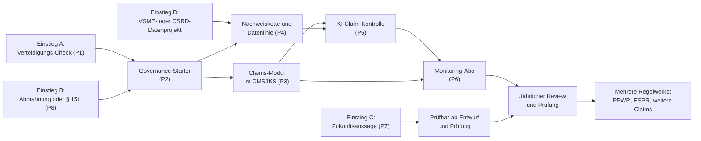

# EmpCo-Beratungsmarkt: Markt- und Wettbewerbsanalyse und USP-Entwicklung

**Wie sich Big 4, Next 10 und Strategieberatungen zu EmpCo und Green Claims positionieren – und was daraus für ein eigenes Beratungsangebot folgt**

| | |
|---|---|
| **Stand** | 28.09.2026 – einen Tag nach Anwendungsbeginn der EmpCo-Regeln in Deutschland; ergänzt am 29.09.2026 (Kap. 15) |
| **Zweck** | Markt- und Wettbewerbsanalyse als Grundlage für ein eigenes Beratungsangebot. **Keine** rechtliche Grundlagenrecherche; dafür siehe die Research-Basis v1.0 im selben Ordner („RB“) |
| **Leitfrage** | Wenn EmpCo für den Kunden zunächst nach zusätzlichem Compliance-Aufwand aussieht: Wie wird genau dieser Aufwand zum Ausgangspunkt für bessere Governance, effizientere Prozesse, bessere Daten, Automatisierung und weitere Mehrwerte – und warum sollte der Kunde dafür uns beauftragen? |
| **Status** | Entwurf v1.1 mit Realitätscheck und Korrekturen vom 29.09.2026. Quellenlage und Annahmen: siehe Lesehinweise |

---

## Lesehinweise

### Kennzeichnung der Aussagen

| Kennzeichen | Bedeutung |
|---|---|
| **[Beleg]** | **A – Tatsächliche Marktpositionierung:** was ein Unternehmen nachweisbar selbst kommuniziert, mit Quelle |
| **[Beobachtung]** | **B – Marktbeobachtung:** was sich aus mehreren Quellen ableiten lässt |
| **[Hypothese]** | **C – Hypothese:** was daraus möglicherweise folgt, ohne Beleg |
| **[Ansatz]** | **D – Eigener Beratungsansatz:** was wir daraus entwickeln könnten |

**Standardregel, damit die Tabellen lesbar bleiben:** Kapitel 2 enthält, soweit nicht anders markiert, **[Beleg]**-Aussagen. Die Kapitel 1 und 3–6 sind **[Beobachtung]**, die Kapitel 7–12 **[Ansatz]**. Abweichungen sind einzeln gekennzeichnet. In Kapitel 15 ist jede Aussage einzeln gekennzeichnet.

Quellen: **[Q01]–[Q54]**, vollständig im Anhang. Verweise auf die Research-Basis erscheinen als „RB Kap. x“.

### Methodik und Quellenlage – bitte vor Weiterverwendung lesen

- **Zeitraum:** 2024 bis 28.09.2026, mit Schwerpunkt 2025–2026.
- **Vorgehen:**
  - je Player gezielte Websuche nach EmpCo-, Green-Claims- und Greenwashing-Inhalten auf den eigenen Domains (Deutschland, ergänzend Österreich und international),
  - Erfassung nach dem Raster A–E (Positionierung, Problemdefinition, Angebot, Zielgruppe, Value Proposition),
  - danach Synthese.
- **Wichtige Einschränkung:** Seiten ließen sich in dieser Arbeitsumgebung nicht direkt öffnen (Netzwerkrichtlinie). Erfasst wurden Titel, URL und Inhaltszusammenfassungen aus der Suche. Daraus folgt:
  - Kernaussagen sind **paraphrasiert**, nicht wörtlich zitiert.
  - Veröffentlichungsdaten sind nur teilweise ermittelbar; sonst steht „n. e.“ (nicht ermittelt).
  - **Vor externer Verwendung sind die Seiten aufzurufen und die Aussagen zu prüfen.**
- **„Nicht gefunden“ heißt nicht „nicht vorhanden“.** Angebote können hinter Logins, in Pitches oder auf nicht indexierten Seiten liegen. Die Analyse bewertet die **Kommunikation** der Player, nicht ihre tatsächliche Kompetenz.
- **Nicht ausgewertet:** Preise (nicht öffentlich), Interviews, Ausschreibungen.

### Arbeitsannahmen (bitte bestätigen oder korrigieren)

- **A1 – Wer „wir“ sind:** eine multidisziplinäre, mittelstandsorientierte Prüfungs- und Beratungsgesellschaft in Deutschland mit Wirtschaftsprüfung, Steuerberatung, Rechtsberatung und Unternehmensberatung. Der Kontext dieses Projekts („RSM Berlin“) legt RSM Ebner Stolz nahe; deren Außenauftritt als „Wirtschaftsprüfer Steuerberater Rechtsanwälte Partnerschaft mbB“ passt dazu [Q17]. Trifft A1 nicht zu, gelten die Ableitungen sinngemäß für vergleichbare Next-10-Häuser.
- **A2 – Zielkunde:** Mittelstand und Mid-Market (ca. 50–5.000 Beschäftigte) mit B2C- oder B2B2C-Bezug, vor allem Hersteller, Handel und Konsumgüter. Großunternehmen nur selektiv.
- **A3 – Markt:** Deutschland. Befunde aus Österreich dienen als Vorlaufindikator, weil dort mehrere Angebote bereits stärker produktisiert sind.
- **A4 – Kompetenzen:**
  - Prüfung und Beratung von IKS und CMS (IDW PS 980, 982)
  - Nachhaltigkeits-Assurance (CSRD, VSME)
  - Rechtsberatung zum UWG über die Rechtsanwaltseinheit
  - Grundlagen in IT-, Daten- und KI-Beratung
- **A5 – Grenzen:**
  - Unabhängigkeitsregeln bei Prüfungsmandanten (Selbstprüfungsrisiko)
  - Rechtsdienstleistungsgesetz (RDG): Rechtsberatung nur durch Anwältinnen und Anwälte
  - keine Kreativleistungen einer Agentur
  - keine eigene Softwareentwicklung, das Angebot bleibt werkzeugneutral
- **A6 – Zugang:** eine bestehende Mandantenbasis im Mittelstand aus Prüfung und Steuerberatung.

---

## Executive Summary

1. **Breite Präsenz, schmale Positionierung.**
   - Alle Big 4 und acht der zehn betrachteten Next-10-Häuser haben EmpCo-spezifische Inhalte veröffentlicht; bei ETL und PKF fand sich nichts.
   - McKinsey, BCG und Bain äußern sich nur indirekt: McKinsey und Bain zum geschäftlichen Wert nachhaltiger Claims, BCG 2023 zur geplanten Green-Claims-Richtlinie, keiner zu EmpCo.
   - Einzige Strategie- bzw. Marketingberatung mit EmpCo-spezifischer Veröffentlichung ist in der Stichprobe Simon-Kucher (28.09.2026) [Q24]–[Q27] **[Beobachtung]**.
2. **Das dominierende Narrativ ist „Get compliant / Avoid the risk“.**
   - 12 der 13 Beratungen mit EmpCo-Inhalten stellen EmpCo als Rechts- und Compliance-Thema dar.
   - Meist folgt das einer Projektlogik mit dem Ziel „konform bis 27.09.2026“ **[Beobachtung]**.
3. **Was der Markt tatsächlich verkauft:**
   - Wissen (Webcasts, Artikel, Podcasts – meist kostenlos),
   - Claim-Checks (teils kostenlos, zunehmend KI-gestützt),
   - strukturierte Prüfung einzelner Claims und rechtliche Bewertung,
   - neu für Wirtschaftsprüfer: die Prüfung von Umsetzungsplänen für Zukunftsaussagen **[Beobachtung]**.
4. **Der Claim-Check wird zur Massenware.**
   - Kostenlose KI-Scanner und Quick-Checks drücken den Einstiegspreis gegen null.
   - Anbieter sind Softwarefirmen, Verbände, Prüfdienstleister, vereinzelt Big 4 (Deloitte Österreich) und Next 10 (Rödl mit einem Screening) [Q04][Q30][Q32][Q35][Q41] **[Beobachtung]**.
5. **Governance wird angesprochen, aber kaum als Produkt angeboten.**
   - PwC: Anti-Greenwashing-Framework mit Ursprung im Finanzsektor.
   - EY: Einordnung ins Compliance-Management-System (CMS) in einem Gastbeitrag; in Österreich Daten und Prozesse.
   - Forvis Mazars: Greenwashing als eigene Risikokategorie.
   - Deloitte Legal: „Identify. Verify. Manage.“
   - Rödl: Screening mit Dokumentation und vertraglichen Nachweispflichten bei Lieferanten (Nachtrag 29.09.2026) [Q35].
   - Managementberatungen und Software positionieren den Dauerprozess (Kap. 15.1) [Q36][Q37].
   - Ein fertiges, mittelstandstaugliches „Claims-Modul im CMS/IKS“ mit Kontrolltests ist nicht sichtbar [Q01][Q05][Q06][Q11][Q18] **[Beobachtung]**.
6. **„Turn compliance into value“ ist eine Nischenposition.**
   - Explizit vertreten nur von KPMG (Wettbewerbsvorteile, Innovation, Geschäftsmodelle über den Produktlebenszyklus) und Simon-Kucher („Chancen“ für die Verpackungsindustrie).
   - Bei PwC taucht es nur im Titel eines Rechtsblogs auf [Q08][Q12][Q27] **[Beleg]**.
7. **KI:**
   - Bei EY Österreich („EY.ai Greenwashing Analyzer“) und Grant Thornton Österreich (KI-gestütztes Screening) ist KI Teil des Angebots; bei Softwareanbietern ist sie Standard.
   - Kontrollen über die KI selbst (Validierung, Änderungssteuerung) thematisiert kein Player [Q05][Q16][Q32] **[Beobachtung]**.
8. **Den Lebenszyklus eines Claims – finden, belegen, auslaufen lassen – besetzen Softwareanbieter für Digital Asset Management (DAM)** wie Bynder und Six, keine Beratungen [Q32] **[Beleg][Beobachtung]**.
9. **Lücken mit Substanz:**
   - Claim-Governance als Managementsystem im bestehenden CMS/IKS,
   - Verteidigungsfähigkeit (Belege in 48 Stunden),
   - Claim-Bibliothek als Hilfe gegen „Greenhushing“ (aus Vorsicht nicht mehr kommunizieren),
   - Nachweiskette zu den Lieferanten (teilweise besetzt, Kap. 15.1),
   - KI-Kontrolle mit Kontrollen über die KI,
   - Monitoring als Service,
   - ein Claim-System für mehrere Regelwerke (Verpackungsverordnung PPWR, Ökodesign-Verordnung ESPR) **[Beobachtung][Hypothese]**.
10. **Wo sich eine mittelstandsorientierte, multidisziplinäre WP-Gesellschaft abheben kann:**
    - nicht beim Recht, das Kanzleien und die Legal-Arme der Big 4 besetzen,
    - nicht beim Scan, der zur Massenware wird,
    - sondern bei der **Kontrollarchitektur**: Claims so steuern, prüfen und belegen wie Finanzzahlen **[Hypothese][Ansatz]**.
11. **Top 5 Differentiators:**
    1. Claims ins CMS/IKS
    2. Verteidigungsfähigkeit in 48 Stunden
    3. Claim-Bibliothek statt Greenhushing
    4. Nachweiskette vom Lieferanten zum Claim
    5. KI-Claim-Kontrolle mit Kontrolle über die KI **[Ansatz]**
12. **Land & Expand:**
    - Einstieg über einen „Verteidigungs-Check“ statt über einen weiteren Claim-Check.
    - Ausbau über einen Governance-Starter, die Integration ins CMS/IKS, Daten und KI sowie ein Monitoring-Abo mit jährlichem Review.
    - Bei Prüfungsmandanten die Unabhängigkeit beachten **[Ansatz]**.
13. **Zeitfenster:**
    - Die Veröffentlichungen verdichten sich seit Juli 2026.
    - Nach dem Stichtag verschiebt sich die Kundenfrage von „Was gilt?“ zu „Wie halten wir das dauerhaft?“.
    - Wer das Governance-Narrativ jetzt besetzt, findet einen noch weitgehend leeren Raum **[Hypothese]**.
14. **Realitätscheck (Kap. 15, ergänzt am 29.09.2026):**
    - Zwölf USPs gibt es nicht. Tragfähig ist ein Kernangebot, die „prüffeste Claim-Governance“ aus U1, U2 und U7; der Rest sind Bausteine oder Themen für später.
    - Die Alleinstellung ist kleiner als oben dargestellt: Rödl hat ein Screening mit Lieferantenverträgen, Managementberatungen und Software positionieren den Dauerprozess [Q35]–[Q40].
    - Verkaufbar ist das Angebot vor allem mit Anlass, besonders nach einer Unterlassungserklärung, und mit kleineren Einstiegen für kleinere Mittelständler [Q41][Q42].
    - Besonders betroffen sind Lebensmittel und Getränke, Drogerie und Kosmetik, Verpackung und Zulieferer, Energie, Handel sowie Reise und Mobilität [Q43].
    - EmpCo schreibt keine Prüfung von Claims vor. Drittprüfung gibt es nur bei Siegeln und beim Umsetzungsplan für Zukunftsaussagen; der Prüfungsgrad ist dort offen [Q45][Q48][Q53].
    - Die Integration in CMS, IKS oder ISO-Systeme ist konzeptionell einfach und praktisch anspruchsvoll; Kap. 15.6 nennt zwölf typische Schwachstellen **[Beobachtung][Hypothese]**.

---

## 1. Market Landscape

### 1.1 Wer sich mit EmpCo beschäftigt – Marktsegmente

| Segment | Beispiele (Belege) | Typische Leistung | Rolle im Wettbewerb |
|---|---|---|---|
| **Big 4** | Deloitte, EY, KPMG, PwC [Q01]–[Q13] | Rechtsupdates über die Legal-Arme, Claim-Checks, Frameworks, KI-Tools (Österreich), Forensik | direkter Wettbewerb, breit aufgestellt |
| **Next 10** (Auswahl) | BDO, Grant Thornton, RSM Ebner Stolz, Forvis Mazars, Baker Tilly, Crowe Kleeberg, Rödl & Partner, Ecovis [Q14]–[Q22] | Rechtsinformation, Prüfung von Umsetzungsplänen, Verifizierung von Claims, Readiness-Checks | direkter Wettbewerb im Mittelstand |
| **Berufsstand** | Wirtschaftsprüferkammer [Q23] | Einordnung als „weiteres Betätigungsfeld für den Berufsstand“ | Signal: Die Prüfung wird ein eigener Markt |
| **Strategie- und Marketingberatungen** | McKinsey, BCG, Bain (indirekt) [Q24]–[Q26]; Simon-Kucher (direkt) [Q27] | Konsumentenstudien, Business Value | kaum direkte Konkurrenz; prägen aber das Narrativ |
| **Kanzleien** | CMS, Bird & Bird, GvW, KINAST, itmr u. v. a. [Q29] | Rechtsupdates, Claim-Prüfung, teilweise Pakete | Hauptwettbewerb bei der Rechtsprüfung |
| **Prüf- und Zertifizierungsdienstleister** | DEKRA, TÜV Rheinland Consulting, Bureau Veritas, GUT Cert, Normec Verifavia [Q30] | unabhängige Prüfung von Claims und Siegeln, Quick-Checks | Wettbewerb bei der Verifizierung |
| **Nachhaltigkeits- und Klimaberatungen, Agenturen** | ClimatePartner, natureOffice, intep, Sustainable AG, plant-values, RITTWEGER + TEAM [Q31] | Claim-Checks, Umstellung von Labels, KI-Tools, Kommunikation | Wettbewerb beim Einstieg |
| **Software** | EmpCo-Scanner, EcoClaim, senken, everwave (KI-Scanner, teils kostenlos); Bynder, Six (DAM) [Q32] | Scans, Workflows für den Claim-Lebenszyklus | machen den Check zur Massenware; mögliche Partner beim Lebenszyklus |
| **Kammern und Verbände** | IHKs, WKO [Q33] | kostenlose Information, Veranstaltungen | stellen das Basiswissen gratis bereit |

### 1.2 Zeitliche Entwicklung

- **2023–2024:**
  - Fokus auf die geplante Green-Claims-Richtlinie (BCG 2023 [Q25]).
  - Fokus auf Behörden und Vorwürfe (Deloitte-Veranstaltung 29.11.2024 [Q02]).
- **2025:** Im Juni 2025 kündigte die Kommission an, den Vorschlag für die Green-Claims-Richtlinie zurückzuziehen. Seitdem ist das Verfahren formell anhängig, faktisch aber gestoppt (RB Kap. 1.2.2). In der Stichprobe fanden sich kaum datierbare Veröffentlichungen aus 2025.
- **2026: deutliche Verdichtung**
  - PwC-Blog (11.02.2026) [Q12]
  - Rödl (28.07.2026) [Q21]
  - Deloitte-Legal-Webcast (26.08.2026) [Q01]
  - Crowe Kleeberg (16. und 25.09.2026) [Q20]
  - Simon-Kucher (28.09.2026) [Q27]
- **Seit September 2026:** Die Prüfung von Umsetzungsplänen wird zum Thema, nachdem das IDW Fragen und Antworten (10.09.2026) und Mustervermerke (22.09.2026) veröffentlicht hat (RB Kap. 3.5).
- **Vorbehalt:** Viele Seiten sind nicht datiert; die Chronologie ist deshalb nur eine Tendenz.

### 1.3 Was der Markt tatsächlich verkauft

Die Frage lautet: Welche Leistung kauft ein Kunde am Ende tatsächlich ein?

| # | Leistung | Belege | Kommerzielle Logik | Typische Käufer | Unterscheidbarkeit [Hypothese] |
|---|---|---|---|---|---|
| 1 | **Wissen und Updates** (Webcasts, Artikel, Podcasts) | Deloitte Legal [Q01], KPMG Law [Q09], Rödl [Q21], RSM Ebner Stolz [Q17], Baker Tilly [Q19], Ecovis [Q22], Kanzleien [Q29], IHK [Q33] | Lead-Generierung, kostenlos | Legal, Marketing | sehr gering |
| 2 | **Quick-Check bzw. Claim-Screening** | Deloitte Österreich (kostenlos) [Q04], Grant Thornton Österreich (kompakt, KI-gestützt) [Q16], Rödl (Screening) [Q35], TÜV Rheinland [Q30], Tools [Q32] | Einstieg, oft kostenlos | Marketing, Compliance | gering, sinkend |
| 3 | **Relevanz- bzw. Readiness-Bewertung** | Grant Thornton Österreich [Q16], Forvis Mazars [Q18], BDO (als Vorgehen) [Q14] | kleines Projekt | Compliance, Nachhaltigkeit | gering |
| 4 | **Strukturierte Prüfung einzelner Claims** (Belege, Transparenz, Konsistenz) | EY Österreich [Q05], Grant Thornton Österreich [Q16], BDO [Q14] | Projekt, abhängig vom Volumen | Marketing, Legal | mittel |
| 5 | **Rechtliche Bewertung im Einzelfall** | Legal-Arme der Big 4, Kanzleien [Q29] | nach Stunden | Legal | mittel (Reputation) |
| 6 | **Aufbau von Belegen** (Ökobilanz, CO₂-Fußabdruck von Produkten) | EY Österreich [Q05], BDO (Verifizierung) [Q14] | technisches Projekt | Nachhaltigkeit | mittel |
| 7 | **Verifizierung und Prüfung** (Umsetzungspläne, CO₂-Fußabdruck, Transitionspläne, Siegel) | Grant Thornton [Q15], Crowe Kleeberg [Q20], BDO [Q14], DEKRA, GUT Cert [Q30], Wirtschaftsprüferkammer [Q23] | wiederkehrend, weil das Gesetz „regelmäßige“ Prüfung verlangt | CFO, Nachhaltigkeit | mittel; durch die IDW-Mustervermerke zunehmend einheitlich |
| 8 | **Framework- und Governance-Design** | PwC [Q11], Grant Thornton Österreich („Compliance-Prozesse“) [Q16] | Projekt | Compliance, Risikomanagement | mittel bis hoch |
| 9 | **Schulungen und Workshops** | Forvis Mazars [Q18], EY Österreich [Q05] | kleines Projekt | Marketing | gering |
| 10 | **Forensik und Krisenbegleitung** | Deloitte [Q02] | anlassbezogen | Legal, Geschäftsführung | mittel |
| 11 | **Umstellung von Labels und Kommunikation** | ClimatePartner [Q31], Agenturen | Produkt oder Projekt | Marketing | gering |
| 12 | **Software** | Scanner, DAM [Q32] | Lizenz, teils kostenlos | Marketing Operations | hängt vom Tool ab |

**Befund:** Wiederkehrende Umsätze sind nur an zwei Stellen erkennbar: bei der gesetzlich regelmäßigen Prüfung von Umsetzungsplänen und bei Softwarelizenzen. Einen wiederkehrenden Governance- oder Monitoring-Service einer Beratung zeigt die Stichprobe nicht.

---

## 2. Player-by-Player Analysis

*Raster: A Positionierung · B Problemdefinition · C Beratungsangebot · D Zielgruppe · E Value Proposition. Aussagen sind **[Beleg]**, soweit nicht anders markiert; die jeweils letzte Zeile „Einordnung“ ist **[Beobachtung]**.*

### 2.1 Big 4

#### Deloitte

| Feld | Befund |
|---|---|
| **A** | **Legal Compliance** (Deloitte Legal Deutschland) und **Risiko/Forensik** (Deloitte Deutschland). In Österreich bietet Consulting einen Risiko-Check an. Dazu kommt ein eigener Strang für den Finanzsektor (Audit & Assurance) |
| **B** | Ohne Übergangsfrist müssen Unternehmen kurzfristig klären, welche Claims künftig noch zulässig sind [Q01]. Greenwashing-Vorwürfe bringen Behördenverfahren, Klagen und interne Untersuchungen mit sich [Q02]. Greenwashing-Risiken bestehen unternehmensweit [Q04] |
| **C** | Webcast „Green Claims 2026: Identify. Verify. Manage in a legally compliant manner“ (26.08.2026) [Q01]; Veranstaltung „Greenwashing im Rampenlicht der Behörden“ zu Handlungsoptionen, internen Untersuchungen und Reaktionen auf Behörden und Klagen (29.11.2024) [Q02]; Perspektive für den Finanzsektor zu EmpCo und Green-Claims-Richtlinie (n. e.) [Q03]; in Österreich Überblick, **kostenloser Quick-Check** und bedarfsgerechte Unterstützung (n. e.) [Q04] |
| **D** | Finanzsektor [Q03]; in Österreich branchenübergreifend [Q04]; KMU nicht ausdrücklich |
| **E** | Compliance und Risiko; Prozess nur angedeutet („Manage“). Business Value nicht EmpCo-spezifisch, sondern allgemein zur EU-Nachhaltigkeitsregulierung („Unlocking competitiveness and growth“) [Q28] |
| **Einordnung** | Compliance und Risiko dominieren. Governance erscheint nur als Schlagwort |

#### EY

| Feld | Befund |
|---|---|
| **A** | In Österreich (EY denkstatt) eine Verbindung von **Nachhaltigkeit, Daten und Recht**; in Deutschland **Compliance und CMS** über Forensic & Integrity |
| **B** | Österreich: Nötig ist eine frühe Auseinandersetzung mit Claims, Datengrundlagen und internen Prozessen [Q05]. Deutschland: Greenwashing wird vom Reputations- zum Compliance-Risiko; Umweltaussagen können nicht mehr außerhalb des CMS stehen; die zentrale Frage ist, ob eine Aussage rechtlich zulässig, faktisch belegbar und gegenüber Dritten belastbar ist (Gastbeitrag von Andreas Pyrcek, Partner Forensic & Integrity) [Q06]. Dänemark: „regulatory milestone“ [Q07] |
| **C** | Österreich [Q05]: Sensibilisierung; Identifikation riskanter Claims u. a. mit dem **„EY.ai Greenwashing Analyzer Tool“**; Bewertung einzelner Aussagen und Prüfung der Belege mit Anpassungsvorschlägen; Berechnung ökologischer Kennzahlen und Analysen entlang der Wertschöpfungskette; rechtliche Einordnung. Deutschland: nur der Gastbeitrag, in der Stichprobe keine EmpCo-Leistungsseite [Q06]. Dänemark: Unterstützung bei der Anpassung der externen Kommunikation [Q07] |
| **D** | nicht spezifiziert; der deutsche Beitrag richtet sich an Compliance- und Ethik-Verantwortliche |
| **E** | Compliance, Risiko, Innovation (KI-Tool), Belege und Daten. Business Value wird nicht betont |
| **Einordnung** | Die stärkste Kombination aus Daten, KI und Recht (Österreich). Das CMS-Narrativ gibt es in Deutschland bisher nur publizistisch |

#### KPMG

| Feld | Befund |
|---|---|
| **A** | **Nachhaltigkeit/ESG mit Chancen-Framing** (Deutschland); dazu Legal (KPMG Law Deutschland und Österreich) |
| **B** | EmpCo greift in den gesamten Produktlebenszyklus ein, von der Herstellung bis zu Reparatur und Software-Updates. Aussagen müssen nachvollziehbar, überprüfbar und dauerhaft dokumentiert sein. EmpCo sei „kein reines Verbotsgesetz, sondern Treiber für Innovation und neue Modelle wie Leasing oder Sharing“ [Q08]. Dazu Praxisfragen aus rechtlicher Sicht [Q09] |
| **C** | Deutschland: gezielte Analyse von Produkten und Prozessen, um sich zu differenzieren, etwa über Lebenszyklusmanagement und längere Nutzungsdauer [Q08]; Rechts-FAQ von KPMG Law [Q09]. Österreich: Factsheet „Nachhaltigkeitskommunikation“ (Inhalt nicht ausgewertet) und ein Beitrag von KPMG Law [Q10] |
| **D** | breit, mit Beispielen: Autohersteller (Streaming-Dienste im Fahrzeug), Elektronik (begrenzter Support), Handel (Recycelbarkeit von Eigenmarken) [Q08] |
| **E** | Compliance, **Business Value** („Chance für Wettbewerbsvorteile“), **strategischer Wert** (Geschäftsmodelle) [Q08] |
| **Einordnung** | Einziger Big-4-Player mit ausdrücklichem Chancen- und Innovationsnarrativ auf einer deutschen Themenseite |

#### PwC

| Feld | Befund |
|---|---|
| **A** | **Governance und Risikomanagement** über das „Anti-Greenwashing Framework“; ein Rechtsblog mit „Chancen, Risiken“ im Titel; international Schulungen |
| **B** | „Viele Greenwashing-Fälle resultieren aus fehlender Governance“; nötig seien ganzheitliche Ansätze [Q11]. Interne Prozesse sollten schon jetzt an die EU-Anforderungen angepasst werden (Blog vom 11.02.2026) [Q12] |
| **C** | Anti-Greenwashing Framework [Q11]: Risiken früh erkennen und adressieren (laut Seite „automatisch“); unterstützt Compliance, Governance und Risikomanagement; Transparenz über die Wertschöpfungskette. Es unterscheidet interne Prozesse (Unternehmenskultur, Datenmanagement, Governance) von kundenbezogenen Prozessen (Wertschöpfungskette von Finanzprodukten). Inhalte: Schulung, Datenmanagement, Verantwortlichkeiten, Dokumentation, Konsistenzprüfungen, digitale Tools. Dazu Blogs [Q12] sowie international ein Training „Compliance and business strategy“ (Luxemburg), Inhalte für Finanzdienstleister (Schweiz) und Pensionsfonds (Niederlande) [Q13] |
| **D** | Herkunft aus Sustainable Finance, also Finanzsektor [Q11][Q13]; die EmpCo-Seite ist allgemein gehalten [Q11] |
| **E** | Compliance, Risiko, **Governance**, Effizienz (automatisiert, digitale Tools); Business Value nur im Blogtitel [Q12] |
| **Einordnung** | Das stärkste Governance-Framing der Big 4, allerdings mit Wurzeln im Finanzsektor. Ein Bezug zum Mittelstand ist nicht erkennbar |

### 2.2 Next 10

#### BDO

| Feld | Befund |
|---|---|
| **A** | Compliance aus Sicht der **Prüfung** (der Beitrag steht in der Rubrik „Assurance“) |
| **B** | Der Stichtag erlaubt keinen Aufschub: Verpackungen, Kampagnen und Websites müssen bis dahin konform sein. Die Schwarze Liste wurde erweitert [Q14] |
| **C** | Verifizierung von Umwelt- und Nachhaltigkeitsaussagen zum heutigen Stand und zu künftigen Zielen, u. a. CO₂-Fußabdruck von Produkten und Klimatransitionspläne. Empfohlenes Vorgehen: systematische **Inventur aller Claims über alle Kanäle**, rechtliche Einordnung gegen die Schwarze Liste, Einteilung in „verboten / nachweispflichtig / unproblematisch“ [Q14] |
| **D** | Unternehmen mit Umweltwerbung, nicht weiter spezifiziert |
| **E** | Compliance, Risiko, Prüfung |
| **Einordnung** | Compliance aus der Prüfungsperspektive. Die Inventur-Methodik ist vorhanden, erscheint aber als Projektschritt, nicht als dauerhaftes System |

#### Grant Thornton

| Feld | Befund |
|---|---|
| **A** | Deutschland: **Prüfung** (Prüfpflicht für Umsetzungspläne). Österreich: fertiges Angebot „EmpCo & Green Claims Compliance“ |
| **B** | Mit künftiger Umweltleistung darf nur werben, wer einen glaubwürdigen, extern geprüften Umsetzungsplan hat; sonst drohen Abmahnungen und Reputationsschäden [Q15]. Österreich: Betroffenheit analysieren, Compliance-Risiken senken [Q16] |
| **C** | Deutschland: Unterstützung beim Formulieren belastbarer Umweltaussagen und bei der Prüfung bestehender Aussagen; Prüfung von Umsetzungsplänen [Q15]. Österreich [Q16]: **kompaktes, KI-gestütztes Claim-Screening**; Bewertung der Relevanz (B2C, B2B); strukturierte Prüfung durch Fachleute nach Kriterien wie Beleg, Transparenz, Konsistenz und Kontext; **Entwicklung geeigneter Compliance-Prozesse** |
| **D** | nicht spezifiziert |
| **E** | Compliance, Risiko, Innovation (KI-Screening in Österreich), Prüfung |
| **Einordnung** | In Österreich am klarsten als Produkt aufgebaut; in Deutschland von der Prüfung her gedacht |

#### RSM Ebner Stolz (RSM-Netzwerk)

| Feld | Befund |
|---|---|
| **A** | **Rechtsberatung** (Wirtschaftsrecht; Litigation im Wettbewerbsrecht) mit Bezug zum Mittelstand |
| **B** | Deutlich strengere Anforderungen an Werbung mit Begriffen wie „umweltfreundlich“ und mit Siegeln. Unternehmen müssen Werbeaussagen, Produktinformationen und Nachhaltigkeitsversprechen prüfen [Q17] |
| **C** | Beitrag zum Bundestagsbeschluss; Webinar „Verschärfte Regeln gegen Greenwashing – die nationale Umsetzung der EmpCo-RL“ zu unzulässigen Praktiken und allgemeinen Umweltaussagen (Referentinnen: Daria Madejska, Sophie-Isabelle Horst); Podcast „Mittelstandstalk: Schluss mit Greenwashing – was die EmpCo-Richtlinie für den Mittelstand bedeutet“; Beitrag zu § 15b [Q17] |
| **D** | Mittelstand (Podcast) [Q17] |
| **E** | Compliance, Risiko |
| **Einordnung** | Von der Rechtsberatung her gedacht, mit Mittelstandsbezug. Governance, IKS, KI und Prüfung werden in der Stichprobe **nicht** kommuniziert. Trifft Annahme A1 zu, ist das unsere eigene Ausgangslage. Auf Ebene des RSM-Netzwerks wurden keine EmpCo-Inhalte gefunden |

#### Forvis Mazars

| Feld | Befund |
|---|---|
| **A** | **Nachhaltigkeitskommunikation** zwischen Compliance und „Erfolgsgeschichten“ |
| **B** | Die Rechtsrisiken durch Greenwashing wachsen. Empfehlung: Greenwashing als **neue Risikokategorie in Compliance- und Risikomanagement** aufnehmen [Q18] |
| **C** | Risikoanalysen, **Readiness-Checks** (u. a. für EmpCo), Workshops für Marketing- und Kommunikationsteams. Modularer Ablauf: Gap-Analyse → qualitative Recherche und quantitatives Datenmanagement → Kommunikationsstrategie. Dazu Optimierung von Berichten einschließlich ihrer Lesbarkeit für KI-Tools [Q18] |
| **D** | Unternehmen mit Nachhaltigkeitskommunikation; in Österreich Handel und Konsumgüter [Q18] |
| **E** | Compliance, Risiko, **Vertrauen** („authentisch, transparent, überprüfbar“), Business Value („Erfolgsgeschichten berichten“) |
| **Einordnung** | Wert der Kommunikation plus Empfehlung zur Risikointegration; die Integration selbst ist nicht als Produkt beschrieben |

#### Weitere Next-10-Häuser

| Player | A Positionierung | B/C Problem und Angebot | D Zielgruppe | E Value | Quelle |
|---|---|---|---|---|---|
| **Baker Tilly** | Rechtsinformation | Beitrag „EmpCo-Richtlinie: Ab September gelten neue Regeln“; kein spezifisches Angebot gefunden | n. e. | Compliance | [Q19] |
| **Crowe Kleeberg** (Mitglied von Crowe Global) | fachlich, aus Sicht der Prüfung | Beiträge zu Umsetzungsplänen (16.09.2026), zu den IDW-Mustervermerken und zur Altbestandsregel (je 25.09.2026); Prüfleistung wird nur mittelbar angesprochen | n. e. | Compliance, Prüfung | [Q20] |
| **Rödl & Partner** | Recht und Compliance, mit Blick auf das Image; dazu ein Screening-Produkt | „Zwischen Image und Compliance – Umweltwerbung unter neuen Maßstäben“ (28.07.2026); „EmpCo Countdown: Nachhaltigkeitswerbung läuft die Zeit davon“; **„RÖDL EmpCo Screening“**: Claims-Inventur, Rechts- und Faktencheck, Dokumentation der Datenbasis, vertragliche Verankerung von Nachweispflichten bei Lieferanten (Nachtrag 29.09.2026) | u. a. Stadtwerke | Compliance, Risiko, Reputation | [Q21][Q35] |
| **Ecovis** | Rechtsinformation | Blogbeitrag zu den neuen UWG-Regeln | n. e. | Compliance | [Q22] |
| *ETL, PKF* | – | keine EmpCo-Inhalte gefunden | – | – | – |

**Berufsstand:** Die Wirtschaftsprüferkammer bezeichnet die Prüfung von Umsetzungsplänen als „weiteres Betätigungsfeld für den Berufsstand“ [Q23]. Damit wird dieser Prüfungsmarkt für **alle** WP-Gesellschaften geöffnet – und entsprechend umkämpft **[Hypothese]**.

### 2.3 Strategie- und Marketingberatungen

| Player | EmpCo-spezifisch? | Relevante Veröffentlichung | Narrativ | Einordnung |
|---|---|---|---|---|
| **McKinsey** | nicht gefunden | Mit NielsenIQ (2023): Produkte mit ESG-Claims wuchsen von 2017 bis Mitte 2022 kumuliert um 28 %, Produkte ohne solche Claims um 20 %; Basis sind 600.000 Artikel, US-Konsumgüter [Q24] | Business Value von Claims | liefert das Narrativ indirekt; US-Daten, vor EmpCo |
| **BCG** | 2025–2026 nicht gefunden | „Preparing for the EU Green Claims Directive – How Companies Can Eliminate Greenwashing at Its Source“ (2023) [Q25] | Greenwashing an der Quelle vermeiden (Prozess) | früh und auf die Green-Claims-Richtlinie bezogen; keine Aktualisierung gefunden |
| **Bain** | nicht gefunden | Laut Berichterstattung: Sorge um Nachhaltigkeit 79 % (2025) → 85 % (2026). B2B-Einkäufer kaufen mehr bei nachhaltigeren Lieferanten. 59 % der Verpackungskunden würden binnen drei Jahren den Lieferanten wechseln, wenn Nachhaltigkeitskennzahlen verfehlt werden [Q26] | Business Value, Druck im B2B | indirekt; stützt das Argument der Nachweiskette (B2B2C) |
| **Simon-Kucher** | **ja** | Pressemitteilung „Neue EU-Regeln gegen Greenwashing: Herausforderungen und **Chancen** für die Verpackungsindustrie“ (28.09.2026). Studie: 49 % nennen minimalen Materialeinsatz als Merkmal nachhaltiger Verpackung, 26 % offizielle Umweltzeichen. Profitieren könne, wer nachweislich investiert [Q27] | Chance, Differenzierung | die einzige gefundene EmpCo-spezifische Chancen-Positionierung aus dem Strategieumfeld |
| **Roland Berger, Accenture, Capgemini, Kearney** | nicht gefunden | – | – | keine substanzielle Positionierung erkennbar |

### 2.4 Angrenzender Wettbewerb (kurz)

| Segment | Befund [Beleg] | Bedeutung für uns [Hypothese] |
|---|---|---|
| **Kanzleien** | Sehr viele Rechtsupdates; einige bieten Pakete an, etwa „Rechtsberatung zur EmpCo“ (GvW), „Greenwashing-Beratung & EmpCo: Beratung & Prüfung“ (KINAST) oder einen „Green-Claims- und Werbeclaim-Check“ (itmr) [Q29] | Die Rechtsprüfung einzelner Claims ist stark umkämpft. Kanzleien bieten in der Stichprobe keine Kontrollarchitektur und kein Belegmanagement an |
| **Prüf- und Zertifizierungsdienstleister** | DEKRA: „EmpCo – unabhängige Prüfung von Nachhaltigkeitsaussagen & Labels“. TÜV Rheinland Consulting: „Green Claims Quick Check“. Bureau Veritas: Verifizierung von Nachhaltigkeitsclaims mit digitaler Plattform für die Lieferkette. GUT Cert: „Umweltaussagen nach EmpCo/UWG“. Normec Verifavia: Webinar (15.07.2026) [Q30] | Konkurrenz bei Verifizierung und Umsetzungsplänen; zugleich mögliche Partner, wenn Belege Dritter nötig sind |
| **Nachhaltigkeits- und Klimaberatungen, Agenturen** | ClimatePartner stellt Labels um („Finanzieller Klimabeitrag“, „EmpCo-konform kommunizieren“); natureOffice und intep bieten Checks; plant-values „EmpCo-Richtlinie mit KI erfüllen“; die Agentur RITTWEGER + TEAM bietet Green-Claim-Kommunikation an [Q31] | Wettbewerb beim Einstieg und in der Kommunikation; kaum bei Kontrollen und Prüfung |
| **Software** | KI-Scanner prüfen ganze Domains in Minuten und liefern PDF-Bericht und Excel-Checkliste (EmpCo-Scanner); weitere Tools sind kostenlos (EcoClaim, senken; everwave für etablierte Unternehmen). DAM-Anbieter positionieren den **Claim-Lebenszyklus**: Bynder mit „Find, prove & retire“ (Belege mit Ablaufdatum, automatisches Zurückziehen), Six mit „Warum Digital Asset Management jetzt noch wichtiger wird“ [Q32] | Der Scan wird zur Massenware; den Lebenszyklus gibt es im Tool, aber ohne Governance-Beratung dazu. Anbieter sind Partner, keine Gegner |
| **Kammern und Verbände** | IHKs und WKO informieren kostenlos und veranstalten Events [Q33] | Grundwissen ist kostenlos zu haben; eine Beratung muss mehr liefern als „was gilt“ |

---

## 3. Market Narratives

*Basis für die Häufigkeit: 13 Beratungen mit EmpCo-spezifischen Inhalten (Big 4, acht Next-10-Häuser, Simon-Kucher). Die Zählung beruht auf der Stichprobe und ist nicht repräsentativ.*

| Narrativ | Verwendet von (Belege) | Häufigkeit | Form | Leistung dahinter | Unterscheidbarkeit |
|---|---|---|---|---|---|
| **A „Avoid the risk“** | Deloitte [Q02][Q04], EY Deutschland [Q06], PwC [Q11], KPMG [Q08], Grant Thornton [Q15], Forvis Mazars [Q18], Rödl [Q21], Baker Tilly [Q19], RSM Ebner Stolz [Q17] | hoch (mindestens 9 von 13) | Risiko-, Behörden- und Abmahnsprache; „bis zu 4 % Bußgeld“ (greift nur bei koordinierten grenzüberschreitenden CPC-Aktionen, § 19 UWG; RB Kap. 1.5, 9.3) | Checks, Forensik, Rechtsprüfung | gering |
| **B „Get compliant“** | nahezu alle [Q01]–[Q22] | sehr hoch (12 von 13) | Updates, Checklisten, Fristen | Updates, Webcasts, Checks | sehr gering |
| **C „Build trust“** | EY Österreich [Q05], Deloitte Österreich [Q04], Forvis Mazars [Q18], Simon-Kucher [Q27], KPMG („ernsthaftere Nachhaltigkeitskommunikation“) [Q08] | mittel (5 von 13) | „verlässliche“, „glaubwürdige“, „transparente“ Kommunikation | Kommunikationsberatung, Umformulieren von Claims | gering bis mittel |
| **D „Transform processes / governance“** | PwC [Q11][Q12], EY [Q05][Q06], Deloitte Legal [Q01], Grant Thornton Österreich [Q16], BDO [Q14], Forvis Mazars [Q18], Rödl [Q35] | mittel (7 von 13), meist als Methode oder Empfehlung | „Governance“, „Prozesse“, „Identify. Verify. Manage.“ | Framework (PwC), Prozessentwicklung (Grant Thornton Österreich), Screening mit Lieferantenverträgen (Rödl) | mittel; Potenzial hoch |
| **E „Turn compliance into value“** | KPMG [Q08], Simon-Kucher [Q27], PwC (nur Blogtitel) [Q12]; indirekt McKinsey [Q24], Bain [Q26], Deloitte Insights [Q28] | niedrig (3 von 13) | „Chance“, „Wettbewerbsvorteil“, „Innovation“ | Produkt- und Prozessanalyse (KPMG), Studien | hoch, aber selten mit einer Leistung unterlegt |
| **F „Digitalize / automate“** | EY Österreich [Q05], Grant Thornton Österreich [Q16], PwC [Q11]; Software [Q32] | bei Beratungen niedrig (3 von 13), bei Software hoch | KI-Tool, „automatisch“, digitale Tools | KI-Screening | sinkt, weil Scans zur Massenware werden |
| **G „Prüfpflicht / Assurance“** (zusätzlich identifiziert) | Grant Thornton [Q15], Crowe Kleeberg [Q20], BDO [Q14]; Wirtschaftsprüferkammer [Q23]; Prüfdienstleister [Q30] | mittel (3 von 13, dazu der Berufsstand) | Prüfpflicht, Mustervermerke, unabhängige Prüfung | Prüfung von Umsetzungsplänen, Verifizierung | mittel; durch IDW-Standards zunehmend einheitlich |
| **H „Kostenloser Einstieg“** (zusätzlich) | Deloitte Österreich [Q04]; Prüfdienstleister und Tools [Q30][Q32] | Big 4 vereinzelt, im Umfeld häufig | „Quick-Check“, „kostenlos“ | Lead-Generierung | keine |
| **I „Produktlebenszyklus und Kreislaufwirtschaft“** (zusätzlich) | KPMG [Q08] | Nische (1 von 13) | Reparatur, Updates, Leasing, Sharing | Analyse von Produkten und Geschäftsmodellen | hoch |
| **J „Greenwashing im Finanzsektor“** (zusätzlich) | Deloitte [Q03], PwC [Q11][Q13] | Nische | Sustainable Finance | Frameworks | mittel |
| **K „Claim-Lebenszyklus im System“** (zusätzlich) | Bynder, Six (Software) [Q32] | nur Software | „Find, prove, retire“ | DAM-Workflows | hoch; bei Beratungen unbesetzt |

**Lesart:** Die Narrative A und B tragen nahezu die gesamte Kommunikation. Die Narrative mit der höchsten Unterscheidbarkeit (E, I, K) sind entweder kaum mit Leistungen unterlegt (E, I) oder liegen bei Softwareanbietern (K). Das Governance-Narrativ D ist angekündigt, aber nur bei PwC und Grant Thornton Österreich als Leistung ausformuliert, in Teilen auch bei Rödl (Nachtrag, Kap. 15.1).

---

## 4. Compliance vs. Opportunity

### 4.1 Positionierungsmatrix (nach kommunizierter Positionierung)

*Legende: ● ausdrücklich und mehrfach kommuniziert · ◐ angesprochen oder im Ansatz · ○ in der Stichprobe nicht gefunden. Die Einordnung folgt ausschließlich den genannten Quellen.*

| Player | Compliance | Business Value | Governance | Transformation | Evidenz | Eindeutigkeit |
|---|---|---|---|---|---|---|
| Deloitte | ● | ○ (EmpCo) / ◐ (allgemein) | ◐ („Manage“) | ○ | [Q01]–[Q04], [Q28] | mittel |
| EY | ● | ○ | ◐ (CMS in Deutschland, Prozesse in Österreich) | ◐ (Daten, KI in Österreich) | [Q05]–[Q07] | mittel (Deutschland nur Gastbeitrag) |
| KPMG | ● | ● | ○ | ◐ (Lebenszyklus, Geschäftsmodelle) | [Q08]–[Q10] | hoch |
| PwC | ● | ◐ (Blogtitel) | ● (Framework) | ◐ (digitale Tools) | [Q11]–[Q13] | hoch; Framework aus dem Finanzsektor |
| BDO | ● | ○ | ◐ (Inventur-Methodik) | ○ | [Q14] | hoch |
| Grant Thornton | ● | ○ | ◐ (Österreich: Compliance-Prozesse) | ◐ (Österreich: KI) | [Q15][Q16] | hoch |
| RSM Ebner Stolz | ● | ○ | ○ | ○ | [Q17] | hoch (innerhalb der Stichprobe) |
| Forvis Mazars | ● | ◐ („Erfolgsgeschichten“) | ◐ (Risikokategorie) | ○ | [Q18] | mittel |
| Baker Tilly | ● | ○ | ○ | ○ | [Q19] | gering (ein Beitrag) |
| Crowe Kleeberg | ● | ○ | ○ | ○ | [Q20] | mittel |
| Rödl & Partner | ● | ○ (nur „Image“) | ◐ (Screening mit Lieferantenverträgen) | ○ | [Q21][Q35] | mittel |
| Ecovis | ● | ○ | ○ | ○ | [Q22] | gering |
| Simon-Kucher | ◐ | ● | ○ | ○ | [Q27] | hoch (eine Pressemitteilung) |
| McKinsey, Bain | – | ● (indirekt) | ○ | ○ | [Q24][Q26] | nicht EmpCo-spezifisch |
| BCG | – | ○ | ◐ (2023: „an der Quelle“) | ○ | [Q25] | veraltet |

### 4.2 Die beiden Dimensionen im Überblick

| | **Compliance / Risiko** | **Business Opportunity / Value** |
|---|---|---|
| **End-to-End-Governance / Transformation** | PwC (Framework); EY (Daten, Prozesse, CMS – teilweise); Grant Thornton Österreich (Prozesse – teilweise) | **weitgehend unbesetzt**; KPMG nur im Ansatz über den Produktlebenszyklus |
| **Rechtliche Einzelprüfung / einzelner Aspekt** | Deloitte Legal, KPMG Law, RSM Ebner Stolz, Baker Tilly, Rödl, Ecovis, BDO, Crowe Kleeberg, Grant Thornton Deutschland, Kanzleien, Tools | Simon-Kucher (Verpackung); McKinsey und Bain (indirekt) |

**Befund:** Das Feld „Business Value + Governance“ ist leer. Genau dort läge ein Angebot, das Pflichtaufwand in dauerhafte Steuerungsfähigkeit und messbaren Nutzen übersetzt.

### 4.3 Herrschende Marktmeinung – evidenzbasierte Synthese

| Stufe | Inhalt | Belege |
|---|---|---|
| **Stark verbreitet** | EmpCo als Rechts- und Compliance-Thema mit Projektlogik; erster Schritt ist die Inventur und Einzelprüfung der Claims; Warnung vor Abmahnung und Bußgeld; Rechtsupdates | 12 von 13 Beratungen; Kanzleien; IHKs [Q01]–[Q22][Q29][Q33] |
| **Verbreitet** | Belege und Daten als Kern (EY Österreich, PwC, BDO, Grant Thornton Österreich); KI-Screening (EY Österreich, Grant Thornton Österreich, Software); Prüfung von Umsetzungsplänen als Leistung der Wirtschaftsprüfer | [Q05][Q11][Q14]–[Q16][Q20][Q23][Q32] |
| **Nische** | Governance-Framework (PwC); Integration ins CMS bzw. Risikomanagement (EY Deutschland im Gastbeitrag, Forvis Mazars als Empfehlung); Chancen und Innovation (KPMG, Simon-Kucher); Produktlebenszyklus (KPMG); Screening mit Lieferantenverträgen (Rödl); Dauerprozess bei Managementberatungen und Software (Nachtrag) | [Q06][Q08][Q11][Q18][Q27][Q35][Q36][Q37] |
| **Lücke (White Space)** | Claims als dauerhaftes Managementsystem im CMS/IKS für den Mittelstand; Claim-Lebenszyklus als Beratungsleistung; Nachweiskette zu Lieferanten (teilweise besetzt, Kap. 15.1); Verteidigungsfähigkeit als messbares Ziel; Kontrollen über die KI; Monitoring als Service; ein System für mehrere Regelwerke | siehe Kap. 6 |

**Antwort auf die beiden Leitfragen:**

- **Ist „EmpCo = Compliance-Projekt“ derzeit das dominierende Narrativ?** Ja. Bei 12 von 13 Beratungen mit EmpCo-Inhalten steht die Logik von Compliance und Risikovermeidung im Vordergrund, überwiegend mit dem Stichtag 27.09.2026 als Projektziel.
- **Wie stark wird „EmpCo = Chance für bessere Governance, Prozesse, Daten und Marketing“ kommuniziert?** Mehrere Player verknüpfen EmpCo mit einzelnen dieser Themen:
  - Governance: PwC,
  - Daten und Prozesse: EY Österreich,
  - Risikomanagement: Forvis Mazars, EY Deutschland,
  - Wettbewerbsvorteile: KPMG, Simon-Kucher.

  Mit konkreten Leistungen unterlegt ist das bisher nur bei PwC (Framework) und Grant Thornton Österreich (Prozessentwicklung, KI-Screening), teilweise auch bei Rödl (Screening mit Lieferantenverträgen) [Q35]. Die überwiegende Kommunikation bleibt auf Zulässigkeit und Risikovermeidung fokussiert.

### 4.4 Weitere Beobachtungen

- **Deutschland und Österreich unterscheiden sich.** Die am weitesten ausgearbeiteten Angebote der Big 4 und Next 10 stehen auf österreichischen Seiten (EY, Deloitte, Grant Thornton; KPMG-Factsheet). In Deutschland dominieren Artikel, Webcasts und die Legal-Arme. Ausnahmen sind PwC (Framework) und KPMG (ESG-Themenseite).
  - *Hypothese:* In Deutschland „gehört“ das Thema bisher den Juristen, und die Beratungseinheiten haben es noch nicht als Produkt aufgebaut. Das öffnet ein Zeitfenster.
- **Der Mittelstand wird von den Big 4 nicht ausdrücklich adressiert.** Die Next 10 erreichen ihn über Rechtsinhalte, etwa den Podcast von RSM Ebner Stolz [Q17].
- **Die Prüfung von Umsetzungsplänen wird schnell einheitlich** (IDW-F&A und Mustervermerke, Wirtschaftsprüferkammer). Zu erwarten ist Preiswettbewerb zwischen WP-Gesellschaften und Umweltgutachtern **[Hypothese]**.

---

## 5. Table Stakes

*Leistungen, die man anbieten muss, die aber keinen USP darstellen.*

| Leistung | Wer sie anbietet (Belege) | Warum Pflichtprogramm | Konsequenz für uns [Ansatz] |
|---|---|---|---|
| Rechtsupdates, Webcasts, FAQ | alle [Q01]–[Q22], Kanzleien [Q29], IHK [Q33] | kostenlos und überall verfügbar | nur Content-Marketing, kein Umsatzträger |
| Claim-Inventur und Ampel-Einstufung | BDO (Methode) [Q14], Grant Thornton Österreich [Q16], Deloitte Österreich [Q04], Rödl (Screening) [Q35], Tools [Q32] | Tools erledigen das in Minuten, teils kostenlos | per KI einbauen, aber nicht als eigenes Produkt verkaufen |
| Einzelprüfung von Claims (fachlich und rechtlich) | EY Österreich [Q05], Grant Thornton Österreich [Q16], BDO [Q14], Kanzleien [Q29] | Kernkompetenz vieler Anbieter | muss sein (über die Rechtsanwaltseinheit), steht aber im Preiswettbewerb |
| Schulungen und Workshops für das Marketing | Forvis Mazars [Q18], EY Österreich [Q05] | Standard | Baustein in Paketen |
| Quick- bzw. Readiness-Check | Deloitte Österreich [Q04], Forvis Mazars [Q18], TÜV [Q30], Tools [Q32] | oft kostenlos | als Einstieg nur mit echtem Zusatznutzen (Paket P1) |
| Prüfung von Siegeln und Labels | Prüfdienstleister [Q30], Klimaberatungen [Q31], Kanzleien [Q29] | Standard | Baustein |
| Prüfung von Umsetzungsplänen (für WP-Gesellschaften) | Grant Thornton [Q15], Crowe Kleeberg [Q20], BDO [Q14], Wirtschaftsprüferkammer [Q23], Umweltgutachter [Q30] | durch IDW-Mustervermerke vereinheitlicht | gehört ins Portfolio, differenziert aber kaum |
| Einfache KI-Scans | Tools [Q32], EY Österreich [Q05], Grant Thornton Österreich [Q16] | Massenware | Werkzeug in der Lieferung, kein USP |

---

## 6. White Spaces

### 6.1 Prüfung der vorgegebenen Hypothesen und weitere Lücken

| # | Hypothese | Marktbefund | Kundennutzen | Ergebnis | Begründung |
|---|---|---|---|---|---|
| W1 | **Claim-Governance** als dauerhafter Prozess | PwC-Framework mit Ursprung im Finanzsektor [Q11]; „Compliance-Prozesse“ bei Grant Thornton Österreich [Q16]; Dauerprozess bei Managementberatungen und Software sowie in der Fachpresse (Nachtrag) [Q36][Q37][Q38] | hoch | **teilweise besetzt** – als prüffähiges Kontrollsystem für den Mittelstand frei | Der Prozess selbst wird Allgemeingut; frei ist die Verbindung mit Kontrolltests und Prüfung (Kap. 15.1) |
| W2 | **Claim-Lebenszyklus-Management** | nur Software (Bynder: „find, prove, retire“) [Q32] | hoch | **bestätigt** – bei Beratungen frei | Mit DAM- und PIM-Anbietern zusammenarbeiten statt selbst entwickeln |
| W3 | **Belegmanagement** | Aufbau von Belegen (EY Österreich), Verifizierung (BDO) [Q05][Q14] | hoch | **teilweise** | Verteidigungsfähigkeit bzw. „Belege in 48 Stunden“ ist als Ziel nirgends sichtbar |
| W4 | **Integration ins bestehende CMS/IKS** | Gastbeitrag EY Deutschland [Q06], Empfehlung Forvis Mazars [Q18]; EmpCo für Unternehmen mit EMAS oder ISO 14001 bei Managementsystem-Beratern (Nachtrag) [Q40] | hoch | **teilweise bestätigt** – als Narrativ vorhanden, als CMS/IKS-Produkt nicht sichtbar | Natürliches Terrain von WP-Gesellschaften (Methodik der CMS- und IKS-Prüfung) |
| W5 | **Data Governance** | Datenmanagement bei PwC [Q11], Daten bei EY Österreich [Q05]; Datenspur je Claim in ESG-Software (Nachtrag) [Q37] | mittel bis hoch | **teilweise** | Die Datenlinie gibt es als Software-Funktion; nicht sichtbar ist die Verbindung mit Kontrollen, Prüfung und dem Abgleich mit VSME oder CSRD |
| W6 | **KI-Governance und KI-Einsatz** | KI-Screening bei EY Österreich, Grant Thornton Österreich und in Tools; Kontrollen über die KI nicht gefunden | mittel bis hoch | **teilweise** – das Screening ist besetzt, die Kontrolle über die KI frei | Die COSO-Leitlinie zu generativer KI (02/2026) liefert den Kontrollrahmen; IDW PH 9.315DE.3 (07/2026) rückt KI-Anwendungen im Unternehmen in den Blick der Abschlussprüfung. Wie weit das auf nichtfinanzielle Kontrollen wie Claims reicht, ist offen (RB Kap. 14) |
| W7 | **Process Mining** | nicht gefunden | im Mittelstand gering bis mittel | **Lücke bestätigt, aber wenig Substanz** | Marketingprozesse haben selten Ereignisprotokolle. Besser: Kartierung, wo Claims entstehen, per Prozess-Walkthrough; Process Mining nur bei Großunternehmen mit DAM/PIM-Workflows |
| W8 | **Transformation des Marketings** | Kommunikationsstrategie (Forvis Mazars), Agenturen, Simon-Kucher [Q18][Q27][Q31] | mittel | **teilweise** | Eine Claim-Bibliothek mit modularen, belegten Bausteinen (wie in der Pharma-Werbung) ist im EmpCo-Markt nicht sichtbar |
| W9 | **Lieferanten-Governance** | Rödl verankert Nachweispflichten vertraglich bei Lieferanten (Nachtrag) [Q35]; Lieferketten-Plattformen (Bureau Veritas, IntegrityNext) und B2B-Plattformen (Unite) [Q30][Q39] | hoch bei Herstellern und B2B2C | **teilweise besetzt** | Frei ist die Verbindung aus Einkaufsbedingungen, Wareneingangskontrolle und Nachweispaket für B2B-Kunden |
| W10 | **Kontinuierliches Monitoring** | Scanner liefern Momentaufnahmen, DAM-Tools Ablaufdaten [Q32] | hoch | **bestätigt** – als Service mit menschlicher Sichtung frei | Wiederkehrender Umsatz |
| W11 | *Neu:* **Verteidigungsfähigkeit und Abmahn-Readiness** | Forensik erst nach dem Vorwurf (Deloitte 2024) [Q02] | hoch | **bestätigt** | Messbar über die Zeit bis zum vollständigen Beleg |
| W12 | *Neu:* **B2B-Nachweispaket** (Kunden fordern Belege entlang der Lieferkette) | nicht gefunden; der Druck im B2B ist belegt (Bain) [Q26] | mittel bis hoch | **bestätigt** | Zulieferer müssen Belege für die Claims ihrer Kunden liefern |
| W13 | *Neu:* **Prüfung des Governance-Systems selbst**, nicht nur des Umsetzungsplans | nicht gefunden | mittel | **bestätigt** | WP-Gesellschaften können das mit der etablierten CMS-Prüfungsmethodik (IDW PS 980) abdecken; Zertifizierer bieten eher ISO-Zertifikate an. Unabhängigkeit beachten |
| W14 | *Neu:* **Ein System für mehrere Regelwerke** (Verpackungsverordnung PPWR, Ökodesign-Verordnung ESPR und digitaler Produktpass, Recht auf Reparatur, KI-Aussagen) | als Beratungsleistung nicht gefunden | mittel, steigend | **bestätigt** | Verhindert, dass für jede neue Regel ein eigenes Silo entsteht (RB Kap. 11.8) |
| W15 | *Neu:* **Produktisierung für den Mittelstand** (Festpreis, Vorlagen) | bei Big 4 und Next 10 nicht gefunden; Tools und Kanzleien teilweise | hoch | **bestätigt** | Große Zielgruppe mit wenig Kapazität und ohne eigene Rechtsabteilung |
| W16 | *Neu:* **Perspektive von Geschäftsführung und Beirat** (Risikoappetit, Sign-off, Berichterstattung) | nicht gefunden, abgesehen vom CMS-Hinweis bei EY Deutschland [Q06] | mittel | **bestätigt** | Die Geschäftsführung trägt die Organisationspflicht (RB Kap. 7.4) |

### 6.2 Abgeleitete Kundenprobleme [Hypothese]

| Nr. | Kundenproblem in der Sprache des Kunden | Lücke |
|---|---|---|
| K1 | „Ob wir bei einer Abmahnung schnell genug Belege liefern können, wissen wir nicht.“ | W3, W11 |
| K2 | „Wir haben jetzt einmal alles geprüft – aber wie bleibt das aktuell?“ | W1, W2, W10 |
| K3 | „Unser Marketing traut sich nichts mehr, und Freigaben dauern ewig.“ | W8 |
| K4 | „Die Nachweise liegen bei unseren Lieferanten, und unsere Kunden wollen sie von uns.“ | W9, W12 |
| K5 | „Wir haben ein Compliance- und Kontrollsystem – aber Marketing läuft daran vorbei.“ | W4, W16 |
| K6 | „Wir nutzen KI für Texte und wollen KI auch zur Kontrolle nutzen – aber sicher.“ | W6 |
| K7 | „Die Zahlen hinter unseren Claims liegen in fünf Systemen und passen nicht zum Nachhaltigkeitsbericht.“ | W5 |
| K8 | „Nach EmpCo kommen Verpackungsrecht und Produktpass – wir wollen nicht jedes Mal neu anfangen.“ | W14 |
| K9 | „Wir brauchen etwas Pragmatisches zum festen Preis, kein Konzernprogramm.“ | W15 |
| K10 | „Als Geschäftsführung wollen wir entscheiden, wie offensiv wir werben – und abgesichert sein.“ | W16, W13 |

---

## 7. Potential USPs

*Alle USPs sind **[Ansatz]**. Die Marktlücken stützen sich auf Kap. 2–6. Herleitung: Lücke → Kundenproblem → USP.*

> **Hinweis nach dem Realitätscheck (Kap. 15):** Streng genommen sind die folgenden zwölf Ansätze keine USPs, sondern Differenzierungsansätze. Tragfähig ist ein Kernangebot aus U1, U2 und U7. Die Marktlücken von U4, U10 und U11 sind kleiner als ursprünglich beschrieben und unten korrigiert.

| USP | Lücke | Kundenproblem |
|---|---|---|
| U1 Claims ins CMS/IKS | W4, W1, W16 | K5 |
| U2 Verteidigungsfähigkeit in 48 Stunden | W11, W3 | K1 |
| U3 Claim-Bibliothek statt Greenhushing | W8 | K3 |
| U4 Nachweiskette Lieferant → Claim | W9, W12 | K4 |
| U5 KI-Claim-Kontrolle mit Kontrolle über die KI | W6 | K6 |
| U6 Claim-Monitoring als Service | W10, W2 | K2 |
| U7 Prüfbar ab Entwurf | W13 | K10 |
| U8 Ein Claim-System für alle Produktaussagen | W14 | K8 |
| U9 Claim-Governance-Starter für den Mittelstand | W15, W1 | K9 |
| U10 Claims im Managementsystem (ISO 9001/14001) | W4 | K5 |
| U11 Datenlinie vom System zum Claim | W5 | K7 |
| U12 Cockpit für die Geschäftsführung | W16 | K10 |

### U1 – „Claims ins CMS/IKS“ (Claims-Modul im bestehenden Compliance- und Kontrollsystem)

| Feld | Inhalt |
|---|---|
| **Customer Pain** | Die Geschäftsführung trägt die Organisationspflicht, aber Claims entstehen außerhalb aller Systeme. Ein weiteres Silo-Programm überfordert KMU (RB Kap. 5.1, 7.4) |
| **Market Gap** | Der Markt verkauft Claim-Checks und Rechtsprüfung. Die Integration ins CMS gibt es nur als Gastbeitrag (EY Deutschland) oder als Empfehlung (Forvis Mazars). Das PwC-Framework stammt aus dem Finanzsektor. Ein produktisiertes Claims-Modul nach den Grundelementen des IDW PS 980 für den Mittelstand ist nicht sichtbar [Q06][Q11][Q18] **[Beobachtung]** |
| **Unser Ansatz** | Claims werden ein eigener Risikobereich im vorhandenen CMS und IKS: Risikoanalyse, Policy-Modul, Risk-Control-Matrix mit den Kontrollen C01–C35, Kontrollbeschreibungen, Testplan und Berichterstattung. Die Methodik stammt aus der Abschluss- und CMS-Prüfung (RB Kap. 5, 8, 13.4) |
| **Konkrete Leistung** | Claims-Risk-Control-Matrix, Policy-Modul, Kompetenzordnung, Plan für Kontrolltests, Berichtsvorlage für die Geschäftsführung, Anbindung an interne Audits nach ISO 9001/14001 |
| **Business Value** | Keine Parallelstruktur, also weniger laufender Aufwand. Wiederverwendbar für andere Claim-Arten. Nachweis einer angemessenen Organisation entlastet die Geschäftsführung |
| **Governance Value** | Vollständigkeit, Funktionstrennung, Nachvollziehbarkeit, Überwachung (Kontrollziele KZ1, KZ6, KZ7) |
| **Differenzierung** | Braucht die Methodik der IKS- und CMS-Prüfung, Rechtskenntnis und Verständnis für den Mittelstand. Kanzleien und Nachhaltigkeitsberatungen fehlt die Kontrollmethodik. Die Big 4 haben sie, kommunizieren sie für Claims im Mittelstand aber bisher nicht |
| **Cross-Selling** | Aufbau oder Prüfung eines CMS (IDW PS 980), IKS-Optimierung, KI-Governance, ISO-Audits, Prüfleistungen |
| **Proof of Value** | Reifegrad vorher und nachher; Anteil der Kontrollen, die an bestehende angedockt statt neu gebaut werden; bestandener 48-Stunden-Test; Management-Review |
| **Satz für den Partner** | „Sie haben bereits ein Kontrollsystem, das für Ihre Finanzzahlen funktioniert. Wir hängen die Claims mit denselben Mechanismen daran, statt ein neues Compliance-Programm aufzubauen.“ |
| **Vorteile** | Klare Haftungsrelevanz; Anschluss an bestehende CMS- und IKS-Mandate; Methodik liegt vor |
| **Nachteile und Risiken** | Viele Mittelständler haben kein formales CMS. Die Zahlungsbereitschaft ist ohne akuten Anlass geringer. Bei Prüfungsmandanten müssen Gestaltung und Prüfung getrennt werden (Unabhängigkeit) |
| **Konkurrenzreaktion** | Die Big 4 können methodisch schnell nachziehen, adressieren den Mittelstand aber bislang nicht. Kanzleien können es kaum nachbauen |

### U2 – „Verteidigungsfähigkeit in 48 Stunden“ (Belege schnell verfügbar, abmahnfest)

| Feld | Inhalt |
|---|---|
| **Customer Pain** | Abmahnfristen betragen wenige Tage. Belege liegen verteilt. Man kann einen Prozess verlieren, obwohl der Claim stimmt, weil der Beleg fehlt. § 15b hilft nur, wenn die Bereinigung dokumentiert ist (RB Kap. 4.5, 9.1, 1.3.3) |
| **Market Gap** | Der Markt konzentriert sich auf die Prüfung vorab. Forensik setzt erst nach dem Vorwurf ein (Deloitte 2024). Bereitschaft für ein Eilverfahren als eigene Leistung ist nicht sichtbar [Q02] **[Beobachtung]** |
| **Unser Ansatz** | Verteidigungsfähigkeit wird zum messbaren Ziel: ein „Evidence Room“ je Claim, ein Playbook (Stunde 0–4, 4–48, Tag 3–7), eine Schnittstelle zur Kanzlei und eine Übung mit anschließendem 48-Stunden-Test |
| **Konkrete Leistung** | Dossier-Standard, Struktur für den Evidence Room (werkzeugneutral), Abmahn-Playbook, Übung mit zufällig gezogenen Claims, Dokumentationspaket zu § 15b |
| **Business Value** | Vermeidet Vertragsstrafen und Rückrufe; verkürzt die Reaktionszeit; senkt Anwaltskosten, weil der Sachverhalt bereits aufbereitet ist |
| **Governance Value** | Nachvollziehbarkeit und Reaktionsfähigkeit (KZ7, KZ8); belastbare Entscheidungsgrundlage für die Geschäftsführung |
| **Differenzierung** | Verbindet Recht, Forensik sowie Dokumentations- und Prüfungskompetenz. Ein messbarer KPI („Time-to-Evidence“) und das Übungsformat sind im Markt nicht sichtbar |
| **Cross-Selling** | Claim-Register, Monitoring, Abmahnabwehr (Rechtsanwaltseinheit), Forensik |
| **Proof of Value** | Stunden bis zum vollständigen Dossier, vorher und nachher; Anteil der Claims mit vollständigem Dossier |
| **Satz für den Partner** | „Eine Abmahnung kommt mit wenigen Tagen Frist. Wir sorgen dafür, dass Sie für jeden Claim in 48 Stunden die Belege vorlegen können – und wir testen das, bevor es ernst wird.“ |
| **Vorteile** | Nach dem 27.09.2026 ein akutes Problem; schnell verkaufbar; Ergebnis messbar |
| **Nachteile und Risiken** | Wirkt defensiv; Budgets entstehen oft erst nach einem Vorfall |
| **Konkurrenzreaktion** | Kanzleien können Playbooks anbieten, aber ohne Belegstruktur. Forensik-Einheiten der Big 4 könnten nachziehen |

### U3 – „Claim-Bibliothek statt Greenhushing“ (Enablement durch vorab freigegebene, belegte Bausteine)

| Feld | Inhalt |
|---|---|
| **Customer Pain** | Nach den Verboten verstummt das Marketing („Greenhushing“). Laut Zusammenfassungen einer South-Pole-Studie (2024) kommunizieren 65 % der befragten Unternehmen über die Hälfte ihrer Umweltmaßnahmen nicht, 58 % haben ihr Schweigen seit 2022 verstärkt [Q34]. Freigaben dauern, und Agenturen formulieren frei |
| **Market Gap** | Der Markt betont, was verboten ist. Das Chancen-Narrativ bleibt allgemein (KPMG, Simon-Kucher, PwC-Blogtitel). Claim-Bibliotheken sind in der Pharma-Werbung Standard, im EmpCo-Markt aber nicht sichtbar [Q08][Q12][Q27] **[Beobachtung]** (RB Kap. 14.6.1) |
| **Unser Ansatz** | Aus der Pflichtinventur entsteht eine freigegebene Claim-Bibliothek: belegte Formulierungsbausteine je Produkt und Kanal, mit Link zum Beleg und Ablaufdatum. Standardfälle sind vorab freigegeben (Freigabestufe 1) |
| **Konkrete Leistung** | Bibliothek (Tabelle, DAM oder PIM), Formulierungsleitfaden, Briefing-Kit für Agenturen, beschleunigter Freigabeweg für Standardfälle |
| **Business Value** | Kampagnen entstehen schneller, weil Freigaben kürzer dauern. Die Rechtsprüfung je Claim wird günstiger. Belegte, differenzierende Kommunikation schafft Vertrauen und Verkaufsargumente |
| **Governance Value** | Konsistenz, Vorabfreigabe mit Gültigkeit, Kontrolle über Agenturen (§ 8 Abs. 2 UWG) |
| **Differenzierung** | Verbindet Rechtssicherheit, Belege und den Marketing-Workflow. Kanzleien liefern Einzelgutachten, Agenturen Kreation ohne Belege, Tools Scans ohne Freigabe |
| **Cross-Selling** | Optimierung des Marketingprozesses, Anbindung an DAM/PIM, KI mit geschlossener Generierung (nur aus freigegebenen Bausteinen), Monitoring |
| **Proof of Value** | Freigabedauer vorher und nachher; Wiederverwendungsquote; Zahl der Claims, die erhalten bleiben statt gestrichen zu werden |
| **Satz für den Partner** | „Wenn wir ohnehin alle Ihre Claims prüfen, machen wir daraus eine freigegebene Claim-Bibliothek. Dann kann Ihr Marketing schneller und sicher kommunizieren, statt aus Vorsicht zu verstummen.“ |
| **Vorteile** | Echter Business Value; das Marketing ist ein Käufer mit eigenem Budget; natürliche Folgeleistung nach der Inventur |
| **Nachteile und Risiken** | Das Marketing ist für WP-Gesellschaften ein ungewohnter Käufer. Agenturen konkurrieren. Die Bibliothek muss gepflegt werden |
| **Konkurrenzreaktion** | Agenturen und Kanzleien können Bibliotheken anbieten, aber ohne Belegstruktur und Kontrollen |

### U4 – „Nachweiskette Lieferant → Claim“ (Lieferanten-Governance und B2B-Nachweispaket)

| Feld | Inhalt |
|---|---|
| **Customer Pain** | Viele Claims beruhen auf Angaben von Lieferanten, etwa zu Rezyklat, Herkunft oder Sozialstandards. Handel und Kunden verlangen Nachweise, und B2B-Zulieferer werden entlang der Kette in die Pflicht genommen (RB Kap. 2.2, 7.6). Laut Bain kaufen B2B-Einkäufer zunehmend bei nachhaltigeren Lieferanten [Q26] |
| **Market Gap** | *Korrigiert am 29.09.2026:* Rödl verankert Nachweispflichten vertraglich bei Lieferanten, im Beispiel für Stadtwerke [Q35]. Lieferketten-Plattformen (Bureau Veritas, IntegrityNext) sammeln Lieferantendaten; B2B-Plattformen wie Unite fordern ihre Lieferanten zur Prüfung der Claims auf [Q30][Q39]. Nicht sichtbar ist die Verbindung aus Einkaufsbedingungen, Wareneingangskontrolle und einem fertigen Nachweispaket für B2B-Kunden **[Beobachtung]** |
| **Unser Ansatz** | Nachweisklauseln in den Einkaufsbedingungen, Validierung von Zertifikaten beim Wareneingang, Selbstauskünfte der Lieferanten und ein fertiges Nachweispaket für die eigenen B2B-Kunden |
| **Konkrete Leistung** | Klauselset (über die Rechtsanwaltseinheit), Prozess für Lieferantenbelege, Zertifikatsregister, Nachweispaket für B2B-Kunden |
| **Business Value** | Nachweise werden im B2B zum Verkaufsargument. Weniger Rückfragen, Schutz gegen Regress. Die Daten lassen sich auch für Lieferkettenpflichten und VSME nutzen |
| **Governance Value** | Datenherkunft, Gültigkeit, klare Verantwortung im Einkauf |
| **Differenzierung** | Verbindet Einkauf und Verträge, Prüfung und IKS sowie Nachhaltigkeitsdaten. Relevant für den produzierenden Mittelstand, den die Kommunikation der Big 4 kaum anspricht |
| **Cross-Selling** | Lieferketten-Compliance, VSME, Vertragsrecht, Optimierung des Einkaufsprozesses |
| **Proof of Value** | Anteil der Claims mit Lieferantennachweis; Zeit bis zur Antwort auf Kundenanfragen |
| **Satz für den Partner** | „Ein großer Teil Ihrer Belege liegt bei Ihren Lieferanten. Wir verankern die Nachweispflichten in Ihrem Einkauf – dann sind die Belege da, wenn der Handel oder ein Abmahner fragt, und Sie können sie auch Ihren eigenen Kunden liefern.“ |
| **Vorteile** | Strukturelle Lücke; hohe Relevanz für den Industrie-Mittelstand; Anschluss an Einkaufs- und ESG-Projekte |
| **Nachteile und Risiken** | Lieferanten sind von Compliance-Anfragen ermüdet. Die Umsetzung dauert. Zahlungsbereitschaft entsteht vor allem, wenn der Handel Druck macht |
| **Konkurrenzreaktion** | Rödl kann sein Screening zu einem Lieferantenmodul ausbauen; Plattformen und Prüfdienstleister bleiben bei Daten und der Verifizierung einzelner Claims |

### U5 – „KI-Claim-Kontrolle mit Kontrolle über die KI“

| Feld | Inhalt |
|---|---|
| **Customer Pain** | Tausende Fundstellen auf Websites, Marktplätzen und in PDFs; das Marketing schreibt bereits mit KI. Manuelle Prüfung ist zu teuer. Ohne Kontrollen über das KI-Tool kann sich weder die Geschäftsführung noch ein Prüfer auf dessen Ergebnisse stützen |
| **Market Gap** | KI-Scanner sind Massenware. EY Österreich und Grant Thornton Österreich nutzen KI-Screening. Kontrollen über die KI (Validierung, Änderungssteuerung, Logik der COSO-Leitlinie zu generativer KI) thematisiert niemand [Q05][Q16][Q32] **[Beobachtung]** |
| **Unser Ansatz** | KI als Kontrollinstrument für Discovery, Screening und Abgleich, dazu Kontrolldesign nach der COSO-Leitlinie (02/2026) und Prüfbarkeit nach IDW PS 861. Zusätzlich Governance für die Marketing-KI: Inventar und geschlossene Generierung (RB Kap. 13, 14) |
| **Konkrete Leistung** | Design der KI-Anwendungsfälle, Testset und Validierungsbericht, Kontrollbeschreibungen C23–C35, Steckbrief für den Go-live, Richtlinie für KI im Marketing |
| **Business Value** | Weniger Prüfaufwand je Claim, mehr Vollständigkeit, niedrigere laufende Kosten; generative KI im Marketing lässt sich sicher skalieren |
| **Governance Value** | Vollständigkeit und Zulässigkeit (KZ1, KZ2); „Kontrolle über die Kontrolle“ |
| **Differenzierung** | Die Perspektive des Prüfers auf KI-Kontrollen: Nach IDW PH 9.315DE.3 werden KI-Anwendungen im Unternehmen zum Prüfungsthema. Tool-Anbieter liefern Scans, aber keine Kontrollarchitektur |
| **Cross-Selling** | KI-Governance (KI-Kompetenz nach Art. 4 KI-VO), Prüfung nach IDW PS 861, Automatisierung weiterer IKS-Kontrollen, Monitoring-Service |
| **Proof of Value** | Trefferquote im Testset; Zeitersparnis je Claim; Zahl der gefundenen Claims im Vergleich zur manuellen Inventur |
| **Satz für den Partner** | „Wenn wir ohnehin Ihre Claim-Prozesse analysieren, finden wir heraus, welche manuellen Prüfschritte eine KI übernehmen kann – und bauen die Kontrollen gleich mit, damit die Ergebnisse auch einer Prüfung standhalten.“ |
| **Vorteile** | Hohe Nachfrage nach KI; Effizienz ist messbar; zukunftsfähig |
| **Nachteile und Risiken** | Hype-Risiko, Abhängigkeit von Tools, Preisdruck durch kostenlose Scanner |
| **Konkurrenzreaktion** | Big 4 mit eigenen KI-Tools (EY.ai) können schnell nachziehen; bei KMU-Preisen und Kontrolldesign bleibt Raum |

### U6 – „Claim-Monitoring als Service“ (kontinuierliche Überwachung)

| Feld | Inhalt |
|---|---|
| **Customer Pain** | Claims veralten: Zertifikate laufen ab, Produkte ändern sich, Recht entwickelt sich weiter, § 15b gilt bis 2028. Ein einmaliger Check ist nach wenigen Wochen überholt |
| **Market Gap** | Der Markt verkauft Projekte bis zum 27.09.2026. Scanner liefern Momentaufnahmen, DAM-Tools Ablaufdaten nur im eigenen System [Q32] **[Beobachtung]** |
| **Unser Ansatz** | Quartalsweiser Service: KI-Scan aller Kanäle mit Sichtung durch Menschen, Ablaufüberwachung, Rechtsupdates, die in die Negativliste einfließen, halbjährlicher 48-Stunden-Test und Jahresbericht an Geschäftsführung bzw. Beirat |
| **Konkrete Leistung** | Abo mit festen Bausteinen und zugesagten Reaktionszeiten |
| **Business Value** | Planbare Kosten statt Anwaltskosten im Ernstfall; frühe Warnung; entlastet knappe interne Ressourcen |
| **Governance Value** | Gültigkeit, Reaktionsfähigkeit und Überwachung durch die Geschäftsführung (KZ5, KZ8) |
| **Differenzierung** | Kombination aus Tool, Recht und Prüfungslogik als wiederkehrender Service |
| **Cross-Selling** | Prüfleistungen, Rechtsberatung im Abo, Auffrischungsschulungen |
| **Proof of Value** | Zahl rechtzeitig erkannter Abläufe und Änderungen; Anteil offener Befunde |
| **Satz für den Partner** | „Ihre Claims sind heute geprüft – aber Zertifikate laufen ab und Produkte ändern sich. Wir halten Ihr Claim-Register aktuell, damit die Prüfung von heute auch in einem Jahr noch trägt.“ |
| **Vorteile** | Wiederkehrender Umsatz; Kundenbindung; lässt sich mit KI skalieren |
| **Nachteile und Risiken** | Kunden sind preissensibel; Konkurrenz durch Software-Abos; die Lieferung muss effizient sein |
| **Konkurrenzreaktion** | Softwareanbieter bauen „Managed Services“ auf; Kanzleien bieten Monitoring im Abo an |

### U7 – „Prüfbar ab Entwurf“ (prüfungsfähige Claim-Governance und Zukunftsaussagen)

| Feld | Inhalt |
|---|---|
| **Customer Pain** | Zukunftsaussagen brauchen eine externe Prüfung. Unternehmen wollen Vertrauen bei Handel und Banken und wissen nicht, welche Qualität genügt |
| **Market Gap** | WP-Gesellschaften positionieren die Prüfung von Umsetzungsplänen (Grant Thornton, Crowe Kleeberg, Wirtschaftsprüferkammer). Eine Prüfung des Claim-Governance-Systems selbst ist nicht sichtbar [Q15][Q20][Q23] **[Beobachtung]** |
| **Unser Ansatz** | Governance von vornherein so gestalten, dass sie prüfbar ist (Kriterien, Nachweise). Dazu die Prüfung von Umsetzungsplänen nach den IDW-Mustervermerken und eine freiwillige Prüfung (ISAE 3000) des Claims-Moduls – Beratung und Prüfung organisatorisch getrennt |
| **Konkrete Leistung** | Katalog der Prüfkriterien, Readiness-Review, Prüfung des Umsetzungsplans, freiwilliger Prüfvermerk zum Claims-Modul |
| **Business Value** | Glaubwürdige Außenwirkung gegenüber Handel und Banken; Voraussetzung, um Zukunftsziele überhaupt bewerben zu dürfen |
| **Governance Value** | Ersatz für eine unabhängige Prüfinstanz (3rd Line), wenn es keine Interne Revision gibt |
| **Differenzierung** | Prüfvermerke nach IDW-Standards erteilen nur WP-Gesellschaften. Kanzleien und Agenturen können das nicht; Umweltgutachter und Prüfdienstleister konkurrieren bei Umsetzungsplänen, kaum aber bei der Prüfung des Governance-Systems |
| **Cross-Selling** | Prüfung von Nachhaltigkeitsberichten (CSRD, VSME), CMS-Prüfung nach IDW PS 980, Prüfung nach IDW PS 861 |
| **Proof of Value** | Prüfvermerk; Akzeptanz beim Handel |
| **Satz für den Partner** | „Wenn Sie mit Klimazielen werben wollen, braucht Ihr Umsetzungsplan ohnehin eine unabhängige Prüfung. Wir sorgen dafür, dass Plan und Claim-Prozess von Anfang an so gebaut sind, dass diese Prüfung reibungslos durchgeht.“ |
| **Vorteile** | Die Pflichtprüfung sichert Nachfrage bei Zukunftsaussagen; Kernkompetenz einer WP-Gesellschaft |
| **Nachteile und Risiken** | Nur ein Teil der Kunden macht Zukunftsaussagen, viele verzichten. Unabhängigkeit: keine Prüfung der eigenen Beratung. Preiswettbewerb |
| **Konkurrenzreaktion** | Alle WP-Gesellschaften und Umweltgutachter bieten die Prüfung von Umsetzungsplänen an; bei der Prüfung des Governance-Systems bleibt Raum |

### U8 – „Ein Claim-System für alle Produktaussagen“ (mehrere Regelwerke)

| Feld | Inhalt |
|---|---|
| **Customer Pain** | EmpCo bleibt nicht allein: Verpackungsverordnung (PPWR), Ökodesign-Verordnung (ESPR) mit digitalem Produktpass, Recht auf Reparatur, Informationspflichten wie das GARAN-Label, Gesundheitsaussagen, „Made in Germany“, Aussagen zu KI. Für jedes Regelwerk droht ein eigenes Silo |
| **Market Gap** | Der Markt behandelt EmpCo isoliert; Querbezüge etwa zur PPWR tauchen nur vereinzelt in Blogs auf **[Beobachtung]** |
| **Unser Ansatz** | Eine allgemeine Claim-Governance: derselbe Lebenszyklus, aber je Regelwerk eigene Negativlisten und Belegstandards. Ein Register, eine Freigabematrix (RB Kap. 11.8) |
| **Konkrete Leistung** | Landkarte der Regelwerke, erweiterte Negativlisten, gemeinsame Stammdaten im PIM für Pflicht- und Werbeangaben |
| **Business Value** | Einmal investieren, mehrfach nutzen; weniger Abstimmung zwischen Marketing, Produkt-Compliance und Legal |
| **Governance Value** | Konsistenz aus einer einzigen Datenquelle; Vollständigkeit |
| **Differenzierung** | Multidisziplinärer Blick über EmpCo hinaus |
| **Cross-Selling** | Readiness für PPWR und ESPR, Produkt-Compliance, Datenprojekte zum digitalen Produktpass |
| **Proof of Value** | Zahl der Regelwerke im selben Prozess; weniger Doppelprüfungen |
| **Satz für den Partner** | „Die nächste Regel für Produktaussagen kommt bestimmt – Verpackung, Produktpass, Reparatur. Wir bauen Ihren Claim-Prozess so, dass er diese gleich mit abdeckt, statt jedes Mal neu anzufangen.“ |
| **Vorteile** | Strategisch stark; erzeugt langfristige Bindung |
| **Nachteile und Risiken** | Abstrakter Nutzen, schwerer zu verkaufen als eine akute Pflicht; braucht breite Fachkompetenz |
| **Konkurrenzreaktion** | Eine Reaktion ist nur von großen Häusern zu erwarten, und nur langsam |

### U9 – „Claim-Governance-Starter für den Mittelstand“ (Mindest-Governance in 90 Tagen zum Festpreis)

| Feld | Inhalt |
|---|---|
| **Customer Pain** | KMU ohne Rechtsabteilung und Compliance-Funktion brauchen eine pragmatische Lösung, kein Konzernprogramm |
| **Market Gap** | Die Angebote der Big 4 zielen erkennbar auf Großunternehmen und den Finanzsektor. Der Mittelstand erhält Rechtsupdates (Next 10, IHK) und Tool-Checks. Ein Governance-Paket zum Festpreis ist nicht sichtbar **[Beobachtung]** |
| **Unser Ansatz** | Die zehn Bausteine der Mindest-Governance (RB Kap. 6.10) als Paket mit Vorlagen, Laufzeit 90 Tage, Festpreisstufen nach Zahl der Kanäle und Marken |
| **Konkrete Leistung** | Claims-Richtlinie (2–4 Seiten), Vorlage für das Register, Negativliste und Bibliothek, Entscheidungsbaum, Freigabematrix, Dossier-Vorlage, Klauseln für Agenturen, Schulung, Playbook, Review |
| **Business Value** | Planbare Kosten, schnelle Wirkung, keine Überdimensionierung |
| **Governance Value** | Mindest-Governance, die sich nachweisen lässt |
| **Differenzierung** | Mittelstandsfokus, Vorlagen, Rechtssicherheit und Prüferblick in einem Paket |
| **Cross-Selling** | Einstieg in alle übrigen USPs |
| **Proof of Value** | Reifegrad nach 90 Tagen; bestandener 48-Stunden-Test |
| **Satz für den Partner** | „In 90 Tagen haben Sie eine schlanke Claim-Governance, die bei einer Abmahnung trägt und einer Prüfung standhält – ohne Konzernbürokratie und zum Festpreis.“ |
| **Vorteile** | Skalierbar, klarer Preis, großer Zielmarkt |
| **Nachteile und Risiken** | Margendruck; Spannung zwischen Standardisierung und Branchenunterschieden |
| **Konkurrenzreaktion** | Kanzleien und Nachhaltigkeitsberatungen können Vorlagen nachbauen; Kontrolllogik und Prüferblick schwerer |

### U10 – „Claims im Managementsystem“ (Integration in ISO 9001/14001)

| Feld | Inhalt |
|---|---|
| **Customer Pain** | Viele Mittelständler sind nach ISO 9001 oder 14001 zertifiziert. ISO 14001 (Ziff. 7.4.1) verlangt verlässliche Umweltkommunikation, doch Claims werden im Audit bisher nicht geprüft (RB Kap. 5.2, 5.3) |
| **Market Gap** | *Korrigiert am 29.09.2026:* Managementsystem-Berater adressieren EmpCo bereits für Unternehmen mit EMAS oder ISO 14001 [Q40]; Zertifizierer bieten EmpCo-Prüfungen als eigene Leistung an [Q30]. Eine Claim-Stichprobe im internen Audit und Produktänderungen als Auslöser für Claim-Prüfungen sind als Standardleistung nicht sichtbar **[Beobachtung]** |
| **Unser Ansatz** | Das Claims-Modul wird in die gemeinsame Grundstruktur der ISO-Normen eingebaut; das interne Audit enthält eine Claim-Stichprobe; die Managementbewertung greift die Ergebnisse auf |
| **Konkrete Leistung** | Verfahrensanweisungen, Audit-Checkliste, Schulung der internen Auditoren |
| **Business Value** | Nutzt vorhandene Strukturen ohne neue Kosten; das Zertifikat gewinnt an Aussagekraft |
| **Governance Value** | Änderungslenkung; internes Audit als Ersatz für eine unabhängige Prüfinstanz |
| **Differenzierung** | Gering bis mittel. QM-Berater und Zertifizierer könnten das auch; unterscheidbar nur zusammen mit Rechts- und IKS-Kompetenz |
| **Cross-Selling** | QM- und UMS-Beratung, Auditorenschulung |
| **Proof of Value** | Audit-Feststellungen; Zahl der Claim-Prüfungen, die durch Produktänderungen ausgelöst wurden |
| **Satz für den Partner** | „Sie sind ohnehin nach ISO 14001 zertifiziert, und die Norm verlangt schon heute verlässliche Umweltkommunikation. Wir machen Ihre Claims zum festen Bestandteil Ihres Managementsystems, statt ein neues aufzubauen.“ |
| **Vorteile** | Niedrige Einstiegshürde; nutzt den Bestand |
| **Nachteile und Risiken** | Unterscheidet sich kaum; niedrige Preise im QM-Markt; eher Baustein von U1 und U9 als eigenes Produkt |
| **Konkurrenzreaktion** | Zertifizierer können die Claim-Stichprobe schnell in ihre Audits aufnehmen |

### U11 – „Datenlinie vom System zum Claim“ (Data Governance für Claims)

| Feld | Inhalt |
|---|---|
| **Customer Pain** | Die Zahlen hinter den Claims – Rezyklatanteil, CO₂-Reduktion, Haltbarkeit – stammen aus ERP, PLM, Ökobilanz-Tools und von Lieferanten. Sie sind verteilt, uneinheitlich und nicht versioniert. Widersprüche zwischen Nachhaltigkeitsbericht und Werbung werden zum Beweismittel (RB Kap. 4.3) |
| **Market Gap** | *Korrigiert am 29.09.2026:* EY Österreich (Aufbau von Belegen), PwC (Datenmanagement) und BDO (Verifizierung) decken Teile ab. ESG-Software wie verso bietet bereits eine Datenspur von der Quelle bis zum Claim [Q37]. Nicht sichtbar ist die Verbindung mit Kontrollen, Prüfung und dem Abgleich mit VSME oder CSRD [Q05][Q11][Q14] **[Beobachtung]** |
| **Unser Ansatz** | Modell der Datenverantwortlichen, Datenlinie je Claim-Typ, Versionierung, Konsistenzabgleich mit dem Nachhaltigkeitsbericht |
| **Konkrete Leistung** | Datenlandkarte, RACI für die Datenverantwortung, Konsistenzkontrolle, Attribute im PIM (auch für Informationspflichten wie das GARAN-Label) |
| **Business Value** | Einmal erhobene Daten dienen mehrfach: Bericht, Werbung, Kundenanfragen, Produktpass. Weniger Nacharbeit |
| **Governance Value** | Qualität der vom System erzeugten Informationen; Konsistenz |
| **Differenzierung** | Prüfer-Wissen zu Datenqualität und systemerzeugten Informationen, verbunden mit Nachhaltigkeitsdaten. Nachhaltigkeitsberatungen haben die Daten, aber keine Kontrolllogik |
| **Cross-Selling** | VSME, CSRD, digitaler Produktpass, Datenmanagement, ERP- und PIM-Projekte |
| **Proof of Value** | Zahl der konsolidierten Datenquellen; Befunde im Konsistenzabgleich |
| **Satz für den Partner** | „Die Zahlen hinter Ihren Claims liegen heute in fünf Systemen. Wir sorgen dafür, dass Werbung, Nachhaltigkeitsbericht und Kundenanfragen aus derselben geprüften Quelle schöpfen.“ |
| **Vorteile** | Gut anschlussfähig (VSME, Produktpass); strategisch |
| **Nachteile und Risiken** | IT-lastig; längere Projekte; das Budget liegt bei CIO oder CFO |
| **Konkurrenzreaktion** | ESG-Software liefert die Datenlinie als Funktion, IT-Beratungen können sie bauen; beide bringen keine Claim- und Prüfungslogik mit |

### U12 – „Cockpit für die Geschäftsführung“ (Risikoappetit, Sign-off, Beirat)

| Feld | Inhalt |
|---|---|
| **Customer Pain** | Die Geschäftsführung trägt die Organisationsverantwortung, hat aber keinen Überblick über Claims und Risiken. Freigaben der Klasse A (Klima, Marke) landen unvorbereitet auf ihrem Tisch |
| **Market Gap** | Der Markt richtet sich an Marketing und Legal. Die Sicht von Geschäftsführung und Beirat ist nicht sichtbar, abgesehen vom CMS-Hinweis bei EY Deutschland [Q06] **[Beobachtung]** |
| **Unser Ansatz** | Workshop zum Risikoappetit, Sign-off-Prozess für Klasse A, Quartals-Dashboard mit Kennzahlen, Bericht an den Beirat |
| **Konkrete Leistung** | Erklärung zum Risikoappetit, Entscheidungsvorlagen, Vorlage für das Dashboard, Dokumentation im Sinne der Business Judgment Rule |
| **Business Value** | Informierte Entscheidung, wie offensiv oder zurückhaltend kommuniziert wird; Entlastung bei der Haftung |
| **Governance Value** | Leitungsverantwortung und Überwachung |
| **Differenzierung** | Die Nähe von WP- und Steuerberatung zu Geschäftsführung und Inhabern im Mittelstand [Annahme A6] |
| **Cross-Selling** | CMS, D&O-Themen, strategische Positionierung beim Thema Nachhaltigkeit |
| **Proof of Value** | Das Dashboard ist im Einsatz; Entscheidungen sind dokumentiert |
| **Satz für den Partner** | „Als Geschäftsführung entscheiden Sie, wie offensiv Ihr Unternehmen mit Nachhaltigkeit wirbt. Wir geben Ihnen dafür eine klare Entscheidungsgrundlage und dokumentieren sie so, dass sie Sie im Ernstfall schützt.“ |
| **Vorteile** | Zugang über die Beziehung zur Geschäftsführung; große Wirkung bei kleinem Aufwand |
| **Nachteile und Risiken** | Kleiner Leistungsumfang; eher Baustein von U1 als eigenes Produkt |
| **Konkurrenzreaktion** | gering |

### 7.13 Wirtschaftliche Plausibilität im Überblick [Hypothese]

*Qualitative Einschätzung mit kurzer Begründung, keine Punktzahl.*

| USP | Kundenproblem | Zahlungsbereitschaft | Umsetzbarkeit | Skalierbarkeit | Differenzierung | Anschlussfähigkeit | Technologie | Kompetenzen | Konkurrenzreaktion |
|---|---|---|---|---|---|---|---|---|---|
| U1 CMS/IKS | hoch, Organisationspflicht | mittel, ohne akuten Anlass | hoch, Methodik vorhanden | mittel, Vorlagen möglich | hoch | sehr hoch (CMS, IKS, Prüfung) | gering | IKS/CMS, Recht | Big 4 können nachziehen |
| U2 48 Stunden | sehr hoch, Abmahnfristen | hoch nach Vorfällen, sonst mittel | hoch | hoch (Übungsformat standardisierbar) | hoch | hoch (Legal, Forensik) | gering bis mittel | Recht, Forensik, Dokumentation | Kanzleien teilweise |
| U3 Bibliothek | hoch, Greenhushing | mittel bis hoch (Marketingbudget) | hoch | hoch | mittel bis hoch | mittel (neuer Käufer: Marketing) | mittel (DAM/PIM) | Recht, Prozess, Marketingverständnis | Agenturen, Kanzleien |
| U4 Lieferanten | hoch bei Herstellern | mittel, steigt mit Druck des Handels | mittel (dauert) | mittel | hoch | hoch (Einkauf, ESG) | gering bis mittel | Verträge, IKS, ESG-Daten | Prüfdienstleister langsam |
| U5 KI-Kontrolle | mittel bis hoch | mittel (Preisdruck durch Tools) | mittel | hoch | mittel bis hoch | hoch (KI-Governance) | hoch | KI, IKS, Prüfung | Big 4 schnell |
| U6 Monitoring | hoch | mittel, Abo-Preise sensibel | hoch mit KI | sehr hoch | mittel | hoch | mittel bis hoch | Recht, KI, Prozess | Software, Kanzleien |
| U7 Prüfbar | mittel (nur bei Zukunftsaussagen) | hoch, wo Pflicht | hoch | mittel | mittel | sehr hoch (Prüfung) | gering | Prüfung | alle WP-Häuser |
| U8 Mehrere Regelwerke | mittel, steigend | gering bis mittel heute | mittel | mittel | hoch | hoch (PPWR, ESPR) | mittel | breit | langsam |
| U9 Starter | hoch | mittel (Festpreis) | hoch | sehr hoch | mittel | sehr hoch (Einstieg) | gering | Recht, Governance | Vorlagen kopierbar |
| U10 ISO | mittel | gering bis mittel | hoch | hoch | gering bis mittel | mittel | gering | QM/UMS | Zertifizierer |
| U11 Datenlinie | mittel bis hoch | mittel (CIO/CFO) | mittel (IT) | mittel | hoch | hoch (VSME, Produktpass) | hoch | Daten, Prüfung | IT-Beratungen |
| U12 Cockpit | mittel | gering bis mittel | hoch | hoch | mittel | hoch (CMS) | gering | Governance | gering |

---

## 8. Productized Services

*Aufwände und Preislogik sind **[Hypothese]** und an Pilotprojekten zu kalibrieren. Die Umfänge gelten für Kunden mit vielen Produkten und Kanälen; den Zuschnitt für kleinere Unternehmen zeigt Kap. 15.2.*

| Paket | Für wen und Anlass | Inhalt | Ergebnis | Aufwand zur Orientierung | Preislogik | Folgeleistung |
|---|---|---|---|---|---|---|
| **P1 – EmpCo-Verteidigungs-Check** (Einstieg) | „Wo stehen wir, und würden wir eine Abmahnung überstehen?“ | KI-Discovery über eine Stichprobe der Kanäle; die 20 riskantesten Claims; 48-Stunden-Test als Übung; Reifegrad entlang der zehn Bausteine; Briefing der Geschäftsführung | Risiko-Heatmap, Reifegrad, Fahrplan für 90 Tage | 8–15 Personentage | Festpreis S, M, L nach Zahl der Kanäle | P2, P8 |
| **P2 – Claim-Governance-Starter** (U9, mit U3) | „Wir müssen unseren Prozess ändern.“ | Zehn Bausteine: Richtlinie, Register, Negativliste und Bibliothek, Entscheidungsbaum, Freigabematrix, Dossier-Vorlage, Agenturklauseln, Schulung, Playbook, Review | arbeitsfähige Mindest-Governance | 25–50 Personentage über 90 Tage | Festpreis nach Kanälen und Marken | P3, P6 |
| **P3 – Claims-Modul im CMS/IKS** (U1, U10, U12) | „Wir brauchen belastbare Kontrollen, die zu unserem System passen.“ | Risikoanalyse, Kontrollmatrix, Kontrollbeschreibungen, Testplan, Anbindung an interne ISO-Audits, Cockpit für die Geschäftsführung | prüfbares Kontrollsystem für Claims | 20–40 Personentage | Festpreis plus Option auf Kontrolltests | P6, P7 |
| **P4 – Nachweiskette und Datenlinie** (U4, U11) | „Die Belege liegen bei Lieferanten und in fünf Systemen.“ | Klauselset, Zertifikatsregister, Prozess für Lieferantenbelege, Datenlandkarte, Konsistenzabgleich mit VSME bzw. CSRD, Nachweispaket für B2B-Kunden | durchgehende Kette von der Quelle bis zum Claim | 20–60 Personentage | Modul nach Umfang | Projekte zu VSME und Produktpass |
| **P5 – KI-Claim-Kontrolle** (U5) | „Was können wir automatisieren, und zwar sicher?“ | Design der Anwendungsfälle, Auswahl des Tools (werkzeugneutral), Testset und Validierung, Kontrollen C23–C35, Richtlinie für Marketing-KI | validierte KI-Kontrollen und Go-live-Steckbrief | 20–40 Personentage plus Lizenz | Festpreis und Tool-Kosten | P6 |
| **P6 – Claim-Monitoring-Abo** (U6, U2) | „Wir wollen die Governance dauerhaft absichern.“ | Quartalsweise Scans und Sichtung, Ablaufüberwachung, Rechtsupdates, halbjährlicher 48-Stunden-Test, Jahresbericht | Register und Belege bleiben aktuell | 3–6 Personentage je Quartal | Abo nach Kanälen | jährlicher Review, P7 |
| **P7 – Zukunftsaussagen und Prüfung** (U7) | „Wir wollen mit Klimazielen werben.“ bzw. „Wir wollen Vertrauen nachweisen.“ | Readiness des Umsetzungsplans, Prüfung nach den IDW-Mustervermerken; freiwilliger Prüfvermerk zum Claims-Modul (ISAE 3000). Bei eigener Beratung prüft ein getrenntes Team oder eine andere Gesellschaft | Prüfvermerk | nach Prüfungsgegenstand | Prüfungshonorar | jährliche Wiederholung |
| **P8 – Abmahn-Soforthilfe und § 15b-Paket** (reaktiv, befristet) | „Wir haben eine Abmahnung.“ bzw. „Was tun mit den Altbeständen?“ | Dossier-Sprint, Kanalsuche, Entscheidungsvorlage, Schnittstelle zur Rechtsanwaltseinheit, Dokumentation der Bereinigung | Handlungsfähigkeit in 48 Stunden | anlassbezogen | Stundensatz bzw. Pauschale | P2, P6 |

**Warum P1 kein weiterer Claim-Check ist:** Der Scan ist nur Mittel. Verkauft werden der Test der Verteidigungsfähigkeit und der Reifegrad der Governance – zwei Dinge, die kostenlose Checks nicht liefern (Kap. 5).

---

## 9. Compliance Plus

*Bewertung: **substanziell** (echter sachlicher Zusammenhang, gemeinsame Datenbasis) · **bedingt** (sinnvoll unter Voraussetzungen) · **künstlich** (Cross-Selling ohne echten Zusammenhang).*

| Kombination „EmpCo-Assessment + …“ | Sachlicher Zusammenhang | Bewertung | Bedingung bzw. Begründung |
|---|---|---|---|
| **+ Potenziale für KI-Einsatz** | Die Inventur liefert das Testset, derselbe Walkthrough zeigt die manuellen Prüfschritte | **substanziell** | Auf Claim-Prozesse beschränken, nicht allgemein „KI im Unternehmen“ |
| **+ Process Mining** | Setzt Ereignisprotokolle voraus, die im Marketing selten existieren | **bedingt bis künstlich** | Nur bei DAM/PIM-Workflows mit Protokollen; sonst ein einfacher Prozess-Walkthrough |
| **+ Data-Governance-Assessment** | Belege sind Daten; Überschneidung mit VSME und CSRD | **substanziell** | Auf die Daten der Claims fokussieren |
| **+ Optimierung des Marketingprozesses** | Freigabedauer und Wiederverwendung über die Claim-Bibliothek | **substanziell** | Als Frage der Durchlaufzeit von Freigaben verkaufen, nicht als Agenturleistung |
| **+ Integration ins CMS** | Claims als Risikobereich im CMS | **substanziell** | Kern des Angebots (U1) |
| **+ Optimierung des IKS** | Kontrollmatrix, Kontrolltests | **substanziell** | Unabhängigkeit bei Prüfungsmandanten beachten |
| **+ Qualität der Nachhaltigkeitsdaten** | Daten zu CO₂-Fußabdruck, Ökobilanz und Lieferanten tragen die Claims | **substanziell** | Relevant bei quantifizierten Claims |
| **+ Lieferanten-Governance** | Belege stammen von Lieferanten | **substanziell** | Vor allem bei Herstellern und im B2B2C |
| **+ Digitales Claim-Register** | Register und Bibliothek brauchen einen Ort | **bedingt** | Werkzeugneutral (DAM, PIM, SharePoint); keine Softwareentwicklung |
| **+ Kontinuierliches Monitoring** | Claims veralten | **substanziell** | Wiederkehrend; effizient mit KI |
| **+ Readiness für PPWR und ESPR bzw. Produktpass** | Gleiche Produktdaten, ähnliche Aussagen | **bedingt** | Bei Verpackung und Produkten mit Produktpass; Zeitplan beachten |
| **+ Prüfung der Marken- und Firmennamen** | Namen können Claims sein (Klasse A) | **bedingt** | Nur wenn ein Umweltbezug im Namen steckt |
| **+ Preis- bzw. Zahlungsbereitschaftsstudie** | Wert grüner Claims am Markt (Simon-Kucher) | **künstlich** für eine WP-Gesellschaft | Außerhalb der Kernkompetenz; eher Partnerschaft |
| **+ Steuerthemen** | kein sachlicher Bezug zu Claims | **künstlich** | – |
| **+ D&O- und Versicherungsberatung** | Schwacher Bezug über die Haftung | **künstlich bis bedingt** | Höchstens als Hinweis im Cockpit für die Geschäftsführung |

---

## 10. Land & Expand

### 10.1 Pfad

### 10.2 Einstiegspunkte und Folgeleistungen

| Einstieg | Anlass beim Kunden | Natürliche Folgeleistung | Echter Bedarf? | Bindung |
|---|---|---|---|---|
| **P1 Verteidigungs-Check** | Unsicherheit nach dem Stichtag, Frage der Geschäftsführung | Starter (P2), Soforthilfe (P8) | ja, wenn der Test Lücken zeigt | gering (einmalig) |
| **P8 Abmahnung oder § 15b** | akuter Vorfall; Altbestände | P2, P6 | ja, Schmerz ist akut | mittel |
| **P7 Zukunftsaussage** | Werbung mit Klimazielen, Druck von Handel oder Banken | jährliche Prüfung, Claims-Modul | ja, gesetzliche Pflicht | hoch (wiederkehrend) |
| **VSME- oder CSRD-Projekt** | Datenanforderungen von Banken und Kunden | P4, Konsistenzabgleich | ja, gleiche Daten | mittel bis hoch |
| **Bestehende Prüfungs- bzw. Steuermandate** | Vertrauensbeziehung zur Geschäftsführung | nur zulässige Leistungen (siehe 10.3) | je nach Mandant | hoch |
| **P6 Monitoring-Abo** | Wunsch nach dauerhafter Absicherung | jährlicher Review, mehrere Regelwerke | ja | **sehr hoch** |

**Was langfristig bindet:**
- das Monitoring-Abo,
- der jährliche Review mit Bericht an die Geschäftsführung,
- wiederkehrende Prüfungen (Umsetzungspläne, Claims-Modul),
- die Pflege von Negativliste und Bibliothek,
- regelmäßige Auffrischungsschulungen.

### 10.3 Grenzen, die das Modell prägen

- **Unabhängigkeit bei Prüfungsmandanten:** Wer Kontrollen gestaltet und dann selbst prüft, schafft ein Selbstprüfungsrisiko. Die Unabhängigkeitsvorschriften (HGB, Berufssatzung; bei Unternehmen von öffentlichem Interesse zusätzlich die EU-Abschlussprüferverordnung) begrenzen Beratungsleistungen für Prüfungsmandanten.
  - Für Prüfungsmandanten eignen sich eher Review, Prüfung und Schulung.
  - Gestaltungsleistungen passen für Nicht-Prüfungsmandanten.
  - **Im Einzelfall mit der Unabhängigkeitsfunktion klären.**
- **Rechtsdienstleistungsgesetz (RDG):** Die rechtliche Bewertung einzelner Claims übernimmt die Rechtsanwaltseinheit (RB Kap. 13.9).
- **Prüfung von Umsetzungsplänen:** Wer den Plan mitentwickelt hat, darf ihn nicht als unabhängiger Sachverständiger prüfen (RB Kap. 6.9 a).

---

## 11. Top 5 Differentiators

**Auswahlkriterien:**
- Grad der Unterscheidung zum Markt (Kap. 4–6),
- Passung zu den Annahmen A1–A6,
- wirtschaftliche Plausibilität (Kap. 7.13),
- Hebel für Land & Expand (Kap. 10).

U6 (Monitoring) ist kein eigener Differentiator, sondern das Geschäftsmodell hinter U2 und U5. Es erscheint deshalb in den Paketen.

> **Hinweis nach dem Realitätscheck (Kap. 15):** D1 und D2 tragen als Argumente. D3 ist ein Baustein, kein Alleinstellungsmerkmal. D4 ist durch Rödl und Plattformen teilweise besetzt. D5 ist eine Nische für später.

### D1 – Claims ins CMS/IKS (U1)

- **Warum wir?** Wir prüfen und gestalten Kontrollsysteme täglich. Claims werden nach derselben Logik gesteuert wie Finanzinformationen. Rechtsanwälte, Prüfer und Nachhaltigkeitsexpertinnen sitzen unter einem Dach.
- **Warum nicht nur Legal?** Eine Kanzlei bewertet, ob ein Claim zulässig ist. Sie baut nicht die Kontrollen, die dafür sorgen, dass morgen nur noch zulässige Claims entstehen und das nachweisbar ist.
- **Warum nicht Big-4-Standard-Compliance?** Die sichtbaren Big-4-Ansätze kommen aus dem Finanzsektor (PwC) oder bleiben auf Check- und Beitragsebene (Deloitte, EY Deutschland). Wir liefern ein Claims-Modul, das in ein mittelständisches CMS oder QM passt, im Umfang eines KMU.
- **Warum nicht eine reine Nachhaltigkeitsberatung?** Sie liefert Inhalte und Daten, aber keine Kontrollmatrix, keine Kompetenzordnung und keinen Kontrolltest.
- **Warum nicht intern lösen?** Das geht, wenn Compliance, Recht und IKS-Methodik intern vorhanden sind. Im Mittelstand fehlen meist mindestens zwei davon. Wir liefern Vorlagen und Methodik, und die Organisation betreibt das System danach selbst.

### D2 – Verteidigungsfähigkeit in 48 Stunden (U2)

- **Warum wir?** Wir verbinden Rechtsberatung für den Ernstfall mit dem Handwerk von Dokumentation und Prüfung und machen die Verteidigungsfähigkeit messbar.
- **Warum nicht nur Legal?** Die Kanzlei verteidigt, aber sie braucht Belege. Wir sorgen dafür, dass diese Belege bereitliegen, bevor die Frist läuft.
- **Warum nicht Big-4-Standard-Compliance?** Sichtbar ist dort Forensik nach dem Vorwurf (Deloitte 2024). Wir setzen vorher an, mit Übung und Kennzahl.
- **Warum nicht eine reine Nachhaltigkeitsberatung?** Sie erzeugt Daten, aber keine verteidigungsfähigen Dossiers und kein Playbook für das Eilverfahren.
- **Warum nicht intern lösen?** Die Übung ist intern selten objektiv. Ein externer Test ist glaubwürdiger, auch gegenüber Beirat und Versicherung.

### D3 – Claim-Bibliothek statt Greenhushing (U3)

- **Warum wir?** Wir machen aus der ohnehin nötigen Inventur ein Werkzeug für das Marketing: belegt, rechtlich geprüft, vorab freigegeben.
- **Warum nicht nur Legal?** Einzelgutachten skalieren nicht. Die Bibliothek macht aus einer Prüfung viele freigegebene Verwendungen.
- **Warum nicht Big-4-Standard-Compliance?** Der Markt betont Verbote. Wir betonen, was belegt gesagt werden darf – und schaffen damit messbaren Nutzen fürs Marketing.
- **Warum nicht eine reine Nachhaltigkeitsberatung oder Agentur?** Beide formulieren, aber ohne Verbindung von Beleg, Freigabe und Ablaufdatum.
- **Warum nicht intern lösen?** Die interne Bibliothek scheitert oft an der rechtlichen Absicherung und an der Pflege. Wir liefern Struktur, Erstbefüllung und Pflegeprozess.

### D4 – Nachweiskette Lieferant → Claim (U4)

- **Warum wir?** Wir kennen die Einkaufs- und Vertragsseite, die Prüfung von Nachweisen und die Nachhaltigkeitsdaten des Mittelstands. Das B2B-Nachweispaket wird zum Verkaufsargument.
- **Warum nicht nur Legal?** Klauseln allein erzeugen keine Belege. Es braucht den Prozess bei Wareneingang und die Pflege des Registers.
- **Warum nicht Big-4-Standard-Compliance?** Im EmpCo-Markt ist kein Lieferantenfokus sichtbar. Wir adressieren gezielt produzierende Mittelständler, die Belege nach vorn und hinten liefern müssen.
- **Warum nicht eine reine Nachhaltigkeitsberatung?** Sie sammelt Daten, verankert sie aber nicht rechtlich und prüferisch in der Lieferkette.
- **Warum nicht intern lösen?** Einkauf, Nachhaltigkeit und Recht müssen zusammenarbeiten. Ein externer Koordinator mit allen drei Kompetenzen beschleunigt das.

### D5 – KI-Claim-Kontrolle mit Kontrolle über die KI (U5)

- **Warum wir?** Wir setzen KI ein und bauen die Kontrollen über die KI gleich mit – orientiert an der COSO-Leitlinie zu generativer KI und an der Sicht, mit der Prüfer KI-Anwendungen nach IDW PH 9.315DE.3 betrachten.
- **Warum nicht nur Legal?** Kanzleien nutzen KI, aber sie gestalten keine validierten Kontrollen mit Testset und Änderungssteuerung.
- **Warum nicht Big-4-Standard-Compliance?** Big 4 haben starke Tools (EY.ai). Wir sind werkzeugneutral, auf KMU zugeschnitten und liefern die Kontrollarchitektur mit.
- **Warum nicht eine reine Nachhaltigkeitsberatung oder ein Tool?** Tools liefern Scans ohne Kontrollen. Die Haftung für Fehlklassifikationen bleibt beim Kunden.
- **Warum nicht intern lösen?** Man kann ein Tool selbst einführen. Die Validierung und die Kontrollen dazu sind aber Spezialwissen, das intern selten vorhanden ist.

---

## 12. Sales Narratives

### 12.1 Sätze für den Partner

| Angebot | Satz |
|---|---|
| **P1 Verteidigungs-Check** | „Ein kostenloser Scan zeigt Ihnen Treffer. Wir zeigen Ihnen, ob Sie eine Abmahnung mit wenigen Tagen Frist überstehen würden – und was Sie in 90 Tagen dafür tun müssen.“ |
| **P2 Starter** | „In 90 Tagen haben Sie eine schlanke Claim-Governance, die bei einer Abmahnung trägt und einer Prüfung standhält – ohne Konzernbürokratie und zum Festpreis.“ |
| **P3 CMS/IKS** | „Sie haben bereits ein Kontrollsystem, das für Ihre Finanzzahlen funktioniert. Wir hängen die Claims mit denselben Mechanismen daran, statt ein neues Compliance-Programm aufzubauen.“ |
| **U3 Bibliothek** | „Wenn wir ohnehin alle Ihre Claims prüfen, machen wir daraus eine freigegebene Claim-Bibliothek. Ihr Marketing kann dann schneller und sicher kommunizieren, statt aus Vorsicht zu verstummen.“ |
| **P4 Lieferanten und Daten** | „Ein großer Teil Ihrer Belege liegt bei Ihren Lieferanten. Wir verankern die Nachweispflichten in Ihrem Einkauf – dann sind die Belege da, wenn der Handel oder ein Abmahner fragt, und Sie können sie auch Ihren eigenen Kunden liefern.“ |
| **P5 KI** | „Wenn wir ohnehin Ihre Claim-Prozesse analysieren, finden wir heraus, welche manuellen Prüfschritte eine KI übernehmen kann – und bauen die Kontrollen gleich mit, damit die Ergebnisse auch einer Prüfung standhalten.“ |
| **P6 Monitoring** | „Ihre Claims sind heute geprüft – aber Zertifikate laufen ab und Produkte ändern sich. Wir halten Ihr Claim-Register aktuell, damit die Prüfung von heute auch in einem Jahr noch trägt.“ |
| **P7 Prüfung** | „Wenn Sie mit Klimazielen werben wollen, braucht Ihr Umsetzungsplan ohnehin eine unabhängige Prüfung. Wir sorgen dafür, dass Plan und Claim-Prozess von Anfang an prüfbar sind.“ |

### 12.2 Einwände und Antworten

| Einwand | Antwort |
|---|---|
| „Das hat unsere Kanzlei schon geprüft.“ | „Die Kanzlei sagt Ihnen, welche Claims heute zulässig sind. Wir sorgen dafür, dass das morgen noch stimmt und dass Sie es in 48 Stunden belegen können.“ |
| „Den Check haben wir kostenlos bekommen.“ | „Der Scan zeigt, wo Sie heute stehen. Ob neue Claims sauber entstehen und ob Belege auslaufen, sagt er nicht.“ |
| „Das ist Marketing-Sache.“ | „Die Haftung liegt beim Unternehmen, auch für Agenturen, und die Organisationspflicht bei der Geschäftsführung. Deshalb gehört das Thema in Ihr Kontrollsystem.“ |
| „Zu teuer für uns.“ | „Die Mindest-Governance kommt mit zehn Bausteinen aus, zum Festpreis, und nutzt Ihre vorhandenen Strukturen. Teuer wird es nach einer Unterlassungserklärung: Dann kostet jeder erneute Verstoß typischerweise 5.000 € und mehr, und bei vielen Kanälen und Altbeständen sind Wiederholungen wahrscheinlich.“ [Q42] |
| „Wir kommunizieren einfach nicht mehr grün.“ | „Dann verschenken Sie Differenzierung, und Ihre B2B-Kunden fragen trotzdem nach Belegen. Mit einer freigegebenen Bibliothek können Sie belegt kommunizieren, statt zu schweigen.“ |
| „Wir warten erst mal ab, ob jemand abmahnt.“ | „Die Frist nach einer Abmahnung beträgt wenige Tage. Was Sie dann nicht belegen können, wird zum Prozessrisiko – auch wenn Sie inhaltlich recht haben.“ |

---

## 13. Strategic Implications

1. **Nicht über Rechtsupdates und kostenlose Checks konkurrieren.** Beides ist Massenware (Kap. 5). Content dient der Sichtbarkeit, nicht dem Umsatz.
2. **Das leere Feld besetzen: „Business Value + Governance“** (Kap. 4.2). Die Botschaft: „Claims so steuern, prüfen und belegen wie Finanzzahlen – und dadurch schneller und sicherer kommunizieren.“
3. **Die eigene DNA nutzen.** IKS- und CMS-Methodik, Prüfvermerke und die Nähe zur Geschäftsführung im Mittelstand sind schwer zu kopieren; Recht und Scan sind es nicht.
4. **Für den Mittelstand produktisieren.** Festpreis-Starter (P2) plus Abo (P6). Große Programme bleiben die Ausnahme.
5. **Wiederkehrende Umsätze aufbauen.** Monitoring, jährlicher Review und Prüfungen verwandeln den einmaligen Stichtags-Effekt in eine dauerhafte Beziehung.
6. **Ein Team, ein Gesicht zum Kunden.** Rechtsanwälte, Prüfer, Nachhaltigkeits- und Datenexperten liefern gemeinsam; der Kunde spricht mit einer verantwortlichen Person.
7. **KI intern für effiziente Lieferung nutzen, beim Kunden Kontrolle verkaufen.** Der Scan senkt die Kosten; bezahlt wird für Kontrollarchitektur und Verlässlichkeit.
8. **Mit Werkzeugen zusammenarbeiten, nicht gegen sie.** Partnerschaften mit DAM- und PIM-Anbietern sowie mit Prüfdienstleistern, statt eigener Software.
9. **Unabhängigkeit und RDG von Beginn an einplanen.** Getrennte Angebote für Prüfungs- und Nicht-Prüfungsmandanten; Rechtsbewertung über die Rechtsanwaltseinheit.
10. **Über EmpCo hinausdenken.** Ein Claim-System für mehrere Regelwerke (PPWR, ESPR, Recht auf Reparatur, KI-Aussagen) verhindert, dass die Nachfrage nach dem Stichtag abbricht.
11. **Das Zeitfenster nutzen.** In den nächsten 6–12 Monaten folgen die ersten Abmahnungen, die Entscheidung zu § 15b und die Produktisierung durch Wettbewerber. Jetzt sollten Pilotkunden, Fallstudien und ein Vergleichswert zur Verteidigungsfähigkeit entstehen **[Hypothese]**.
12. **Eigene Thought Leadership aufbauen.** Eine kurze Studie wie „Claim-Readiness im Mittelstand“ mit dem 48-Stunden-Test als Messgröße würde das Governance-Narrativ mit eigenen Daten besetzen **[Hypothese]**.
13. **Ein Kernangebot statt zwölf USPs.** Nach dem Realitätscheck trägt die prüffeste Claim-Governance (U1, U2, U7) mit Einstiegen über echte Anlässe und zwei bis drei Fokusbranchen (Kap. 15.7) **[Ansatz]**.

---

## 14. Offene Rückfragen

1. **Trifft Annahme A1 zu** (RSM Ebner Stolz bzw. mittelstandsorientierte WP-Gesellschaft)? Welche Einheiten wären beteiligt – Prüfung, Recht, Beratung, IT?
2. **Welche Zielbranchen haben Vorrang?** Etwa Konsumgüter, Lebensmittel, Handel, Industrie im B2B2C oder Bau.
3. **Gibt es Leistungen, die wir ausdrücklich nicht anbieten wollen?** Etwa die Prüfung von Umsetzungsplänen, die Einführung von Tools oder Kommunikationsberatung.
4. **Welche KI- und Datenkompetenzen sowie Partnerschaften bestehen?** Etwa mit DAM- oder PIM-Anbietern.
5. **Wie hoch ist der Anteil der Prüfungsmandanten in der Zielgruppe?** Das bestimmt, welche Pakete wir wem anbieten können.

---

## 15. Realitätscheck: USPs, Branchen, Assurance und Integration

*Ergänzt am 29.09.2026 nach kritischen Rückfragen. Grundlage sind eine Nachrecherche im breiteren Markt ([Q35]–[Q47], wieder nur über Suchergebnisse) und die Research-Basis. Das Kapitel relativiert Kap. 6–8 und 11; bei Widersprüchen gilt Kap. 15. Jede Aussage ist einzeln gekennzeichnet.*

### 15.1 Sind es echte USPs?

Ein USP muss vier Tests bestehen: Er ist **einzigartig** (heute nicht angeboten), **relevant** (echter Schmerz mit Budget), **glaubwürdig lieferbar** (Kompetenz, Unabhängigkeit, RDG) und **schwer kopierbar** (Vorsprung von mindestens zwölf Monaten).

Die Nachrecherche zeigt, dass der breitere Markt weiter ist als die in Kap. 2 untersuchten Häuser **[Beobachtung]**:

- **Rödl & Partner** bietet ein „RÖDL EmpCo Screening“ an: Claims-Inventur, Rechts- und Faktencheck, Dokumentation der Datenbasis und vertragliche Verankerung von Nachweispflichten bei Lieferanten, im Beispiel für Stadtwerke und deren Energie- und Technologielieferanten [Q35]. Kap. 2.2 ist entsprechend korrigiert.
- **Managementberatungen und Software** positionieren den Dauerprozess:
  - plenum: Freigabeprozesse, Dokumentationskonzepte, Richtlinien und Schulungen [Q36],
  - verso: „erfassen, prüfen, freigeben, pflegen“ und eine Datenspur von der Quelle bis zum Claim [Q37],
  - Arqum und Zukunftswerk: EmpCo für Organisationen mit EMAS, ISO 14001 oder ÖKOPROFIT [Q40].
- **Die Fachpresse** beschreibt ein zentrales Claim-Register und einen dauerhaften Prüf- und Freigabeprozess bereits als gute Praxis [Q38].
- **Lieferantendaten** sammeln Plattformen wie IntegrityNext. B2B-Plattformen wie Unite fordern ihre Lieferanten auf, die Umweltclaims im Katalog zu prüfen [Q39].

**Folge:** „Claims als Dauerprozess“ wird zum Pflichtprogramm. Unterscheidend bleibt nur die **Kombination** aus prüffähigen Kontrollen (IKS/CMS-Logik mit Kontrolltests), eigener Rechtsberatung und Prüfvermerk. Diese Kombination haben die meisten Next-10-Häuser strukturell ebenfalls. Der mögliche Vorsprung ist deshalb ein **Zeit- und Positionierungsvorsprung**, kein struktureller **[Hypothese]**.

| USP | Urteil | Begründung | Verkaufbar? |
|---|---|---|---|
| U1 Claims ins CMS/IKS | **Kern**, nur im Paket | Register und Freigabe werden Allgemeingut [Q36][Q38]; unterscheidend bleiben prüffähige Kontrollen mit Tests | mittel; ohne Anlass zäh |
| U2 Belege in 48 Stunden | **Kern**, stärkstes Argument | konkret und messbar; als Ziel nirgends gefunden, aber schnell kopierbar | hoch nach einer Abmahnung |
| U7 Prüfbar ab Entwurf | **Kern** bei Zukunftsaussagen | Prüfpflicht sichert Nachfrage, einheitliche Mustervermerke führen aber zu Preiskampf; für einen Prüfvermerk zur Governance ist keine Nachfrage belegt | hoch, wo Pflicht |
| U3 Claim-Bibliothek | Baustein mit echtem Nutzen | Agenturen und DAM-Anbieter können das auch | im Paket |
| U6 Monitoring | Geschäftsmodell, kein USP | Software-Abos und Kanzleien bieten das an | hoch nach einer Unterlassungserklärung |
| U9 Starter zum Festpreis | Preisform, kein USP | sofort kopierbar | wenn der Preis passt (Kap. 15.2) |
| U12 Cockpit | Baustein von U1 | zu klein für ein eigenes Produkt | nur im Paket |
| U4 Lieferanten-Nachweise | geschwächt | Rödl deckt Verträge ab [Q35]; Plattformen sammeln Lieferantendaten [Q39] | mittel, bei Druck vom Handel |
| U5 Kontrolle über die KI | Nische, später | Botschaft ist frei, der Mittelstand zahlt dafür heute aber kaum | gering |
| U10 ISO-Integration | kein USP | Managementsystem-Berater und Zertifizierer sind da [Q40][Q30] | nur als Baustein |
| U11 Datenlinie | kein USP | ESG-Software positioniert genau das [Q37] | gering; lange IT-Projekte |
| U8 Mehrere Regelwerke | Vision, kein Produkt | heute kein Kaufanlass | gering |

**Ergebnis [Ansatz]:** Kein Haus hat zwölf USPs. Tragfähig ist **ein Kernangebot, die „prüffeste Claim-Governance“ aus U1, U2 und U7**, mit U3, U6, U9 und U12 als Bausteinen. U4 taugt als Angebot für Zulieferer unter Handelsdruck. U5, U8, U10 und U11 sollten nicht als USP vermarktet werden.

### 15.2 Verkaufbarkeit und Preisrealität

- **Eine Erstabmahnung ist billig.** Bei einem Gegenstandswert von 20.000–50.000 € liegen die zu erstattenden Abmahnkosten typischerweise bei 1.300–2.000 € netto; Verbände rechnen Pauschalen von 250–400 € ab [Q42]. Hinzu kommen die eigenen Anwaltskosten. Als Angstargument trägt das nur einen kleinen Check **[Beobachtung]**.
- **Teuer wird die Wiederholung.** Nach einer Unterlassungserklärung wird für jeden erneuten Verstoß eine Vertragsstrafe fällig, typischerweise 5.000 € und mehr [Q42]. Alte Posts, Marktplatz-Listings und Lagerware machen Wiederholungen wahrscheinlich. **Das ist der eigentliche Kaufanlass für Governance und Monitoring [Hypothese].**
- **Die Durchsetzung ist real.**
  - Die Deutsche Umwelthilfe hat seit Mai 2022 92 Verfahren zu „klimaneutral“ geführt und leitet weitere ein [Q43].
  - Die Wettbewerbszentrale hat Umwelt und Nachhaltigkeit zum Schwerpunkt gemacht [Q43].
  - In einer Auswertung von 476 Unternehmenswebsites, sieben Wochen vor dem Stichtag, warben 345 Firmen aktiv mit Nachhaltigkeitsaussagen. Davon wiesen 176 (51 %) mindestens einen Verstoß auf, 167 (48 %) kommunizierten regelkonform. Auf Websiteebene erfüllten 170 der 476 Websites (36 %) alle Kriterien [Q44].
- **Der Check ist kein Produkt.** Der Händlerbund bietet einen EmpCo-Check für einmalig 49,90 € netto an, Dokumentenprüfungen gibt es ab 129 €, der TÜV und viele Tools prüfen kostenlos [Q41][Q30] **[Beleg]**.
- **Die günstigste Alternative des Kunden ist Schweigen.** Wer nicht werben muss, streicht Claims (Greenhushing). Käufer sind die Unternehmen, die weiter werben müssen oder wollen (Kap. 15.3) **[Hypothese]**.
- **Die Umfänge in Kap. 8 passen nur für größere Kunden.** Realistischer Zuschnitt **[Hypothese]**:

| Kundenprofil | Typischer Anlass | Passender Einstieg | Umfang zur Orientierung |
|---|---|---|---|
| Klein (50–250 Beschäftigte, wenige Claims und Kanäle) | Abmahnung, Anfrage eines Händlers | Vorlagenpaket, Workshop, Kurz-Check der wichtigsten Kanäle | 2–5 Personentage |
| Mittel (250–1.000 Beschäftigte, Marke mit mehreren Kanälen) | Unterlassungserklärung, Relaunch, Druck vom Handel | Verteidigungs-Check und schlanker Starter | 8–20 Personentage |
| Groß (über 1.000 Beschäftigte, viele Produkte, ggf. CSRD) | Konsistenz mit dem Bericht, Werbung mit Klimazielen | Starter, Claims-Modul, Prüfung des Umsetzungsplans | 25–60 Personentage |

### 15.3 Welche Branchen sind besonders betroffen?

EmpCo gilt für alle Branchen und Unternehmensgrößen, sobald sich Aussagen an Verbraucher richten (RB Kap. 2.1). Besonders betroffen sind Branchen mit
1. vielen Claims auf Verpackung und Website,
2. Kompensationsclaims wie „klimaneutral“,
3. Aussagen zu Haltbarkeit, Reparierbarkeit und Updates,
4. einem Fokus der Durchsetzer.

Die vollständige Übersicht steht in RB Kap. 2.6. Hier die Bewertung aus Anbietersicht:

| Branche | Warum besonders betroffen | Belege | Attraktivität für ein Mittelstandsangebot [Hypothese] |
|---|---|---|---|
| Lebensmittel und Getränke, inkl. Lieferanten von Handelsmarken | viele Verpackungsclaims, Welle von „klimaneutral“, lange Vorläufe bei Verpackungen | DUH-Verfahren u. a. gegen Netto, REWE stoppt „klimaneutral“ [Q43]; BGH I ZR 98/23 zu Fruchtgummi (RB) | **hoch**: viele Mittelständler, Druck vom Handel |
| Drogerie, Kosmetik, Reinigungsmittel | „biologisch abbaubar“, „natürlich“, Eigenlabels | DUH gegen dm und Rossmann [Q43]; RB Kap. 2.6 | **hoch** |
| Verpackung und B2B2C-Zulieferer | „recycelbar“, Rezyklatanteil; Kunden verlangen Nachweise; PPWR-Kennzeichnung ab 2028 | RB Kap. 2.6; Unite [Q39] | **hoch**: Nachweisdruck von Kunden |
| Energie: Stadtwerke, Gas, Heizöl, Kraftstoffe | Ökostrom, „klimaneutrales“ Gas oder Heizöl, Kompensation | DUH-Verfahren gegen Gasversorger, Mineralölkonzerne und einen Heizölhändler [Q43]; Rödl-Angebot für Stadtwerke [Q35] | **mittel**: stark betroffen, aber Rödl ist präsent und viele Stadtwerke sind Prüfungsmandanten |
| Handel und E-Commerce | Icons, Filter, Eigenmarken, „grüner Versand“ | Netto [Q43]; Zalando-Präzedenz (RB Kap. 2.7) | **mittel**: große Händler haben eigene Rechtsabteilungen, kleine Onlinehändler sind preissensibel [Q41] |
| Reise, Mobilität, Logistik | Kompensationsclaims (Nr. 4c) | DUH gegen Eurowings und TUI [Q43]; CPC-Aktion gegen Airlines (RB Kap. 2.6) | **mittel** |
| Elektronik und Haushaltsgeräte | Haltbarkeit, Software-Updates, Verbrauchsmaterial (Nr. 23d ff.) | RB Kap. 2.6 | **mittel**: in Deutschland vor allem Großunternehmen |
| Textil und Mode | Recyclingfasern, Sozialclaims, Siegel | Zalando, Shein (RB) | **mittel** |
| Bau, Handwerk, Immobilien | „energieeffizient“, „nachhaltig bauen“ | RB Kap. 2.6 | **mittel** |
| Dienstleistungen, Freizeit, Sport | „klimaneutral“ bei Versand, Fotodiensten, Vereinen | DUH gegen Fleurop, CEWE, FC Mainz 05 [Q43] | **niedrig bis mittel** |
| Finanzdienstleistungen | „nachhaltige Geldanlage“ | RB Kap. 2.6 (SFDR, ESMA) | **niedrig**: Spezialrecht, Big 4 stark |

**Empfehlung [Ansatz]:** zwei bis drei Fokusbranchen, etwa Lebensmittel und Getränke, Drogerie und Kosmetik sowie Verpackung und B2B2C-Zulieferer. Energie nur selektiv, wegen Wettbewerb und Unabhängigkeit.

### 15.4 Welcher Assurance-Grad steht hinter EmpCo?

**Kurz: EmpCo schreibt für Claims keine Prüfung vor.** Weder die Richtlinie (EU) 2024/825 noch das 3. UWG-Änderungsgesetz sehen ein Genehmigungs- oder Vorabprüfverfahren für Umweltaussagen vor; sie legen nur fest, welche Aussagen unlauter sind [Q48][Q50][Q51]. Eine Vorab-Verifizierung durch unabhängige Prüfer mit Konformitätsbescheinigung enthielt erst der Vorschlag für die Green-Claims-Richtlinie (Art. 10), und der ist nicht verabschiedet [Q53] **[Beleg]**.

Die Regulierung ist ein **Ergebnis- und Beweisregime**:

- **Belegpflicht:**
  - Die Mitgliedstaaten müssen Gerichten die Befugnis geben, vom Unternehmer Beweise für die Richtigkeit von Tatsachenbehauptungen zu verlangen und unbelegte Behauptungen als unrichtig zu behandeln (Art. 12 UGP-RL) [Q49]. In Deutschland trägt der Werbende regelmäßig eine sekundäre Darlegungslast für Tatsachen aus seiner Sphäre (RB Kap. 3.12).
  - Allgemeine Umweltaussagen sind stets unlauter, wenn der Unternehmer die anerkannte hervorragende Umweltleistung nicht „nachweisen kann“ (Anhang Nr. 4a UWG) [Q50].
  - Für Umweltwerbung gelten strenge Anforderungen an Richtigkeit, Eindeutigkeit und Klarheit (BGH, Urteil vom 27.06.2024 – I ZR 98/23, Leitsatz a) [Q54]. Die Leitlinien der Kommission zur UGP-RL behandeln Umweltaussagen in Abschnitt 4.1.1 [Q52] **[Beleg]**.
- **„Vor der Veröffentlichung“ ist eine Schlussfolgerung:** Die Unlauterkeit tritt mit der Aussage ein, und im Eilverfahren bleibt kaum Zeit, Belege nachträglich zu beschaffen (RB Kap. 3.12, 4.5) **[Beobachtung]**.
- **Kontrolle im Nachhinein:**
  - Ansprüche auf Unterlassung und Beseitigung haben Mitbewerber, eingetragene Wirtschaftsverbände, qualifizierte Verbraucherverbände wie die DUH sowie IHK und Handwerkskammern (§ 8 Abs. 1 und 3 UWG). Durchgesetzt wird per Abmahnung (§ 13 UWG) und vor Gericht [Q50].
  - Behörden werden nur bei grenzüberschreitenden Verstößen tätig (VO (EU) 2017/2394, EU-VSchDG, § 19 UWG; RB Kap. 1.5).
  - Die UGP-RL überlässt den Mitgliedstaaten, ob gerichtlich oder behördlich durchgesetzt wird (Art. 11 UGP-RL) [Q49] **[Beleg]**.

Eine Drittprüfung gibt es nur an drei Stellen:

| Element | Drittprüfung vorgeschrieben? | Prüfungsgrad | Anmerkung |
|---|---|---|---|
| Umweltaussagen allgemein (§ 5, § 5a UWG) | nein | keiner; Nachweis auf Anforderung des Gerichts (Art. 12 UGP-RL) [Q49], sekundäre Darlegungslast | strenge Anforderungen (BGH I ZR 98/23, Leitsatz a) [Q54]; Belege müssen faktisch vor der Veröffentlichung vorliegen (RB Kap. 3.12, 4.5) |
| Allgemeine Umweltaussagen (Anhang Nr. 4a UWG; Anhang I Nr. 4a UGP-RL) | mittelbar | Zertifizierte Spitzenleistung: EU Ecolabel, offiziell anerkanntes Typ-I-Umweltzeichen nach EN ISO 14024 (Blauer Engel) oder Spitzenleistung nach anderem Unionsrecht (Art. 2 lit. s UGP-RL) [Q48] | ohne eine solche Leistung sind allgemeine Aussagen verboten [Q50] |
| Nachhaltigkeitssiegel (Anhang Nr. 2a UWG; Anhang I Nr. 2a UGP-RL) | ja, für das Siegelsystem | Zertifizierungssystem mit objektiver Überwachung durch einen Dritten, dessen Kompetenz und Unabhängigkeit auf internationalen, EU- oder nationalen Normen beruhen (Art. 2 lit. r UGP-RL); ErwG 7 nennt z. B. ISO/IEC 17065 [Q48] | staatlich festgesetzte Siegel ausgenommen; kein Prüfvermerk zum einzelnen Claim |
| Zukunftsaussagen (§ 5 Abs. 3 Nr. 4 UWG; Art. 6 Abs. 2 lit. d UGP-RL) | ja: Umsetzungsplan, der „regelmäßig von einem unabhängigen externen Sachverständigen überprüft wird“ (Art. 6 Abs. 2 lit. d UGP-RL; ErwG 4) [Q48][Q50] | **nicht festgelegt**: begrenzte oder hinreichende Sicherheit; das IDW hat Muster für beide Varianten, ausdrücklich nur zur Transparenz [Q45] | Gegenstand ist der Plan, nicht der Claim; „regelmäßig“ ist offen; die Ergebnisse müssen für Verbraucher zugänglich sein (RB Kap. 3.5) |
| Zum Vergleich: CSRD-Bericht, nach Omnibus I nur Großunternehmen | ja | nur begrenzte Sicherheit; die Anhebung auf hinreichende Sicherheit ist gestrichen [Q46] | Widersprüche zwischen Bericht und Werbung werden zum Beweisthema |
| Zum Vergleich: Green-Claims-Richtlinie (Vorschlag COM(2023) 166) | wäre: Vorab-Verifizierung durch unabhängige Prüfer mit Konformitätsbescheinigung, bevor der Claim veröffentlicht wird (Art. 10) [Q53] | – | formell anhängig, faktisch gestoppt (RB Kap. 1.2.2) |

*Prüfhinweis: Der Wortlaut von Art. 6 Abs. 2 lit. d und Art. 2 lit. r UGP-RL sowie von Anhang Nr. 4a UWG ist über Sekundärquellen bestätigt. Die Nummern der Erwägungsgründe (4, 7) und der Leitlinien-Abschnitt sind plausibilisiert; die Primärtexte waren in dieser Arbeitsumgebung nicht abrufbar und sind vor externer Verwendung im Amtsblatt zu prüfen.*

**Folgen [Hypothese]:**

- **Pflichtprüfungen betreffen nur Zukunftsaussagen.** Das ist ein kleines, preissensibles Segment; in der Praxis dürfte begrenzte Sicherheit dominieren.
- **Eine freiwillige Prüfung schafft keinen Rechtsschutz.** Ob eine Aussage irreführt, entscheiden Gerichte, nicht Prüfer. Der Wert einer Prüfung von Claims-Modul oder Einzelclaims liegt in der Beweisqualität, im Vertrauen von Handel und Banken und in der Überwachung durch die Geschäftsführung. Kein Angebot sollte „Rechtssicherheit durch Prüfung“ versprechen.
- **Das IDW warnt selbst** vor Rechtsunsicherheit, zusätzlicher Bürokratie sowie zivilrechtlichen und Schadensersatzrisiken [Q45]. Für Prüfer heißt das: Prüfungsgegenstand, Auftragsbedingungen und Haftung sorgfältig abgrenzen.

### 15.5 Ist die Integration in bestehende Systeme so einfach?

**Konzeptionell ja, praktisch nein.** Freigaben, Dokumentenlenkung, Schulung und internes Audit gibt es in vielen Unternehmen bereits (RB Kap. 5.3). In der Praxis stehen sechs Hürden im Weg **[Beobachtung]**:

1. **Die Basis fehlt oft.**
   - Nach einer älteren Studie von F.A.Z.-Institut und Ebner Stolz haben nur 22 % der Mittelständler mit weniger als 50 Mio. € Umsatz umfassende Compliance-Instrumente, im oberen Mittelstand etwa die Hälfte [Q47].
   - Eine Studie von 2018 fand 43 % der Unternehmen mit CMS, 29 % im Aufbau und 28 % ohne [Q47]. Beide Zahlen zeigen nur die Größenordnung.
   - Ein IKS ist im Mittelstand meist auf das Rechnungswesen ausgerichtet; Marketingprozesse sind nicht erfasst **[Hypothese]**.
2. **Claims entstehen außerhalb der Systeme:** in Agenturen, bei Influencern, im Vertrieb (auch mündlich), in der Produktentwicklung, bei der Verpackungsgestaltung, auf Marktplätzen und in sozialen Medien (RB Kap. 2.7).
3. **Die Belege kommen von außen:** von Lieferanten, Zertifizierern und aus Ökobilanz-Tools, mit Ablaufdaten und Versionen (RB Kap. 14.6.5).
4. **Altbestände:** Digitale Inhalte fallen nicht unter § 15b, Verpackungen haben lange Vorläufe, und Marktplatz-Listings liegen teilweise nicht in eigener Hand (RB Kap. 1.3.3, 2.7).
5. **Werkzeuge fehlen:** Ohne DAM, PIM oder zentralen Freigabe-Workflow lässt sich ein Gate nicht technisch durchsetzen; Freigaben laufen dann per E-Mail **[Hypothese]**.
6. **Tempo:** Das Marketing arbeitet in Tagen, Managementsysteme in Jahreszyklen. Zu lange Freigabewege führen zu Umgehung oder Schweigen **[Hypothese]**.

Wie weit selbst die Grundlagen fehlen, zeigt die Website-Auswertung: 51 % der Firmen, die aktiv mit Nachhaltigkeitsaussagen werben (176 von 345), verstießen kurz vor dem Stichtag gegen mindestens eine Anforderung [Q44].

**Wirklich einfach ist die Integration nur, wenn drei Bedingungen erfüllt sind [Hypothese]:**

- Es gibt ein gelebtes CMS oder QM mit Dokumentenlenkung und internen Audits.
- Das Marketing hat einen zentralen Freigabe-Workflow, etwa eine Druckfreigabe oder DAM/PIM.
- Es gibt wenige Claims und Kanäle.

**Realistischer Zeitbedarf [Hypothese]:**

- Inventur und Bereinigung: 1–3 Monate.
- Mindest-Governance: 3–6 Monate.
- Getestete Kontrollen und Monitoring im Regelbetrieb: nach 9–12 Monaten.

**Konsequenz für das Angebot [Ansatz]:** Vor jeder Integration steht ein kurzer Reifegrad-Check. Ohne tragfähiges CMS oder QM beginnt man mit der Mindest-Governance (RB Kap. 6.10), nicht mit der Integration.

### 15.6 Schwachstellen bei der Einbindung ins Managementsystem

Die Schwachstellen leiten sich aus den Normanforderungen, der Durchsetzungspraxis und typischen Strukturen im Mittelstand ab **[Beobachtung]**. Die Gegenmaßnahmen sind **[Ansatz]**.

| Schwachstelle | Ursache | Folge | Gegenmaßnahme |
|---|---|---|---|
| **UWG fehlt im Rechtskataster** | Rechtskataster im Umweltmanagement erfassen Umweltrecht, nicht Lauterkeitsrecht | Claim-Pflichten werden weder bewertet noch auditiert | EmpCo/UWG als bindende Verpflichtung aufnehmen (ISO 14001, 6.1.3); Aktualisierung zuweisen (RB Kap. 5.2) |
| **Marketing liegt außerhalb des Geltungsbereichs** | Managementsysteme decken Standorte und Produktion ab; Marketing, Vertrieb und Agenturen fehlen | Der Hauptentstehungsort der Claims ist ungesteuert | Geltungsbereich erweitern oder Schnittstellenprozess mit Gate definieren |
| **Zertifikat als Scheinsicherheit** | ISO 14001 und EMAS belegen keine hervorragende Umweltleistung von Produkten (RB Kap. 2.7); Zertifizierer bieten EmpCo-Prüfungen gesondert an, das Zertifizierungsaudit prüft Werbung also nicht [Q30] | „Wir sind zertifiziert, also dürfen wir …“; Werbung mit dem Zertifikat kann selbst irreführen | Nutzung des Zertifikats in der Negativliste regeln; Claim-Stichprobe ins interne Audit |
| **Kein Auslöser bei Änderungen** | Die Änderungslenkung (ISO 9001, 8.5.6) fragt nicht nach Claims; Lieferanten- oder Rezepturwechsel bleiben folgenlos | Claims veralten unbemerkt | Pflichtfrage „Claim betroffen?“ im Änderungsprozess; Ablaufdaten im Register |
| **Belege nicht beweisfest** | Daten im Managementsystem dienen der internen Steuerung, nicht öffentlichen Aussagen; Lieferantendaten sind ungeprüft | Beweisnot im Eilverfahren (RB Kap. 3.12) | Belegstandard je Claim-Klasse; Pflichtinhalte des Dossiers; Datenqualitäts-Checks |
| **Takt passt nicht** | Internes Audit und Managementbewertung laufen jährlich, das Marketing wöchentlich | Fehler bleiben Monate unentdeckt | Laufendes Monitoring; Quartalsbericht an die Geschäftsführung |
| **Kontrollen nicht nachweisbar** | Freigaben per E-Mail, keine Belege der Durchführung | „Nicht dokumentiert“ gilt als „nicht durchgeführt“; die Organisationspflicht ist nicht belegbar | Register mit Freigabenachweis; Stichprobentests |
| **Kompetenzlücke bei Auditoren** | Interne Auditoren und Zertifizierer haben keine Kenntnisse im Lauterkeitsrecht | Audits übersehen Claim-Risiken | Schulung, Audit-Checkliste, rechtliche Stichprobe durch Rechtsabteilung oder Kanzlei |
| **Bürokratie führt zu Umgehung** | Zu lange Freigabewege | Schatten-Claims in sozialen Medien oder völliger Verzicht auf Kommunikation | Risikobasierte Freigabestufen, Claim-Bibliothek, beschleunigter Weg für Standardfälle |
| **Struktur nach Standort statt nach Marke und Markt** | Managementsysteme sind nach Standorten gebaut, Claims entstehen je Marke und Markt; § 15b gilt nur in Deutschland, Österreich regelt Altbestände anders (RB Kap. 1.3.3, 1.6) | Lücken zwischen Einheiten und Ländern | Claim-Register je Marke und Markt; zentrale Negativliste |
| **Dritte außerhalb des Systems** | Agenturen, Influencer und Händler werden zugerechnet (§ 8 Abs. 2 UWG) | Verstöße Dritter treffen das Unternehmen | Vertragsklauseln, Freigabepflicht, Stichproben |
| **Kein Verantwortlicher mit Durchgriff** | QM- oder Umweltbeauftragte haben kein Weisungsrecht gegenüber dem Marketing | Regeln werden ignoriert | Beschluss der Geschäftsführung; benannter Claim-Governance-Owner mit Eskalationsrecht; Kennzahlen im Management-Review |

### 15.7 Konsequenzen und Validierung

**Für das Angebot [Ansatz]:**

1. **Ein Kernangebot statt zwölf USPs:** die prüffeste Claim-Governance (U1, U2, U7) mit Bausteinen.
2. **Drei Einstiege über echte Anlässe:**
   - nach Abmahnung oder Unterlassungserklärung: bereinigen, Wiederholungen verhindern, überwachen;
   - bei Werbung mit Klimazielen: Umsetzungsplan und Prüfung;
   - bei Nachweisforderungen von Handel oder Plattformen: eine schlanke Variante von U4.
3. **Reifegrad-Check als Pflichtschritt** vor jeder Integration (Kap. 15.5).
4. **Zwei bis drei Fokusbranchen** (Kap. 15.3).
5. **Keine Rechtssicherheit versprechen:** Eine Prüfung verbessert die Belege, schützt aber nicht vor einer Abmahnung (Kap. 15.4).
6. **Unabhängigkeit vorab klären:** welche Bausteine für Prüfungsmandanten zulässig sind.

**Validierung in sechs Wochen [Ansatz]:**

- 10–12 Gespräche mit Mandanten (Geschäftsführung, Finanzleitung, Marketing) in den Fokusbranchen: Welcher Anlass, welches Budget, ab welchem Preis wird abgesagt?
- 2–3 Pilotprojekte mit einem messbaren Kriterium, etwa wie viele Folgeaufträge aus dem Einstiegs-Check entstehen.
- Übersicht, welche Bausteine bei Prüfungsmandanten zulässig sind.
- Vorher festgelegtes Abbruchkriterium: Wenn aus den Piloten keine Folgeaufträge entstehen, das Thema als Inhalts- und Schulungsangebot führen statt als Produkt.

---

## Anhang – Quellenverzeichnis

*Die Quellen Q01–Q34 wurden am 28.09.2026, Q35–Q54 am 29.09.2026 über Websuche erfasst; die Seiten selbst waren nicht abrufbar (siehe Methodik). „n. e.“ = Datum nicht ermittelt.*

| ID | Anbieter | Veröffentlichung / Angebot | Datum | URL |
|---|---|---|---|---|
| Q01 | Deloitte Legal Deutschland | Legal Update 13/2026 – Webcast „Green Claims 2026: Identify. Verify. Manage in a legally compliant manner“ | 26.08.2026 | https://www.deloittelegal.de/dl/en/events/legal-update-webcast-umsetzung-empco-richtlinie.html |
| Q02 | Deloitte Deutschland | Veranstaltung „Greenwashing im Rampenlicht der Behörden“ und Präsentation | 29.11.2024 | https://www.deloitte.com/de/de/services/consulting-financial/events/greenwashing-im-rampenlicht-der-behoerden.html · https://www.deloitte.com/content/dam/assets-zone2/de/de/docs/events/2024/Deloitte_Greenwashing_Webcast_Präsentation.pdf |
| Q03 | Deloitte Deutschland (Audit & Assurance) | „Gegen Greenwashing im Finanzsektor: Empowering Consumers und Green Claims Directives“ | n. e. | https://www.deloitte.com/de/de/services/audit-assurance/perspectives/greenwashing-finanzsektor-empco-und-gcd.html |
| Q04 | Deloitte Österreich (Consulting) | Leistungsseite „EU Greenwashing Directive“ mit kostenlosem Quick-Check | n. e. | https://www.deloitte.com/at/de/services/consulting/services/eu-greenwashing-directive.html |
| Q05 | EY Österreich (EY denkstatt) | Leistungsseite „EmpCo-Richtlinie – Greenwashing vermeiden“ (u. a. „EY.ai Greenwashing Analyzer Tool“) | n. e. | https://www.ey.com/de_at/services/sustainability/greenwashing-vermeiden |
| Q06 | EY Deutschland (Andreas Pyrcek, Forensic & Integrity) | Gastbeitrag „With EmpCo, Greenwashing Moves From Reputation Risk to Compliance Risk“ (Corporate Compliance Insights) | n. e. | https://www.corporatecomplianceinsights.com/with-empco-greenwashing-moves-from-reputation-risk-ccompliance-risk/ |
| Q07 | EY Dänemark | „EmpCo: A regulatory milestone for greenwashing“ | n. e. | https://www.ey.com/en_dk/insights/climate-change-sustainability-services/empco-a-regulatory-milestone-for-greenwashing |
| Q08 | KPMG Deutschland | Themenseite „EmpCo 2026: Neue Regeln für Umweltangaben“ | n. e. (2026) | https://kpmg.com/de/de/themen/nachhaltigkeit-esg/empco-2026-neue-regeln-fuer-umweltangaben.html |
| Q09 | KPMG Law Deutschland | „Die EmpCo tritt in Kraft – Antworten auf die wichtigsten Praxisfragen“ | n. e. (2026) | https://kpmg-law.de/die-empco-tritt-in-kraft-antworten-auf-die-wichtigsten-praxisfragen/ |
| Q10 | KPMG Österreich / KPMG Law Österreich | Factsheet „Nachhaltigkeitskommunikation – EmpCo-Richtlinie 2026“; „Greenwashing – strengere Vorgaben für Umweltwerbung ab September 2026“ | n. e. (2026) | https://assets.kpmg.com/content/dam/kpmgsites/at/pdf/website-factsheets/kpmg-factsheet-empco-richtlinie-empowering-consumers-directive-2026.pdf · https://www.kpmg-law.at/greenwashing-im-fokus-strengere-vorgaben-fuer-umweltwerbung-ab-september-2026/ |
| Q11 | PwC Deutschland | Leistungsseiten „EmpCo-Richtlinie“ und „Anti-Greenwashing Framework“ | n. e. | https://www.pwc.de/de/nachhaltigkeit/empco-richtlinie.html · https://www.pwc.de/de/nachhaltigkeit/sustainable-finance/anti-greenwashing-framework.html |
| Q12 | PwC Deutschland (Blogs) | „Umweltbezogene Angaben und Nachhaltigkeitskennzeichnungen: Was Unternehmen im Jahr 2026 wissen müssen“ (11.02.2026); „Greenwashing vermeiden“; „Werbung mit Green Claims in Deutschland 2026 – Chancen, Risiken und Handlungsempfehlungen für Unternehmen“ | 11.02.2026 bzw. n. e. | https://blogs.pwc.de/de/sustainability/article/253141/umweltbezogene-angaben-und-nachhaltigkeitskennzeichnungen-was-unternehmen-im-jahr-2026-wissen-muessen/ · https://blogs.pwc.de/de/sustainability/article/253644/greenwashing-vermeiden/ · https://blogs.pwc.de/de/steuern-und-recht/article/252906/werbung-mit-green-claims-in-deutschland-2026-chancen-risiken-und-handlungsempfehlungen-fuer-unternehmen/ |
| Q13 | PwC international | PwC Luxembourg Academy „Understanding the EU Green Claims Directive – Compliance and business strategy“; PwC Schweiz „Green Claims Directive“; PwC Niederlande „Greenwashing: how to maintain control over sustainability claims“ | n. e. | https://www.pwc.lu/en/pwcacademy/training-library/eu-green-claims-directive.html · https://www.pwc.ch/en/insights/fs/green-claims-directive.html · https://www.pwc.nl/en/insights-and-publications/services-and-industries/pensions/greenwashing-how-to-maintain-control-over-sustainability-claims.html |
| Q14 | BDO Deutschland | „EmpCO & UWG-Novelle 2026: Neue Anforderungen an umweltbezogene Werbeaussagen – was Unternehmen jetzt …“ (Rubrik Assurance) | n. e. (2026) | https://www.bdo.de/de-de/insights/aktuelles/assurance/empco-uwg-novelle-2026 |
| Q15 | Grant Thornton Deutschland | „UWG 2026: Neue Prüfpflicht für Umsetzungspläne im Zusammenhang mit Umweltaussagen über künftige Umweltleistungen“ | 2026 | https://www.grantthornton.de/themen/2026/uwg-2026-neue-pruefpflicht-fur-umsetzungsplaene-im-zusammenhang-mit-umweltaussagen-ueber-kuenftige-umweltleistungen/ |
| Q16 | Grant Thornton Österreich | Leistungsseite „EmpCo & Green Claims Compliance“; Blog „UWG-Novelle und EmpCo“ | 2026 | https://www.grantthornton.at/services/advisory/sustainability-services/empco-green-claims-compliance/ · https://www.grantthornton.at/themen/blogs/2026/uwg-novelle-und-empco/ |
| Q17 | RSM Ebner Stolz | „Bundestag beschließt Umsetzung der EmpCo-Richtlinie“; Webinar „Verschärfte Regeln gegen Greenwashing – die nationale Umsetzung der EmpCo-RL“; Podcast „Mittelstandstalk: Schluss mit Greenwashing – was die EmpCo-Richtlinie für den Mittelstand bedeutet“; Beitrag zu § 15b | n. e. (12/2025–09/2026) | https://www.ebnerstolz.de/de/unser-angebot/leistungen/rechtsberatung/wirtschaftsrecht-commercial/umsetzung-empco-richtlinie-99600.html · https://www.ebnerstolz.de/de/ueber-rsm-ebner-stolz/veranstaltungen/verschaerfte-regeln-gegen-greenwashing-die-nationale-umsetzung-der-empco-rl-101726.html · https://www.ebnerstolz.de/de/ueber-rsm-ebner-stolz/mediathek/podcasts/mittelstandstalk/greenwashing-empco-richtlinie-105546.html · https://www.ebnerstolz.de/de/unser-angebot/leistungen/rechtsberatung/ip-recht-und-wettbewerbsrecht/bundestag-hoehere-huerde-empco-bestandsprodukte-113263.html |
| Q18 | Forvis Mazars | „Green Claims Directive: Die Rechtsrisiken durch Greenwashing wachsen“; „ESG Reporting & Communication – Erfolgsgeschichten berichten und Compliance erreichen“; Österreich: „Tightening of the rules against greenwashing“ | n. e. | https://www.forvismazars.com/de/de/services/sustainability/rechtsrisiken-durch-greenwashing-wachsen · https://www.forvismazars.com/de/de/services/sustainability/esg-reporting-communication · https://www.forvismazars.com/at/en/industries/retail-consumer-goods/news-handels-und-konsumgueter-branche/tightening-of-the-rules-against-greenwashing |
| Q19 | Baker Tilly Deutschland | „EmpCo-Richtlinie: Ab September gelten neue Regeln“ | n. e. (2026) | https://www.bakertilly.de/beitrag/empco-richtlinie-ab-september-gelten-neue-anforderungen-an-umweltwerbung |
| Q20 | Crowe Kleeberg (Mitglied von Crowe Global) | Beiträge zu Umsetzungsplänen (16.09.2026), zu den Mustervermerken und zur Abverkaufsfrist (je 25.09.2026); Crowe-Mitgliedschaft | 16.–25.09.2026 | https://www.kleeberg.de/2026/09/16/umsetzungsplan-bzgl-umweltaussagen-in-bezug-auf-kuenftige-umweltleistungen-nach-%C2%A7-5-abs-3-nr-4-uwg/ · https://www.kleeberg.de/2026/09/25/pruefung-von-umsetzungsplaenen-bzgl-umweltaussagen-in-bezug-auf-kuenftige-umweltleistungen-nach-%C2%A7-5-abs-3-nr-4-uwg-mustervermerke/ · https://www.kleeberg.de/en/2026/09/25/empco-richtlinie-uwg-abverkaufsfrist-fuer-nicht-empco-konforme-bestandsware-beschlossen/ · https://www.kleeberg.de/kleeberg/crowe-global/ |
| Q21 | Rödl & Partner | „EmpCo-Richtlinie: Zwischen Image und Compliance – Umweltwerbung unter neuen Maßstäben“ (28.07.2026); „EmpCo Countdown: Nachhaltigkeitswerbung läuft die Zeit davon“ | 28.07.2026 bzw. n. e. | https://www.roedl.com/insights/empco-neue-regelungen-fuer-umweltaussagen/ · https://www.roedl.com/insights/empco-countdown-nachhaltigkeitswerbung-laeuft-die-zeit-davon/ |
| Q22 | Ecovis KSO | „EmpCo-Richtlinie 2026: Neue UWG-Regeln für Umweltaussagen“ | n. e. (2026) | https://ecovis-kso.com/blog/die-empco-richtlinie-tritt-in-kraft/ |
| Q23 | Wirtschaftsprüferkammer (über DATEV und anwey); Der Betrieb | „Neue Vorgaben für Umweltaussagen (EmpCo-Richtlinie) – weiteres Betätigungsfeld für den Berufsstand“; „EmpCo: Externe Prüfung schafft neues Betätigungsfeld“ | n. e. (2026) | https://www.datev.de/web/de/berufsgruppenuebergreifend/nachrichten/ndsr/wp/Neue-Vorgaben-Umweltaussagen-EmpCo-Richtlinie-WPK · https://anwey.de/neue-vorgaben-fuer-umweltaussagen-empco-richtlinie-weiteres-betaetigungsfeld-fuer-den-berufsstand/ · https://der-betrieb.de/meldungen/empco-externe-pruefung-schafft-neues-betaetigungsfeld/ |
| Q24 | McKinsey & NielsenIQ | „Consumers care about sustainability—and back it up with their wallets“ | 2023 | https://www.mckinsey.com/industries/consumer-packaged-goods/our-insights/consumers-care-about-sustainability-and-back-it-up-with-their-wallets |
| Q25 | BCG | „Preparing for the EU Green Claims Directive – How Companies Can Eliminate Greenwashing at Its Source“ | 2023 | https://www.bcg.com/publications/2023/preparing-for-the-eu-green-claims-directive-how-companies-can-eliminate-greenwashing-at-its-source |
| Q26 | Bain & Company; Berichterstattung ESG Today | Pressemitteilung „Sustainability is not dead – CEOs, consumers and B2B buyers continue to act sustainably, and tie it to business value“; Berichte zu Konsumenten- und B2B-Umfragen | 2025–2026 | https://www.bain.com/about/media-center/press-releases/20252/sustainability-is-not-dead--ceos-consumers-and-b2b-buyers-continue-to-act-sustainably-and-tie-it-to-business-value2/ · https://www.esgtoday.com/consumer-concern-about-sustainability-increases-for-first-time-in-3-years-bain-survey/ · https://www.esgtoday.com/half-of-corporate-buyers-spending-more-with-sustainable-suppliers-and-plan-to-drop-unsustainable-ones-bain-survey/ · https://www.packagingdive.com/news/bain-report-packaging-sustainability-substrate-regulation-recycling/808981/ |
| Q27 | Simon-Kucher | Pressemitteilung „Neue EU-Regeln gegen Greenwashing: Herausforderungen und Chancen für die Verpackungsindustrie“ | 28.09.2026 | https://www.presseportal.de/pm/78805/6360077 · https://www.ots.at/presseaussendung/OTS_20260928_OTS0040/neue-eu-regeln-gegen-greenwashing-herausforderungen-und-chancen-fuer-die-verpackungsindustrie |
| Q28 | Deloitte (global/USA) | „EU 2025 Sustainability Regulation Outlook: Unlocking competitiveness and growth“; Legal-Blog „The greenwashing risk to corporate sustainability“ | 2025 bzw. n. e. | https://www.deloitte.com/us/en/insights/topics/environmental-social-governance/eu-2025-sustainability-regulation-outlook.html · https://www.deloitte.com/global/en/services/legal/blogs/greenwashing-risk-to-corporate-sustainability.html |
| Q29 | Kanzleien (Auswahl) | CMS „EmpCo-Richtlinie: Neue Regeln für Umweltwerbung ab 2026“; Bird & Bird „EmpCo gilt ab dem 27.9.2026“; GvW „Rechtsberatung zur EmpCo“; KINAST „Greenwashing-Beratung & EmpCo“; itmr „Green-Claims- und Werbeclaim-Check“ | 2026 | https://cms.law/de/deu/legal-updates/empco-richtlinie-neue-regeln-fuer-umweltwerbung-ab-2026 · https://www.twobirds.com/de/insights/2026/germany/empco-gilt-ab-dem-27,-d-,9,-d-,2026-die-neuen-regeln-fr-umweltwerbung-im-berblick · https://www.gvw.com/leistungen/detail/rechtsberatung-zur-empco · https://www.kinast.eu/greenwashing/ · https://itmr-legal.de/green-claims-check |
| Q30 | Prüf- und Zertifizierungsdienstleister | DEKRA „EmpCo – unabhängige Prüfung von Nachhaltigkeitsaussagen & Labels“; TÜV Rheinland Consulting „Green Claims Quick Check“; Bureau Veritas „Sustainable Claims Verification Services“; GUT Cert „Umweltaussagen nach EmpCo / UWG“; Normec Verifavia, EmpCo-Webinar (15.07.2026) | 2026 | https://www.dekra.de/de/empco-unabhaengige-pruefung-von-nachhaltigkeitsaussagen-labels/ · https://consulting.tuv.com/leistungen/green-claims-quick-check · https://group.bureauveritas.com/sustainability/product-circularity/sustainable-claims-verification-services · https://www.gut-cert.de/en/products/management-systems/environment/empco-uwg · https://normecverifavia.com/events/empco-in-practice-managing-environmental-claims-marketing-greenwashing-risks-and-compliance/ |
| Q31 | Nachhaltigkeits- und Klimaberatungen, Agenturen | ClimatePartner „EmpCo-konform kommunizieren“; natureOffice „Green Claims Check“; intep „EmpCo-Richtlinie: Pflichten & Quick Check 2026“; Sustainable AG „Green Claims & EmpCo“; plant-values „EmpCo-Richtlinie mit KI erfüllen“; RITTWEGER + TEAM „Green Claim Nachhaltigkeitskommunikation“ | 2026 | https://www.climatepartner.com/de/loesungen/kommunikation/empco · https://natureoffice.com/en/our-services/green-claims-check · https://intep.com/ratgeber/empco-richtlinie/ · https://www.sustainable-services.com/en/solutions/compliance/green-claims-directive-empco · https://plant-values.de/empco-richtlinie-mit-ki-erfuellen/ · https://www.rittweger-team.de/leistungen/green-claim-nachhaltigkeitskommunikation/ |
| Q32 | Software | EmpCo-Scanner; EcoClaim; senken „Free Greenwashing Compliance Checker“; everwave „EmpCo-Check: KI-Audit-Tool“; Bynder „EmpCo Directive: Find, prove & retire green claims“; Six Offene Systeme „EmpCo-Richtlinie gegen Greenwashing: Warum Digital Asset Management jetzt noch wichtiger wird“ | 2026 | https://empco-scanner.de/ · https://www.ecoclaim.eu/ · https://www.senken.io/blog/free-greenwashing-compliance-checker-empco-directive · https://everwave.de/der-empco-check-unser-ki-audit-tool-fuer-eure-green-claims/ · https://www.bynder.com/en/blog/empco-directive-green-claims/ · https://www.six.de/blog/empco-richtlinie-gegen-greenwashing-warum-digital-asset-management-jetzt-noch-wichtiger-wird/ |
| Q33 | Kammern und Verbände | IHK München „Empowering Consumers und Green Claims“; WKO „EmpCo: Neue UWG-Regeln gegen Greenwashing“; Handelskammer Bremen (Veranstaltung) | 2026 | https://www.ihk-muenchen.de/ratgeber/recht/werbung-fairer-wettbewerb/green-claims/ · https://www.wko.at/nachhaltigkeit/eu-richtlinien-greenwashing · https://www.ihk.de/bremen-bremerhaven/system/veranstaltungssuche/vstdetail-tibros/5859716/0?terminId=5314 |
| Q34 | South Pole (über Sekundärquellen) | Greenhushing-Befunde 2024 (65 % kommunizieren über die Hälfte ihrer Umweltmaßnahmen nicht; 58 % verstärkten ihr Schweigen 2022–2024), zitiert nach Zusammenfassung | 2024 bzw. 10/2025 | https://cleantechnica.com/2025/10/28/greenhushing-when-companies-dont-want-to-publicize-their-climate-progress/ |
| Q35 | Rödl & Partner | „EmpCo: neue Regelungen für Umweltaussagen“ (mit „RÖDL EmpCo Screening“); „EmpCo: Was Stadtwerke bei Umweltclaims beachten müssen“ | n. e. (2026) | https://www.roedl.com/insights/empco-neue-regelungen-fuer-umweltaussagen/ · https://www.roedl.com/insights/greenwashing-check-energieversorger/ |
| Q36 | plenum (Managementberatung) | „Greenwashing im Fadenkreuz: EmpCo-Richtlinie krempelt Nachhaltigkeitskommunikation um“ | n. e. (2026) | https://www.plenum.de/greenwashing-im-fadenkreuz-empco-richtlinie-krempelt-nachhaltigkeitskommunikation-um |
| Q37 | VERSO (ESG-Software) | „EmpCo & Green Claims Directive“ (Blog) | n. e. (2026) | https://verso.de/blog/green-claims-directive-empco/ |
| Q38 | Haufe Sustainability | „Green Claims: Vom Rechtscheck zum dauerhaften Prüfprozess“ | n. e. (2026) | https://www.haufe.de/sustainability/strategie/green-claims-vom-rechtscheck-zum-dauerhaften-pruefprozess_575772_698090.html |
| Q39 | Plattformen | Unite: „EU-EmpCo-Richtlinie: Umweltclaims im Katalog prüfen“; IntegrityNext (Nachhaltigkeit in der Lieferkette) | 2026 bzw. n. e. | https://support.unite.eu/de-de/fuer-lieferanten/eu-empco-richtlinie · https://www.integritynext.com/ |
| Q40 | Managementsystem- und Compliance-Berater | Arqum: „Umsetzung EmpCo-Richtlinie / UWG“; Zukunftswerk eG: „EmpCo-Compliance“ | n. e. | https://arqum.de/leistungen/compliance/umsetzung-empco-richtlinie/ · https://zukunftswerk.org/empowering-consumers-directive-empco |
| Q41 | Preisanker für Einstiegs-Checks | Händlerbund-Check (einmalig 49,90 € netto); hut.eco „EmpCo-Analyse“ (ab 129 € je Dokument); kostenlose Checker (leadity, Glacier) | 2026 (hut.eco: 14.04.2026) | https://ohn.haendlerbund.de/haendlerbund-news/haendlerbund-check-empco · https://www.hut.eco/wp-content/uploads/2026/04/2026_04_14-angebotsblatt-empco-analyse.pdf · https://leadity.de/kostenlose-tools/empco-check/ · https://www.glacier.eco/de/empco-checker |
| Q42 | Abmahnkosten | tww.law: „Abmahnung wegen Greenwashing: Was seit dem 27. September 2026 auf Unternehmen zukommt“; Händlerbund: „Abmahnung Green Claims“ | 28.09.2026 bzw. n. e. | https://tww.law/blog/2026/09/28/abmahnung-greenwashing-uwg-2026/ · https://www.haendlerbund.de/de/leistungen/rechtssicherheit/hilfe-bei-abmahnung/abmahnung-green-claims |
| Q43 | Durchsetzung | Deutsche Umwelthilfe: Zwischenbilanz nach 92 Verfahren; neue Klagen gegen Fleurop, CEWE und FC Mainz 05; Urteil gegen Netto; „Immer mehr Unternehmen stoppen irreführende Werbung“; Wettbewerbszentrale: Umwelt, Klima & Nachhaltigkeit | 2023–2026, n. e. | https://www.duh.de/presse/pressemitteilungen/pressemitteilung/irrefuehrende-werbung-zu-angeblich-klimaneutralen-produkten-deutsche-umwelthilfe-zieht-erfolgreiche/ · https://www.duh.de/presse/pressemitteilungen/pressemitteilung/irrefuehrende-werbung-mit-klimaneutralitaetsversprechen-deutsche-umwelthilfe-leitet-neue-klagen-gegen/ · https://www.duh.de/presse/pressemitteilungen/pressemitteilung/erfolgreiche-klage-der-deutschen-umwelthilfe-gegen-irrefuehrende-werbung-mit-klimaneutralitaet-deut/ · https://www.duh.de/presse/pressemitteilungen/pressemitteilung/klagen-der-deutschen-umwelthilfe-wegen-falscher-werbeversprechen-zu-klimaneutralitaet-wirken-immer/ · https://www.wettbewerbszentrale.de/branchen/umwelt-klima-nachhaltigkeit/ |
| Q44 | Wortliga und media4nature (Studie) | Auswertung von 476 Unternehmenswebsites, davon 345 Firmen mit eigenen Nachhaltigkeitsaussagen, sieben Wochen vor dem Stichtag; Berichte bei Haufe und onlinemarktplatz.de | 08/2026 | https://media4nature.de/27-9-2026-viele-unternehmen-sind-nicht-bereit-fuer-empco · https://www.haufe.de/sustainability/strategie/studie-jede-zweite-firma-kommuniziert-regelwidrig_575772_697476.html · https://onlinemarktplatz.de/293007/greenwashing-studie-claims-pruefskript/ |
| Q45 | IDW | „IDW veröffentlicht Mustervermerke zur Prüfung von Umsetzungsplänen für künftige Umweltleistungen“; Pressemitteilung „UWG-Novelle führt zu Rechtsunsicherheit bei Nachhaltigkeitsaussagen“ | 22.09.2026 bzw. 09/2026 | https://www.idw.de/news/idw-veroeffentlicht-mustervermerke-zur-pruefung-von-umsetzungsplaenen-fuer-kuenftige-umweltleistungen.html · https://www.presseportal.de/pm/115568/6351944 |
| Q46 | CSRD nach Omnibus I | Noerr: „Vereinfachungen der CSRD: Omnibus I“; Rödl: „EU erzielt Einigung im Omnibus-Verfahren zur Nachhaltigkeitsberichterstattung“ | 2025–2026 | https://www.noerr.com/de/insights/vereinfachung-der-csrd-omnibus-i · https://www.roedl.com/insights/eu-erzielt-einigung-im-omnibus-verfahren-zur-nachhaltigkeitsberichterstattung/ |
| Q47 | Compliance im Mittelstand | F.A.Z.-Institut und Ebner Stolz: „Compliance – Handlungsoptionen im Mittelstand“; AGAMON Consulting: Compliance-Studie | n. e. bzw. 2018 | https://www.ebnerstolz.de/de/ueber-rsm-ebner-stolz/publikationen/studien/compliance-handlungsoptionen-im-mittelstand-14080.html · https://www.pressebox.de/pressemitteilung/agamon-consulting-gmbh/Neue-Compliance-Studie-von-AGAMON-Consulting-offenbart-weiterhin-Nachholbedarf-im-deutschen-Mittelstand/boxid/909185 |
| Q48 | EU-Recht: EmpCo-Richtlinie | Richtlinie (EU) 2024/825 vom 28.02.2024, ABl. L 2024/825 vom 06.03.2024; hier Art. 2 lit. r und s, Art. 6 Abs. 2 lit. d sowie Anhang I Nr. 2a und 4a UGP-RL in der geänderten Fassung, ErwG 4 und 7; Wortlaut über Sekundärquellen bestätigt (u. a. OEKO-TEX) | 06.03.2024 | https://eur-lex.europa.eu/legal-content/DE/TXT/PDF/?uri=OJ:L_202400825 · https://eur-lex.europa.eu/eli/dir/2024/825/oj?locale=de · https://www.oeko-tex.com/en/news/infocenter/compliance-with-the-requirements-for-a-certification-system-in-accordance-with-directive-eu-2024-825-ectg-directive/ |
| Q49 | EU-Recht: UGP-Richtlinie | Richtlinie 2005/29/EG über unlautere Geschäftspraktiken; hier Art. 11 (Durchsetzung) und Art. 12 (Beweisanforderung durch Gerichte und Behörden) | 11.05.2005 | https://eur-lex.europa.eu/legal-content/DE/TXT/?uri=celex:32005L0029 |
| Q50 | Deutsches Recht: UWG | UWG in der Fassung des 3. UWG-Änderungsgesetzes (BGBl. 2026 I Nr. 43); hier § 2 Abs. 2, § 5 Abs. 3 Nr. 4, § 8 Abs. 1 und 3, § 13, § 19 sowie Anhang Nr. 2a und 4a; Wortlaut von Anhang Nr. 4a über Sekundärquelle bestätigt (tww.law) | 19.02.2026 | https://www.recht.bund.de/bgbl/1/2026/43/regelungstext.pdf?__blob=publicationFile&v=1 · https://www.gesetze-im-internet.de/uwg_2004/__8.html · https://tww.law/blog/2026/09/21/allgemeine-umweltaussagen-umweltfreundlich-nachhaltig-uwg-2026/ |
| Q51 | Gesetzgebung | Gesetzentwurf der Bundesregierung zum 3. UWG-Änderungsgesetz, BT-Drs. 21/1855 | 29.09.2025 | https://dserver.bundestag.de/btd/21/018/2101855.pdf |
| Q52 | Europäische Kommission: Leitlinien | Leitlinien zur Auslegung und Anwendung der Richtlinie 2005/29/EG, ABl. C 526 vom 29.12.2021; hier Abschnitt 4.1.1 (Umweltaussagen) | 29.12.2021 | https://eur-lex.europa.eu/legal-content/DE/TXT/PDF/?uri=CELEX:52021XC1229(05) |
| Q53 | Europäische Kommission: Green-Claims-Richtlinie | Vorschlag COM(2023) 166 final vom 22.03.2023; hier Art. 10 (Überprüfung und Konformitätsbescheinigung vor Veröffentlichung); Verfahrensstand: Legislative Train des Europäischen Parlaments; Einordnung: A&O Shearman | 22.03.2023 bzw. n. e. | https://eur-lex.europa.eu/legal-content/DE/TXT/PDF/?uri=CELEX%3A52023PC0166 · https://www.europarl.europa.eu/legislative-train/spotlight-JD%2023-24/file-substantiating-green-claims · https://www.aoshearman.com/en/insights/european-commission-publishes-proposal-for-the-green-claims-directive |
| Q54 | Rechtsprechung | BGH, Urteil vom 27.06.2024 – I ZR 98/23 („klimaneutral“), Leitsatz a; Pressemitteilung Nr. 138/2024 | 27.06.2024 | https://www.bundesgerichtshof.de/SharedDocs/Pressemitteilungen/DE/2024/2024138.html · https://juris.bundesgerichtshof.de/cgi-bin/rechtsprechung/document.py?Gericht=bgh&Art=en&nr=138206&pos=0&anz=1 · https://medien-internet-und-recht.de/volltext.php?mir_dok_id=3386 |

---

*Ende des Dokuments. Nächste Schritte: Annahmen A1–A6 bestätigen, Rückfragen in Kap. 14 klären, Validierung nach Kap. 15.7 starten, Quellen vor externer Verwendung im Original prüfen.*
